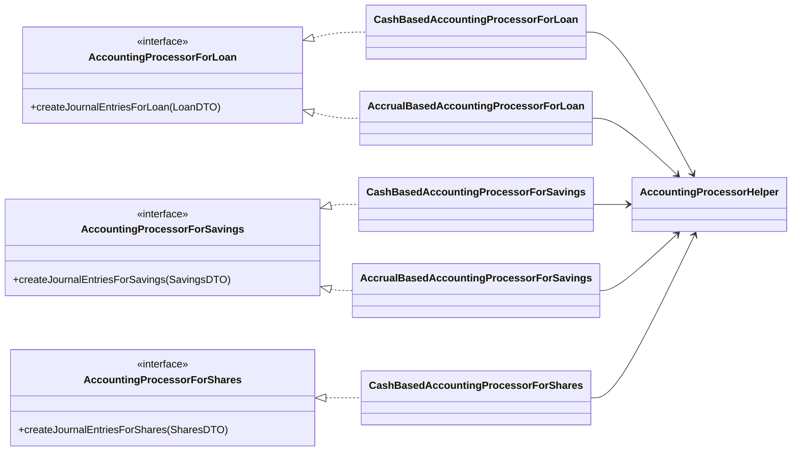
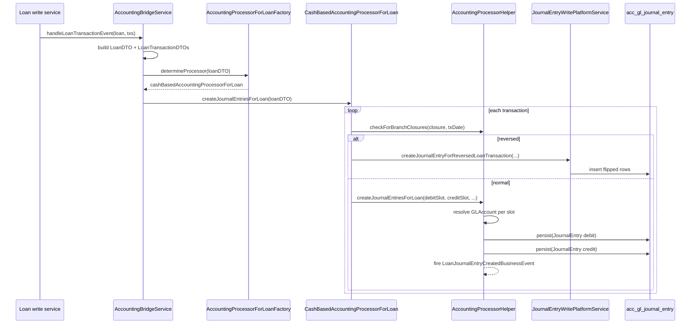

When a loan disburses, a savings deposit clears, or a share is purchased, Apache Fineract translates that subledger event into balanced general-ledger postings. The translation is done by an `AccountingProcessor` — a polymorphic strategy whose concrete subclass depends on the product's accounting type (cash, upfront accrual, periodic accrual). This page documents the processor hierarchy, the central `AccountingProcessorHelper`, the DTOs that carry transaction context, and the factory routing.

## Strategy hierarchy



All processors live in `org.apache.fineract.accounting.journalentry.service` in `fineract-provider`. The interfaces are deliberately tiny — each takes a single product-typed DTO and is expected to produce a balanced set of `JournalEntry` rows via the helper.

## Factories

Each product type has its own factory that inspects the DTO and dispatches to the correct Spring bean by name. From `AccountingProcessorForLoanFactory`:

```java
@Component
@RequiredArgsConstructor
public class AccountingProcessorForLoanFactory {

    private final ApplicationContext applicationContext;

    public AccountingProcessorForLoan determineProcessor(final LoanDTO loanDTO) {

        AccountingProcessorForLoan accountingProcessorForLoan = null;

        if (loanDTO.isCashBasedAccountingEnabled()) {
            accountingProcessorForLoan = this.applicationContext.getBean(
                    "cashBasedAccountingProcessorForLoan", AccountingProcessorForLoan.class);
        } else if (loanDTO.isUpfrontAccrualBasedAccountingEnabled()) {
            accountingProcessorForLoan = this.applicationContext.getBean(
                    "accrualBasedAccountingProcessorForLoan", AccountingProcessorForLoan.class);
        } else if (loanDTO.isPeriodicAccrualBasedAccountingEnabled()) {
            accountingProcessorForLoan = this.applicationContext.getBean(
                    "accrualBasedAccountingProcessorForLoan", AccountingProcessorForLoan.class);
        }

        return accountingProcessorForLoan;
    }
}
```

Note that **both** accrual variants — upfront and periodic — route to the same bean (`AccrualBasedAccountingProcessorForLoan`). The variant only changes the timing of when accruals are written by the periodic accrual job; the processor itself handles either case.

`AccountingProcessorForSavingsFactory` and `AccountingProcessorForSharesFactory` follow the same pattern. For shares only the cash variant exists.

If `determineProcessor` returns `null` (the product has `NONE` accounting), the calling write service simply skips posting. This is the contract that makes "accounting disabled" a first-class product configuration.

## DTOs

The processors operate on plain DTOs decorated with Lombok. They have no JPA dependencies — the loan / savings / shares modules construct them at the bridge boundary.

### `LoanDTO`

```java
@AllArgsConstructor
@Getter
public class LoanDTO {
    @Setter private Long loanId;
    @Setter private Long loanProductId;
    @Setter private Long officeId;
    @Setter private String currencyCode;
    @Setter private boolean cashBasedAccountingEnabled;
    private final boolean upfrontAccrualBasedAccountingEnabled;
    private final boolean periodicAccrualBasedAccountingEnabled;
    @Setter private List<LoanTransactionDTO> newLoanTransactions;
    @Setter private boolean markedAsChargeOff;
    @Setter private boolean markedAsFraud;
    private Long chargeOffReasonCodeValue;
    private boolean markedAsWrittenOff;
    private boolean merchantBuyDownFee;
    private List<AdvancedMappingtDTO> buydownFeeAdvancedMappingData;
    private List<AdvancedMappingtDTO> capitalizedIncomeAdvancedMappingData;
    private AdvancedMappingtDTO writeOffReasonAdvancedMappingData;
}
```

A `LoanDTO` represents *all transactions on one loan that need accounting in this call*. The list `newLoanTransactions` is the work queue; each `LoanTransactionDTO` carries:

- `transactionId`, `transactionDate`, `paymentTypeId`;
- the `LoanTransactionEnumData` indicating type (disbursement, repayment, charge-off, …);
- principal, interest, fees, penalty, overpayment splits;
- `chargesPaidByData` for each charge payment;
- `reversed` flag (so reversals are handled inline).

### `SavingsDTO` / `SharesDTO` / `ClientTransactionDTO`

Each has the analogous shape — an aggregator for many transactions on one account, with one transaction-DTO type per nested element.

## `AccountingProcessorHelper`

The helper is the workhorse. It centralises:

- branch closure checks;
- GL account lookup from product mappings;
- DTO → entity conversion;
- balanced debit/credit construction;
- saving (with event firing).

```java
public class AccountingProcessorHelper {

    public static final String LOAN_TRANSACTION_IDENTIFIER         = "L";
    public static final String SAVINGS_TRANSACTION_IDENTIFIER      = "S";
    public static final String CLIENT_TRANSACTION_IDENTIFIER       = "C";
    public static final String PROVISIONING_TRANSACTION_IDENTIFIER = "P";
    public static final String SHARE_TRANSACTION_IDENTIFIER        = "SH";

    private final JournalEntryRepository glJournalEntryRepository;
    private final ProductToGLAccountMappingRepository accountMappingRepository;
    private final FinancialActivityAccountRepositoryWrapper financialActivityAccountRepositoryWrapper;
    private final GLClosureRepository closureRepository;
    private final OfficeRepository officeRepository;
    private final GLAccountRepository glAccountRepository;
    private final BusinessEventNotifierService businessEventNotifierService;
    ...
}
```

### Closure check

Every processor begins its loop by asking the helper for the latest closure:

```java
final Long officeId = loanDTO.getOfficeId();
final GLClosure latestGLClosure = this.helper.getLatestClosureByBranch(officeId);
...
for (final LoanTransactionDTO loanTransactionDTO : loanDTO.getNewLoanTransactions()) {
    final LocalDate transactionDate = loanTransactionDTO.getTransactionDate();
    ...
    this.helper.checkForBranchClosures(latestGLClosure, transactionDate);
    ...
}
```

`checkForBranchClosures` throws `JournalEntryInvalidException(ACCOUNTING_CLOSED, ...)` if the transaction date falls inside a closed period. See [Closure](/accounting/closure).

### Account lookup

The slot-to-account resolver:

```java
public GLAccount getLinkedGLAccountForLoanProduct(final Long loanProductId, final Integer accountMappingTypeId, ...) {
    final ProductToGLAccountMapping accountMapping = this.accountMappingRepository
            .findCoreProductToFinAccountMapping(loanProductId, PortfolioProductType.LOAN.getValue(), accountMappingTypeId)
            .orElseThrow(() -> new ProductToGLAccountMappingNotFoundException(...));
    return accountMapping.getGlAccount();
}
```

The integer `accountMappingTypeId` is `CashAccountsForLoan.LOAN_PORTFOLIO.getValue()` or one of its peers — see [Product to Account Mapping](/accounting/product-to-account-mapping) for the table of slots. The processor never references account ids directly.

### Balanced posting

The standard recipe in the helper is:

```java
public void createJournalEntriesForLoan(final Office office, final String currencyCode,
        final int debitAccountTypeId, final int creditAccountTypeId,
        final Long loanProductId, final Long paymentTypeId, final Long loanId,
        final String transactionId, final LocalDate transactionDate, final BigDecimal amount) {

    final GLAccount debitAccount  = getLinkedGLAccountForLoanProduct(loanProductId, debitAccountTypeId,  paymentTypeId);
    final GLAccount creditAccount = getLinkedGLAccountForLoanProduct(loanProductId, creditAccountTypeId, paymentTypeId);

    createDebitJournalEntryOrReversalForLoan(office, currencyCode, debitAccount, loanProductId, paymentTypeId,
            loanId, transactionId, transactionDate, amount);
    createCreditJournalEntryOrReversalForLoan(office, currencyCode, creditAccount, loanProductId, paymentTypeId,
            loanId, transactionId, transactionDate, amount);
}
```

The `OrReversal` part of the method name is important: if the upstream transaction is a reversal (`loanTransactionDTO.isReversed()`), the same call flips the entry types to undo a prior posting (negative-of-a-positive becomes positive-of-a-negative). For most cash-based reversals the cash processor takes a shorter path and calls `JournalEntryWritePlatformService.createJournalEntryForReversedLoanTransaction(...)` directly — see [Journal Entries](/accounting/journal-entries#reversal-of-loan-driven-entries).

### Persist + event

```java
public JournalEntry persistJournalEntry(JournalEntry journalEntry) {
    boolean isNew = journalEntry.isNew();
    JournalEntry savedJournalEntry = this.glJournalEntryRepository.saveAndFlush(journalEntry);
    if (isNew && journalEntry.getLoanTransactionId() != null) {
        businessEventNotifierService.notifyPostBusinessEvent(
                new LoanJournalEntryCreatedBusinessEvent(savedJournalEntry));
    }
    return savedJournalEntry;
}
```

Only newly-created loan entries fire a business event — this is how the investor / external-asset-owner subsystem subscribes.

## `CashBasedAccountingProcessorForLoan`

The cash processor's top-level method dispatches on `LoanTransactionEnumData`:

```java
@Override
public void createJournalEntriesForLoan(final LoanDTO loanDTO) {
    final Long officeId = loanDTO.getOfficeId();
    final GLClosure latestGLClosure = this.helper.getLatestClosureByBranch(officeId);
    final Long loanProductId = loanDTO.getLoanProductId();
    final String currencyCode = loanDTO.getCurrencyCode();
    final Office office = this.helper.getOfficeById(officeId);
    for (final LoanTransactionDTO loanTransactionDTO : loanDTO.getNewLoanTransactions()) {
        final LocalDate transactionDate = loanTransactionDTO.getTransactionDate();
        final String transactionId = loanTransactionDTO.getTransactionId();
        final Long paymentTypeId = loanTransactionDTO.getPaymentTypeId();
        final Long loanId = loanDTO.getLoanId();
        final LoanTransactionEnumData transactionType = loanTransactionDTO.getTransactionType();

        this.helper.checkForBranchClosures(latestGLClosure, transactionDate);

        if (loanTransactionDTO.isReversed()) {
            journalEntryWritePlatformService.createJournalEntryForReversedLoanTransaction(
                    transactionDate, transactionId, officeId);
            continue;
        }

        if (transactionType.isDisbursement()) {
            createJournalEntriesForDisbursements(loanDTO, loanTransactionDTO, office);
        } else if ((transactionType.isRepaymentType() && !transactionType.isChargeAdjustment())
                || transactionType.isRepaymentAtDisbursement() || transactionType.isChargePayment()) {
            createJournalEntriesForRepayments(loanDTO, loanTransactionDTO, office);
        } else if (transactionType.isRecoveryRepayment()) {
            createJournalEntriesForRecoveryRepayments(loanDTO, loanTransactionDTO, office);
        } else if (transactionType.isRefund()) {
            createJournalEntriesForRefund(loanDTO, loanTransactionDTO, office);
        } else if (transactionType.isCreditBalanceRefund()) {
            createJournalEntriesForCreditBalanceRefund(loanDTO, loanTransactionDTO, office);
        } else if (transactionType.isWriteOff()) {
            // Only principal write off affects cash based accounting.
            final BigDecimal principalAmount = loanTransactionDTO.getPrincipal();
            if (principalAmount != null && principalAmount.compareTo(BigDecimal.ZERO) > 0) {
                this.helper.createJournalEntriesForLoan(office, currencyCode,
                        CashAccountsForLoan.LOSSES_WRITTEN_OFF.getValue(),
                        CashAccountsForLoan.LOAN_PORTFOLIO.getValue(),
                        loanProductId, paymentTypeId, loanId, transactionId, transactionDate, principalAmount);
            }
        } else if (transactionType.isInitiateTransfer() || transactionType.isApproveTransfer()
                || transactionType.isWithdrawTransfer()) {
            createJournalEntriesForTransfers(loanDTO, loanTransactionDTO, office);
        } else if (transactionType.isRefundForActiveLoans()) {
            createJournalEntriesForRefundForActiveLoan(loanDTO, loanTransactionDTO, office);
        } else if (transactionType.isChargeback()) {
            createJournalEntriesForChargeback(loanDTO, loanTransactionDTO, office);
        } else if (transactionType.isChargeAdjustment()) {
            createJournalEntriesForChargeAdjustment(loanDTO, loanTransactionDTO, office);
        } else if (transactionType.isChargeoff()) {
            createJournalEntriesForChargeOff(loanDTO, loanTransactionDTO, office);
        }
    }
}
```

### Example: cash disbursement

A loan disbursement under cash accounting produces:

| Side | Slot | Amount |
| --- | --- | --- |
| Debit | `LOAN_PORTFOLIO` | principal |
| Credit | `FUND_SOURCE` (resolved by payment type) | principal |

That's it — there is no interest receivable to set up because cash accounting only recognises income when cash is received.

### Example: cash write-off

```java
this.helper.createJournalEntriesForLoan(office, currencyCode,
        CashAccountsForLoan.LOSSES_WRITTEN_OFF.getValue(),  // debit
        CashAccountsForLoan.LOAN_PORTFOLIO.getValue(),      // credit
        loanProductId, paymentTypeId, loanId, transactionId, transactionDate, principalAmount);
```

Interest and fee components are deliberately ignored under cash accounting because the income was never recognised in the first place.

## `AccrualBasedAccountingProcessorForLoan`

The accrual variant adds receivable accounts to the picture. The same dispatch on `LoanTransactionEnumData` runs, but additional account slots are touched:

- **Disbursement**: Debit `LOAN_PORTFOLIO`, Credit `FUND_SOURCE` — same as cash.
- **Accrual (separate job, see [Accrual postings](/accounting/accrual-postings))**:
  - Debit `INTEREST_RECEIVABLE`, Credit `INTEREST_ON_LOANS`.
  - Debit `FEES_RECEIVABLE`,    Credit `INCOME_FROM_FEES`.
  - Debit `PENALTIES_RECEIVABLE`, Credit `INCOME_FROM_PENALTIES`.
- **Repayment**:
  - Debit `FUND_SOURCE`, Credit each of `LOAN_PORTFOLIO`, `INTEREST_RECEIVABLE`, `FEES_RECEIVABLE`, `PENALTIES_RECEIVABLE` depending on the breakdown.
- **Write-off**:
  - Debit `LOSSES_WRITTEN_OFF` for principal, debit the relevant receivable accounts for unpaid interest / fees / penalties — symmetric to what the accrual job posted earlier.
- **Charge-off** moves the unpaid principal to `CHARGE_OFF_EXPENSE` (or `CHARGE_OFF_FRAUD_EXPENSE` when `markedAsFraud`).

The accrual processor reuses `helper.createJournalEntriesForLoan(office, currencyCode, debitAccountType, creditAccountType, ...)` and supplies `AccrualAccountsForLoan` slot ids instead of `CashAccountsForLoan`.

## `CashBasedAccountingProcessorForSavings` and `AccrualBasedAccountingProcessorForSavings`

The savings processors handle:

- **Deposits**: Debit `SAVINGS_REFERENCE`, Credit `SAVINGS_CONTROL`.
- **Withdrawals**: Debit `SAVINGS_CONTROL`, Credit `SAVINGS_REFERENCE`.
- **Interest posting** (cash): Debit `INTEREST_ON_SAVINGS`, Credit `SAVINGS_CONTROL`.
- **Interest accrual** (accrual only): Debit `INTEREST_ON_SAVINGS`, Credit `INTEREST_PAYABLE`. The cash-out then debits `INTEREST_PAYABLE` and credits `SAVINGS_CONTROL`.
- **Fee / penalty income**: Debit `SAVINGS_CONTROL`, Credit `INCOME_FROM_FEES` / `INCOME_FROM_PENALTIES`.
- **Overdraft interest**: Debit `INCOME_FROM_INTEREST`, Credit `OVERDRAFT_PORTFOLIO_CONTROL` (cash) or via `FEES_RECEIVABLE`/`PENALTIES_RECEIVABLE` (accrual).
- **Escheat** (dormant account close-out): Debit `SAVINGS_CONTROL`, Credit `ESCHEAT_LIABILITY`.

Slot enums are `CashAccountsForSavings` and `AccrualAccountsForSavings` in `AccountingConstants`.

## `CashBasedAccountingProcessorForShares`

Shares accounting has only four slots: `SHARES_REFERENCE`, `SHARES_SUSPENSE`, `INCOME_FROM_FEES`, `SHARES_EQUITY`. The processor handles:

- **Share request** (subscription): Debit `SHARES_REFERENCE`, Credit `SHARES_SUSPENSE`.
- **Approval**: Debit `SHARES_SUSPENSE`, Credit `SHARES_EQUITY`.
- **Rejection**: reverse of subscription.
- **Redemption**: reverse direction.
- **Charges**: Debit `SHARES_REFERENCE`, Credit `INCOME_FROM_FEES`.

## `AccountingProcessorForClientTransactions` / `CashBasedAccountingProcessorForClientTransactions`

Client charges (not tied to a savings or loan product) are posted by a separate, single-strategy processor. The accounting is configured at the **charge level** via `ChargeToGLAccountMapper` rather than at a product level.

## End-to-end flow



## Edge cases

<AccordionGroup>
  <Accordion title="Payment-type fund source override">
    For loan repayments where a `PaymentType` is supplied, the helper first looks up an override in `acc_product_mapping` keyed by `payment_type`, falling back to the product-level `FUND_SOURCE` if no override exists. This is how an MFI can route mobile-money repayments to a different bank account from cash repayments while sharing the same loan product.
  </Accordion>
  <Accordion title="Charge-to-income overrides">
    Each loan charge can override `INCOME_FROM_FEES` / `INCOME_FROM_PENALTIES` with a charge-specific income account, via `ChargeToGLAccountMapper`. The helper resolves the charge id first; if absent, it falls back to the product mapping.
  </Accordion>
  <Accordion title="Asset externalisation (investor)">
    When a loan is sold to an `ExternalAssetOwner`, the `LoanJournalEntryCreatedBusinessEvent` listener in the investor module produces *additional* entries that mirror the principal flow into the investor's `TRANSFERS_SUSPENSE` and `LOAN_PORTFOLIO` slots. The accounting processors themselves are unaware of investor logic.
  </Accordion>
  <Accordion title="Capitalized income and buy-down (advanced mapping)">
    `LoanDTO` carries `buydownFeeAdvancedMappingData` and `capitalizedIncomeAdvancedMappingData` — lists of `AdvancedMappingtDTO` keyed by classification code value. The accrual processor uses these to redirect capitalised income or buy-down fees to alternate income accounts depending on the underlying loan's classification, without changing the slot definitions.
  </Accordion>
</AccordionGroup>

## Cross references

<CardGroup cols={2}>
  <Card title="Journal entries" icon="pen-to-square" href="/accounting/journal-entries">
    The row model written here.
  </Card>
  <Card title="Product to account mapping" icon="diagram-project" href="/accounting/product-to-account-mapping">
    Slot enums and mapping helpers.
  </Card>
  <Card title="Accrual postings" icon="calendar-days" href="/accounting/accrual-postings">
    The periodic accrual job that feeds the accrual processor's receivable entries.
  </Card>
  <Card title="Loan overview" icon="hand-holding-dollar" href="/loan/overview">
    Source side of `LoanDTO`.
  </Card>
  <Card title="Savings overview" icon="piggy-bank" href="/savings/overview">
    Source side of `SavingsDTO`.
  </Card>
  <Card title="Investor overview" icon="briefcase" href="/investor/overview">
    External-asset-owner listener.
  </Card>
</CardGroup>
