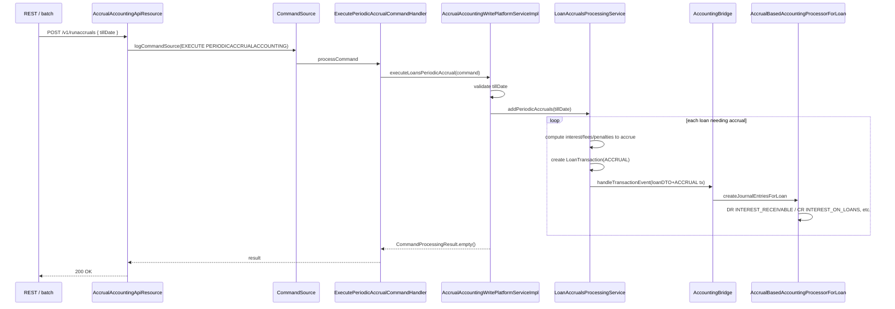

Apache Fineract supports three accounting modes per product (`NONE`, `CASH_BASED`, `ACCRUAL_PERIODIC`, `ACCRUAL_UPFRONT`). Accrual-mode products must periodically recognise interest income, fee income, and penalty income into receivable accounts ahead of cash collection. This page documents the accrual sub-package in `fineract-accounting`, the REST trigger, the Spring Batch jobs (`ADD_ACCRUAL_ENTRIES`, `ADD_PERIODIC_ACCRUAL_ENTRIES`, `ACCRUAL_ACTIVITY_POSTING`, and the *income-posted-as-transactions* variants), and how they interact with the cross-cutting `UPDATE_LOAN_PAID_IN_ADVANCE` logic.

## Package map

```
fineract-accounting/.../accounting/accrual/
├── api/
│   ├── AccrualAccountingApiResource.java        # POST /v1/runaccruals
│   ├── AccrualAccountingApiResourceSwagger.java
│   └── AccrualAccountingConstants.java          # tillDate parameter name, error codes
├── handler/
│   └── ExecutePeriodicAccrualCommandHandler.java
├── request/
│   └── AccrualAccountRequest.java               # { tillDate, locale, dateFormat }
├── serialization/
│   └── AccrualAccountingDataValidator.java      # validates tillDate present, parseable
└── service/
    └── AccrualAccountingWritePlatformService.java
```

The implementation lives in `fineract-provider`:

```
fineract-provider/.../accounting/accrual/
├── service/AccrualAccountingWritePlatformServiceImpl.java
└── starter/AccountingAccrualConfiguration.java
```

## Constants and request

```java
public final class AccrualAccountingConstants {

    public static final String ACCRUE_TILL_PARAM_NAME = "tillDate";
    public static final String LOCALE_PARAM_NAME = "locale";
    public static final String DATE_FORMAT_PARAM_NAME = "dateFormat";

    public static final String PERIODIC_ACCRUAL_ACCOUNTING_RESOURCE_NAME = "periodicaccrual";
    public static final String PERIODIC_ACCRUAL_ACCOUNTING_EXECUTION_ERROR_CODE = "execution.failed";
}
```

`AccrualAccountRequest` is a thin Lombok record with the three string fields above.

## REST resource — `/v1/runaccruals`

```java
@Path("/v1/runaccruals")
@Component
@Tag(name = "Periodic Accrual Accounting",
     description = "Periodic Accrual is to accrue the loan income till the specific date or till batch job scheduled time.\n")
@RequiredArgsConstructor
public class AccrualAccountingApiResource {

    private final PortfolioCommandSourceWritePlatformService commandsSourceWritePlatformService;
    private final DefaultToApiJsonSerializer<String> apiJsonSerializerService;

    @POST
    @Consumes({ MediaType.APPLICATION_JSON })
    @Produces({ MediaType.APPLICATION_JSON })
    @Operation(summary = "Executes Periodic Accrual Accounting", method = "POST",
            description = "Mandatory Fields\n\ntillDate\n")
    public CommandProcessingResult executePeriodicAccrualAccounting(
            @Parameter(hidden = true) AccrualAccountRequest accrualAccountRequest) {
        final CommandWrapper commandRequest = new CommandWrapperBuilder().excuteAccrualAccounting()
                .withJson(apiJsonSerializerService.serialize(accrualAccountRequest)).build();
        return commandsSourceWritePlatformService.logCommandSource(commandRequest);
    }
}
```

The request flows through the standard command pipeline. The handler:

```java
@Service
@CommandType(entity = "PERIODICACCRUALACCOUNTING", action = "EXECUTE")
@RequiredArgsConstructor
public class ExecutePeriodicAccrualCommandHandler implements NewCommandSourceHandler {

    private final AccrualAccountingWritePlatformService writePlatformService;

    @Transactional
    @Override
    public CommandProcessingResult processCommand(final JsonCommand command) {
        return this.writePlatformService.executeLoansPeriodicAccrual(command);
    }
}
```

CommandType pair: `PERIODICACCRUALACCOUNTING` / `EXECUTE` — this is the permission and command-source key.

## Write service

The interface is one method:

```java
public interface AccrualAccountingWritePlatformService {

    CommandProcessingResult executeLoansPeriodicAccrual(JsonCommand command);
}
```

The implementation (in `fineract-provider`):

```java
@RequiredArgsConstructor
public class AccrualAccountingWritePlatformServiceImpl implements AccrualAccountingWritePlatformService {

    private final LoanAccrualsProcessingService loanAccrualsProcessingService;
    private final AccrualAccountingDataValidator accountingDataValidator;

    @Override
    public CommandProcessingResult executeLoansPeriodicAccrual(JsonCommand command) {
        this.accountingDataValidator.validateLoanPeriodicAccrualData(command.json());
        LocalDate tillDate = command.localDateValueOfParameterNamed(ACCRUE_TILL_PARAM_NAME);
        try {
            this.loanAccrualsProcessingService.addPeriodicAccruals(tillDate);
        } catch (MultiException e) {
            final List<ApiParameterError> dataValidationErrors = new ArrayList<>();
            final DataValidatorBuilder baseDataValidator = new DataValidatorBuilder(dataValidationErrors)
                    .resource(PERIODIC_ACCRUAL_ACCOUNTING_RESOURCE_NAME);
            baseDataValidator.reset().failWithCodeNoParameterAddedToErrorCode(
                    PERIODIC_ACCRUAL_ACCOUNTING_EXECUTION_ERROR_CODE, e.getMessage());
            throw new PlatformApiDataValidationException(dataValidationErrors, e);
        }
        return CommandProcessingResult.empty();
    }
}
```

The real work is delegated to `LoanAccrualsProcessingService.addPeriodicAccruals(LocalDate)` which lives in `fineract-loan`. The accounting module owns only the *trigger surface* — the loan module owns the *what to accrue* logic.

<Note>
`MultiException` is the Fineract wrapper for "multiple per-loan failures were collected, here are the messages". The write service unwraps it into a single platform validation error so the API caller sees a consolidated error response.
</Note>

## Loan accrual jobs

There are four related Spring Batch jobs. All names are from `org.apache.fineract.infrastructure.jobs.service.JobName`:

| Enum constant | Display name | Location | Purpose |
| --- | --- | --- | --- |
| `ADD_ACCRUAL_ENTRIES` | `"Add Accrual Transactions"` | `fineract-provider/.../loanaccount/jobs/addaccrualentries/` | **Upfront accrual**: accrue all interest/fees/penalties from the loan schedule eagerly, on each new disbursement. |
| `ADD_PERIODIC_ACCRUAL_ENTRIES` | `"Add Periodic Accrual Transactions"` | `fineract-loan/.../loanaccount/jobs/addperiodicaccrualentries/` | **Periodic accrual**: accrue interest/fees/penalties up to the COB date, recurring nightly. Equivalent to calling `/v1/runaccruals` with the business date as `tillDate`. |
| `ADD_PERIODIC_ACCRUAL_ENTRIES_FOR_LOANS_WITH_INCOME_POSTED_AS_TRANSACTIONS` | `"Add Accrual Transactions For Loans With Income Posted As Transactions"` | `fineract-provider/.../loanaccount/jobs/addperiodicaccrualentriesforloanswithincomepostedastransactions/` | Same as above but only operates on loans flagged `incomePostedAsTransactions` (revenue recognition variant). |
| `ACCRUAL_ACTIVITY_POSTING` | `"Accrual Activity Posting"` | `fineract-provider/.../loanaccount/jobs/accrualactivityposting/` | Posts accrual activity rows distinct from interest accrual — used by the merchant buy-down / capitalised income workflows. |

The Spring Batch wiring for `ADD_PERIODIC_ACCRUAL_ENTRIES` (from `AddPeriodicAccrualEntriesConfig`):

```java
return new StepBuilder(JobName.ADD_PERIODIC_ACCRUAL_ENTRIES.name(), jobRepository)
        .tasklet(addPeriodicAccrualEntriesTasklet, transactionManager).build();
...
return new JobBuilder(JobName.ADD_PERIODIC_ACCRUAL_ENTRIES.name(), jobRepository)
        .start(addPeriodicAccrualEntriesStep())
        .incrementer(new RunIdIncrementer()).build();
```

The tasklet typically calls `LoanAccrualsProcessingService.addPeriodicAccruals(businessDate)` — the same method behind `/v1/runaccruals`.

## `UPDATE_LOAN_PAID_IN_ADVANCE`

This job is **not** in `JobName` under that exact name in current trunk. The historical Mifos counterpart was renamed; the current pre-payment recognition flow is integrated directly into the loan repayment posting and the period-end accrual processing. Search the codebase by the constant `incomePostedAsTransactions` to see how advance payments interact with accrual.

If you have an older Fineract instance that still references `UPDATE_LOAN_PAID_IN_ADVANCE` from a custom job, treat that job as a no-op against current trunk — the equivalent logic lives in the loan COB and accrual flow now.

## Accounting effect of an accrual

For a loan whose interest accrual produces a single `LoanTransaction` of type `ACCRUAL` with components `interest = 100.00`, `fees = 5.00`, `penalties = 0.00`, the loan-side processing eventually feeds the **accrual-based loan processor** which posts:

| Debit | Credit | Amount |
| --- | --- | --- |
| `INTEREST_RECEIVABLE` | `INTEREST_ON_LOANS` | 100.00 |
| `FEES_RECEIVABLE`     | `INCOME_FROM_FEES`  |   5.00 |

Each row goes into `acc_gl_journal_entry` with:

- `entity_type_enum = 1` (LOAN);
- `entity_id = <loanId>`;
- `loan_transaction_id = <id of the ACCRUAL LoanTransaction>`;
- `transaction_id = "L" + loanTransactionId`;
- `manual_entry = false`.

Subsequent cash repayments then debit `FUND_SOURCE` and credit the matching receivable accounts (clearing the receivable instead of recognising new income).

## Savings accrual

`SavingsAccountAccrualPlatformService` is not yet present under `fineract-accounting/accrual/` — savings accrual is handled in `fineract-provider/.../portfolio/savings/jobs/`. The relevant job from `JobName` is:

| Enum constant | Display name |
| --- | --- |
| `ADD_PERIODIC_ACCRUAL_ENTRIES_FOR_SAVINGS_WITH_INCOME_POSTED_AS_TRANSACTIONS` | `"Add Accrual Transactions For Savings"` |

Wired in `AddAccrualTransactionForSavingsConfig`:

```java
return new StepBuilder(JobName.ADD_PERIODIC_ACCRUAL_ENTRIES_FOR_SAVINGS_WITH_INCOME_POSTED_AS_TRANSACTIONS.name(), jobRepository)
        .tasklet(addAccrualTransactionsForSavingsTasklet, transactionManager).build();
```

The savings tasklet walks each accrual-enabled savings product, computes interest accrued up to the business date, and writes either a savings `INTEREST_POSTING` (cash) or `ACCRUAL` (accrual) transaction. The savings cash/accrual processors then translate those into journal entries via the helper described in [Accounting Processors](/accounting/accounting-processors).

See [Savings overview → savings-accrual](/savings/overview) for the savings-side detail.

## Validator — `AccrualAccountingDataValidator`

```java
@Component
public class AccrualAccountingDataValidator {

    public void validateLoanPeriodicAccrualData(final String json) {
        // 1) ensure {tillDate, locale, dateFormat} present
        // 2) tillDate <= business date
        // 3) parse-roundtrip tillDate as LocalDate
    }
}
```

A `tillDate` after the business date is rejected with a `dataValidationException`. This ensures you can never accrue forward income — accruals are always at-or-before the business date.

## Sequence



## Why an upfront-accrual product still needs the accrual processor

Even though the upfront-accrual variant front-loads all interest into a single transaction at disbursement (rather than monthly), the *journal entries* still need to flow through the accrual processor so that the receivable accounts are debited rather than the cash account. The factory routes both variants to the same `accrualBasedAccountingProcessorForLoan` bean — only the *timing* of when the `ACCRUAL` transaction appears differs.

## Reversal of accrual entries

When a loan is fully paid off ahead of schedule, any unmaterialised accrual must be reversed:

1. The loan module marks the unpaid accrual `LoanTransaction` reversed.
2. The accrual processor sees `loanTransactionDTO.isReversed() == true` on a subsequent bridge call.
3. It delegates to `JournalEntryWritePlatformService.createJournalEntryForReversedLoanTransaction(...)` which writes a flipped pair using the same `transaction_id` — netting the previously recorded accrual to zero.

Cross-period reversal is blocked by the closure guard (see [Closure](/accounting/closure)): once a period is closed, no reversal of an accrual entry inside that period can land.

## Worked example — full accrual cycle on a single loan

Consider a 12-month, equal-installment loan of 10,000 at 12% APR disbursed on 2024-01-01 with the **Periodic Accrual** product. We'll trace the postings.

### Day 1 (disbursement, 2024-01-01)

The cash side of the loan is posted by the accrual processor's disbursement branch (which behaves identically to the cash processor for principal):

| Side | Slot | Amount |
| --- | --- | --- |
| Debit | `LOAN_PORTFOLIO` | 10,000.00 |
| Credit | `FUND_SOURCE` | 10,000.00 |

No interest is recognised yet because no accrual transaction exists.

### Periodic accrual job — 2024-01-31

The nightly `ADD_PERIODIC_ACCRUAL_ENTRIES` job runs with `tillDate = 2024-01-31`. The loan accrual service computes accrued interest for the period: roughly `10000 × 0.12 × 31/365 ≈ 101.92`. It creates a `LoanTransaction(ACCRUAL)` row and the accrual processor posts:

| Side | Slot | Amount |
| --- | --- | --- |
| Debit | `INTEREST_RECEIVABLE` | 101.92 |
| Credit | `INTEREST_ON_LOANS` | 101.92 |

The interest is now in the income statement (`INTEREST_ON_LOANS`) and a corresponding asset is on the balance sheet (`INTEREST_RECEIVABLE`).

### Repayment on 2024-02-01

The borrower repays the first installment (approximately 888.49 if the schedule was generated with the standard equal-installment formula). Say it splits into principal 786.57 and interest 101.92. The accrual processor's repayment branch posts:

| Side | Slot | Amount |
| --- | --- | --- |
| Debit | `FUND_SOURCE` | 888.49 |
| Credit | `LOAN_PORTFOLIO` | 786.57 |
| Credit | `INTEREST_RECEIVABLE` | 101.92 |

`INTEREST_RECEIVABLE` is now zero again — the receivable has been cleared. Note that `INTEREST_ON_LOANS` is **not** touched on repayment under accrual accounting; the income was already recognised on accrual.

### Reversal scenario

Suppose the borrower's payment bounces and we mark the repayment reversed. The next bridge call sees `loanTransactionDTO.isReversed() == true` and routes to `JournalEntryWritePlatformService.createJournalEntryForReversedLoanTransaction`, which writes flipped entries on the *original* transaction id. The `INTEREST_RECEIVABLE` is re-asserted, `LOAN_PORTFOLIO` is restored, `FUND_SOURCE` is reduced.

### Effect of a closure

If 2024-01 has been closed on 2024-02-05 and a January accrual reversal arrives on 2024-02-10, the closure guard rejects the reversal: the reversal's `transactionDate` (the original accrual date, in January) falls inside a closed period. Operators must either re-open the period (delete the closure if it's the latest) or post a compensating entry in February.

## Validator implementation detail

`AccrualAccountingDataValidator.validateLoanPeriodicAccrualData(String json)`:

```java
public void validateLoanPeriodicAccrualData(final String json) {
    if (StringUtils.isBlank(json)) {
        throw new InvalidJsonException();
    }
    final Type typeOfMap = new TypeToken<Map<String, Object>>() {}.getType();
    fromApiJsonHelper.checkForUnsupportedParameters(typeOfMap, json,
            Set.of(ACCRUE_TILL_PARAM_NAME, LOCALE_PARAM_NAME, DATE_FORMAT_PARAM_NAME));

    final List<ApiParameterError> errors = new ArrayList<>();
    final DataValidatorBuilder b = new DataValidatorBuilder(errors)
            .resource(PERIODIC_ACCRUAL_ACCOUNTING_RESOURCE_NAME);

    final JsonElement element = fromApiJsonHelper.parse(json);
    final LocalDate tillDate = fromApiJsonHelper.extractLocalDateNamed(ACCRUE_TILL_PARAM_NAME, element);
    b.reset().parameter(ACCRUE_TILL_PARAM_NAME).value(tillDate).notNull();

    if (tillDate != null && DateUtils.isDateInTheFuture(tillDate)) {
        b.reset().parameter(ACCRUE_TILL_PARAM_NAME).value(tillDate)
                .failWithCode("must.be.on.or.before.business.date");
    }

    if (!errors.isEmpty()) {
        throw new PlatformApiDataValidationException(errors);
    }
}
```

The only legal request shape is `{ tillDate, locale, dateFormat }`. Any extra parameter raises `UnsupportedParameterException`.

## Permission setup

The accrual API requires the user to hold either:

- `PERIODICACCRUALACCOUNTING_EXECUTE` permission (the command-specific permission), or
- `ALL_FUNCTIONS` (super-user shortcut).

The same permission applies to the Spring Batch trigger via `/v1/jobs/{jobId}/run`.

## Operational notes

<AccordionGroup>
  <Accordion title="Idempotency">
    Running the job twice for the same `tillDate` is safe. The loan accrual service tracks the last accrued-through date per loan; the second run finds nothing to accrue.
  </Accordion>
  <Accordion title="Catching up after a long pause">
    If the job has been disabled for a while, the first run after re-enabling will accrue the entire gap in one go. For very large gaps this can be slow because each loan's accrual is computed up to the same `tillDate`. Consider running the job with intermediate `tillDate` values via the REST endpoint to chunk the work.
  </Accordion>
  <Accordion title="MultiException unwrapping">
    `LoanAccrualsProcessingService.addPeriodicAccruals(...)` collects per-loan failures and wraps them in `MultiException`. The accounting write service then formats those as a single `dataValidationException` with the catenated message in the error code `execution.failed`. To debug, look at the loan ids in the response and check the loan-level audit log.
  </Accordion>
  <Accordion title="Cash-mode loans are skipped">
    Even though `/v1/runaccruals` is global, the loan accrual service only operates on loans whose product has `accountingType IN (ACCRUAL_PERIODIC, ACCRUAL_UPFRONT)`. Cash-mode loans are silently skipped.
  </Accordion>
</AccordionGroup>

## Cross references

<CardGroup cols={2}>
  <Card title="Accounting processors" icon="gears" href="/accounting/accounting-processors">
    The accrual-based processor that consumes the loan transactions written by `addPeriodicAccruals`.
  </Card>
  <Card title="Journal entries" icon="pen-to-square" href="/accounting/journal-entries">
    The row model used by accruals.
  </Card>
  <Card title="Loan overview" icon="hand-holding-dollar" href="/loan/overview">
    `LoanAccrualsProcessingService` and the loan transaction model.
  </Card>
  <Card title="Savings overview" icon="piggy-bank" href="/savings/overview">
    Savings-side accrual job and posting.
  </Card>
  <Card title="Jobs overview" icon="clock" href="/jobs/overview">
    The Spring Batch infrastructure these jobs plug into.
  </Card>
  <Card title="Closure" icon="lock" href="/accounting/closure">
    The closure guard applied at posting time.
  </Card>
</CardGroup>
