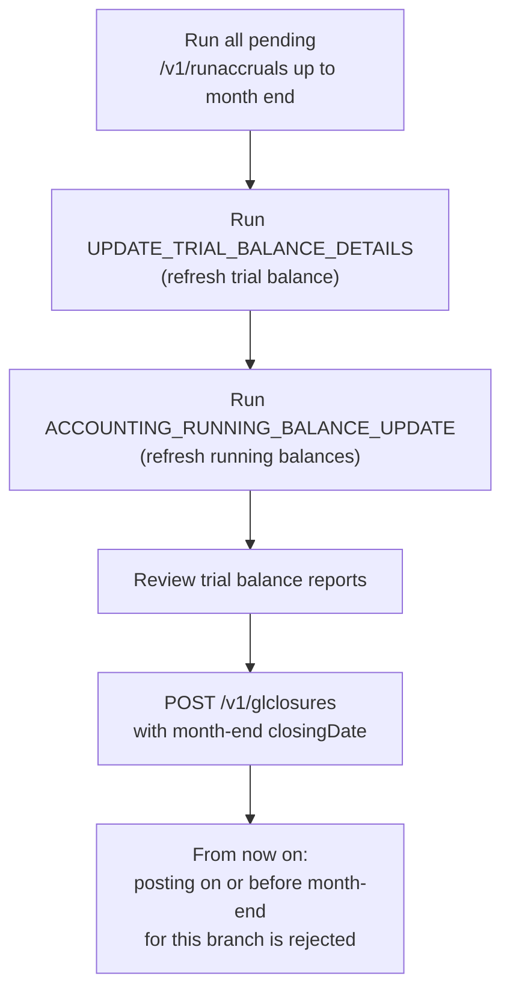

A general-ledger closure in Apache Fineract is a *period seal*: a row in `acc_gl_closure` that records "no journal entry dated on or before this date may be added to this branch any more". Closures are per-branch (office) and per-date. Every posting path — manual journal entries, processor-driven postings, reversals, provisioning, opening-balance contras — consults the latest closure for the relevant branch before persisting. This page documents the entity, services, REST surface, and the guard pattern.

## Entity — `org.apache.fineract.accounting.closure.domain.GLClosure`

```java
@Entity
@Table(name = "acc_gl_closure", uniqueConstraints = {
        @UniqueConstraint(columnNames = { "office_id", "closing_date" }, name = "office_id_closing_date") })
@NoArgsConstructor(access = AccessLevel.PROTECTED)
@Getter
public class GLClosure extends AbstractAuditableCustom {

    @ManyToOne
    @JoinColumn(name = "office_id", nullable = false)
    private Office office;

    @Column(name = "is_deleted", nullable = false)
    private boolean deleted = true;

    @Column(name = "closing_date")
    private LocalDate closingDate;

    @Column(name = "comments", nullable = true, length = 500)
    private String comments;

    public GLClosure(final Office office, final LocalDate closingDate, final String comments) {
        this.office = office;
        this.deleted = false;
        this.closingDate = closingDate;
        this.comments = StringUtils.defaultIfEmpty(comments, null);
        if (this.comments != null) {
            this.comments = this.comments.trim();
        }
    }

    public static GLClosure fromJson(final Office office, final JsonCommand command) {
        final LocalDate closingDate = command.localDateValueOfParameterNamed(GLClosureJsonInputParams.CLOSING_DATE.getValue());
        final String comments = command.stringValueOfParameterNamed(GLClosureJsonInputParams.COMMENTS.getValue());
        return new GLClosure(office, closingDate, comments);
    }
}
```

### Column reference

| Column | Java | Notes |
| --- | --- | --- |
| `id` | `id` | Inherited from `AbstractAuditableCustom`. |
| `office_id` | `office` | FK to `m_office`. |
| `is_deleted` | `deleted` | Default in DDL is `true`, flipped to `false` in the constructor — effectively a `created` indicator. |
| `closing_date` | `closingDate` | The latest date for which posting is no longer permitted. |
| `comments` | `comments` | Free-text reason / context. |
| Audit columns | inherited | `createdby_id`, `created_date`, `lastmodifiedby_id`, `lastmodified_date`. |

Unique constraint `office_id_closing_date` ensures one closure row per (office, date) — you cannot close the same branch on the same date twice.

`GLClosureJsonInputParams` defines the JSON parameter constants: `officeId`, `closingDate`, `comments`, `locale`, `dateFormat`.

## Repository

```java
public interface GLClosureRepository extends JpaRepository<GLClosure, Long> {

    GLClosure getLatestGLClosureByBranch(@Param("officeId") Long officeId);

    List<GLClosure> findAllByOfficeIdOrderByClosingDateDesc(Long officeId);
}
```

`getLatestGLClosureByBranch` is the single most-called accounting query in the platform — every posting path invokes it. It returns the most recent (greatest `closing_date`) non-deleted closure for the branch, or `null` if the branch has no closures.

## Closure-date guard

The pattern is identical everywhere: load the latest closure, throw if the entry date is on or before the closure date.

### Manual journal entries

From `JournalEntryWritePlatformServiceJpaRepositoryImpl.revertJournalEntry(List<JournalEntry>, String)`:

```java
final LocalDate journalEntriesTransactionDate = journalEntries.get(0).getTransactionDate();
final GLClosure latestGLClosureByBranch = this.glClosureRepository.getLatestGLClosureByBranch(officeId);
if (latestGLClosureByBranch != null) {
    if (!DateUtils.isBefore(latestGLClosureByBranch.getClosingDate(), journalEntriesTransactionDate)) {
        throw new JournalEntryInvalidException(GlJournalEntryInvalidReason.ACCOUNTING_CLOSED,
                latestGLClosureByBranch.getClosingDate(), accountName, accountGLCode);
    }
}
```

`DateUtils.isBefore(closingDate, transactionDate)` is read as *"closing date strictly before transaction date"*, so `!isBefore` means *closingDate >= transactionDate* — i.e. the transaction falls on or before the seal, which is forbidden.

### Processor-driven postings

`AccountingProcessorHelper` exposes two helpers used by every processor (cash and accrual, loan and savings and shares):

```java
public GLClosure getLatestClosureByBranch(final Long officeId) {
    return this.closureRepository.getLatestGLClosureByBranch(officeId);
}

public void checkForBranchClosures(final GLClosure latestGLClosure, final LocalDate transactionDate) {
    if (latestGLClosure != null) {
        if (!DateUtils.isBefore(latestGLClosure.getClosingDate(), transactionDate)) {
            throw new JournalEntryInvalidException(GlJournalEntryInvalidReason.ACCOUNTING_CLOSED,
                    latestGLClosure.getClosingDate(), null, null);
        }
    }
}
```

The cash processor's loop is the canonical caller:

```java
final GLClosure latestGLClosure = this.helper.getLatestClosureByBranch(officeId);
...
for (final LoanTransactionDTO loanTransactionDTO : loanDTO.getNewLoanTransactions()) {
    final LocalDate transactionDate = loanTransactionDTO.getTransactionDate();
    ...
    this.helper.checkForBranchClosures(latestGLClosure, transactionDate);
    ...
}
```

Note that the closure is fetched **once** outside the loop. This means within a single batch of transactions the guard uses a consistent snapshot; if a closure is created mid-batch by another transaction it will not be observed until the next call.

### Reversal of loan-driven entries

`JournalEntryWritePlatformServiceJpaRepositoryImpl.createJournalEntryForReversedLoanTransaction`:

```java
@Override
public void createJournalEntryForReversedLoanTransaction(final LocalDate transactionDate,
        final String loanTransactionId, final Long officeId) {
    final GLClosure latestGLClosure = this.helper.getLatestClosureByBranch(officeId);
    this.helper.checkForBranchClosures(latestGLClosure, transactionDate);
    ...
}
```

Same guard. A reversal of a transaction whose date falls in a closed period is rejected — even though the original entries are inside the closure, you cannot record the offset there either.

## Write service

`GLClosureWritePlatformServiceJpaRepositoryImpl.createGLClosure` enforces three rules:

```java
@Transactional
@Override
public CommandProcessingResult createGLClosure(final JsonCommand command) {
    try {
        final GLClosureCommand closureCommand = this.fromApiJsonDeserializer.commandFromApiJson(command.json());
        closureCommand.validateForCreate();

        final Long officeId = command.longValueOfParameterNamed(GLClosureJsonInputParams.OFFICE_ID.getValue());
        final Office office = this.officeRepositoryWrapper.findOneWithNotFoundDetection(officeId);
        // ensure closure date is not in the future
        final LocalDate closureDate = command.localDateValueOfParameterNamed(GLClosureJsonInputParams.CLOSING_DATE.getValue());
        if (DateUtils.isDateInTheFuture(closureDate)) {
            throw new GLClosureInvalidException(GlClosureInvalidReason.FUTURE_DATE, closureDate);
        }
        // shouldn't be before an existing accounting closure
        final GLClosure latestGLClosure = this.glClosureRepository.getLatestGLClosureByBranch(officeId);
        if (latestGLClosure != null && DateUtils.isAfter(latestGLClosure.getClosingDate(), closureDate)) {
            throw new GLClosureInvalidException(GlClosureInvalidReason.ACCOUNTING_CLOSED, latestGLClosure.getClosingDate());
        }
        final GLClosure glClosure = GLClosure.fromJson(office, command);
        this.glClosureRepository.saveAndFlush(glClosure);

        return new CommandProcessingResultBuilder().withCommandId(command.commandId())
                .withOfficeId(officeId).withEntityId(glClosure.getId()).build();
    } catch (final JpaSystemException | DataIntegrityViolationException dve) { ... }
}
```

1. **Office exists** — `OfficeRepositoryWrapper.findOneWithNotFoundDetection`.
2. **Closure date not in the future** — `DateUtils.isDateInTheFuture(closureDate)` ⇒ throws `GLClosureInvalidException(FUTURE_DATE, ...)`. You cannot seal a period that hasn't ended.
3. **Closure date strictly after the previous closure** — `DateUtils.isAfter(latestGLClosure.closingDate, closureDate)` ⇒ throws `GLClosureInvalidException(ACCOUNTING_CLOSED, ...)`. You cannot create a closure inside an already-closed period.

A duplicate `(office, date)` collision is caught at the JDBC layer and translated by `handleGLClosureIntegrityIssues` into `GLClosureDuplicateException`.

### Update

Only `comments` may be updated:

```java
public Map<String, Object> update(final JsonCommand command) {
    final Map<String, Object> actualChanges = new LinkedHashMap<>(5);
    handlePropertyUpdate(command, actualChanges, GLClosureJsonInputParams.COMMENTS.getValue(), this.comments);
    return actualChanges;
}
```

`closingDate` and `officeId` are immutable on an existing closure — the only safe path to "amend" a seal is to delete it and re-create.

### Delete

Only the latest closure per branch can be deleted:

```java
@Transactional
@Override
public CommandProcessingResult deleteGLClosure(final Long glClosureId) {
    final GLClosure glClosure = this.glClosureRepository.findById(glClosureId)
            .orElseThrow(() -> new GLClosureNotFoundException(glClosureId));

    final LocalDate closureDate = glClosure.getClosingDate();
    final GLClosure latestGLClosure = this.glClosureRepository.getLatestGLClosureByBranch(glClosure.getOffice().getId());
    if (DateUtils.isAfter(latestGLClosure.getClosingDate(), closureDate)) {
        throw new GLClosureInvalidDeleteException(latestGLClosure.getOffice().getId(),
                latestGLClosure.getOffice().getName(), latestGLClosure.getClosingDate());
    }

    this.glClosureRepository.delete(glClosure);
    return new CommandProcessingResultBuilder().withOfficeId(glClosure.getOffice().getId())
            .withEntityId(glClosure.getId()).build();
}
```

Deleting an older closure would punch a hole in the period seal — there would be a window of "closed" periods with a later "open" period inside, which makes no accounting sense.

## Exceptions

| Class | Mapped HTTP | Condition |
| --- | --- | --- |
| `GLClosureNotFoundException` | 404 | `glClosureId` does not exist. |
| `GLClosureDuplicateException` | 400 | `(office, date)` collision. |
| `GLClosureInvalidException(FUTURE_DATE, …)` | 400 | Closure date in the future. |
| `GLClosureInvalidException(ACCOUNTING_CLOSED, …)` | 400 | New date overlaps an existing closure. |
| `GLClosureInvalidDeleteException` | 400 | Tried to delete a non-latest closure. |

`GLClosureInvalidException` carries the offending date via `GlClosureInvalidReason` so the i18n error can render context.

## REST resource — `/v1/glclosures`

`GLClosuresApiResource`:

| Method | Path | Operation | Permission |
| --- | --- | --- | --- |
| `GET` | `/v1/glclosures?officeId={n}` | List closures (optionally filtered by office). | `GLCLOSURE` |
| `GET` | `/v1/glclosures/{glClosureId}` | Single closure, optionally with office dropdown. | `GLCLOSURE` |
| `POST` | `/v1/glclosures` | Create. | `CREATE_GLCLOSURE` |
| `PUT` | `/v1/glclosures/{glClosureId}` | Update comments. | `UPDATE_GLCLOSURE` |
| `DELETE` | `/v1/glclosures/{glClosureId}` | Delete latest. | `DELETE_GLCLOSURE` |

The API description in the resource sums up the semantics precisely:

> An accounting closure indicates that no more journal entries may be logged (or reversed) in the system, either manually or via the portfolio with an entry date prior to the defined closure date.

## Read service

`GLClosureReadPlatformServiceImpl.retrieveAllGLClosures(Long officeId)` returns a list ordered by `closing_date DESC`. The DTO `GLClosureData` carries `id`, `officeId`, `officeName`, `closingDate`, `comments`, audit fields and (when used as a template) an `allowedOffices` collection.

## Command handlers

| Handler | CommandType |
| --- | --- |
| `CreateGLClosureCommandHandler` | `GLCLOSURE` / `CREATE` |
| `UpdateGLClosureCommandHandler` | `GLCLOSURE` / `UPDATE` |
| `DeleteGLClosureCommandHandler` | `GLCLOSURE` / `DELETE` |

Each is a thin delegate to `GLClosureWritePlatformService`.

## Guard sites map

The closure guard lives in multiple posting paths. Quick reference:

| Path | Guard call |
| --- | --- |
| `JournalEntryWritePlatformServiceJpaRepositoryImpl.createJournalEntry` | `validateBusinessRulesForJournalEntries` → `getLatestGLClosureByBranch` |
| `JournalEntryWritePlatformServiceJpaRepositoryImpl.revertJournalEntry` | inline check shown above |
| `JournalEntryWritePlatformServiceJpaRepositoryImpl.createJournalEntryForReversedLoanTransaction` | `helper.checkForBranchClosures` |
| `JournalEntryWritePlatformServiceJpaRepositoryImpl.createProvisioningJournalEntries` | per-office check via helper |
| `CashBasedAccountingProcessorForLoan.createJournalEntriesForLoan` | `helper.checkForBranchClosures` per transaction |
| `AccrualBasedAccountingProcessorForLoan.createJournalEntriesForLoan` | same |
| `CashBasedAccountingProcessorForSavings`, `AccrualBasedAccountingProcessorForSavings` | same |
| `CashBasedAccountingProcessorForShares` | same |
| `CashBasedAccountingProcessorForClientTransactions` | same |

## Sequencing of period-end activities

A typical month-end workflow at a branch:



The closure is the *last* step because it freezes the period; you cannot run accruals or refresh balances backward across a closure.

## Edge cases

<AccordionGroup>
  <Accordion title="No closure on a branch yet">
    `getLatestGLClosureByBranch` returns `null`, the guard short-circuits, and any date (past or current) is acceptable. New tenants start in this state.
  </Accordion>
  <Accordion title="Closure across head office / branches">
    Closures are **per branch**. Closing head office on a date does not close the child branches. Each branch must have its own closure row to seal that branch's books on that date.
  </Accordion>
  <Accordion title="What about back-dated postings allowed by global config?">
    The configuration `allow-backdated-transactions` controls *whether the loan write service accepts* a back-dated transaction, but does **not** override the closure guard. Even with that flag on, a back-dated transaction still has to fall after the latest closure date.
  </Accordion>
  <Accordion title="Future closure date">
    Rejected by `GLClosureInvalidException(FUTURE_DATE)`. The closure date must be on or before the business date at the time of creation.
  </Accordion>
</AccordionGroup>

## Operations — typical workflows

### Closing a single branch at month end

```http
POST /v1/glclosures HTTP/1.1
Content-Type: application/json

{
  "officeId": 4,
  "closingDate": "31 March 2024",
  "comments": "Q1 2024 month-end close (audit-ready)",
  "dateFormat": "dd MMMM yyyy",
  "locale": "en"
}
```

The response is the standard `CommandProcessingResult`:

```json
{
  "officeId": 4,
  "resourceId": 217,
  "commandId": 9912
}
```

### Discovering the latest closure for a branch

```http
GET /v1/glclosures?officeId=4
```

Returns a list ordered by `closingDate DESC`. The first element (if present) is the seal; any posting attempt with `transactionDate <= closingDate` for office 4 is rejected.

### Discovering all closures across all branches

```http
GET /v1/glclosures
```

The user must have `GLCLOSURE` read permission. The response contains one element per closure across all offices, useful for the operations dashboard's "open branches" widget.

### Trying to reverse a closed-period entry

```http
POST /v1/journalentries?command=reverse&transactionId=L91872
```

Response 400:

```json
{
  "developerMessage": "Entries with a transaction date prior to the latest accounting closure dated 31 March 2024 for branch 'Branch A' cannot be reversed",
  "userMessageGlobalisationCode": "error.msg.glJournalEntry.cannot.transact.against.closed.accounts",
  "defaultUserMessage": "Cannot reverse a journal entry posted prior to a branch closure",
  "errors": []
}
```

The error code points back to `JournalEntryInvalidException(GlJournalEntryInvalidReason.ACCOUNTING_CLOSED, ...)`.

## Read service details

`GLClosureReadPlatformServiceImpl.retrieveAllGLClosures(Long officeId)` builds the following SQL (paraphrased):

```sql
SELECT
    gc.id,
    gc.office_id, o.name AS office_name,
    gc.closing_date, gc.comments,
    gc.created_date, gc.lastmodified_date,
    cb.username AS created_by, mb.username AS modified_by
FROM acc_gl_closure gc
JOIN m_office o ON gc.office_id = o.id
LEFT JOIN m_appuser cb ON gc.createdby_id = cb.id
LEFT JOIN m_appuser mb ON gc.lastmodifiedby_id = mb.id
WHERE gc.is_deleted = 0
  AND (? IS NULL OR gc.office_id = ?)
ORDER BY gc.closing_date DESC
```

The `is_deleted = 0` filter is what the entity's column is for — when the write service "deletes" a closure (the latest one of a branch), the row in fact persists with `is_deleted = 0` flipped to the historical default `true`. The read service hides those.

`GLClosureData` (data shape):

| Field | Type |
| --- | --- |
| `id` | `Long` |
| `officeId` | `Long` |
| `officeName` | `String` |
| `closingDate` | `LocalDate` |
| `comments` | `String` |
| `createdDate` | `LocalDateTime` |
| `lastUpdatedDate` | `LocalDateTime` |
| `createdByUserId`, `createdByUsername`, `lastUpdatedByUserId`, `lastUpdatedByUsername` | audit |
| `allowedOffices` | `Collection<OfficeData>` (only on template) |

## Cross references

<CardGroup cols={2}>
  <Card title="Journal entries" icon="pen-to-square" href="/accounting/journal-entries">
    The guard's primary client.
  </Card>
  <Card title="Accounting processors" icon="gears" href="/accounting/accounting-processors">
    Where `checkForBranchClosures` is called per transaction.
  </Card>
  <Card title="Trial balance" icon="chart-line" href="/accounting/trial-balance">
    Closure is normally the last step of period end after the trial balance is approved.
  </Card>
  <Card title="Jobs overview" icon="clock" href="/jobs/overview">
    Sequencing of period-end batch jobs.
  </Card>
</CardGroup>
