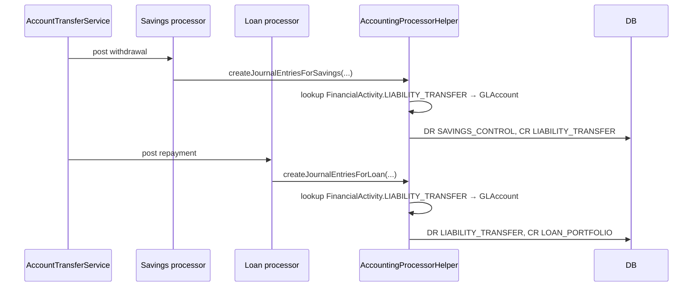

Some accounting flows in Apache Fineract are *organisation-wide* rather than per-product. When a customer transfers money from a savings account to a loan, the savings module credits its `SAVINGS_CONTROL` and the loan module debits its `LOAN_PORTFOLIO`, but the intermediary "in transit" account is a single GL account configured at the organisation level. `FinancialActivityAccount` is the binding table that holds those organisation-level associations.

## Conceptual model

There is a finite set of `FinancialActivity` values defined in `AccountingConstants`:

```java
public enum FinancialActivity {

    ASSET_TRANSFER(100,                       "assetTransfer",                  GLAccountType.ASSET),
    LIABILITY_TRANSFER(200,                   "liabilityTransfer",              GLAccountType.LIABILITY),
    CASH_AT_MAINVAULT(101,                    "cashAtMainVault",                GLAccountType.ASSET),
    CASH_AT_TELLER(102,                       "cashAtTeller",                   GLAccountType.ASSET),
    OPENING_BALANCES_TRANSFER_CONTRA(300,     "openingBalancesTransferContra",  GLAccountType.EQUITY),
    ASSET_FUND_SOURCE(103,                    "fundSource",                     GLAccountType.ASSET),
    PAYABLE_DIVIDENDS(201,                    "payableDividends",               GLAccountType.LIABILITY);
    ...
}
```

Each enum value has three pieces of data:

- a numeric `value` (used as the `financial_activity_type` column);
- a `code` (i18n key);
- a *mapped GL account type* — the constraint that any `GLAccount` bound to this activity must be of that classification.

The seven activities split into three families:

| Family | Members | Used by |
| --- | --- | --- |
| **Inter-account transfer suspense** | `ASSET_TRANSFER`, `LIABILITY_TRANSFER` | Savings ↔ loan account transfers. |
| **Cash management** | `CASH_AT_MAINVAULT`, `CASH_AT_TELLER`, `ASSET_FUND_SOURCE` | Teller / vault management workflows. |
| **Organisation events** | `OPENING_BALANCES_TRANSFER_CONTRA`, `PAYABLE_DIVIDENDS` | Opening balance contra entries; share dividend payouts. |

## Entity — `org.apache.fineract.accounting.financialactivityaccount.domain.FinancialActivityAccount`

```java
@Entity
@Table(name = "acc_gl_financial_activity_account")
@NoArgsConstructor(access = AccessLevel.PROTECTED)
@AllArgsConstructor
@Getter
public class FinancialActivityAccount extends AbstractPersistableCustom<Long> {

    @ManyToOne(fetch = FetchType.EAGER)
    @JoinColumn(name = "gl_account_id")
    private GLAccount glAccount;

    @Column(name = "financial_activity_type", nullable = false)
    private Integer financialActivityType;

    public static FinancialActivityAccount createNew(final GLAccount glAccount, final Integer financialAccountType) {
        return new FinancialActivityAccount(glAccount, financialAccountType);
    }

    public void updateGlAccount(final GLAccount glAccount) {
        this.glAccount = glAccount;
    }

    public void updateFinancialActivityType(final Integer financialActivityType) {
        this.financialActivityType = financialActivityType;
    }
}
```

Only two fields beyond the id:

| Column | Java | Purpose |
| --- | --- | --- |
| `gl_account_id` | `glAccount` | FK to `acc_gl_account`. |
| `financial_activity_type` | `financialActivityType` | One of the `FinancialActivity.value()` integers. |

The combination is effectively unique — a tenant has at most one row per `financialActivityType` — though the uniqueness is enforced by the validator and `FinancialActivityAccountRepositoryWrapper` rather than a DB constraint.

## Repositories

```java
public interface FinancialActivityAccountRepository
        extends JpaRepository<FinancialActivityAccount, Long> {

    FinancialActivityAccount findByFinancialActivityType(int financialActivityType);
}
```

`FinancialActivityAccountRepositoryWrapper` adds:

- `findOneWithNotFoundDetection(Long)` → throws `FinancialActivityAccountNotFoundException`.
- `findByFinancialActivityTypeWithNotFoundDetection(int)` → same for activity type lookup.

The accounting processors call the activity-type lookup directly — e.g. when a savings ↔ loan transfer is detected:

```java
final FinancialActivityAccount liabilityTransfer = this.helper.getFinancialActivityAccount(
        FinancialActivity.LIABILITY_TRANSFER.getValue());
final GLAccount liabilityTransferAccount = liabilityTransfer.getGlAccount();
```

If the mapping is missing, the wrapper raises `FinancialActivityAccountNotFoundException` and the transfer rejection bubbles back to the caller.

## Validator — `FinancialActivityAccountDataValidator`

The validator gates the seven legal activity ids and ensures the GL account id is present:

```java
public void validateForCreate(final String json) {
    validateJSONAndCheckForUnsupportedParams(json);
    final List<ApiParameterError> dataValidationErrors = new ArrayList<>();
    final DataValidatorBuilder baseDataValidator = getDataValidator(dataValidationErrors);
    final JsonElement element = this.fromApiJsonHelper.parse(json);

    final Integer financialActivityId = this.fromApiJsonHelper.extractIntegerSansLocaleNamed(
            paramNameForFinancialActivity, element);
    baseDataValidator.reset().parameter(paramNameForFinancialActivity).value(financialActivityId).notNull().isOneOfTheseValues(
            FinancialActivity.ASSET_TRANSFER.getValue(),
            FinancialActivity.LIABILITY_TRANSFER.getValue(),
            FinancialActivity.CASH_AT_MAINVAULT.getValue(),
            FinancialActivity.CASH_AT_TELLER.getValue(),
            FinancialActivity.OPENING_BALANCES_TRANSFER_CONTRA.getValue(),
            FinancialActivity.ASSET_FUND_SOURCE.getValue(),
            FinancialActivity.PAYABLE_DIVIDENDS.getValue());

    final Long glAccountId = this.fromApiJsonHelper.extractLongNamed(paramNameForGLAccount, element);
    baseDataValidator.reset().parameter(paramNameForGLAccount).value(glAccountId).notNull().integerGreaterThanZero();

    throwExceptionIfValidationWarningsExist(dataValidationErrors);
}
```

`validateForUpdate` accepts either or both fields; absent fields are ignored.

## Write service — `FinancialActivityAccountWritePlatformServiceImpl`

```java
@Transactional
public CommandProcessingResult createGLAccountActivityMapping(JsonCommand command) {
    this.dataValidator.validateForCreate(command.json());

    final Integer financialActivityId = command.integerValueSansLocaleOfParameterNamed(
            FinancialActivityAccountsJsonInputParams.FINANCIAL_ACTIVITY_ID.getValue());
    final FinancialActivity activity = FinancialActivity.fromInt(financialActivityId);

    final Long glAccountId = command.longValueOfParameterNamed(
            FinancialActivityAccountsJsonInputParams.GL_ACCOUNT_ID.getValue());
    final GLAccount glAccount = glAccountRepositoryWrapper.findOneWithNotFoundDetection(glAccountId);

    // Type compatibility: glAccount.type must match activity.mappedGLAccountType
    if (!glAccount.getType().equals(activity.getMappedGLAccountType().getValue())) {
        throw new FinancialActivityAccountInvalidException(activity, glAccount);
    }

    // Duplicate guard
    final FinancialActivityAccount existing = repository.findByFinancialActivityType(financialActivityId);
    if (existing != null) {
        throw new DuplicateFinancialActivityAccountFoundException(activity);
    }

    final FinancialActivityAccount entity = FinancialActivityAccount.createNew(glAccount, financialActivityId);
    repository.saveAndFlush(entity);
    return new CommandProcessingResultBuilder().withEntityId(entity.getId()).build();
}
```

Two semantic constraints (in addition to validator-level field checks):

1. **Type match.** The GL account's `type` (`ASSET`/`LIABILITY`/`EQUITY`/…) must equal the activity's `mappedGLAccountType`. Trying to bind `LIABILITY_TRANSFER` to an Asset account throws `FinancialActivityAccountInvalidException`.
2. **Uniqueness.** One row per activity id — re-mapping requires update or delete-then-create.

## REST resource — `/v1/financialactivityaccounts`

`FinancialActivityAccountsApiResource`:

| Method | Path | Operation | Permission |
| --- | --- | --- | --- |
| `GET` | `/v1/financialactivityaccounts/template` | Returns dropdown of activities + eligible GL accounts. | `FINANCIALACTIVITYACCOUNT` |
| `GET` | `/v1/financialactivityaccounts` | List all mappings. | `FINANCIALACTIVITYACCOUNT` |
| `GET` | `/v1/financialactivityaccounts/{mappingId}` | Single mapping, optionally with template enrichment. | `FINANCIALACTIVITYACCOUNT` |
| `POST` | `/v1/financialactivityaccounts` | Create. | `CREATE_FINANCIALACTIVITYACCOUNT` |
| `PUT` | `/v1/financialactivityaccounts/{mappingId}` | Update. | `UPDATE_FINANCIALACTIVITYACCOUNT` |
| `DELETE` | `/v1/financialactivityaccounts/{mappingId}` | Delete. | `DELETE_FINANCIALACTIVITYACCOUNT` |

The resource description in source explains the use case:

> Organization Level Financial Activities like Asset and Liability Transfer can be mapped to GL Account. Integrated accounting takes these accounts into consideration when an Account transfer is made between a savings to loan/savings account and vice-versa.

## Read service

`FinancialActivityAccountReadPlatformServiceImpl` exposes:

- `getFinancialActivityAccountTemplate()` → returns a `FinancialActivityAccountData` populated with `allowedFinancialActivities` (the list of seven) and `allowedGLAccounts` (filtered to the appropriate GL account type for each, surfaced via the UI when the user picks the activity).
- `retrieveAll()` → all mappings.
- `retrieve(Long)` → single mapping.
- `addTemplateDetails(FinancialActivityAccountData)` → enrichment used by template `?template=true` query.

`FinancialActivityAccountData` (shape):

| Field | Type | Notes |
| --- | --- | --- |
| `id` | `Long` | Mapping id. |
| `financialActivityData` | `FinancialActivityData` | The activity definition (id, name, type). |
| `glAccountData` | `GLAccountData` | The bound GL account. |
| `allowedFinancialActivities` | `List<FinancialActivityData>` | Only on template. |
| `allowedGLAccounts` | `List<GLAccountData>` | Only on template. |

## Use cases — what each activity drives

### `ASSET_TRANSFER` / `LIABILITY_TRANSFER`

The `AccountTransfersWritePlatformService` (in `fineract-provider`) uses these when moving money between a savings and a loan, or two savings accounts under different products. The flow:



The two halves both touch the same liability transfer account, which nets to zero — that's the accounting purpose of the bridging account.

### `OPENING_BALANCES_TRANSFER_CONTRA`

Used by `JournalEntryWritePlatformServiceJpaRepositoryImpl.defineOpeningBalance(...)`. When a tenant first migrates from a paper ledger to Fineract, they call `POST /v1/journalentries?command=defineOpeningBalance` with the opening positions. The implementation creates manual journal entries crediting/debiting each operating GL account, with the **contra side** going to the `OPENING_BALANCES_TRANSFER_CONTRA` equity account. That account ends up holding the historical net position, and standard reporting treats it as the bookkeeping balance brought forward.

`FinancialActivity.OPENING_BALANCES_TRANSFER_CONTRA` must be mapped before opening-balance entries can be defined; the JE write service throws if the mapping is missing.

### `PAYABLE_DIVIDENDS`

Used by the share-product dividend pay-out flow. When dividends are declared on a share product, the system credits `PAYABLE_DIVIDENDS` (liability) — when paid out the same account is debited.

### `CASH_AT_MAINVAULT` / `CASH_AT_TELLER` / `ASSET_FUND_SOURCE`

Used by the teller / vault management flows (cash on hand at a branch's main vault vs at an individual teller's drawer). These are organisation defaults that branch-level configuration can override.

## Exceptions

| Class | Condition |
| --- | --- |
| `FinancialActivityAccountNotFoundException` | 404 on mapping id. |
| `DuplicateFinancialActivityAccountFoundException` | Cannot create a second mapping for the same activity id. |
| `FinancialActivityAccountInvalidException` | GL account type does not match activity's mapped type. |

## Command handlers

| Handler | CommandType |
| --- | --- |
| `CreateFinancialActivityAccountHandler` | `FINANCIALACTIVITYACCOUNT` / `CREATE` |
| `UpdateFinancialActivityAccountCommandHandler` | `FINANCIALACTIVITYACCOUNT` / `UPDATE` |
| `DeleteFinancialActivityAccountCommandHandler` | `FINANCIALACTIVITYACCOUNT` / `DELETE` |

## Recommended seed mappings

For a typical new tenant deployment, define at least three mappings:

```json
[
  { "financialActivityId": 200, "glAccountId": <liability_transfer_in_suspense_account> },
  { "financialActivityId": 100, "glAccountId": <asset_transfer_in_suspense_account> },
  { "financialActivityId": 300, "glAccountId": <opening_balances_equity_account> }
]
```

Without `LIABILITY_TRANSFER` mapped, savings ↔ loan transfers fail at posting time. Without `OPENING_BALANCES_TRANSFER_CONTRA` mapped, the opening-balance API rejects every request.

## Worked example — savings-to-loan transfer

A customer transfers 200.00 from her savings account (id 7000, product id 12) to her loan account (id 9000, product id 4) on 2024-03-15. Both accounts belong to office 1. The savings product's `TRANSFERS_SUSPENSE` slot is mapped to GL account 51; the loan product's `TRANSFERS_SUSPENSE` is mapped to GL account 52. The organisation-level `LIABILITY_TRANSFER` financial activity is mapped to GL account 99.

The transfer flow produces journal entries that share the financial-activity account:

### Savings withdrawal batch

| Side | GL account | Amount |
| --- | --- | --- |
| Debit | `SAVINGS_CONTROL` (savings product 12) | 200.00 |
| Credit | account 99 — `LIABILITY_TRANSFER` (org-level) | 200.00 |

### Loan repayment batch

| Side | GL account | Amount |
| --- | --- | --- |
| Debit | account 99 — `LIABILITY_TRANSFER` (org-level) | 200.00 |
| Credit | `LOAN_PORTFOLIO` (loan product 4) | 200.00 |

After both batches: `SAVINGS_CONTROL` is down 200, `LOAN_PORTFOLIO` is down 200, and `LIABILITY_TRANSFER` is flat. The bridge between the two subledgers nets to zero, exactly as bookkeeping expects.

## Diagnostics

If a transfer fails at posting time with `FinancialActivityAccountNotFoundException`, the most likely cause is that the relevant `FinancialActivity` enum value is **not yet mapped**. Use:

```http
GET /v1/financialactivityaccounts
```

to list current mappings. Cross-reference with the seven values in `FinancialActivity`. The exception message includes the missing activity id so operators know which to add.

## Migration considerations

When a tenant upgrades from an older Fineract version, the migration scripts seed a row keyed to `OPENING_BALANCES_TRANSFER_CONTRA` with a default Equity account. If the seed picks the wrong account, the opening-balance API may post into the wrong contra — operators should review and adjust before defining opening balances.

`PAYABLE_DIVIDENDS` was added in a later release; if you're hitting the share-dividend pay-out flow and getting `FinancialActivityAccountNotFoundException`, that's the missing mapping.

## Cross references

<CardGroup cols={2}>
  <Card title="GL accounts" icon="book" href="/accounting/gl-accounts">
    The target of every mapping.
  </Card>
  <Card title="Product to account mapping" icon="diagram-project" href="/accounting/product-to-account-mapping">
    Sister table for product-level slot mapping.
  </Card>
  <Card title="Journal entries" icon="pen-to-square" href="/accounting/journal-entries">
    Opening balance contra entries are normal journal entries with `OPENING_BALANCES_TRANSFER_CONTRA` on one side.
  </Card>
  <Card title="Accounting processors" icon="gears" href="/accounting/accounting-processors">
    The savings ↔ loan transfer postings.
  </Card>
</CardGroup>
