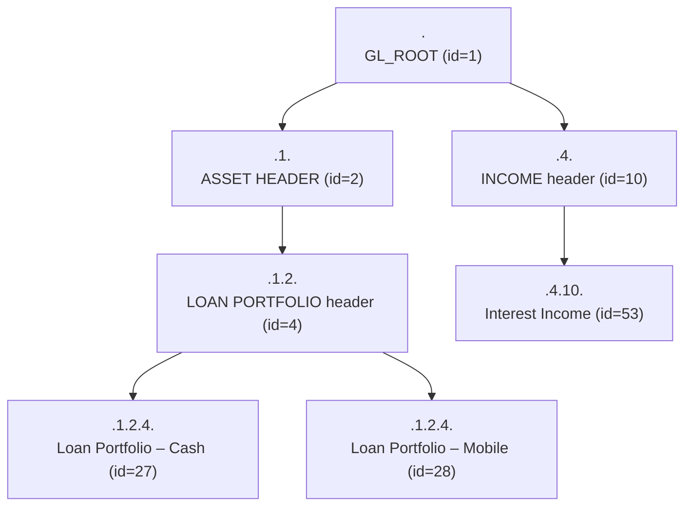

The chart of accounts is the foundation of Apache Fineract's accounting module. Every monetary movement eventually lands on a `GLAccount` row, and every product-to-account binding, every accounting rule, every journal entry, and every trial-balance line ultimately references one of these rows. This page documents the `GLAccount` JPA entity, its enums (`GLAccountType`, `GLAccountUsage`), the parent / hierarchy model, the disabled-account semantics, and the read/write services.

## Entity — `org.apache.fineract.accounting.glaccount.domain.GLAccount`

`GLAccount` is defined in `fineract-core` and maps to the `acc_gl_account` table.

```java
@Entity
@Table(name = "acc_gl_account", uniqueConstraints = {
        @UniqueConstraint(columnNames = { "gl_code" }, name = "acc_gl_code") })
@Getter
@Setter
@NoArgsConstructor
@Accessors(chain = true)
public class GLAccount extends AbstractPersistableCustom<Long> {

    @ManyToOne(fetch = FetchType.LAZY)
    @JoinColumn(name = "parent_id")
    private GLAccount parent;

    @Column(name = "hierarchy", nullable = true, length = 50)
    private String hierarchy;

    @OneToMany(fetch = FetchType.LAZY)
    @JoinColumn(name = "parent_id")
    private List<GLAccount> children = new ArrayList<>();

    @Column(name = "name", nullable = false, length = 45)
    private String name;

    @Column(name = "gl_code", nullable = false, length = 100)
    private String glCode;

    @Column(name = "disabled", nullable = false)
    private boolean disabled;

    @Column(name = "manual_journal_entries_allowed", nullable = false)
    private boolean manualEntriesAllowed = true;

    @Column(name = "classification_enum", nullable = false)
    private Integer type;

    @Column(name = "account_usage", nullable = false)
    private Integer usage;

    @Column(name = "description", nullable = true, length = 500)
    private String description;

    @ManyToOne(fetch = FetchType.LAZY)
    @JoinColumn(name = "tag_id")
    private CodeValue tagId;
```

### Field reference

| Field | Column | Type | Notes |
| --- | --- | --- | --- |
| `id` | `id` | `Long` | Inherited from `AbstractPersistableCustom`. |
| `parent` | `parent_id` | FK → `acc_gl_account` | Null for top-level accounts. |
| `hierarchy` | `hierarchy` | `varchar(50)` | Dot-delimited path of ancestor ids, e.g. `.1.4.27.`. Used for cheap subtree filtering. |
| `children` | (inverse of `parent_id`) | `List<GLAccount>` | Lazy collection of immediate children. |
| `name` | `name` | `varchar(45)` | Human-readable name. |
| `glCode` | `gl_code` | `varchar(100)` | Globally unique (DB constraint `acc_gl_code`). Used as a stable external code. |
| `disabled` | `disabled` | `boolean` | When true, the account cannot be referenced by new mappings / new entries. |
| `manualEntriesAllowed` | `manual_journal_entries_allowed` | `boolean` | Defaults to `true`. When `false`, the account is read-only from the manual JE API; it can still receive entries from processors / rules. |
| `type` | `classification_enum` | int | One of `GLAccountType` values. |
| `usage` | `account_usage` | int | `DETAIL=1` or `HEADER=2`. |
| `description` | `description` | `varchar(500)` | Optional descriptive text. |
| `tagId` | `tag_id` | FK → `m_code_value` | Optional tag for reporting groupings. The allowed code-name depends on `type` (see below). |

## GLAccountType — `ASSET / LIABILITY / EQUITY / INCOME / EXPENSE`

```java
public enum GLAccountType {

    ASSET(1,     "accountType.asset"),
    LIABILITY(2, "accountType.liability"),
    EQUITY(3,    "accountType.equity"),
    INCOME(4,    "accountType.income"),
    EXPENSE(5,   "accountType.expense");
    ...
    public static GLAccountType fromInt(final Integer v) { ... }
}
```

The numeric value is what is persisted into `classification_enum`. The `code` is the i18n key surfaced through `EnumOptionData` in API responses. `fromInt` is the canonical decoder used wherever code receives a raw integer (REST input, ResultSet rows).

The five values map to the standard accounting equation: **Assets = Liabilities + Equity** with **Income** increasing equity and **Expense** decreasing it.

### Tag code names

`AccountingConstants` exports the code-list names that gate which `tagId` value is legal for each type:

```java
public static final String ASSESTS_TAG_OPTION_CODE_NAME    = "AssetAccountTags";
public static final String LIABILITIES_TAG_OPTION_CODE_NAME = "LiabilityAccountTags";
public static final String EQUITY_TAG_OPTION_CODE_NAME     = "EquityAccountTags";
public static final String INCOME_TAG_OPTION_CODE_NAME     = "IncomeAccountTags";
public static final String EXPENSES_TAG_OPTION_CODE_NAME   = "ExpenseAccountTags";
```

`GLAccountWritePlatformServiceJpaRepositoryImpl` validates that `tagId` (if supplied) belongs to the code-list matching the account's `type`.

## GLAccountUsage — `DETAIL` vs `HEADER`

```java
public enum GLAccountUsage {

    DETAIL(1, "accountUsage.detail"),
    HEADER(2, "accountUsage.header");
    ...
}
```

A **detail** account is a posting account: it appears on journal entries, in mappings, in trial balance lines. A **header** account exists only for hierarchical grouping in the chart of accounts UI — it carries no balance of its own and cannot receive journal entries.

The entity exposes two convenience predicates:

```java
public boolean isHeaderAccount() {
    return GLAccountUsage.HEADER.getValue().equals(this.usage);
}

public boolean isDetailAccount() {
    return GLAccountUsage.DETAIL.getValue().equals(this.usage);
}
```

`GLAccountWritePlatformServiceJpaRepositoryImpl.validateForCreate` and `validateForUpdate` both refuse to accept a header account as a journal entry target or as the `parent` of a detail account that already has children.

## Hierarchy

The `hierarchy` string is computed at insert/update time by:

```java
public void generateHierarchy() {
    if (this.parent != null) {
        this.hierarchy = this.parent.hierarchyOf(getId());
    } else {
        this.hierarchy = ".";
    }
}

private String hierarchyOf(final Long id) {
    return this.hierarchy + id.toString() + ".";
}
```

A top-level account has `hierarchy = "."`. A child of an account whose hierarchy is `.4.` and whose own id is `27` ends up with `hierarchy = ".4.27."`. This format lets the read side use `LIKE` predicates like `hierarchy LIKE '.4.%'` to fetch a whole subtree cheaply.



<Warning>
The `hierarchy` field has a 50-character limit. Deeply nested charts of accounts (more than ~10 levels) can overflow. `GLAccountWritePlatformServiceJpaRepositoryImpl` does **not** explicitly truncate or validate hierarchy depth — a future-proof chart should keep depth low.
</Warning>

## `fromJson` factory

The static constructor reads the JSON command:

```java
public static GLAccount fromJson(final GLAccount parent, final JsonCommand command, final CodeValue glAccountTagType) {
    final String name = command.stringValueOfParameterNamed(GLAccountJsonInputParams.NAME.getValue());
    final String glCode = command.stringValueOfParameterNamed(GLAccountJsonInputParams.GL_CODE.getValue());
    final boolean disabled = command.booleanPrimitiveValueOfParameterNamed(GLAccountJsonInputParams.DISABLED.getValue());
    final boolean manualEntriesAllowed = command
            .booleanPrimitiveValueOfParameterNamed(GLAccountJsonInputParams.MANUAL_ENTRIES_ALLOWED.getValue());
    final Integer usage = command.integerValueSansLocaleOfParameterNamed(GLAccountJsonInputParams.USAGE.getValue());
    final Integer type = command.integerValueSansLocaleOfParameterNamed(GLAccountJsonInputParams.TYPE.getValue());
    final String description = command.stringValueOfParameterNamed(GLAccountJsonInputParams.DESCRIPTION.getValue());
    return new GLAccount().setParent(parent).setName(name).setGlCode(glCode).setDisabled(disabled)
            .setManualEntriesAllowed(manualEntriesAllowed).setType(type).setUsage(usage).setDescription(description)
            .setTagId(glAccountTagType);
}
```

Parameter names are constants in `GLAccountJsonInputParams` (in `fineract-core`): `name`, `parentId`, `glCode`, `disabled`, `manualEntriesAllowed`, `type`, `usage`, `description`, `tagId`.

## Update semantics

`update(JsonCommand)` walks the JSON command, calling `handlePropertyUpdate` overloads for each field. The overloads are interesting because they double-check the field actually changed before recording it in the returned `Map<String, Object>`:

```java
public Map<String, Object> update(final JsonCommand command) {
    final Map<String, Object> actualChanges = new LinkedHashMap<>(15);
    handlePropertyUpdate(command, actualChanges, GLAccountJsonInputParams.DESCRIPTION.getValue(), this.description);
    handlePropertyUpdate(command, actualChanges, GLAccountJsonInputParams.DISABLED.getValue(), this.disabled);
    handlePropertyUpdate(command, actualChanges, GLAccountJsonInputParams.GL_CODE.getValue(), this.glCode);
    handlePropertyUpdate(command, actualChanges, GLAccountJsonInputParams.MANUAL_ENTRIES_ALLOWED.getValue(), this.manualEntriesAllowed);
    handlePropertyUpdate(command, actualChanges, GLAccountJsonInputParams.NAME.getValue(), this.name);
    handlePropertyUpdate(command, actualChanges, GLAccountJsonInputParams.PARENT_ID.getValue(), 0L);
    handlePropertyUpdate(command, actualChanges, GLAccountJsonInputParams.TYPE.getValue(), this.type, true);
    handlePropertyUpdate(command, actualChanges, GLAccountJsonInputParams.USAGE.getValue(), this.usage, true);
    handlePropertyUpdate(command, actualChanges, GLAccountJsonInputParams.TAGID.getValue(),
            this.tagId == null ? 0L : this.tagId.getId());
    return actualChanges;
}
```

The returned map is exactly what `CommandProcessingResult.changes()` reflects back to the caller, so clients see only fields that actually changed. The `sansLocale` flag in the integer overload controls whether `JsonCommand` uses the request's locale when parsing numbers (false) or strictly base-10 (true).

## Repositories

```java
public interface GLAccountRepository
        extends JpaRepository<GLAccount, Long>, JpaSpecificationExecutor<GLAccount> { ... }
```

`GLAccountRepositoryWrapper` adds throw-on-missing semantics:

- `findOneWithNotFoundDetection(Long)` → throws `GLAccountNotFoundException`.
- `findOneByGlCode(String)` → optional lookup by stable code.

## Write service

`GLAccountWritePlatformServiceJpaRepositoryImpl` (in `fineract-accounting`) implements:

- `createGLAccount(JsonCommand)`
- `updateGLAccount(Long, JsonCommand)`
- `deleteGLAccount(Long)`

Its create flow:

1. Calls `GLAccountCommandFromApiJsonDeserializer.validateForCreate` to enforce required fields.
2. Resolves `parentId` (optional) to a parent `GLAccount`. Header parent must itself be a header **of the same `type`** — otherwise `InvalidParentGLAccountHeadException` or `GLAccountInvalidParentException`.
3. Resolves the optional `tagId` to a `CodeValue` from the code-list named by the type (`AssetAccountTags`, …). Mismatches throw `GLAccountInvalidClassificationException`.
4. Builds the entity via `GLAccount.fromJson(...)`.
5. Persists, then calls `generateHierarchy()` and persists again so the `hierarchy` column reflects the newly assigned id.
6. Returns `CommandProcessingResultBuilder().withEntityId(account.getId()).build()`.

Exception classes raised by the write service:

| Exception | When |
| --- | --- |
| `GLAccountDuplicateException` | `gl_code` collides. |
| `GLAccountInvalidParentException` | Parent does not exist or has wrong type. |
| `InvalidParentGLAccountHeadException` | Parent is a detail account. |
| `GLAccountInvalidUsageException` | Tried to use a header where a detail is required (or vice versa). |
| `GLAccountInvalidClassificationException` | `tagId` does not belong to the type's code-list. |
| `GLAccountInvalidUpdateException` | Update would invalidate existing journal entries (e.g. changing `type` on a posted account). |
| `GLAccountInvalidDeleteException` | Account already has journal entries or children. |
| `GLAccountDisableException` | Tried to disable an account still referenced by active product mappings. |
| `GLAccountNotFoundException` | 404. |

## Read service

`GLAccountReadPlatformServiceImpl` exposes:

- `retrieveAllGLAccounts(...)` with filters (type, usage, manualEntriesAllowed, disabled, search term, parent id, hierarchy prefix).
- `retrieveGLAccountById(Long, JournalEntryAssociationParametersData)` returning a full `GLAccountData` with running balance and recent journal entries.
- `retrieveAllEnabledHeaderGLAccounts(GLAccountType)` for parent-picker dropdowns.
- `retrieveLookupTable(...)` returning lightweight `GLAccountDataForLookup` rows.

`GLAccountData` exposes everything the entity has plus enriched display fields: parent name, hierarchy as a list, organisation running balance, tags, name decorated for header rows, and so on.

## API resource — `/v1/glaccounts`

`GLAccountsApiResource` (in `fineract-accounting`, registered at `/v1/glaccounts`) wires CRUD plus bulk import:

| Method | Path | Purpose |
| --- | --- | --- |
| `GET` | `/v1/glaccounts/template` | Returns enum dropdowns (types, usages, parent options, tag options). |
| `GET` | `/v1/glaccounts` | List with filters (`type`, `searchParam`, `usage`, `manualEntriesAllowed`, `disabled`). |
| `GET` | `/v1/glaccounts/{glAccountId}` | Single account, optionally with running balance / recent entries. |
| `POST` | `/v1/glaccounts` | Create. |
| `PUT` | `/v1/glaccounts/{glAccountId}` | Update. |
| `DELETE` | `/v1/glaccounts/{glAccountId}` | Delete (subject to integrity rules). |
| `GET` | `/v1/glaccounts/downloadtemplate` | XLSX template for bulk import. |
| `POST` | `/v1/glaccounts/uploadtemplate` | XLSX upload. |

Every endpoint is gated by the `GLACCOUNT` permission set.

## Disabled accounts and integrity

A `disabled` account is filtered out of every dropdown by `GLAccountReadPlatformService`, so users cannot pick it when defining product mappings, accounting rules, or manual journal entries. The entity stays in the database and old journal entries continue to reference it (which is necessary — you cannot retroactively erase posted history). Disabling is enforced by `GLAccountDisableException`: you cannot disable an account that is still referenced by:

- An active `ProductToGLAccountMapping` row;
- An active `AccountingRule` or `AccountingTagRule`;
- A `FinancialActivityAccount` row.

The write service performs these reference checks before flipping the flag.

`manualEntriesAllowed = false` is a softer restriction: it merely forbids the manual JE API from posting to that account directly, while still permitting processor-driven postings. This is typical for control accounts (e.g. `LOAN_PORTFOLIO`) where ad-hoc adjustments would corrupt the relationship with the subledger.

## Tables: GLAccount columns at a glance

| Column | Java | DB type | Default |
| --- | --- | --- | --- |
| `id` | `id` | `BIGINT PK` | auto |
| `parent_id` | `parent` | `BIGINT FK` | null |
| `hierarchy` | `hierarchy` | `VARCHAR(50)` | `.` for roots |
| `name` | `name` | `VARCHAR(45) NOT NULL` | — |
| `gl_code` | `glCode` | `VARCHAR(100) NOT NULL UNIQUE` | — |
| `disabled` | `disabled` | `BOOLEAN NOT NULL` | `false` |
| `manual_journal_entries_allowed` | `manualEntriesAllowed` | `BOOLEAN NOT NULL` | `true` |
| `classification_enum` | `type` | `INT NOT NULL` | — |
| `account_usage` | `usage` | `INT NOT NULL` | — |
| `description` | `description` | `VARCHAR(500)` | null |
| `tag_id` | `tagId` | `BIGINT FK` | null |

## Cross references

<Card title="Journal entries" icon="pen-to-square" href="/accounting/journal-entries">
A `JournalEntry` requires a `GLAccount` reference — see the FK on `account_id`.
</Card>

<Card title="Product to account mapping" icon="diagram-project" href="/accounting/product-to-account-mapping">
How `GLAccount` rows bind to product-specific slots.
</Card>

<Card title="Accounting rules" icon="scale-balanced" href="/accounting/accounting-rules">
Rules constrain the set of accounts that may appear on manual debits / credits.
</Card>

<Card title="Accounting shared domain" icon="cube" href="/core/accounting-shared-domain">
The fineract-core types reused here.
</Card>
