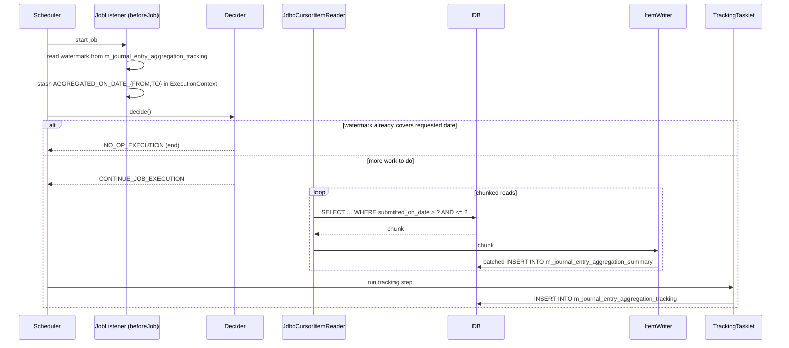

The Apache Fineract journal-entry aggregation job rolls raw `acc_gl_journal_entry` rows into a daily summary table grouped by `(office, product, GL account, currency, entityType, externalOwner)`. The summary feeds downstream BI / data-warehouse pipelines that need pre-aggregated numbers without re-scanning the wide journal-entry table. This page documents the `JOURNAL_ENTRY_AGGREGATION` Spring Batch job — the only job in the accounting space that uses chunked reader/writer plus a tracking step — and the entities it populates.

## Package map

The job is intentionally placed *outside* `org.apache.fineract.accounting` because it's a cross-cutting concern owned by the infrastructure-jobs subsystem. All classes live under:

```
fineract-provider/.../infrastructure/jobs/service/aggregationjob/
├── JournalEntryAggregationJobConfiguration.java
├── JournalEntryAggregationJobConstant.java
├── JournalEntryAggregationJobReader.java
├── JournalEntryAggregationJobWriter.java
├── JournalEntryAggregationJobExecutionDecider.java
├── data/
│   ├── JournalEntryAggregationSummaryData.java
│   └── JournalEntryAggregationTrackingData.java
├── domain/
│   ├── JournalEntryAggregationTracking.java
│   └── JournalEntryAggregationTrackingRepository.java
├── listener/JournalEntryAggregationJobListener.java
├── services/JournalEntryAggregationWriterService.java
└── tasklet/JournalEntryAggregationTrackingTasklet.java
```

## Tables

Two tables receive writes from the job:

| Table | Owner | Purpose |
| --- | --- | --- |
| `m_journal_entry_aggregation_summary` | written by `JournalEntryAggregationJobWriter` | One row per `(office, product, GL account, currency, entityType, externalOwner, aggregatedOnDate)` with summed debit and credit amounts. |
| `m_journal_entry_aggregation_tracking` | written by `JournalEntryAggregationTrackingTasklet` | One row per job run recording the date window covered. |

## Tracking entity

```java
@Entity
@Table(name = "m_journal_entry_aggregation_tracking")
@Getter
@Setter
public class JournalEntryAggregationTracking extends AbstractAuditableWithUTCDateTimeCustom<Long> {

    @Column(name = "aggregated_on_date_from", nullable = false)
    private LocalDate aggregatedOnDateFrom;

    @Column(name = "aggregated_on_date_to", nullable = false)
    private LocalDate aggregatedOnDateTo;

    @Column(name = "submitted_on_date", nullable = false)
    private LocalDate submittedOnDate;

    @Column(name = "job_execution_id", nullable = false)
    private Long jobExecutionId;
}
```

Each row says: *"Spring Batch job execution `jobExecutionId` aggregated entries where `submitted_on_date > aggregatedOnDateFrom AND <= aggregatedOnDateTo` on calendar day `submittedOnDate`."* The latest row's `aggregatedOnDateTo` is the watermark — the next run starts just after it.

## Summary data shape

```java
@Getter
@Setter
@Builder(toBuilder = true)
public class JournalEntryAggregationSummaryData {

    private Long productId;
    private Long glAccountId;
    private Long office;
    private Long entityTypeEnum;
    private LocalDate submittedOnDate;
    private LocalDate aggregatedOnDate;
    private Long externalOwnerId;
    private BigDecimal debitAmount;
    private BigDecimal creditAmount;
    private Boolean manualEntry;
    private String currencyCode;
    private Long jobExecutionId;
}
```

The persisted shape mirrors this directly (in `m_journal_entry_aggregation_summary`).

## Job — `JOURNAL_ENTRY_AGGREGATION`

```java
JOURNAL_ENTRY_AGGREGATION("Journal Entry Aggregation"),
```

Configuration:

```java
@Configuration
@ConditionalOnProperty(value = "fineract.job.journal-entry-aggregation.enabled", havingValue = "true")
public class JournalEntryAggregationJobConfiguration {
    ...
    @Bean
    public Step journalEntryAggregationSummaryStep() {
        return new StepBuilder(JOB_SUMMARY_STEP_NAME, jobRepository)
                .<JournalEntryAggregationSummaryData, JournalEntryAggregationSummaryData>chunk(
                        fineractProperties.getJob().getJournalEntryAggregation().getChunkSize(), transactionManager)
                .reader(journalEntryAggregationJobReader())
                .writer(aggregationItemWriter)
                .allowStartIfComplete(true).build();
    }

    @Bean
    protected Step journalEntryAggregationTrackingStep() {
        return new StepBuilder(JOB_TRACKING_STEP_NAME, jobRepository)
                .tasklet(journalEntryAggregationTrackingTasklet, transactionManager).build();
    }

    @Bean(name = "journalEntryAggregation")
    public Job journalEntryAggregation() {
        return new JobBuilder(JobName.JOURNAL_ENTRY_AGGREGATION.name(), jobRepository)
                .listener(journalEntryAggregationJobListener)
                .start(journalEntryAggregationJobExecutionDecider)
                    .on(JournalEntryAggregationJobConstant.NO_OP_EXECUTION).end()
                .from(journalEntryAggregationJobExecutionDecider)
                    .on(JournalEntryAggregationJobConstant.CONTINUE_JOB_EXECUTION)
                    .to(journalEntryAggregationSummaryStep())
                    .next(journalEntryAggregationTrackingStep()).end()
                .incrementer(new RunIdIncrementer()).build();
    }
}
```

### Notes

- **Disabled by default.** `@ConditionalOnProperty("fineract.job.journal-entry-aggregation.enabled" = "true")` means a tenant has to opt in by setting `fineract.job.journal-entry-aggregation.enabled = true` in its YAML.
- **Chunked.** Unlike most accounting jobs which run as single tasklets, this one uses Spring Batch's chunked reader + writer pattern, with a configurable `chunkSize` from `fineract.job.journalEntryAggregation.chunkSize`.
- **Two-step flow.** The summary step runs first; the tracking step records the watermark. If summary fails, tracking is not invoked so the watermark stays put for the next attempt.
- **Decider gate.** A `JobExecutionDecider` decides whether to run at all.

## Decider

```java
@Override
public FlowExecutionStatus decide(final JobExecution jobExecution, final StepExecution stepExecution) {
    final LocalDate aggregatedOnDate = (LocalDate) jobExecution.getExecutionContext()
            .get(JournalEntryAggregationJobConstant.AGGREGATED_ON_DATE);
    final LocalDate lastAggregatedOnDate = (LocalDate) jobExecution.getExecutionContext()
            .get(JournalEntryAggregationJobConstant.LAST_AGGREGATED_ON_DATE);

    if (aggregationAlreadyExist(lastAggregatedOnDate, aggregatedOnDate)) {
        log.info("Journal entry aggregation for given aggregatedOnDate already exist hence skipping...");
        jobExecution.setExitStatus(ExitStatus.NOOP);
        return new FlowExecutionStatus(JournalEntryAggregationJobConstant.NO_OP_EXECUTION);
    }
    return new FlowExecutionStatus(JournalEntryAggregationJobConstant.CONTINUE_JOB_EXECUTION);
}

private boolean aggregationAlreadyExist(final LocalDate lastAggregatedOnDate, final LocalDate aggregatedOnDate) {
    if (Objects.isNull(lastAggregatedOnDate)) {
        return false;
    }
    return aggregatedOnDate.isBefore(lastAggregatedOnDate) || aggregatedOnDate.isEqual(lastAggregatedOnDate);
}
```

The decider returns `NO_OP_EXECUTION` when the next requested date is on or before the watermark — i.e. the work has already been done. Otherwise it returns `CONTINUE_JOB_EXECUTION` and the summary step runs.

## Listener — date window setup

`JournalEntryAggregationJobListener` (Spring Batch `JobExecutionListener`) is the only place that decides *which* date window to process. In its `beforeJob`:

- Look up the latest `aggregatedOnDateTo` from `m_journal_entry_aggregation_tracking` (the watermark).
- Set `aggregatedOnDateFrom` = watermark (or null if first run).
- Set `aggregatedOnDateTo` = current business date.
- Set `aggregatedOnDate` = current business date (used by the decider).
- Stash all three into the job's `ExecutionContext` for the reader and decider to read.

## Reader — the aggregation SQL

`JournalEntryAggregationJobReader` extends `JdbcCursorItemReader<JournalEntryAggregationSummaryData>`. Its `@BeforeStep` callback wires the `aggregatedOnDateFrom` / `aggregatedOnDateTo` from the execution context into the prepared statement:

```java
@BeforeStep
public void beforeStep(StepExecution stepExecution) {
    ExecutionContext ctx = stepExecution.getJobExecution().getExecutionContext();
    this.aggregatedOnDateFrom = (LocalDate) ctx.get(JournalEntryAggregationJobConstant.AGGREGATED_ON_DATE_FROM);
    this.aggregatedOnDateTo   = (LocalDate) ctx.get(JournalEntryAggregationJobConstant.AGGREGATED_ON_DATE_TO);

    setPreparedStatementSetter(ps -> {
        ps.setObject(1, aggregatedOnDateFrom);
        ps.setObject(2, aggregatedOnDateTo);
    });
}
```

The SQL (returned by `buildAggregationQuery()` — a text block in source):

```sql
SELECT
    COALESCE(loan_product.id, savings_product.id, prov_product.id, share_product.id) AS productId,
    acc_gl_account.id AS glAccountId,
    acc_gl_journal_entry.entity_type_enum AS entityTypeEnum,
    acc_gl_journal_entry.office_id AS officeId,
    aw.owner_id AS externalOwner,
    SUM(CASE WHEN acc_gl_journal_entry.type_enum = 2 THEN amount ELSE 0 END) AS debitAmount,
    SUM(CASE WHEN acc_gl_journal_entry.type_enum = 1 THEN amount ELSE 0 END) AS creditAmount,
    acc_gl_journal_entry.submitted_on_date AS aggregatedOnDate,
    acc_gl_journal_entry.currency_code AS currencyCode
FROM acc_gl_account
JOIN acc_gl_journal_entry
    ON acc_gl_account.id = acc_gl_journal_entry.account_id

-- entity_type_enum = 1 → LOAN
LEFT JOIN m_loan loan
    ON loan.id = acc_gl_journal_entry.entity_id
    AND acc_gl_journal_entry.entity_type_enum = 1
LEFT JOIN m_product_loan loan_product
    ON loan_product.id = loan.product_id
    AND acc_gl_journal_entry.entity_type_enum = 1

-- entity_type_enum = 2 → SAVING
LEFT JOIN m_savings_account savings
    ON savings.id = acc_gl_journal_entry.entity_id
    AND acc_gl_journal_entry.entity_type_enum = 2
LEFT JOIN m_savings_product savings_product
    ON savings_product.id = savings.product_id
    AND acc_gl_journal_entry.entity_type_enum = 2

-- entity_type_enum = 3 → PROVISIONING
LEFT JOIN m_provisioning_history prov
    ON prov.id = acc_gl_journal_entry.entity_id
    AND acc_gl_journal_entry.entity_type_enum = 3
LEFT JOIN m_loanproduct_provisioning_entry prov_entry
    ON prov_entry.history_id = prov.id
    AND acc_gl_journal_entry.entity_type_enum = 3
LEFT JOIN m_product_loan prov_product
    ON prov_product.id = prov_entry.product_id
    AND acc_gl_journal_entry.entity_type_enum = 3

-- entity_type_enum = 4 → SHARED
LEFT JOIN m_share_account share
    ON share.id = acc_gl_journal_entry.entity_id
    AND acc_gl_journal_entry.entity_type_enum = 4
LEFT JOIN m_share_product share_product
    ON share_product.id = share.product_id
    AND acc_gl_journal_entry.entity_type_enum = 4

-- external owner
LEFT JOIN m_external_asset_owner_journal_entry_mapping aw
    ON aw.journal_entry_id = acc_gl_journal_entry.id

WHERE acc_gl_journal_entry.submitted_on_date > ?
  AND acc_gl_journal_entry.submitted_on_date <= ?

GROUP BY
    productId, glAccountId, externalOwner, aggregatedOnDate, currencyCode, entityTypeEnum, officeId;
```

### What the SQL does

- **Joins to product tables conditionally on `entity_type_enum`.** `LEFT JOIN` plus `AND entity_type_enum = N` means each branch contributes only when the entry's entity type matches. The four branches mirror `PortfolioProductType` values 1–4.
- **`COALESCE(...)` picks the one product id that is non-null** for that entry — exactly one of the four LEFT JOINs will resolve a row.
- **`type_enum = 2` is DEBIT, `type_enum = 1` is CREDIT.** Recall from [Journal entries](/accounting/journal-entries#journalentrytype-enum): `JournalEntryType.CREDIT = 1`, `DEBIT = 2`. So the two `SUM(CASE …)` columns yield total debit and total credit per group.
- **`m_external_asset_owner_journal_entry_mapping`** carries the investor link — when a journal entry is owned by an external asset owner, that row joins and contributes `owner_id`. Otherwise `externalOwner` is `NULL`.
- **Window is `submitted_on_date`, not `entry_date`.** This is intentional: aggregation tracks *when entries were posted*, not the business date they belong to. Back-dated postings entered today are aggregated into today's bucket.
- **`GROUP BY` includes `aggregatedOnDate`** — so a single window can produce one row per (group, submission date).

## Writer

```java
@Component
@Slf4j
@RequiredArgsConstructor
public class JournalEntryAggregationJobWriter implements ItemWriter<JournalEntryAggregationSummaryData>, StepExecutionListener {

    private final JournalEntryAggregationWriterService journalEntryAggregationWriterService;
    private StepExecution stepExecution;

    @Override
    public void beforeStep(@NonNull StepExecution stepExecution) {
        this.stepExecution = stepExecution;
    }

    @Override
    public void write(@NonNull Chunk<? extends JournalEntryAggregationSummaryData> journalEntrySummaries) {
        final Long jobExecutionId = stepExecution.getJobExecution().getId();
        List<JournalEntryAggregationSummaryData> summariesList = journalEntrySummaries.getItems().stream()
                .map(item -> {
                    item.setJobExecutionId(jobExecutionId);
                    return (JournalEntryAggregationSummaryData) item;
                }).toList();
        journalEntryAggregationWriterService.insertJournalEntrySummaryBatch(summariesList);
    }
}
```

The writer stamps every chunked item with the current `jobExecutionId` and delegates to `JournalEntryAggregationWriterService.insertJournalEntrySummaryBatch(...)`, which does a batched `INSERT` into `m_journal_entry_aggregation_summary`.

The `jobExecutionId` on every summary row lets you ask "all rows produced by run X" for debugging and replay.

## Tracking tasklet

The second step persists a single tracking row using `JournalEntryAggregationTrackingTasklet`:

- Pull `aggregatedOnDateFrom`, `aggregatedOnDateTo` from the execution context.
- Build a `JournalEntryAggregationTracking` entity with `submittedOnDate = ThreadLocalContextUtil.getBusinessDate()` and `jobExecutionId`.
- Save through `JournalEntryAggregationTrackingRepository`.

Because of the flow definition (`.next(journalEntryAggregationTrackingStep())`), the tracking row is written **only if the summary step succeeded** — guaranteeing the watermark advances only after data is durably persisted.

## Sequence



## API surface

There is **no dedicated `JournalEntryAggregationApiResource`** — aggregation is purely a backend job whose output is consumed by external BI tools reading directly from `m_journal_entry_aggregation_summary`. You can trigger it ad-hoc via the standard jobs API:

```
POST /v1/jobs/{jobId}/run
```

where `jobId` resolves the job named `"Journal Entry Aggregation"`.

## Tuning

Property keys (from `FineractProperties.Job.JournalEntryAggregation`):

| Key | Default | Purpose |
| --- | --- | --- |
| `fineract.job.journal-entry-aggregation.enabled` | `false` | Master switch — the `@ConditionalOnProperty` on the configuration class. |
| `fineract.job.journal-entry-aggregation.chunk-size` | impl default | Spring Batch chunk size for the summary step. |

Increasing the chunk size reduces transaction overhead per chunk but uses more memory and locks more rows.

## Cross references

<CardGroup cols={2}>
  <Card title="Journal entries" icon="pen-to-square" href="/accounting/journal-entries">
    Source of the aggregation.
  </Card>
  <Card title="Running balance job" icon="rotate" href="/accounting/running-balance-job">
    Complementary roll-up by account, not by office/product/owner.
  </Card>
  <Card title="Trial balance" icon="chart-line" href="/accounting/trial-balance">
    Sister daily snapshot — different grain and consumers.
  </Card>
  <Card title="Investor overview" icon="briefcase" href="/investor/overview">
    Source of `external_owner_id` joined here.
  </Card>
  <Card title="Jobs overview" icon="clock" href="/jobs/overview">
    Spring Batch job framework.
  </Card>
</CardGroup>
