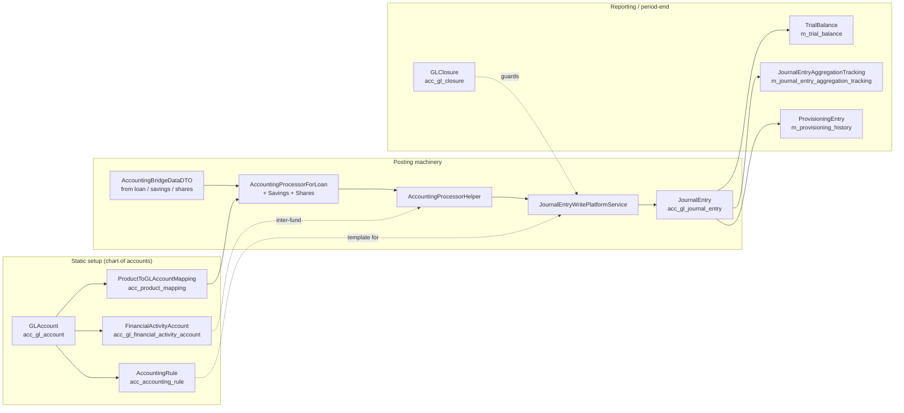
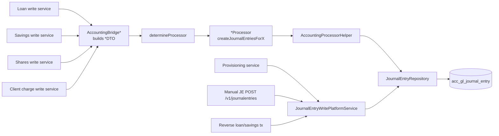

The Apache Fineract accounting module is the bookkeeping engine that sits underneath every loan, savings, share, and client transaction in the platform. Every monetary movement in Fineract — whether driven by a manual REST call, a batch job, or a side effect of a loan repayment — ultimately produces a balanced set of rows in `acc_gl_journal_entry`. This page is the entry point for the wiki sub-section covering that machinery: it inventories the source packages, names the major collaborators, and links to the dedicated reference pages for each concept.

<Info>
The accounting code is split across three Gradle modules: **`fineract-core`** holds shared domain (entities, enums, JSON parameter constants), **`fineract-accounting`** holds command handlers, validators, services, and most JAX-RS API resources, and **`fineract-provider`** holds the wiring — processors, factories, the journal-entry write service implementation, batch job tasklets, and the API resources that the provider exposes.
</Info>

## Conceptual flow

The arrows read like a story: the chart of accounts is set up (`GLAccount`, plus mapping tables); a transaction in a loan or savings account is translated by an `AccountingProcessor` into balanced debits and credits through `AccountingProcessorHelper`; the `JournalEntryWritePlatformService` persists those rows; downstream period-end machinery rolls the rows into trial balance, provisioning, and office-level aggregates. `GLClosure` is the closure-date guard that prevents back-dated postings after books are closed for a branch.

## Sub-page navigation

<CardGroup cols={2}>
  <Card title="GL Accounts" icon="book" href="/accounting/gl-accounts">
    `GLAccount`, `GLAccountType`, `GLAccountUsage`, hierarchy, disabled accounts, and CRUD services.
  </Card>
  <Card title="Journal Entries" icon="pen-to-square" href="/accounting/journal-entries">
    The `acc_gl_journal_entry` row model, double-entry invariants, reversal, and external events.
  </Card>
  <Card title="Accounting Processors" icon="gears" href="/accounting/accounting-processors">
    `AccountingProcessorForLoan` / `Savings` / `Shares`, the cash vs accrual variants, and the helper.
  </Card>
  <Card title="Accrual Postings" icon="calendar-days" href="/accounting/accrual-postings">
    `AccrualAccountingWritePlatformService`, periodic accrual job and the `ACCRUAL_ACTIVITY_POSTING` job.
  </Card>
  <Card title="GL Closure" icon="lock" href="/accounting/closure">
    `GLClosure` and the closure-date guard applied by every posting path.
  </Card>
  <Card title="Financial Activity Accounts" icon="building-columns" href="/accounting/financial-activity-accounts">
    Inter-fund / inter-branch transfer mapping driven by the `FinancialActivity` enum.
  </Card>
  <Card title="Product to Account Mapping" icon="diagram-project" href="/accounting/product-to-account-mapping">
    How loan / savings / share products bind their accounting slots to GL accounts.
  </Card>
  <Card title="Provisioning Entries" icon="shield-halved" href="/accounting/provisioning-entries">
    `ProvisioningCategory`, `ProvisioningCriteria`, `ProvisioningEntry`, and the auto provisioning job.
  </Card>
  <Card title="Accounting Rules" icon="scale-balanced" href="/accounting/accounting-rules">
    Templated manual journal entries: `AccountingRule`, `AccountingTagRule`, and validator.
  </Card>
  <Card title="Trial Balance" icon="chart-line" href="/accounting/trial-balance">
    `TrialBalance` entity, refresh tasklet, and the `UPDATE_TRIAL_BALANCE_DETAILS` job.
  </Card>
  <Card title="Running Balance Job" icon="rotate" href="/accounting/running-balance-job">
    `ACCOUNTING_RUNNING_BALANCE_UPDATE` job and `JournalEntryRunningBalanceUpdateService`.
  </Card>
  <Card title="Journal Entry Aggregation" icon="layer-group" href="/accounting/journal-entry-aggregation">
    The `JOURNAL_ENTRY_AGGREGATION` chunked Spring Batch job and office-level summary rows.
  </Card>
</CardGroup>

## File inventory

The tables below list every Java source file under `org.apache.fineract.accounting.*` grouped by sub-package and module. Use them as a jump table when navigating the codebase.

### Shared domain — `fineract-core`

| Path (relative to `fineract-core/src/main/java/org/apache/fineract/accounting/`) | Purpose |
| --- | --- |
| `common/AccountingConstants.java` | All the slot enums: `CashAccountsForLoan`, `AccrualAccountsForLoan`, `LoanProductAccountingParams`, `SavingProductAccountingParams`, `CashAccountsForSavings`, `AccrualAccountsForSavings`, `CashAccountsForShares`, `SharesProductAccountingParams`, `FinancialActivity`, GL-account tag option-code-name constants. |
| `common/AccountingEnumerations.java` | Static factory helpers turning ints into `EnumOptionData`. |
| `common/AccountingRuleType.java` | `NONE`, `CASH_BASED`, `ACCRUAL_PERIODIC`, `ACCRUAL_UPFRONT`. |
| `glaccount/api/GLAccountJsonInputParams.java` | JSON parameter names for GL account commands. |
| `glaccount/data/GLAccountData.java` | DTO returned by read services / API. |
| `glaccount/domain/GLAccount.java` | JPA entity for `acc_gl_account`. |
| `glaccount/domain/GLAccountRepository.java` and `GLAccountRepositoryWrapper.java` | Spring Data repo + not-found-throwing wrapper. |
| `glaccount/domain/GLAccountType.java` | `ASSET=1`, `LIABILITY=2`, `EQUITY=3`, `INCOME=4`, `EXPENSE=5`. |
| `glaccount/domain/GLAccountUsage.java` | `DETAIL=1`, `HEADER=2`. |
| `glaccount/exception/GLAccountNotFoundException.java` | Throws HTTP 404. |
| `glaccount/mapper/GlAccountMapper.java` and `GlAccountTypeMapper.java`, `GlAccountUsageMapper.java` | MapStruct mappers (entity ⇄ DTO). |
| `financialactivityaccount/data/FinancialActivityData.java` | DTO for a financial-activity slot definition. |
| `journalentry/data/AdvancedMappingtDTO.java` | (sic) Advanced mapping DTO shared across modules. |
| `journalentry/domain/JournalEntryType.java` | `CREDIT=1`, `DEBIT=2`. |
| `producttoaccountmapping/data/*` | `AdvancedMappingToExpenseAccountData`, `ChargeToGLAccountMapper`, `ClassificationToGLAccountData`, `PaymentTypeToGLAccountMapper`. |

### Accounting services — `fineract-accounting`

| Sub-package | Notable files |
| --- | --- |
| `accrual/` | `AccrualAccountingApiResource` (path `/v1/runaccruals`), `ExecutePeriodicAccrualCommandHandler`, `AccrualAccountRequest`, `AccrualAccountingDataValidator`, `AccrualAccountingWritePlatformService`. |
| `closure/` | `GLClosure` entity, `GLClosureRepository`, `GLClosureCommand`, `GLClosureData`, `GLClosureRequest`, `GLClosureCommandFromApiJsonDeserializer`, `GLClosuresApiResource` (path `/v1/glclosures`), `Create/Update/DeleteGLClosureCommandHandler`, four exception types. |
| `common/` | `AccountingDropdownReadPlatformService`, `AccountingValidations`. |
| `financialactivityaccount/` | `FinancialActivityAccount` entity, repo + wrapper, data validator, `FinancialActivityAccountsApiResource` (`/v1/financialactivityaccounts`), three handlers, three exception types. |
| `glaccount/` | `GLAccountsApiResource` (`/v1/glaccounts`), `GLAccountCommandFromApiJsonDeserializer`, `GLAccountWritePlatformServiceJpaRepositoryImpl`, `GLAccountReadPlatformServiceImpl`, `TrialBalance` entity + repo + wrapper, eight exception classes, and the `updatetrialbalancedetails` Spring Batch tasklet/config. |
| `journalentry/` | `JournalEntryJsonInputParams`, `JournalEntryCommand`, `SingleDebitOrCreditEntryCommand`, `CreditDebit`, `JournalEntryData`, `JournalEntryDataValidator`, `OfficeOpeningBalancesData`, `TransactionDetailData`, `JournalEntry` entity, `JournalEntryRepository`, four exception classes, `JournalEntryCommandFromApiJsonDeserializer`, `JournalAmountHolder`, `JournalEntryReadPlatformService`, `JournalEntryRunningBalanceUpdateService` interface, `JournalEntryMapper`. |
| `producttoaccountmapping/` | `ProductToGLAccountMapping` entity + repo, `ProductToGLAccountMappingFromApiJsonDeserializer`, `ProductToGLAccountMappingHelper` (loans), `SavingsProductToGLAccountMappingHelper`, `ShareProductToGLAccountMappingHelper`, `ProductToGLAccountMappingWritePlatformService` interface, `ProductToGLAccountMappingReadPlatformServiceImpl`. |
| `provisioning/` | `ProvisioningEntriesApiResource` (`/v1/provisioningentries`), `ProvisioningEntriesApiConstants`, `ProvisioningEntryData`, `LoanProductProvisioningEntryData`, `ProvisionEntryRequest`, `ProvisioningEntriesDefinitionJsonDeserializer`, read service impl, four exceptions. |
| `rule/` | `AccountingRule` and `AccountingTagRule` entities, repo + wrapper, `AccountingRuleApiResource` (`/v1/accountingrules`), validator, three handlers, five exceptions, write service impl, `AccountingRuleConfiguration` (starter). |
| `trialbalance/` | Just `TrialBalanceNotFoundException` here; the entity lives in `glaccount/domain`. |

### Provider wiring — `fineract-provider`

| Path (relative to `fineract-provider/src/main/java/org/apache/fineract/accounting/`) | Purpose |
| --- | --- |
| `accrual/service/AccrualAccountingWritePlatformServiceImpl.java` | Delegates to `LoanAccrualsProcessingService.addPeriodicAccruals(tillDate)`. |
| `accrual/starter/AccountingAccrualConfiguration.java` | Spring config for accrual write service. |
| `common/AccountingDropdownReadPlatformServiceImpl.java` | Backing implementation for dropdown lookups. |
| `jobs/accountrunningbalanceupdate/AccountRunningBalanceUpdateConfig.java` + `Tasklet.java` | Spring Batch wiring for `ACCOUNTING_RUNNING_BALANCE_UPDATE`. |
| `journalentry/api/JournalEntriesApiResource.java` | `/v1/journalentries` REST surface. |
| `journalentry/data/*DTO.java` | `LoanDTO`, `LoanTransactionDTO`, `SavingsDTO`, `SavingsTransactionDTO`, `SharesDTO`, `SharesTransactionDTO`, `ClientTransactionDTO`, `ClientChargePaymentDTO`, `ChargePaymentDTO`, `TaxPaymentDTO`, `GLAccountBalanceHolder`. |
| `journalentry/handler/*` | `CreateJournalEntryCommandHandler`, `ReverseJournalEntryCommandHandler`, `UpdateRunningBalanceCommandHandler`, `DefineOpeningBalanceCommandHandler`. |
| `journalentry/service/AccountingProcessorHelper.java` | Central helper — converts DTOs into balanced `JournalEntry` rows and persists them. |
| `journalentry/service/AccountingProcessorForLoan.java` + `…ForLoanFactory.java` | Interface and dispatcher (cash vs accrual). |
| `journalentry/service/CashBasedAccountingProcessorForLoan.java` | Cash-basis loan posting. |
| `journalentry/service/AccrualBasedAccountingProcessorForLoan.java` | Periodic & upfront accrual loan posting. |
| `journalentry/service/AccountingProcessorForSavings.java` + factory + `Cash/AccrualBasedAccountingProcessorForSavings.java` | Same for savings. |
| `journalentry/service/AccountingProcessorForShares.java` + factory + `CashBasedAccountingProcessorForShares.java` | Same for shares (cash only). |
| `journalentry/service/AccountingProcessorForClientTransactions.java` + `CashBasedAccountingProcessorForClientTransactions.java` | Client-charge transactions. |
| `journalentry/service/JournalEntryReadPlatformServiceImpl.java` | Read-side queries. |
| `journalentry/service/JournalEntryRunningBalanceUpdateServiceImpl.java` | Office and account running balances. |
| `journalentry/service/JournalEntryWritePlatformService.java` + `JpaRepositoryImpl.java` | The big write service implementing manual JE create, reverse, opening balance, provisioning posting, loan / savings / shares bridge, client transactions. |
| `journalentry/starter/AccountingJournalEntryConfiguration.java` | Spring wiring. |
| `productaccountmapping/service/ProductToGLAccountMappingWritePlatformServiceImpl.java` | (Note the package name `productaccountmapping` — slightly different from the `producttoaccountmapping` package in `fineract-accounting`.) |
| `provisioning/domain/ProvisioningEntry.java` + `LoanProductProvisioningEntry.java` + repository | JPA entities for `m_provisioning_history` and `m_loanproduct_provisioning_entry`. |
| `provisioning/handler/*` | `CreateProvisioningEntriesRequestCommandHandler`, `CreateProvisioningJournalEntriesRequestCommandHandler`, `ReCreateProvisioningEntryRequestCommandHandler`. |
| `provisioning/service/ProvisioningEntriesWritePlatformService.java` + impl | Computes provisioning amounts and persists journal entries. |
| `provisioning/starter/AccountingProvisioningConfiguration.java` | Spring wiring. |

The journal entry aggregation job lives outside `org.apache.fineract.accounting` — under `org.apache.fineract.infrastructure.jobs.service.aggregationjob` — but it is logically part of this module and is documented at [Journal Entry Aggregation](/accounting/journal-entry-aggregation).

## Cross-module references

<CardGroup cols={2}>
  <Card title="Accounting shared domain" icon="cube" href="/core/accounting-shared-domain">
    The shared core types reused by every loan / savings / shares assembler.
  </Card>
  <Card title="Loan overview" icon="hand-holding-dollar" href="/loan/overview">
    Where `AccountingBridgeDataDTO` comes from on the loan side.
  </Card>
  <Card title="Savings overview" icon="piggy-bank" href="/savings/overview">
    Savings-side bridge and the accrual-on-savings job link.
  </Card>
  <Card title="Jobs overview" icon="clock" href="/jobs/overview">
    The Spring Batch jobs surface that this module plugs into.
  </Card>
  <Card title="Investor / external asset owner" icon="briefcase" href="/investor/overview">
    Source of `externalAssetOwner` on `JournalEntry`.
  </Card>
  <Card title="Accounting APIs" icon="terminal" href="/api/accounting-apis">
    Public REST surface — paths, payloads, swagger.
  </Card>
</CardGroup>

## Cross-cutting code paths

A handful of code paths cut across every accounting sub-page; recognising them speeds up navigation.

### Posting code path

Every monetary side-effect ultimately walks the same skeleton:

### Closure check

The single closure-check helper `AccountingProcessorHelper.checkForBranchClosures(closure, txDate)` (and its sibling `getLatestClosureByBranch(officeId)`) is invoked once per posting transaction. Every posting site that does not go through that helper inlines the same check — see [Closure → guard sites map](/accounting/closure#guard-sites-map).

### Configuration-driven mode switch

The `AccountingRuleType` enum (`NONE`, `CASH_BASED`, `ACCRUAL_PERIODIC`, `ACCRUAL_UPFRONT`) is the single source of truth for which slot set a product uses. The product write services (loan, savings, shares) consult it twice:

- **On create / update** — to decide which slot enum to walk when persisting `ProductToGLAccountMapping` rows.
- **On posting** — `AccountingProcessorForLoanFactory.determineProcessor(LoanDTO)` reads `cashBasedAccountingEnabled`, `upfrontAccrualBasedAccountingEnabled`, `periodicAccrualBasedAccountingEnabled` flags and picks the bean accordingly.

### Business event flow

Loan-driven journal entries fire `LoanJournalEntryCreatedBusinessEvent` from `AccountingProcessorHelper.persistJournalEntry(...)`. The investor module's `ExternalAssetOwnerJournalEntryServiceImpl` is the only listener in trunk; custom listeners can be added by tenants. No other entry source fires this event — savings, shares, manual, and provisioning postings stay quiet.

## Database tables

The accounting module owns the following tables. Quick reference:

| Table | Source entity | Purpose |
| --- | --- | --- |
| `acc_gl_account` | `GLAccount` | Chart of accounts. |
| `acc_gl_journal_entry` | `JournalEntry` | The ledger itself. |
| `acc_gl_closure` | `GLClosure` | Per-branch period seals. |
| `acc_gl_financial_activity_account` | `FinancialActivityAccount` | Organisation-level bindings. |
| `acc_product_mapping` | `ProductToGLAccountMapping` | Per-product slot bindings + overrides. |
| `acc_accounting_rule` | `AccountingRule` | Templated manual JE shapes. |
| `acc_rule_tags` | `AccountingTagRule` | Per-side allowed tags for a rule. |
| `m_trial_balance` | `TrialBalance` | Daily snapshot per (office, account). |
| `m_provisioning_history` | `ProvisioningEntry` | Provisioning snapshot header. |
| `m_loanproduct_provisioning_entry` | `LoanProductProvisioningEntry` | Provisioning per-product detail. |
| `m_journal_entry_aggregation_summary` | (Spring Batch insert) | BI aggregation per office/product/account/currency/owner/date. |
| `m_journal_entry_aggregation_tracking` | `JournalEntryAggregationTracking` | Aggregation watermark. |

## Spring Batch jobs

Display names of every job that touches `acc_gl_journal_entry` or its derived tables:

| `JobName` enum | Display | Owner |
| --- | --- | --- |
| `ACCOUNTING_RUNNING_BALANCE_UPDATE` | "Update Accounting Running Balances" | `fineract-provider/.../accounting/jobs/accountrunningbalanceupdate/` |
| `UPDATE_TRIAL_BALANCE_DETAILS` | "Update Trial Balance Details" | `fineract-accounting/.../accounting/glaccount/jobs/updatetrialbalancedetails/` |
| `ADD_ACCRUAL_ENTRIES` | "Add Accrual Transactions" | `fineract-provider/.../loanaccount/jobs/addaccrualentries/` |
| `ADD_PERIODIC_ACCRUAL_ENTRIES` | "Add Periodic Accrual Transactions" | `fineract-loan/.../loanaccount/jobs/addperiodicaccrualentries/` |
| `ADD_PERIODIC_ACCRUAL_ENTRIES_FOR_LOANS_WITH_INCOME_POSTED_AS_TRANSACTIONS` | "Add Accrual Transactions For Loans With Income Posted As Transactions" | `fineract-provider/.../loanaccount/jobs/addperiodicaccrualentriesforloanswithincomepostedastransactions/` |
| `ADD_PERIODIC_ACCRUAL_ENTRIES_FOR_SAVINGS_WITH_INCOME_POSTED_AS_TRANSACTIONS` | "Add Accrual Transactions For Savings" | `fineract-provider/.../portfolio/savings/jobs/addaccrualtransactionforsavings/` |
| `ACCRUAL_ACTIVITY_POSTING` | "Accrual Activity Posting" | `fineract-provider/.../loanaccount/jobs/accrualactivityposting/` |
| `GENERATE_LOANLOSS_PROVISIONING` | "Generate Loan Loss Provisioning" | `fineract-provider/.../loanaccount/jobs/generateloanlossprovisioning/` |
| `JOURNAL_ENTRY_AGGREGATION` | "Journal Entry Aggregation" | `fineract-provider/.../infrastructure/jobs/service/aggregationjob/` |

Apart from `JOURNAL_ENTRY_AGGREGATION` (which is opt-in via `fineract.job.journal-entry-aggregation.enabled`), every job is registered by default and runs on the schedule defined in the scheduler tables.

## REST surface

All accounting endpoints live under `/v1/`:

| Path | Resource | Permission prefix |
| --- | --- | --- |
| `/v1/glaccounts` | `GLAccountsApiResource` | `GLACCOUNT` |
| `/v1/glclosures` | `GLClosuresApiResource` | `GLCLOSURE` |
| `/v1/journalentries` | `JournalEntriesApiResource` | `JOURNALENTRY` |
| `/v1/financialactivityaccounts` | `FinancialActivityAccountsApiResource` | `FINANCIALACTIVITYACCOUNT` |
| `/v1/accountingrules` | `AccountingRuleApiResource` | `ACCOUNTINGRULE` |
| `/v1/runaccruals` | `AccrualAccountingApiResource` | `PERIODICACCRUALACCOUNTING` / `EXECUTE` |
| `/v1/provisioningentries` | `ProvisioningEntriesApiResource` | `PROVISIONENTRIES` |
| `/v1/provisioningcriteria` | `ProvisioningCriteriaApiResource` | `PROVISIONCRITERIA` |
| `/v1/provisioningcategory` | `ProvisioningCategoryApiResource` | `PROVISIONINGCATEGORY` |

Product-mapping is **not** surfaced under a top-level `/v1/productmappings` endpoint — it is read/written via the relevant product endpoints (`/v1/loanproducts`, `/v1/savingsproducts`, `/v1/products/share`), with JSON fields that the helper persists into `acc_product_mapping`.

## High-level mental model

Three rules govern every line of code in this module:

1. **Every posting is a balanced set of journal entries.** Validation either rejects unbalanced input (manual JE) or constructs balanced sets programmatically (processors).
2. **A posting cannot cross a closed period.** Every posting code path consults `GLClosureRepository.getLatestGLClosureByBranch(officeId)` and refuses to write if the entry date is on or before the closure date.
3. **The chart of accounts is parameterised per product.** `ProductToGLAccountMapping` rows turn product-agnostic accounting "slots" (e.g. `LOAN_PORTFOLIO`, `INTEREST_ON_LOANS`) into concrete `GLAccount` rows. Processors look up these mappings, never hard-code account ids.

The remaining sub-pages drill into each piece in turn. If you are reading the code for the first time, follow [GL Accounts](/accounting/gl-accounts) → [Product to Account Mapping](/accounting/product-to-account-mapping) → [Accounting Processors](/accounting/accounting-processors) → [Journal Entries](/accounting/journal-entries); everything else is a refinement of that core path.

## Glossary

| Term | Meaning |
| --- | --- |
| **Chart of accounts (COA)** | The hierarchical tree of `GLAccount` rows for a tenant. |
| **Slot** | An abstract accounting role on a product (e.g. `LOAN_PORTFOLIO`). |
| **Mapping** | A row in `acc_product_mapping` that binds one slot to one `GLAccount`. |
| **Closure** | A per-branch period seal recorded in `acc_gl_closure`. |
| **Accrual** | Recognition of income before cash is received (or expense before cash is paid). |
| **Provisioning** | Setting aside funds for expected loan losses. |
| **Running balance** | The cumulative net per account up to a given entry. |
| **Trial balance** | A daily snapshot per `(office, account, date)`. |
| **Financial activity** | An organisation-level accounting role (e.g. `LIABILITY_TRANSFER`). |
| **Subledger** | The product-level books (loan, savings, share) that *generate* journal entries. |
| **General ledger (GL)** | The unified ledger of `acc_gl_journal_entry`. |

## Quick troubleshooting

| Symptom | Likely cause | Page |
| --- | --- | --- |
| `JournalEntryInvalidException(ACCOUNTING_CLOSED, ...)` on posting | Branch closure date >= entry date. | [Closure](/accounting/closure) |
| `ProductToGLAccountMappingNotFoundException` on disbursement | Product is missing a slot mapping. | [Product mapping](/accounting/product-to-account-mapping) |
| `FinancialActivityAccountNotFoundException` on savings-to-loan transfer | `LIABILITY_TRANSFER` not mapped. | [Financial activity accounts](/accounting/financial-activity-accounts) |
| Trial balance numbers off | `UPDATE_TRIAL_BALANCE_DETAILS` not run after recent postings. | [Trial balance](/accounting/trial-balance) |
| `runningBalance` blank in JE detail | `ACCOUNTING_RUNNING_BALANCE_UPDATE` not run since the entry was posted. | [Running balance job](/accounting/running-balance-job) |
| Provisioning won't post | New entry date not strictly after previously posted entry. | [Provisioning](/accounting/provisioning-entries) |
| Manual JE rejected with tag mismatch | Account's `tagId` not in the rule's allowed tags for that side. | [Accounting rules](/accounting/accounting-rules) |
