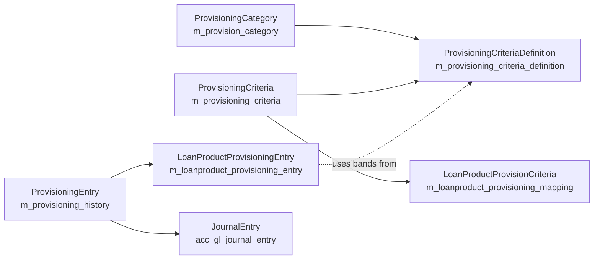

Loan-loss provisioning is the accounting practice of setting aside money against the principal of loans that show elevated default risk. Apache Fineract models this as three layers: **categories** (named risk buckets like "Standard", "Sub-Standard", "Doubtful", "Loss"), **criteria** (per-product mappings from delinquency-day bands to categories with provisioning percentages and the GL accounts to post into), and **entries** (snapshots computed periodically that drive journal entry creation). This page documents all three.

## Layered model



## Categories — `ProvisioningCategory`

Lives at `org.apache.fineract.organisation.provisioning.domain.ProvisioningCategory`:

```java
@Entity
@Table(name = "m_provision_category",
       uniqueConstraints = { @UniqueConstraint(columnNames = { "category_name" }, name = "category_name") })
public class ProvisioningCategory extends AbstractPersistableCustom<Long> {

    @Column(name = "category_name", nullable = false, unique = true)
    private String categoryName;

    @Column(name = "description", nullable = true)
    private String categoryDescription;

    public static ProvisioningCategory fromJson(JsonCommand jsonCommand) {
        final String categoryName = jsonCommand.stringValueOfParameterNamed("categoryname");
        final String description  = jsonCommand.stringValueOfParameterNamed("description");
        return new ProvisioningCategory(categoryName, description);
    }
    ...
}
```

A category is just a named bucket. Typical entries from a fresh tenant would be:

| Name | Description |
| --- | --- |
| Standard | Loans that are current or only mildly past due. |
| Sub-Standard | Past due by some range, e.g. 31-90 days. |
| Doubtful | Past due by more, e.g. 91-180 days. |
| Loss | Past due beyond, e.g. > 180 days. |

The names are not standardised by Fineract — each MFI defines its own.

### REST resource — `/v1/provisioningcategory`

`ProvisioningCategoryApiResource`:

| Method | Path | Operation |
| --- | --- | --- |
| `GET` | `/v1/provisioningcategory` | List. |
| `POST` | `/v1/provisioningcategory` | Create. |
| `PUT` | `/v1/provisioningcategory/{categoryId}` | Update. |
| `DELETE` | `/v1/provisioningcategory/{categoryId}` | Delete (rejected if referenced by any criteria). |

## Criteria — `ProvisioningCriteria` and `ProvisioningCriteriaDefinition`

A criteria entity is a set of bands keyed by category, where each band has a delinquency range and a provisioning percentage:

```java
@Entity
@Table(name = "m_provisioning_criteria", uniqueConstraints = {
        @UniqueConstraint(columnNames = { "criteria_name" }, name = "criteria_name") })
public class ProvisioningCriteria extends AbstractAuditableCustom {

    @Column(name = "criteria_name", nullable = false)
    private String criteriaName;

    @OneToMany(cascade = CascadeType.ALL, mappedBy = "criteria", orphanRemoval = true, fetch = FetchType.EAGER)
    Set<ProvisioningCriteriaDefinition> provisioningCriteriaDefinition = new HashSet<>();

    @OneToMany(cascade = CascadeType.ALL, mappedBy = "criteria", orphanRemoval = true, fetch = FetchType.EAGER)
    Set<LoanProductProvisionCriteria> loanProductMapping = new HashSet<>();
    ...
}
```

Each `ProvisioningCriteriaDefinition` row carries:

- a `ProvisioningCategory` FK;
- `minAge` and `maxAge` (delinquency days range);
- `provisioningPercentage` (e.g. `10.0` for 10%);
- two GL account FKs — the **liability account** (provision balance) and the **expense account** (period charge).

A criteria can be **attached to one or many loan products** via the `LoanProductProvisionCriteria` cross-reference. When a loan's product has no criteria attached, that loan does not participate in automated provisioning.

### REST resource — `/v1/provisioningcriteria`

`ProvisioningCriteriaApiResource`:

| Method | Path | Operation |
| --- | --- | --- |
| `GET` | `/v1/provisioningcriteria/template` | Returns categories and eligible GL accounts. |
| `GET` | `/v1/provisioningcriteria` | List. |
| `GET` | `/v1/provisioningcriteria/{criteriaId}` | Single. |
| `POST` | `/v1/provisioningcriteria` | Create. |
| `PUT` | `/v1/provisioningcriteria/{criteriaId}` | Update. |
| `DELETE` | `/v1/provisioningcriteria/{criteriaId}` | Delete. |

The validator `ProvisioningCriteriaDefinitionJsonDeserializer` enforces:

- Non-overlapping `(minAge, maxAge)` ranges between definitions on the same criteria. Overlap raises `ProvisioningCriteriaOverlappingDefinitionException`.
- Each band references a real category and two real GL accounts.
- Each loan product can only be attached to one criteria at a time.

## Entries — `ProvisioningEntry`

A provisioning entry is the *snapshot* generated for a given date.

```java
@Getter @Setter @NoArgsConstructor @Accessors(chain = true)
@Entity
@Table(name = "m_provisioning_history")
public class ProvisioningEntry extends AbstractPersistableCustom<Long> {

    @Column(name = "journal_entry_created")
    private Boolean isJournalEntryCreated;

    @OneToMany(cascade = CascadeType.ALL, mappedBy = "entry", orphanRemoval = true, fetch = FetchType.EAGER)
    private Set<LoanProductProvisioningEntry> provisioningEntries = new HashSet<>();

    @OneToOne @JoinColumn(name = "createdby_id") private AppUser createdBy;
    @Column(name = "created_date") private LocalDate createdDate;
    @OneToOne @JoinColumn(name = "lastmodifiedby_id") private AppUser lastModifiedBy;
    @Column(name = "lastmodified_date") private LocalDate lastModifiedDate;
    ...
}
```

The child `LoanProductProvisioningEntry` rows hold one number per `(office, loan product, currency, category)` tuple — the amount that should be provisioned. The aggregator queries the loan portfolio at the snapshot date, bands each loan by its `daysOverdue` according to its product's criteria, and computes the provisioning amount.

### Lifecycle

1. **Compute** — `createProvisioningEntry(JsonCommand)`: walks all loan products with criteria, asks the read service to compute the bands, persists a `ProvisioningEntry` with all `LoanProductProvisioningEntry` children.
2. **Post** — `createProvisioningJournalEntries(provisioningEntryId)`: posts the actual GL entries (debit expense, credit liability) per `LoanProductProvisioningEntry`. Optionally reverts a previous snapshot first.
3. **Recreate** — `reCreateProvisioningEntry(JsonCommand)`: forces a recompute (e.g. after correcting late-arriving transactions). Old children removed via cascade + orphanRemoval.

### Write service

```java
@Override
public CommandProcessingResult createProvisioningJournalEntries(Long provisioningEntryId, JsonCommand command) {
    ProvisioningEntry requestedEntry = this.provisioningEntryRepository.findById(provisioningEntryId)
            .orElseThrow(() -> new ProvisioningEntryNotfoundException(provisioningEntryId));

    ProvisioningEntryData exisProvisioningEntryData = this.provisioningEntriesReadPlatformService
            .retrieveExistingProvisioningIdDateWithJournals();
    revertAndAddJournalEntries(exisProvisioningEntryData, requestedEntry);
    return new CommandProcessingResultBuilder().withCommandId(command.commandId())
            .withEntityId(requestedEntry.getId()).build();
}

private void revertAndAddJournalEntries(ProvisioningEntryData existingEntryData, ProvisioningEntry requestedEntry) {
    if (existingEntryData != null) {
        validateForCreateJournalEntry(existingEntryData, requestedEntry);
        this.journalEntryWritePlatformService.revertProvisioningJournalEntries(
                requestedEntry.getCreatedDate(),
                existingEntryData.getId(), PortfolioProductType.PROVISIONING.getValue());
    }
    if (requestedEntry.getLoanProductProvisioningEntries() == null
            || requestedEntry.getLoanProductProvisioningEntries().size() == 0) {
        requestedEntry.setIsJournalEntryCreated(Boolean.FALSE);
    } else {
        requestedEntry.setIsJournalEntryCreated(Boolean.TRUE);
    }

    this.provisioningEntryRepository.saveAndFlush(requestedEntry);
    this.journalEntryWritePlatformService.createProvisioningJournalEntries(requestedEntry);
}

private void validateForCreateJournalEntry(ProvisioningEntryData existingEntry, ProvisioningEntry requested) {
    LocalDate existingDate = existingEntry.getCreatedDate();
    LocalDate requestedDate = requested.getCreatedDate();
    if (!DateUtils.isBefore(existingDate, requestedDate)) {
        throw new ProvisioningJournalEntriesCannotbeCreatedException(existingEntry.getCreatedDate(), requestedDate);
    }
    ...
}
```

The flow:

1. If a previous posted entry exists, **revert** its journal entries with a new transaction id and the new entry's date.
2. The new entry must be strictly *after* the previous posted entry — otherwise `ProvisioningJournalEntriesCannotbeCreatedException`.
3. Post the new entry's journal entries: for each `LoanProductProvisioningEntry`, **debit** the expense account and **credit** the liability account (both from the criteria definition) by the computed amount.

The journal entries are written under `PortfolioProductType.PROVISIONING` and the helper-generated transaction id is prefixed with `P` (the `PROVISIONING_TRANSACTION_IDENTIFIER`).

## Spring Batch job — `GENERATE_LOANLOSS_PROVISIONING`

```java
@JobName-enum: GENERATE_LOANLOSS_PROVISIONING("Generate Loan Loss Provisioning")
```

`GenerateLoanlossProvisioningConfig` (in `fineract-provider/.../portfolio/loanaccount/jobs/generateloanlossprovisioning/`):

```java
return new StepBuilder(JobName.GENERATE_LOANLOSS_PROVISIONING.name(), jobRepository)
        .tasklet(generateLoanlossProvisioningTasklet, transactionManager).build();
...
return new JobBuilder(JobName.GENERATE_LOANLOSS_PROVISIONING.name(), jobRepository)
        .start(generateLoanlossProvisioningStep()).incrementer(new RunIdIncrementer()).build();
```

The tasklet calls `ProvisioningEntriesWritePlatformService.createProvisioningEntries(...)` under-the-hood, which is equivalent to a POST to `/v1/provisioningentries`. By default this runs nightly; admins can disable it per tenant via the global configuration.

## REST resource — `/v1/provisioningentries`

`ProvisioningEntriesApiResource`:

| Method | Path | Operation |
| --- | --- | --- |
| `GET` | `/v1/provisioningentries` | List entries (paged). |
| `GET` | `/v1/provisioningentries/{entryId}` | Single entry. |
| `GET` | `/v1/provisioningentries/entries?entryId=&offset=&limit=` | Drill-down to per-loan-product rows. |
| `POST` | `/v1/provisioningentries` | Create entry. |
| `POST` | `/v1/provisioningentries/{entryId}?command=createjournalentry` | Post journal entries. |
| `POST` | `/v1/provisioningentries/{entryId}?command=recreateprovisioningentry` | Force recompute. |

The two `?command=` values are constants:

```java
public static final String CREATE_JOURNAL_ENTRY        = "createjournalentry";
public static final String RECREATE_PROVISION_IN_ENTRY = "recreateprovisioningentry";
```

## Command handlers

| Handler | CommandType |
| --- | --- |
| `CreateProvisioningEntriesRequestCommandHandler` | `PROVISIONENTRIES` / `CREATE` |
| `CreateProvisioningJournalEntriesRequestCommandHandler` | `PROVISIONJOURNALENTRIES` / `CREATE` |
| `ReCreateProvisioningEntryRequestCommandHandler` | `PROVISIONENTRIES` / `RECREATE` |

## Exceptions

| Class | Condition |
| --- | --- |
| `ProvisioningEntryNotfoundException` | (sic) 404 on `entryId`. |
| `ProvisioningEntryAlreadyCreatedException` | Trying to create a second entry for the same date. |
| `NoProvisioningCriteriaDefinitionFound` | Loan product has no criteria attached. |
| `ProvisioningJournalEntriesCannotbeCreatedException` | New entry date not strictly after previous posted entry. |

## DTOs

`ProvisioningEntryData` (read side):

| Field | Notes |
| --- | --- |
| `id` | Entry id. |
| `journalEntryCreated` | Whether the entry has been posted. |
| `createdDate`, `lastModifiedDate` | Audit. |
| `loanProductProvisioningEntries` | List of per-product, per-office, per-currency, per-category rows. |
| `pageItems` (when paged) | Drill-down. |

`LoanProductProvisioningEntryData`:

| Field | Notes |
| --- | --- |
| `loanProductId`, `loanProductName` | The product. |
| `officeId`, `officeName` | The branch. |
| `currencyCode` | Loan currency. |
| `categoryId`, `categoryName` | The applicable category. |
| `amountreserved` (sic) | The provisioning amount (sum of `principal * percentage` over loans in this bucket). |
| `liablityAccount`, `expenseAccount` (sic) | The two GL accounts that will be debited/credited when posted. |
| `overdueDays` | The criterion band that placed each loan into this category. |

## Effect on journal entries

For a posted provisioning entry on 2024-03-31 for branch A, product P, USD, Doubtful category, `amount = 12_500.00`, `expenseAccount = "Provision Expense - Doubtful"`, `liabilityAccount = "Provision Liability - Doubtful"`:

| office | currency | type | account | amount | entityType | entityId |
| --- | --- | --- | --- | --- | --- | --- |
| A | USD | DEBIT | Provision Expense - Doubtful | 12,500.00 | PROVISIONING(5) | provisioningEntryId |
| A | USD | CREDIT | Provision Liability - Doubtful | 12,500.00 | PROVISIONING(5) | provisioningEntryId |

Both rows share the same `transaction_id` starting with `P`.

## Cross references

<CardGroup cols={2}>
  <Card title="Journal entries" icon="pen-to-square" href="/accounting/journal-entries">
    Where provisioning postings land.
  </Card>
  <Card title="GL accounts" icon="book" href="/accounting/gl-accounts">
    The liability + expense accounts used by criteria.
  </Card>
  <Card title="Loan overview" icon="hand-holding-dollar" href="/loan/overview">
    The portfolio that the calculator walks.
  </Card>
  <Card title="Jobs overview" icon="clock" href="/jobs/overview">
    The `GENERATE_LOANLOSS_PROVISIONING` job.
  </Card>
</CardGroup>
