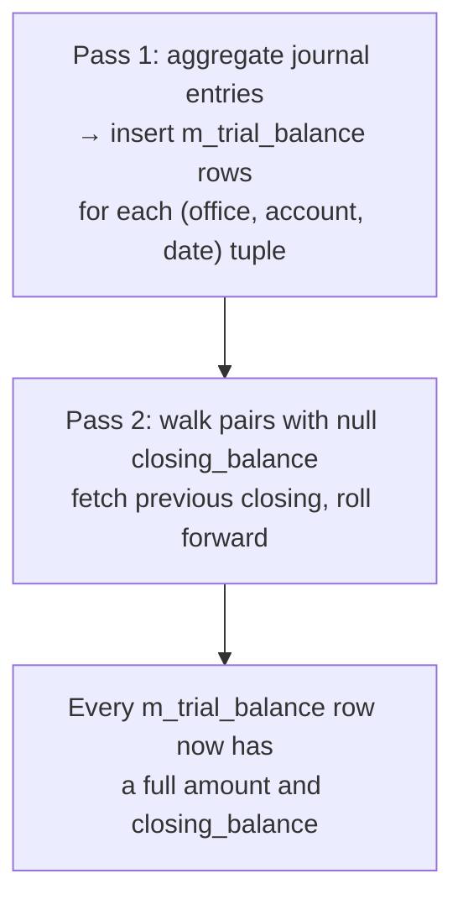

A trial balance in Apache Fineract is a daily snapshot table populated from the raw journal entries. Each row records — for an `(office, GL account, date)` triple — the net amount posted on that date and a running closing balance. The `m_trial_balance` table is what reports query, instead of aggregating across millions of `acc_gl_journal_entry` rows live. The trial balance is refreshed by a Spring Batch job, `UPDATE_TRIAL_BALANCE_DETAILS`. This page documents the entity, the repository, and the tasklet's two-pass refresh algorithm.

## Entity — `org.apache.fineract.accounting.glaccount.domain.TrialBalance`

Despite living under `glaccount.domain`, the entity is the centrepiece of the trial-balance feature.

```java
@Entity
@Table(name = "m_trial_balance")
@Getter
@Setter
@NoArgsConstructor
@Accessors(chain = true)
public class TrialBalance extends AbstractPersistableCustom<Long> {

    @Column(name = "office_id", nullable = false)
    private Long officeId;

    @Column(name = "account_id", nullable = false)
    private Long glAccountId;

    @Column(name = "amount", nullable = false)
    private BigDecimal amount;

    @Column(name = "entry_date", nullable = false)
    private LocalDate entryDate;

    @Column(name = "created_date", nullable = true)
    private LocalDate transactionDate;

    @Column(name = "closing_balance", nullable = false)
    private BigDecimal closingBalance;

    public static TrialBalance getInstance(final Long officeId, final Long glAccountId, final BigDecimal amount,
            final LocalDate entryDate, final LocalDate transactionDate) {
        return new TrialBalance().setOfficeId(officeId).setGlAccountId(glAccountId).setAmount(amount)
                .setEntryDate(entryDate).setTransactionDate(transactionDate);
    }

    @Override
    public boolean equals(Object obj) {
        if (!(obj instanceof TrialBalance)) {
            return false;
        }
        TrialBalance other = (TrialBalance) obj;
        return Objects.equals(other.officeId, officeId) && Objects.equals(other.glAccountId, glAccountId)
                && Objects.equals(other.amount, amount) && DateUtils.isEqual(other.entryDate, entryDate)
                && DateUtils.isEqual(other.transactionDate, transactionDate)
                && Objects.equals(other.closingBalance, closingBalance);
    }

    @Override
    public int hashCode() {
        return Objects.hash(officeId, glAccountId, amount, entryDate, transactionDate, closingBalance);
    }
}
```

### Column reference

| Column | Java | Notes |
| --- | --- | --- |
| `office_id` | `officeId` | The branch the entries are attributed to. |
| `account_id` | `glAccountId` | The GL account aggregated. |
| `amount` | `amount` | **Net signed amount for this (office, account, date)** — debits positive, credits negative (or the opposite convention depending on the account type — see the SQL below). |
| `entry_date` | `entryDate` | The business / posting date of the underlying journal entries. |
| `created_date` | `transactionDate` | The date on which the trial balance row was generated (i.e. the tasklet run date). |
| `closing_balance` | `closingBalance` | The running closing balance for that `(office, account)` pair at the end of `entryDate`. Computed in the second pass. |

The `entryDate` vs `transactionDate` distinction mirrors the same pattern on `JournalEntry`: it lets you tell apart "what business date does this number belong to" from "when was the number computed".

## Repositories

```java
public interface TrialBalanceRepository extends JpaRepository<TrialBalance, Long> {

    LocalDate findMaxCreatedDate();
    List<Long> findDistinctOfficeIdsWithNullClosingBalance();
    List<Long> findDistinctAccountIdsWithNullClosingBalanceByOfficeId(Long officeId);
    List<BigDecimal> findLastClosingBalance(Long officeId, Long accountId);
}
```

`TrialBalanceRepositoryWrapper` adds:

- `save(List<TrialBalance>)` — bulk insert with audit decoration.
- `findNewByOfficeAndAccount(Long officeId, Long accountId)` — fetch the rows whose closing balance has not yet been computed, ordered by `entryDate ASC` so they can be filled in pass two.

`TrialBalanceNotFoundException` is the only declared exception (in `org.apache.fineract.accounting.trialbalance.exception`); it's raised when a specific row id is requested by the read service but not found.

## Spring Batch job — `UPDATE_TRIAL_BALANCE_DETAILS`

`JobName.UPDATE_TRIAL_BALANCE_DETAILS` corresponds to display name `"Update Trial Balance Details"`. The wiring is in `UpdateTrialBalanceDetailsConfig`:

```java
@Configuration
@RequiredArgsConstructor
public class UpdateTrialBalanceDetailsConfig {

    private final JobRepository jobRepository;
    private final PlatformTransactionManager transactionManager;
    private final RoutingDataSourceServiceFactory dataSourceServiceFactory;
    private final TrialBalanceRepositoryWrapper trialBalanceRepositoryWrapper;
    private final TrialBalanceRepository trialBalanceRepository;
    private final JournalEntryRepository journalEntryRepository;

    @Bean
    protected Step updateTrialBalanceDetailsStep() {
        return new StepBuilder(JobName.UPDATE_TRIAL_BALANCE_DETAILS.name(), jobRepository)
                .tasklet(updateTrialBalanceDetailsTasklet(), transactionManager).build();
    }

    @Bean
    public Job updateTrialBalanceDetailsJob() {
        return new JobBuilder(JobName.UPDATE_TRIAL_BALANCE_DETAILS.name(), jobRepository)
                .start(updateTrialBalanceDetailsStep())
                .incrementer(new RunIdIncrementer())
                .build();
    }
    ...
}
```

This is a single-step single-tasklet job — there is no chunked reader/writer. The whole refresh runs in one transaction.

## Tasklet — `UpdateTrialBalanceDetailsTasklet`

```java
@Slf4j
@RequiredArgsConstructor
public class UpdateTrialBalanceDetailsTasklet implements Tasklet {

    private final RoutingDataSourceServiceFactory dataSourceServiceFactory;
    private final TrialBalanceRepositoryWrapper trialBalanceRepositoryWrapper;
    private final TrialBalanceRepository trialBalanceRepository;
    private final JournalEntryRepository journalEntryRepository;

    @Override
    public RepeatStatus execute(StepContribution contribution, ChunkContext chunkContext) throws Exception {
        final JdbcTemplate jdbcTemplate = new JdbcTemplate(dataSourceServiceFactory
                .determineDataSourceService().retrieveDataSource());

        processTrialBalanceGaps(jdbcTemplate);
        updateClosingBalances(jdbcTemplate);

        return RepeatStatus.FINISHED;
    }
    ...
}
```

The two passes:

### Pass 1 — fill in the trial-balance lines for missing dates

```java
private void processTrialBalanceGaps(JdbcTemplate jdbcTemplate) {
    LocalDate maxCreatedDate = trialBalanceRepository.findMaxCreatedDate();
    LocalDate baselineDate = maxCreatedDate != null ? maxCreatedDate : LocalDate.of(2010, 1, 1);
    List<LocalDate> tbGaps = journalEntryRepository.findTransactionDatesAfter(baselineDate);
    for (LocalDate tbGap : tbGaps) {
        if (DateUtils.getExactDifferenceInDays(tbGap, DateUtils.getBusinessLocalDate()) < 1) {
            continue;
        }
        insertTrialBalanceForDate(tbGap);
    }
}

private void insertTrialBalanceForDate(LocalDate tbGap) {
    List<Object[]> rows = journalEntryRepository.findTrialBalanceLinesForDate(tbGap);

    List<TrialBalance> trialBalances = rows.stream().map(row -> {
        TrialBalance tb = new TrialBalance();
        tb.setOfficeId((Long) row[0]);
        tb.setGlAccountId((Long) row[1]);
        tb.setAmount((BigDecimal) row[2]);
        tb.setEntryDate((LocalDate) row[3]);
        tb.setTransactionDate((LocalDate) row[4]);
        tb.setClosingBalance((BigDecimal) row[5]);
        return tb;
    }).toList();

    trialBalanceRepositoryWrapper.save(trialBalances);

    log.debug("{}: Records affected by updateTrialBalanceDetails: {}",
            ThreadLocalContextUtil.getTenant().getName(), trialBalances.size());
}
```

Pass-1 logic:

1. Find the latest `created_date` already in `m_trial_balance`. If empty, anchor at 2010-01-01.
2. Ask `JournalEntryRepository.findTransactionDatesAfter(baseline)` for the distinct entry dates of journal entries that exist beyond that baseline — these are the dates the trial balance hasn't yet been computed for.
3. For each such date *that is strictly before the current business date* (the `< 1` guard skips today and the future — the day is only sealed for trial-balance purposes after it ends), call `findTrialBalanceLinesForDate` to aggregate that day's journal entries and persist them.

The aggregation query returned by `findTrialBalanceLinesForDate` groups by `(office_id, account_id)` summing signed amounts; that's the `amount` column of `TrialBalance`. The `closing_balance` from the query is the per-account running balance the journal-entry running-balance job has already computed (see [Running balance job](/accounting/running-balance-job)) — but for any rows where that field was null at the time, pass two fills it in.

### Pass 2 — backfill `closing_balance`

```java
private void updateClosingBalances(JdbcTemplate jdbcTemplate) {
    final List<Long> officeIds = trialBalanceRepository.findDistinctOfficeIdsWithNullClosingBalance();

    for (Long officeId : officeIds) {
        updateClosingBalancesForOffice(jdbcTemplate, officeId);
    }
}

private void updateClosingBalancesForOffice(JdbcTemplate jdbcTemplate, Long officeId) {
    final List<Long> accountIds = trialBalanceRepository
            .findDistinctAccountIdsWithNullClosingBalanceByOfficeId(officeId);

    for (Long accountId : accountIds) {
        updateClosingBalanceForAccount(jdbcTemplate, officeId, accountId);
    }
}

private void updateClosingBalanceForAccount(JdbcTemplate jdbcTemplate, Long officeId, Long accountId) {
    BigDecimal closingBalance = getPreviousClosingBalance(officeId, accountId);
    List<TrialBalance> tbRows = trialBalanceRepositoryWrapper.findNewByOfficeAndAccount(officeId, accountId);

    updateTrialBalanceRows(tbRows, closingBalance);
}

private BigDecimal getPreviousClosingBalance(Long officeId, Long accountId) {
    List<BigDecimal> closingBalanceData = trialBalanceRepository.findLastClosingBalance(officeId, accountId);
    return CollectionUtils.isEmpty(closingBalanceData) ? BigDecimal.ZERO : closingBalanceData.getFirst();
}

private void updateTrialBalanceRows(List<TrialBalance> tbRows, BigDecimal initialClosingBalance) {
    BigDecimal closingBalance = initialClosingBalance;

    for (TrialBalance row : tbRows) {
        if (closingBalance != null) {
            closingBalance = closingBalance.add(row.getAmount());
        }
        row.setClosingBalance(closingBalance);
    }
}
```

Pass-2 logic:

1. For every `(office, account)` pair that has any rows with `closing_balance IS NULL`:
2. Find the *previous* closing balance for that pair via `findLastClosingBalance` (returns the latest non-null `closing_balance` in `m_trial_balance` for that pair; falls back to `0.00` if none exists).
3. Fetch the new rows ordered by `entryDate ASC` and roll the running sum: `closing_balance = previous_closing + amount`.

This guarantees that once both passes complete, every `m_trial_balance` row has both a correctly computed `amount` for its day and a correct `closing_balance` reflecting all prior days' activity.

## Two-pass invariants



Key invariants the job maintains:

1. **No date overlap.** A `(office, account, date)` row is written exactly once per date.
2. **Today is excluded.** The `< 1` day check ensures the day isn't finalised while it's still being posted.
3. **Closing balance monotonic in date.** For a given `(office, account)`, rows ordered by `entryDate` show a non-decreasing-by-construction running sum (it can decrease in absolute value if credits exceed debits — the *direction* is not constrained, only the recursion).

## How callers use the data

The Trial Balance report query is not a JPA repository method — it's a JdbcTemplate query in `TrialBalanceReportReadPlatformService` (in `fineract-provider`). Reports filter by `office_id` and a date range:

```sql
SELECT account_id, sum(amount) AS net, max(closing_balance) AS closing
FROM m_trial_balance
WHERE office_id = ? AND entry_date BETWEEN ? AND ?
GROUP BY account_id
```

`closing_balance` queried at the end-date gives the balance brought forward; net amount across the range gives the period activity. This is what feeds the standard Trial Balance and Balance Sheet reports.

## Re-running for a back-dated correction

If a posting is back-dated — i.e. a new journal entry is inserted with `entry_date` earlier than the latest trial balance date — the tasklet does **not** automatically retroactively rebuild the affected rows. Operators typically:

1. Issue `POST /v1/journalentries?command=updateRunningBalance` (forces the running-balance job to recompute).
2. Trigger `UPDATE_TRIAL_BALANCE_DETAILS` manually via `/v1/jobs/{jobId}/run`.

If the back-date is older than the existing `max(created_date)` in `m_trial_balance`, deeper surgery is required — see the Apache Fineract operations playbook for the recommended manual SQL.

## Querying the trial balance

The trial balance feeds three different consumers:

### 1. The Trial Balance report

Standard "Trial Balance" report (in `m_report` seed data) wraps the table with grouping by `glAccountType` so the operator sees Assets / Liabilities / Equity / Income / Expense subtotals:

```sql
SELECT
    ga.classification_enum AS accountType,
    tb.account_id, ga.name, ga.gl_code,
    SUM(tb.amount) AS net,
    MAX(tb.closing_balance) AS closing
FROM m_trial_balance tb
JOIN acc_gl_account ga ON ga.id = tb.account_id
WHERE tb.office_id = ?
  AND tb.entry_date BETWEEN ? AND ?
GROUP BY accountType, tb.account_id
ORDER BY accountType, tb.account_id
```

### 2. JE running balance enrichment

When the JE API is called with `?runningBalance=true`, the read service joins against the running balance pre-computed on `acc_gl_journal_entry` itself — *not* `m_trial_balance`. The trial balance is the period-grouped view; the running balance on the JE row is the per-entry view.

### 3. Balance Sheet report

The Balance Sheet report selects from `m_trial_balance` filtered to `entry_date = <as of>` and groups by account type to compute Total Assets, Total Liabilities + Equity, and the equation closure.

## Worked example

Suppose a single tenant with one office (id=1) has these journal entries on 2024-03-30:

| transaction_id | account_id | type | amount |
| --- | --- | --- | --- |
| L100 | 12 (LOAN_PORTFOLIO) | DEBIT  | 1,000.00 |
| L100 | 5  (FUND_SOURCE)    | CREDIT | 1,000.00 |
| L101 | 12 (LOAN_PORTFOLIO) | DEBIT  |   500.00 |
| L101 | 5  (FUND_SOURCE)    | CREDIT |   500.00 |

Before the trial-balance job has run, `m_trial_balance` is empty for 2024-03-30.

After `UPDATE_TRIAL_BALANCE_DETAILS` runs on 2024-03-31:

| office_id | account_id | entry_date | amount | created_date | closing_balance |
| --- | --- | --- | --- | --- | --- |
| 1 | 12 | 2024-03-30 | 1,500.00   | 2024-03-31 | carried fwd + 1,500.00 |
| 1 | 5  | 2024-03-30 | (1,500.00) | 2024-03-31 | carried fwd − 1,500.00 |

The closing balance is computed in pass two by summing each account's prior `closing_balance` with `amount`.

If a new entry dated 2024-03-30 arrives later (a back-dated insert), the tasklet on the next run will detect that `2024-03-30` already has rows but `m_trial_balance.created_date` is earlier than the new business date — making a hole. Re-running the job alone does not patch the hole; operators typically truncate the affected `m_trial_balance` rows and re-run.

## Cross references

<CardGroup cols={2}>
  <Card title="Journal entries" icon="pen-to-square" href="/accounting/journal-entries">
    The source rows aggregated here.
  </Card>
  <Card title="Running balance job" icon="rotate" href="/accounting/running-balance-job">
    Pre-computes `organization_running_balance` and `office_running_balance` consumed by pass 1.
  </Card>
  <Card title="GL accounts" icon="book" href="/accounting/gl-accounts">
    The account grouping dimension.
  </Card>
  <Card title="Jobs overview" icon="clock" href="/jobs/overview">
    How the Spring Batch job is registered and scheduled.
  </Card>
</CardGroup>
