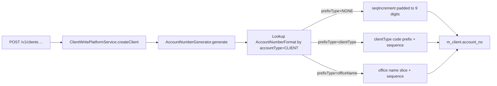

The Account Number Formats API lets Apache Fineract administrators describe how new account numbers are auto-generated for client, loan, savings, and share accounts. Each `AccountNumberFormat` row pairs an `accountType` with a `prefixType` so the platform can compose values like `OFF-000123`, `BR-LOAN-000456`, or fixed-width numeric ids.

## Source

| Aspect | Value |
| --- | --- |
| Resource class | `org.apache.fineract.infrastructure.accountnumberformat.api.AccountNumberFormatsApiResource` |
| File | `fineract-provider/src/main/java/org/apache/fineract/infrastructure/accountnumberformat/api/AccountNumberFormatsApiResource.java` |
| JAX-RS `@Path` | `AccountNumberFormatConstants.resourceRelativeURL` → `/v1/accountnumberformats` |
| Swagger tag | `Account number format` |
| Permission code | `AccountNumberFormatConstants.ENTITY_NAME` (`ACCOUNTNUMBERFORMAT`) |
| Read service | `AccountNumberFormatReadPlatformService` |

## Endpoints

| Method | Path | Description | Command / read handler | Permission |
| --- | --- | --- | --- | --- |
| `GET` | `/v1/accountnumberformats/template` | Template with allowed `accountType` and `prefixType` options. | `AccountNumberFormatReadPlatformService.retrieveTemplate(null)` | `READ_ACCOUNTNUMBERFORMAT` |
| `GET` | `/v1/accountnumberformats` | List all configured formats. | `AccountNumberFormatReadPlatformService.getAllAccountNumberFormats()` | `READ_ACCOUNTNUMBERFORMAT` |
| `GET` | `/v1/accountnumberformats/{accountNumberFormatId}` | Retrieve a single format; `?template=true` overlays prefix dropdowns. | `getAccountNumberFormat(id)` (+ `templateOnTop`) | `READ_ACCOUNTNUMBERFORMAT` |
| `POST` | `/v1/accountnumberformats` | Create a format. Mandatory `accountType`. | `CommandWrapperBuilder.createAccountNumberFormat()` → `CREATE_ACCOUNTNUMBERFORMAT` | `CREATE_ACCOUNTNUMBERFORMAT` |
| `PUT` | `/v1/accountnumberformats/{accountNumberFormatId}` | Update a format. | `updateAccountNumberFormat(id)` → `UPDATE_ACCOUNTNUMBERFORMAT` | `UPDATE_ACCOUNTNUMBERFORMAT` |
| `DELETE` | `/v1/accountnumberformats/{accountNumberFormatId}` | Delete; numbers already generated under the format remain unchanged. | `deleteAccountNumberFormat(id)` → `DELETE_ACCOUNTNUMBERFORMAT` | `DELETE_ACCOUNTNUMBERFORMAT` |

Response data parameters: `id`, `accountType`, `prefixType`, `accountTypeOptions`, `prefixTypeOptions`.

## Account types

`EntityAccountType`:

| Code | Type |
| --- | --- |
| `1` | CLIENT |
| `2` | LOAN |
| `3` | SAVINGS |
| `4` | SHARES |
| `5` | CENTER |
| `6` | GROUP |

## Prefix types

Prefix-type values are loaded from `accountNumberFormatRepositoryWrapper.retrieveAllowedPrefixTypes(accountType)` and cover combinations such as office name, branch code, loan product short name, client type, savings product short name, etc.

## Request body — create

```json
{
  "accountType": 2,
  "prefixType": 101
}
```

## Request body — update

```json
{
  "prefixType": 103
}
```

## Response — list

```json
[
  {
    "id": 1,
    "accountType": { "id": 1, "code": "accountType.client", "value": "CLIENT" },
    "prefixType":  { "id": 0, "code": "accountNumberPrefix.none", "value": "NONE" }
  },
  {
    "id": 2,
    "accountType": { "id": 2, "code": "accountType.loan", "value": "LOAN" },
    "prefixType":  { "id": 101, "code": "accountNumberPrefix.loanProductShortName", "value": "loanProductShortName" }
  }
]
```

## Response — write

```json
{
  "resourceId": 2,
  "changes": { "prefixType": 103 }
}
```

## Source — create handler

```java
@POST
public String createAccountNumberFormat(final String apiRequestBodyAsJson) {
    final CommandWrapper commandRequest = new CommandWrapperBuilder()
        .createAccountNumberFormat().withJson(apiRequestBodyAsJson).build();
    final CommandProcessingResult result =
        commandsSourceWritePlatformService.logCommandSource(commandRequest);
    return toApiJsonSerializer.serialize(result);
}
```

## Source — retrieve-one with template overlay

```java
@GET
@Path("{accountNumberFormatId}")
public String retrieveOne(@PathParam("accountNumberFormatId") final Long id,
        @Context final UriInfo uriInfo) {
    context.authenticatedUser().validateHasReadPermission(RESOURCE_NAME_FOR_PERMISSIONS);
    AccountNumberFormatData data = readPlatformService.getAccountNumberFormat(id);
    final ApiRequestJsonSerializationSettings settings =
        apiRequestParameterHelper.process(uriInfo.getQueryParameters());
    if (settings.isTemplate()) {
        data = readPlatformService.templateOnTop(data);
    }
    return toApiJsonSerializer.serialize(settings, data, RESPONSE_DATA_PARAMETERS);
}
```

## Generation flow



If no format row exists for the account type, `AccountNumberGenerator` falls back to the default zero-padded numeric sequence.

## Canonical curl

```bash
# Explore template options
curl -k -u mifos:password \
  -H "Fineract-Platform-TenantId: default" \
  https://localhost:8443/fineract-provider/api/v1/accountnumberformats/template

# List all formats
curl -k -u mifos:password \
  -H "Fineract-Platform-TenantId: default" \
  https://localhost:8443/fineract-provider/api/v1/accountnumberformats

# Create a loan format prefixed by loan product short name
curl -k -u mifos:password \
  -H "Fineract-Platform-TenantId: default" \
  -H "Content-Type: application/json" \
  -X POST https://localhost:8443/fineract-provider/api/v1/accountnumberformats \
  -d '{ "accountType": 2, "prefixType": 101 }'

# Switch the loan prefix to office name
curl -k -u mifos:password \
  -H "Fineract-Platform-TenantId: default" \
  -H "Content-Type: application/json" \
  -X PUT https://localhost:8443/fineract-provider/api/v1/accountnumberformats/2 \
  -d '{ "prefixType": 102 }'

# Drop the format (existing account numbers are unaffected)
curl -k -u mifos:password \
  -H "Fineract-Platform-TenantId: default" \
  -X DELETE https://localhost:8443/fineract-provider/api/v1/accountnumberformats/2
```

## Validation rules

- `accountType` is mandatory on create and immutable on update — to change the type, delete and recreate.
- `(accountType)` is unique across `m_account_number_format`; attempting to create a second row for the same type raises `PlatformDataIntegrityException`.
- `prefixType` must belong to the per-type allow-list returned by `retrieveAllowedPrefixTypes(accountType)`. Sending a foreign prefix raises `error.msg.accountnumberformat.prefixtype.not.allowed.for.accounttype`.
- Deleting a format does not retroactively rename existing account numbers — only new accounts going forward use the default scheme.

## Operational notes

- Each format affects only freshly allocated account numbers; rebranding the catalogue mid-flight will create a visual mix of old- and new-prefixed numbers in `m_client.account_no` / `m_loan.account_no`.
- The `AccountNumberGenerator` honours `account-number-prefix` global configuration toggles where defined (for example to insert a separator character between the prefix and sequence).
- Race-safe sequence allocation is delegated to `AccountNumberGeneratorWrapper` which serialises through a database-side advisory lock per `accountType`.

## Error responses

| HTTP | When |
| --- | --- |
| `400 Bad Request` | Missing `accountType`; unknown enum values. |
| `403 Forbidden` | Missing `*_ACCOUNTNUMBERFORMAT` permission. |
| `404 Not Found` | `accountNumberFormatId` not in `m_account_number_format`. |
| `409 Conflict` | Duplicate `accountType` row; invalid `prefixType` for the type. |

## Related subsystems

- Subsystem overview: [/config/account-number-formats](/api/account-number-formats)
- Client account numbers consume client formats: [/api/clients](/api/clients)
- Loan / savings / share product account numbers: [/portfolio/loan-products](/loan/loan-product-api), [/portfolio/savings-products](/savings/overview)
- Generation utility: see `AccountNumberGenerator` in `fineract-core/.../accountnumber`.
- API conventions: [/api/conventions](/api/conventions)
