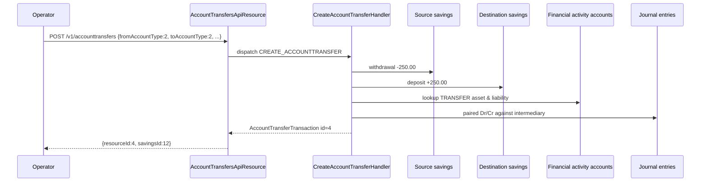

The Account Transfers API moves monetary funds between accounts in Apache Fineract. The current implementation supports savings-to-savings and savings-to-loan transfers plus a specialised "refund of an active loan by transfer" flow. Each transfer is recorded as a `AccountTransferTransaction` and posts paired savings/loan transactions plus journal entries against the configured asset/liability transfer financial-activity accounts.

## Source

| Aspect | Value |
| --- | --- |
| Resource class | `org.apache.fineract.portfolio.account.api.AccountTransfersApiResource` |
| File | `fineract-provider/src/main/java/org/apache/fineract/portfolio/account/api/AccountTransfersApiResource.java` |
| JAX-RS `@Path` | `/v1/accounttransfers` |
| Swagger tag | `Account Transfers` |
| Permission code | `AccountTransfersApiConstants.ACCOUNT_TRANSFER_RESOURCE_NAME` (`ACCOUNTTRANSFER`) |
| Read service | `AccountTransfersReadPlatformService` |
| Search params bean | `AccountTransSearchParam` (via `@BeanParam`) |

## Endpoints

| Method | Path | Description | Command / read handler | Permission |
| --- | --- | --- | --- | --- |
| `GET` | `/v1/accounttransfers/template` | Transfer template (allowed offices/clients/accounts). | `AccountTransfersReadPlatformService.retrieveTemplate(...)` | `READ_ACCOUNTTRANSFER` |
| `POST` | `/v1/accounttransfers` | Create a new transfer. | `CommandWrapperBuilder.createAccountTransfer()` → `CREATE_ACCOUNTTRANSFER` | `CREATE_ACCOUNTTRANSFER` |
| `GET` | `/v1/accounttransfers` | Paginated list with `externalId`, `offset`, `limit`, `orderBy`, `sortOrder`, `accountDetailId`. | `AccountTransfersReadPlatformService.retrieveAll(searchParameters, accountDetailId)` | `READ_ACCOUNTTRANSFER` |
| `GET` | `/v1/accounttransfers/{transferId}` | Retrieve a single transfer. | `AccountTransfersReadPlatformService.retrieveOne(transferId)` | `READ_ACCOUNTTRANSFER` |
| `GET` | `/v1/accounttransfers/templateRefundByTransfer` | Template for refunding an active loan by transfer. | `AccountTransfersReadPlatformService.retrieveRefundByTransferTemplate(...)` | `READ_ACCOUNTTRANSFER` |
| `POST` | `/v1/accounttransfers/refundByTransfer` | Refund a loan by transferring funds to a savings account. | `CommandWrapperBuilder.refundByTransfer()` → `REFUNDBYTRANSFER_ACCOUNTTRANSFER` | `REFUNDBYTRANSFER_ACCOUNTTRANSFER` |

## Bean parameters

`AccountTransSearchParam` exposes these query parameters used by both template endpoints:

| Field | Meaning |
| --- | --- |
| `fromOfficeId`, `fromClientId`, `fromAccountId`, `fromAccountType` | Source office/client/account triple. |
| `toOfficeId`, `toClientId`, `toAccountId`, `toAccountType` | Destination triple. |

`fromAccountType` / `toAccountType` use the `PortfolioAccountType` enum (`1` = loan, `2` = savings, `3` = current, etc.).

## Request body — create transfer

The payload binds to `AccountTransferRequest`:

```json
{
  "fromOfficeId": 1,
  "fromClientId": 1,
  "fromAccountId": 12,
  "fromAccountType": 2,
  "toOfficeId": 1,
  "toClientId": 2,
  "toAccountId": 24,
  "toAccountType": 2,
  "transferAmount": 250.00,
  "transferDate": "01 March 2024",
  "transferDescription": "Family transfer",
  "locale": "en",
  "dateFormat": "dd MMMM yyyy"
}
```

## Request body — refund by transfer

The same `AccountTransferRequest` shape; the source is the loan account (`fromAccountType=1`) and the destination is a savings account (`toAccountType=2`).

## Response — list

```json
{
  "totalFilteredRecords": 1,
  "pageItems": [
    {
      "id": 4,
      "reversed": false,
      "transferDate": [2024, 3, 1],
      "currency": { "code": "USD" },
      "transferAmount": 250.00,
      "transferDescription": "Family transfer",
      "fromOffice": { "id": 1, "name": "Head Office" },
      "fromClient": { "id": 1, "displayName": "Alice" },
      "fromAccountType": { "id": 2, "value": "SAVINGS" },
      "fromAccount": { "id": 12, "accountNo": "0012" },
      "toOffice": { "id": 1, "name": "Head Office" },
      "toClient": { "id": 2, "displayName": "Bob" },
      "toAccountType": { "id": 2, "value": "SAVINGS" },
      "toAccount": { "id": 24, "accountNo": "0024" }
    }
  ]
}
```

## Response — write

```json
{
  "officeId": 1,
  "clientId": 1,
  "savingsId": 12,
  "resourceId": 4,
  "changes": {}
}
```

## Source — create handler

```java
@POST
public String create(final String apiRequestBodyAsJson) {
    final CommandWrapper commandRequest = new CommandWrapperBuilder()
        .createAccountTransfer().withJson(apiRequestBodyAsJson).build();
    final CommandProcessingResult result =
        commandsSourceWritePlatformService.logCommandSource(commandRequest);
    return toApiJsonSerializer.serialize(result);
}
```

## Source — refund-by-transfer

```java
@POST
@Path("refundByTransfer")
public String refundByTransfer(final String apiRequestBodyAsJson) {
    final CommandWrapper commandRequest = new CommandWrapperBuilder()
        .refundByTransfer().withJson(apiRequestBodyAsJson).build();
    final CommandProcessingResult result =
        commandsSourceWritePlatformService.logCommandSource(commandRequest);
    return toApiJsonSerializer.serialize(result);
}
```

## Posting flow — savings to savings



## Posting flow — savings to loan

For `toAccountType=1` the destination posting is a loan repayment instead of a deposit:

- `LoanTransaction` of type `REPAYMENT_AT_DISBURSEMENT` or `REPAYMENT` depending on loan state.
- Re-amortisation is triggered on the destination loan.
- Per-installment allocation honours the loan product's transaction-processing strategy.

## Refund-by-transfer specifics

The `templateRefundByTransfer` endpoint resolves the maximum refundable amount by querying `LoanAccountDomainService.fetchPortfolioOverpaidAmount(...)`. The `POST /refundByTransfer` then:

1. Reverses or partially refunds the source loan (raising a `LoanTransaction` of type `REFUND_FOR_ACTIVE_LOAN`).
2. Deposits the same amount into the destination savings account.
3. Posts the journal entries through the configured `FINANCIAL_ACTIVITY` accounts.

## Canonical curl

```bash
# Template for source account 12 to destination 24
curl -k -u mifos:password \
  -H "Fineract-Platform-TenantId: default" \
  'https://localhost:8443/fineract-provider/api/v1/accounttransfers/template?fromAccountId=12&fromAccountType=2&toAccountId=24&toAccountType=2'

# Create a savings-to-savings transfer
curl -k -u mifos:password \
  -H "Fineract-Platform-TenantId: default" \
  -H "Content-Type: application/json" \
  -X POST https://localhost:8443/fineract-provider/api/v1/accounttransfers \
  -d '{
    "fromOfficeId": 1, "fromClientId": 1, "fromAccountId": 12, "fromAccountType": 2,
    "toOfficeId": 1,   "toClientId": 2,   "toAccountId": 24, "toAccountType": 2,
    "transferAmount": 250.00,
    "transferDate": "01 March 2024",
    "transferDescription": "Family transfer",
    "locale": "en",
    "dateFormat": "dd MMMM yyyy"
  }'

# Refund an overpaid loan into the client's savings
curl -k -u mifos:password \
  -H "Fineract-Platform-TenantId: default" \
  -H "Content-Type: application/json" \
  -X POST https://localhost:8443/fineract-provider/api/v1/accounttransfers/refundByTransfer \
  -d '{
    "fromOfficeId": 1, "fromClientId": 1, "fromAccountId": 55, "fromAccountType": 1,
    "toOfficeId": 1,   "toClientId": 1,   "toAccountId": 12, "toAccountType": 2,
    "transferAmount": 35.50,
    "transferDate": "01 March 2024",
    "transferDescription": "Refund of overpayment",
    "locale": "en",
    "dateFormat": "dd MMMM yyyy"
  }'

# List recent transfers for account 12
curl -k -u mifos:password \
  -H "Fineract-Platform-TenantId: default" \
  'https://localhost:8443/fineract-provider/api/v1/accounttransfers?accountDetailId=12&limit=20&orderBy=transfer_date&sortOrder=desc'
```

## Validation rules

- Source and destination currencies must match; cross-currency transfers raise `CurrencyMismatchException`.
- `transferAmount` must be positive and ≤ the available source balance (savings) or the overpayment portion (refund-by-transfer).
- `transferDate` cannot be in the future and must not pre-date the source account's activation.
- Refund-by-transfer is rejected if the loan is closed-written-off or already fully reversed.

## Error responses

| HTTP | When |
| --- | --- |
| `400 Bad Request` | Negative amount; currency mismatch; bad dates. |
| `403 Forbidden` | Missing the matching `*_ACCOUNTTRANSFER` permission. |
| `404 Not Found` | Source/destination account ids unknown. |
| `409 Conflict` | Source has insufficient balance; refund exceeds overpayment. |

## Related subsystems

- Subsystem overview: [/portfolio/account-transfers](/portfolio/account-transfers)
- GL postings produced by transfers: [/api/journal-entries](/api/journal-entries), [/api/financial-activity-accounts](/api/financial-activity-accounts)
- Recurring transfers: [/api/standing-instructions](/api/standing-instructions)
- Standing-instruction execution history: [/api/standing-instruction-history](/api/standing-instruction-history)
- Source/destination accounts: [/api/savings-accounts](/api/savings-accounts), [/api/loans](/api/loans)
- API conventions: [/api/conventions](/api/conventions)
