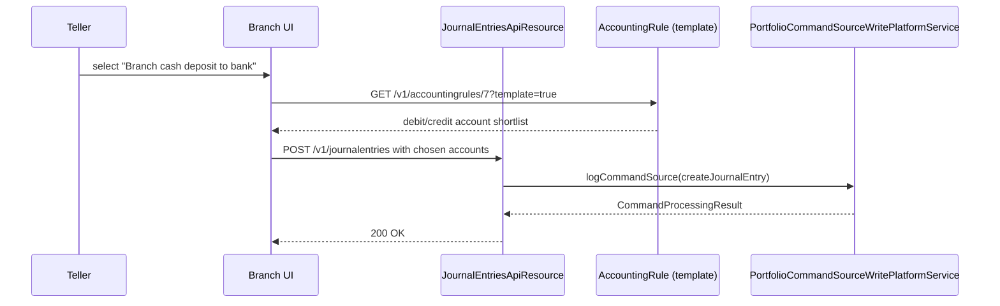

The Accounting Rules API lets Apache Fineract administrators define abstractions over manual journal entries so that non-accountant branch users can post common transactions without picking GL accounts directly. A rule may pre-select the debit and credit accounts, restrict them to tag-driven shortlists, or allow compound multi-leg entries scoped to a specific office.

## Source

| Aspect | Value |
| --- | --- |
| Resource class | `org.apache.fineract.accounting.rule.api.AccountingRuleApiResource` |
| File | `fineract-accounting/src/main/java/org/apache/fineract/accounting/rule/api/AccountingRuleApiResource.java` |
| JAX-RS `@Path` | `/v1/accountingrules` |
| Swagger tag | `Accounting Rules` |
| Permission code | `ACCOUNTINGRULE` |
| Read service | `AccountingRuleReadPlatformService` |
| Office hierarchy filter | Uses `currentUser.getOffice().getHierarchy()` to scope visibility |

## Endpoints

| Method | Path | Description | Command / read handler | Permission |
| --- | --- | --- | --- | --- |
| `GET` | `/v1/accountingrules/template` | Template containing allowed offices, allowed detail accounts, and tag option lists. | `handleTemplate(null)` → `AccountingRuleReadPlatformService`, `OfficeReadPlatformService`, `CodeValueReadPlatformService` | `READ_ACCOUNTINGRULE` |
| `GET` | `/v1/accountingrules` | List rules visible under the current user's office hierarchy. Supports `associations=all`. | `AccountingRuleReadPlatformService.retrieveAllAccountingRules(hierarchy, includeAssoc)` | `READ_ACCOUNTINGRULE` |
| `GET` | `/v1/accountingrules/{accountingRuleId}` | Retrieve a single rule; `?template=true` overlays template options. | `AccountingRuleReadPlatformService.retrieveAccountingRuleById(id)` | `READ_ACCOUNTINGRULE` |
| `POST` | `/v1/accountingrules` | Create a rule. Required: `name`, `officeId`, (`accountToDebit` OR `debitTags`), (`accountToCredit` OR `creditTags`). | `CommandWrapperBuilder.createAccountingRule()` → `CREATE_ACCOUNTINGRULE` | `CREATE_ACCOUNTINGRULE` |
| `PUT` | `/v1/accountingrules/{accountingRuleId}` | Update a rule. | `updateAccountingRule(id)` → `UPDATE_ACCOUNTINGRULE` | `UPDATE_ACCOUNTINGRULE` |
| `DELETE` | `/v1/accountingrules/{accountingRuleId}` | Delete a rule. | `deleteAccountingRule(id)` → `DELETE_ACCOUNTINGRULE` | `DELETE_ACCOUNTINGRULE` |

## Request body — create

The deserialiser binds to `AccountRuleRequest`:

```json
{
  "name": "Branch cash deposit to bank",
  "officeId": 1,
  "description": "Posts branch teller cash to corporate bank account",
  "accountToDebit": 25,
  "creditTags": [301, 302],
  "allowMultipleDebitEntries": false,
  "allowMultipleCreditEntries": true,
  "systemDefined": false
}
```

Either of `accountToDebit` / `debitTags` and either of `accountToCredit` / `creditTags` must be present.

## Response — retrieve

```json
{
  "id": 7,
  "officeId": 1,
  "officeName": "Head Office",
  "name": "Branch cash deposit to bank",
  "description": "Posts branch teller cash to corporate bank account",
  "systemDefined": false,
  "allowMultipleCreditEntries": true,
  "allowMultipleDebitEntries": false,
  "debitAccounts": [ { "id": 25, "name": "Cash at Branch", "glCode": "100001" } ],
  "creditTags": [
    { "tag": { "id": 301, "name": "Bank-Corp" } }
  ]
}
```

When invoked with `?template=true` the response additionally carries `allowedAccounts`, `allowedOffices`, `allowedCreditTagOptions`, and `allowedDebitTagOptions`. The internal `retrieveSelectedTags` helper removes already-bound tags from the suggestion lists.

## Response — write

```json
{
  "officeId": 1,
  "resourceId": 7,
  "changes": {}
}
```

## Tag sources

`handleTemplate` aggregates allowed tag options from the following code-name constants in `AccountingConstants`:

- `ASSESTS_TAG_OPTION_CODE_NAME`
- `LIABILITIES_TAG_OPTION_CODE_NAME`
- `EQUITY_TAG_OPTION_CODE_NAME`
- `INCOME_TAG_OPTION_CODE_NAME`
- `EXPENSES_TAG_OPTION_CODE_NAME`

Each maps to a code value list manageable through the codes API.

## Rule application flow



The rule itself is **not** invoked at posting time — it is a UI/UX scaffolding that constrains the dropdowns. The journal entry produced is a normal balanced posting that goes through the standard `JournalEntryCommand` validator.

## Office hierarchy scoping

`retrieveAllAccountingRules(hierarchy, includeAssoc)` filters by `office.hierarchy LIKE '<currentUser hierarchy>%'`. A branch user therefore only sees rules attached to their own office or descendants; head-office users see everything.

## Common pitfalls

- **Tag vs account ambiguity.** Supplying both `accountToDebit` and `debitTags` raises `error.msg.accountingrule.debit.account.and.debit.tag.cannot.be.both.present`.
- **`allowMultipleDebitEntries=true` requires `debitTags`** — multi-line debits make no sense when there is only one allowed debit account. Same for credits.
- **`systemDefined` rules cannot be edited or deleted** through the API. They are installed by migrations.

## Sample curl — create a rule

```bash
curl -k -u mifos:password \
  -H "Fineract-Platform-TenantId: default" \
  -H "Content-Type: application/json" \
  -X POST https://localhost:8443/fineract-provider/api/v1/accountingrules \
  -d '{
        "name": "Branch cash deposit to bank",
        "officeId": 1,
        "accountToDebit": 25,
        "creditTags": [301, 302],
        "allowMultipleCreditEntries": true
      }'
```

## Worked example — tag-driven rule

A rule that lets a teller pick **any liability tagged "Bank-Corp"** as the credit side and posts the debit to a fixed cash drawer:

```json
{
  "name": "Cash drawer to corporate bank",
  "officeId": 1,
  "accountToDebit": 25,
  "creditTags": [301],
  "allowMultipleCreditEntries": false,
  "allowMultipleDebitEntries": false
}
```

`creditTags=[301]` resolves at template time to every GL liability account whose `tag_id = 301`. The teller UI then renders that filtered dropdown. A subsequent `POST /v1/journalentries` carrying `credits = [{ glAccountId: 56, amount: 1000 }]` will only succeed if account 56 is in that filtered set — the rule does not enforce this at posting time; it is the UI's responsibility.

## When to use rules vs Financial Activity Accounts

| Need | Use |
| --- | --- |
| Mid-day teller postings with shortlist | `accountingrules` |
| One-to-one system mapping (asset transfer, etc.) | [`financialactivityaccounts`](/api/financial-activity-accounts) |
| Branch-specific shortlist scoped by office | `accountingrules` (with `officeId`) |
| Org-wide shortcut used by automated postings | `financialactivityaccounts` |

## Listing — sample response

```json
[
  {
    "id": 7,
    "officeId": 1,
    "officeName": "Head Office",
    "name": "Branch cash deposit to bank",
    "description": null,
    "systemDefined": false,
    "allowMultipleCreditEntries": true,
    "allowMultipleDebitEntries": false,
    "debitAccounts": [ { "id": 25, "name": "Cash at Branch", "glCode": "100001" } ],
    "creditTags": [ { "tag": { "id": 301, "name": "Bank-Corp" } } ]
  }
]
```

The endpoint returns a flat list; pagination is not supported (rule counts are typically small per institution).

## Related subsystems

- Subsystem overview: [/accounting/accounting-rules](/accounting/accounting-rules)
- Chart of accounts: [/api/gl-accounts](/api/gl-accounts)
- Journal entries created from rule applications: [/api/journal-entries](/api/journal-entries)
- Code values used as tags: [/api/code-values](/api/code-values)
- [/api/conventions](/api/conventions) — envelope, locale and error model.
