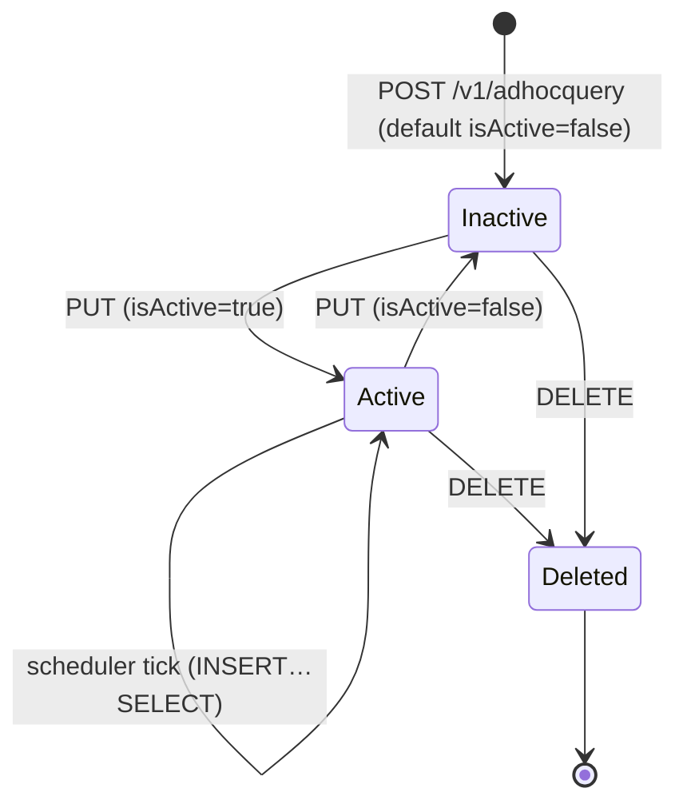

The AdHoc Query resource manages Apache Fineract's saved **INSERT…SELECT** jobs. Each row is a named SQL query plus a target table, field list and an optional email address; a scheduled job picks active queries and executes them, accumulating results in the destination table and notifying the owner. This is the persistence side of the platform's "build me a custom report-store" feature, distinct from on-demand reporting via [Run Reports](/api/run-reports).

> The Java class name is `AdHocApiResource` (in package `org.apache.fineract.adhocquery.api`), not `AdHocQueryApiResource` — the URL path is the canonical `/v1/adhocquery`.

## Source

- **File**: `fineract-provider/src/main/java/org/apache/fineract/adhocquery/api/AdHocApiResource.java`
- **Base path**: `@Path("/v1/adhocquery")`
- **Permission entity**: `ADHOC`
- **Tag**: `AdhocQuery Api`

Reads go through `AdHocReadPlatformService`; writes are command-sourced via `PortfolioCommandSourceWritePlatformService`. The body is JSON-bound into an `AdHocRequest` POJO and re-serialised through `DefaultToApiJsonSerializer<AdHocData>` before being placed on the command wrapper.

## Endpoints

| Method | Path | Description | Command handler | Permission |
| ------ | ---- | ----------- | --------------- | ---------- |
| GET | `/v1/adhocquery` | List all adhoc queries | `AdHocReadPlatformService.retrieveAllAdHocQuery` | authenticated user |
| GET | `/v1/adhocquery/template` | Returns the empty-shell with defaults for the create form | `retrieveNewAdHocDetails` | authenticated user |
| GET | `/v1/adhocquery/{adHocId}` | Retrieve one query | `AdHocReadPlatformService.retrieveOne` | authenticated user |
| POST | `/v1/adhocquery` | Create | `CommandWrapperBuilder.createAdHoc` → action `CREATE`, entity `ADHOC` | `CREATE_ADHOC` |
| PUT | `/v1/adhocquery/{adHocId}` | Update — partial body, only changed fields are written | `CommandWrapperBuilder.updateAdHoc(id)` → action `UPDATE` | `UPDATE_ADHOC` |
| DELETE | `/v1/adhocquery/{adHocId}` | Soft-delete | `CommandWrapperBuilder.deleteAdHoc(id)` → action `DELETE` | `DELETE_ADHOC` |

The read endpoints only call `context.authenticatedUser()` — they don't go through `validateHasReadPermission`, so any logged-in user can list and read.

## Response fields

`RESPONSE_DATA_PARAMETERS` enumerates the serialised fields:

```text
id, name, query, tableName, tableField, isActive,
createdBy, createdOn, createdById, updatedById, updatedOn, email
```

The Java DTO is `AdHocData`; the request DTO is `AdHocRequest`.

## Examples

### Create an adhoc query

`POST /v1/adhocquery`

```json
{
  "name": "Active client count by office",
  "query": "select office_id, count(*) as active_clients from m_client where status_enum = 300 group by office_id",
  "tableName": "rpt_active_client_by_office",
  "tableField": "office_id,active_clients",
  "email": "ops@example.org",
  "isActive": true
}
```

Response:

```json
{
  "resourceId": 4,
  "changes": {}
}
```

When the scheduler runs, it conceptually executes:

```sql
INSERT INTO rpt_active_client_by_office (office_id, active_clients)
SELECT office_id, count(*) ... FROM m_client WHERE status_enum = 300 GROUP BY office_id;
```

…and then emails the configured address.

### Retrieve

`GET /v1/adhocquery/4`

```json
{
  "id": 4,
  "name": "Active client count by office",
  "query": "select office_id, count(*) as active_clients from m_client where status_enum = 300 group by office_id",
  "tableName": "rpt_active_client_by_office",
  "tableField": "office_id,active_clients",
  "email": "ops@example.org",
  "isActive": true,
  "createdOn": "2024-03-04T09:12:11",
  "createdById": 1,
  "createdBy": "mifos"
}
```

### Update — deactivate

`PUT /v1/adhocquery/4`

```json
{ "isActive": false }
```

### Delete

`DELETE /v1/adhocquery/4` → `{ "resourceId": 4 }`

## Subsystem cross-links

- **[Reports](/api/reports)** / **[Run Reports](/api/run-reports)** — on-demand reporting; AdHoc Query is "materialise once per schedule".
- **[Report Mailing Jobs](/api/report-mailing-job)** — schedule a report and email rendered output (PDF/XLS/CSV). Use that when you need the **report itself**; use AdHoc when you need the **rows in a table** for downstream querying.
- **[Datatables](/api/datatables)** — the destination `tableName` is often a registered datatable so the resulting rows are queryable through the standard API.

## Notes

- SQL validation is light — the platform trusts that the configured user has appropriate database privileges. Treat AdHoc as "scheduled admin", and restrict `CREATE_ADHOC` to operators.
- The scheduler job that runs adhoc queries is registered in `AdhocQueryConfiguration` (`fineract-provider/.../adhocquery/starter`). It is a Spring Batch tasklet picked up by the regular Fineract job scheduler.
- `tableField` is a comma-separated list and must match the projection of the `query`.


## Endpoint reference

```java
@Path("/v1/adhocquery")
public class AdHocApiResource {
    @GET                          List<AdHocData> retrieveAll();
    @GET  @Path("template")       AdHocData template();
    @POST                         CommandProcessingResult create(String json);
    @GET  @Path("{adHocId}")      AdHocData retrieveAdHocQuery(@PathParam Long adHocId);
    @PUT  @Path("{adHocId}")      CommandProcessingResult update(@PathParam Long adHocId, String json);
    @DELETE @Path("{adHocId}")    CommandProcessingResult deleteAdHocQuery(@PathParam Long adHocId);
}
```

## Data model

| Field | Notes |
| ----- | ----- |
| `id` | Surrogate key. |
| `name` | Unique label. |
| `query` | The SELECT body. Must project the columns named in `tableField`. |
| `tableName` | Destination table for the INSERT…SELECT. Must already exist; the scheduler does not create it. |
| `tableField` | Comma-separated list — the column order is significant; it matches the projection of `query`. |
| `email` | Optional recipient for completion notifications. |
| `isActive` | Boolean; only active queries run on tick. |
| `createdById` / `updatedById` | Audit columns (set automatically). |
| `createdOn` / `updatedOn` | Timestamps. |

## Lifecycle



The scheduler job lives in `AdhocQueryConfiguration` (Spring Batch tasklet). On tick, it iterates over `m_adhoc` rows where `is_active=1`, runs `INSERT INTO {tableName} ({tableField}) {query}`, captures any exception into the audit log, and (if `email` is set) sends a completion notification.

## Permissions

Writes require `CREATE_ADHOC`, `UPDATE_ADHOC`, `DELETE_ADHOC`. Reads use `READ_ADHOC`. The scheduler runs as the platform service account; the SQL therefore executes with full database privileges — restrict `CREATE_ADHOC` accordingly.

## Maker–checker

All writes go through `PortfolioCommandSourceWritePlatformService` and participate in maker–checker when `ADHOC` is registered. Activation of a query that runs sensitive SQL is therefore reviewable.

## Error semantics

| Failure | HTTP | Detail |
| ------- | ---- | ------ |
| Duplicate `name` | 403 | `adhoc.duplicate.name` |
| Mismatched `tableField` / projection on save | 400 | platform validation error |
| Unknown `tableName` on tick | logged as `error` on the audit row | record retained for review |
| AdHoc id not found | 404 | `adhoc.not.found` |

## cURL recipes

Create an adhoc query that aggregates daily new loans into a custom datatable:

```bash
curl -u mifos:password -X POST      -H "Content-Type: application/json"      -d '{"name":"Daily new loans","query":"SELECT CURDATE() day, COUNT(*) cnt FROM m_loan WHERE DATE(submittedon_date) = CURDATE()","tableName":"m_daily_new_loans","tableField":"day,cnt","email":"ops@example.com","isActive":true}'      "https://localhost:8443/fineract-provider/api/v1/adhocquery"
```

Deactivate without deleting:

```bash
curl -u mifos:password -X PUT      -H "Content-Type: application/json"      -d '{"isActive":false}'      "https://localhost:8443/fineract-provider/api/v1/adhocquery/3"
```

## Cross-links

- [Reports](/api/reports) / [Run Reports](/api/run-reports) — on-demand reporting; AdHoc is "materialise once per schedule".
- [Report Mailing Jobs](/api/report-mailing-job) — schedule and email rendered reports.
- [Datatables](/api/datatables) — destination tables for the INSERT…SELECT pattern.
