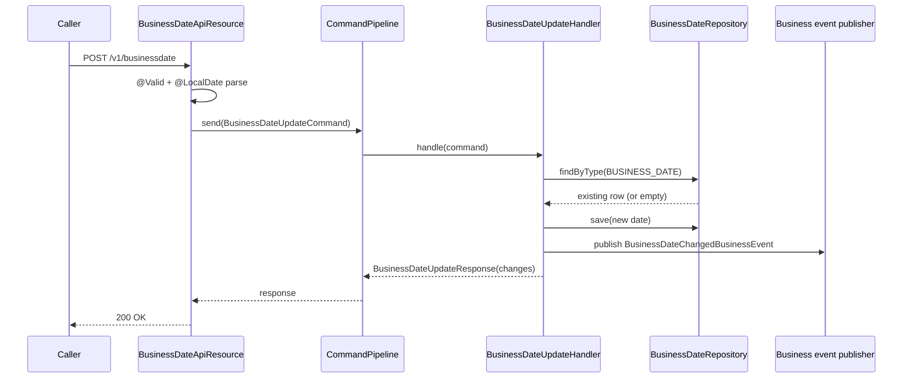

The Business Date API exposes the operational date controls Apache Fineract uses for transaction recording and close-of-business (COB) sequencing. Two types are stored:

- `BUSINESS_DATE` — the system date used by transactions when callers omit a transaction date.
- `COB_DATE` — the date currently being processed by close-of-business jobs.

Both values are persisted to the `m_business_date` table through the `BusinessDate` entity, fetched via `BusinessDateReadPlatformService`, and modified through the lightweight `CommandPipeline` so the change is validated, transactional, and publishes a `BusinessDateChangedBusinessEvent` for downstream listeners.

## Source

| Aspect | Value |
| --- | --- |
| Resource class | `org.apache.fineract.infrastructure.businessdate.api.BusinessDateApiResource` |
| File | `fineract-core/src/main/java/org/apache/fineract/infrastructure/businessdate/api/BusinessDateApiResource.java` |
| JAX-RS `@Path` | `/v1/businessdate` |
| Swagger tag | `Business Date Management` |
| Read service | `BusinessDateReadPlatformService` |
| Mapper | `BusinessDateMapper` |
| Command pipeline | `CommandPipeline.send(BusinessDateUpdateCommand)` |
| Request DTO | `BusinessDateUpdateRequest` |
| Response DTOs | `BusinessDateResponse`, `BusinessDateUpdateResponse` |
| Enum | `BusinessDateType` — `BUSINESS_DATE(1)`, `COB_DATE(2)` |

Both `GET` endpoints declare `@Produces(MediaType.TEXT_HTML, MediaType.APPLICATION_JSON)` so they can be probed from a browser as well as from automation.

## Endpoints

| Method | Path | Description | Command / read handler | Permission |
| --- | --- | --- | --- | --- |
| `GET` | `/v1/businessdate` | List all stored business dates. | `BusinessDateReadPlatformService.findAll()` + `BusinessDateMapper.mapFetchResponse(...)` | Authenticated |
| `GET` | `/v1/businessdate/{type}` | Retrieve one business date by type code. | `BusinessDateReadPlatformService.findByType(type)` | Authenticated |
| `POST` | `/v1/businessdate` | Insert-or-update a business date for the given type. | `BusinessDateUpdateCommand` via `CommandPipeline` → write service | Authenticated (handler enforces fine-grained checks) |

The `POST` endpoint is idempotent on `(type, date)` — sending the same payload twice produces an empty `changes` map.

## Date types

| Type code | Numeric id | Description | Typical writer |
| --- | --- | --- | --- |
| `BUSINESS_DATE` | 1 | Business Date | Operators / scheduled jobs at start of day |
| `COB_DATE` | 2 | Close of Business Date | `LoanCOBExecutorBatchJob` and related COB jobs |

The string identifier is forwarded into `BusinessDateType.valueOf(...)` deeper in the stack and validated by `@EnumValue` on the request DTO.

## Request body — update

The handler binds to `BusinessDateUpdateRequest` (validated with `@Valid` and a class-level `@LocalDate`):

```json
{
  "type": "BUSINESS_DATE",
  "date": "01 March 2024",
  "dateFormat": "dd MMMM yyyy",
  "locale": "en"
}
```

| Field | Required | Notes |
| --- | --- | --- |
| `type` | yes | `BUSINESS_DATE` or `COB_DATE`. Validated against `BusinessDateType`. |
| `date` | yes | Date string in the format specified by `dateFormat`. |
| `dateFormat` | yes | Java `DateTimeFormatter` pattern. |
| `locale` | yes | Locale tag for parsing month names. Validated by `@Locale`. |

The class-level `@LocalDate(dateField = "date", formatField = "dateFormat", localeField = "locale")` runs an additional parse-time check.

## Response — list

```json
[
  {
    "type": { "id": 1, "name": "BUSINESS_DATE", "description": "Business Date" },
    "description": "Business Date",
    "date": [2024, 3, 1]
  },
  {
    "type": { "id": 2, "name": "COB_DATE", "description": "Close of Business Date" },
    "description": "Close of Business Date",
    "date": [2024, 2, 29]
  }
]
```

`LocalDate` values render as `[year, month, day]` arrays because the response class is annotated with `@JsonLocalDateArrayFormat`.

## Response — single

```json
{
  "type": { "id": 1, "name": "BUSINESS_DATE", "description": "Business Date" },
  "description": "Business Date",
  "date": [2024, 3, 1]
}
```

## Response — update

`BusinessDateUpdateResponse` echoes the new `(type, date)` and carries a `changes` map keyed by `BusinessDateType` whose value is the **previous** date for each row that moved:

```json
{
  "type": { "id": 1, "name": "BUSINESS_DATE", "description": "Business Date" },
  "description": "Business Date",
  "date": [2024, 3, 1],
  "changes": {
    "BUSINESS_DATE": [2024, 2, 29]
  }
}
```

When the date is unchanged, `changes` is empty.

## Source — handler

```java
@GET
public List<BusinessDateResponse> getBusinessDates() {
    return businessDateMapper.mapFetchResponse(readPlatformService.findAll());
}

@GET
@Path("{type}")
public BusinessDateResponse getBusinessDate(@PathParam("type") final String type) {
    return businessDateMapper.mapFetchResponse(readPlatformService.findByType(type));
}

@POST
public BusinessDateUpdateResponse updateBusinessDate(@Valid BusinessDateUpdateRequest request) {
    var command = new BusinessDateUpdateCommand();
    command.setPayload(request);
    return commandPipeline.send(command).get();
}
```

## Update flow



## Canonical curl

```bash
# Read all business dates
curl -k -u mifos:password \
  -H "Fineract-Platform-TenantId: default" \
  https://localhost:8443/fineract-provider/api/v1/businessdate

# Read only the COB date
curl -k -u mifos:password \
  -H "Fineract-Platform-TenantId: default" \
  https://localhost:8443/fineract-provider/api/v1/businessdate/COB_DATE

# Advance the business date by one day
curl -k -u mifos:password \
  -H "Fineract-Platform-TenantId: default" \
  -H "Content-Type: application/json" \
  -X POST https://localhost:8443/fineract-provider/api/v1/businessdate \
  -d '{
    "type": "BUSINESS_DATE",
    "date": "01 March 2024",
    "dateFormat": "dd MMMM yyyy",
    "locale": "en"
  }'
```

## Behavioural notes

- The `enable-business-date` global configuration must be on for these values to be honoured by transaction handlers. Otherwise transaction handlers fall back to `LocalDate.now()` from the JVM clock.
- `COB_DATE` is normally advanced by the COB job runner — operators usually update only `BUSINESS_DATE` directly and let COB catch up.
- Audit trails are written through the standard command-pipeline mechanism rather than `m_portfolio_command_source`. The persistent change is the row in `m_business_date`.
- The handler enforces a monotonic progression for `BUSINESS_DATE` when `business-date-future-allowed` is `false` — attempting to set a date earlier than the current `BUSINESS_DATE` raises a `PlatformDataIntegrityException`.
- Each successful update publishes a `BusinessDateChangedBusinessEvent`; external integrations (webhooks, Kafka bridge) can subscribe.

## Error responses

| HTTP | When |
| --- | --- |
| `400 Bad Request` | Missing `type`, `date`, `dateFormat`, or `locale`; bad date format; `type` not in `BusinessDateType`. |
| `403 Forbidden` | Insufficient role/permission to mutate operational dates. |
| `404 Not Found` | `GET /v1/businessdate/{type}` for a `type` that has no stored row yet. |
| `409 Conflict` | Date violates configured monotonic-progression policy. |
| `500 Internal Server Error` | Pipeline retry exhausted. |

## Related subsystems

- Subsystem overview: [/infrastructure/business-date](/core/business-date)
- Enable/disable the feature: [/api/global-configuration](/api/global-configuration) (`enable-business-date`)
- COB job orchestration: [/api/scheduler-jobs](/api/scheduler-jobs), [/api/cob-catchup](/api/cob-catchup)
- Holiday and working-day calendars: [/api/calendars](/api/calendars), [/api/working-days](/api/working-days), [/api/holidays](/api/holidays)
- API conventions: [/api/conventions](/api/conventions)
