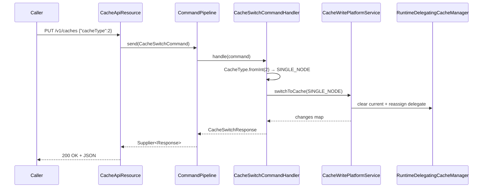

The Cache API exposes the runtime cache provider that Apache Fineract uses for per-tenant lookups (codes, permissions, configurations, and other reference data). The platform ships two providers — `NO_CACHE` (caching turned off) and `SINGLE_NODE` (in-process Caffeine cache, suitable for single-Tomcat deployments). Switching providers fully clears the previously active cache so that subsequent reads repopulate from the database.

Unlike most write endpoints, the cache switch dispatches through the lightweight `CommandPipeline` (a Resilience4j-protected handler) rather than the `PortfolioCommandSourceWritePlatformService`, so the switch does not create an `m_portfolio_command_source` audit row.

## Source

| Aspect | Value |
| --- | --- |
| Resource class | `org.apache.fineract.infrastructure.cache.api.CacheApiResource` |
| File | `fineract-core/src/main/java/org/apache/fineract/infrastructure/cache/api/CacheApiResource.java` |
| JAX-RS `@Path` | `/v1/caches` |
| Swagger tag | `Cache` |
| Cache facade | `RuntimeDelegatingCacheManager` (Spring qualifier `runtimeDelegatingCacheManager`) |
| Write service | `CacheWritePlatformService.switchToCache(CacheType)` |
| Command handler | `CacheSwitchCommandHandler` (Resilience4j retry `commandCacheSwitch`) |
| Request DTO | `CacheSwitchRequest` (`cacheType: Integer`, `@NotNull`) |
| Response DTO | `CacheSwitchResponse` (`cacheType: Integer`, `changes: Map<String,Object>`) |
| Read DTO | `CacheData` (`cacheType: EnumOptionData`, `enabled: boolean`) |

Class-level `@Consumes`/`@Produces` are both `application/json`.

## Endpoints

| Method | Path | Description | Command / read handler | Permission |
| --- | --- | --- | --- | --- |
| `GET` | `/v1/caches` | List cache providers and the currently enabled one. | `RuntimeDelegatingCacheManager.retrieveAll()` | Authenticated |
| `PUT` | `/v1/caches` | Switch the active cache provider. | `CommandPipeline.send(CacheSwitchCommand)` → `CacheSwitchCommandHandler` → `CacheWritePlatformService.switchToCache` | Authenticated; the handler runs under `@Transactional` |

`CacheType` is an enum backed by an integer:

| Integer | Enum constant | Meaning |
| --- | --- | --- |
| `1` | `NO_CACHE` | Caching disabled — every read hits the database. |
| `2` | `SINGLE_NODE` | In-process Caffeine cache for a single deployment. |

## Request body — switch

The handler binds to `CacheSwitchRequest`. Only `cacheType` is required and it is the integer form of the enum.

```json
{
  "cacheType": 2
}
```

| Field | Type | Required | Notes |
| --- | --- | --- | --- |
| `cacheType` | integer | yes (`@NotNull`) | `1` for `NO_CACHE`, `2` for `SINGLE_NODE`. Validated with `CacheType.fromInt(...)`. |

## Response — list

`Collection<CacheData>` — one row per known provider with `enabled` set on the currently selected one:

```json
[
  {
    "cacheType": { "id": 1, "code": "cacheType.no.cache",     "value": "No cache" },
    "enabled": false
  },
  {
    "cacheType": { "id": 2, "code": "cacheType.single.node", "value": "Single node" },
    "enabled": true
  }
]
```

## Response — switch

`CacheSwitchResponse` echoes the new `cacheType` and surfaces a `changes` map populated by `CacheWritePlatformService.switchToCache(...)`:

```json
{
  "cacheType": 2,
  "changes": {
    "cacheType": 2
  }
}
```

## Source — handler

```java
@PUT
@Operation(summary = "Switch Cache", description = "Switches the cache to chosen one.")
public CacheSwitchResponse switchCache(@Valid CacheSwitchRequest request) {
    final var command = new CacheSwitchCommand();
    command.setPayload(request);
    final Supplier<CacheSwitchResponse> response = commandPipeline.send(command);
    return response.get();
}
```

```java
// CacheSwitchCommandHandler
@Retry(name = "commandCacheSwitch", fallbackMethod = "fallback")
@Transactional
@Override
public CacheSwitchResponse handle(final Command<CacheSwitchRequest> command) {
    var request = command.getPayload();
    var cacheType = CacheType.fromInt(request.getCacheType());
    var changes = cacheService.switchToCache(cacheType);
    return CacheSwitchResponse.builder()
        .changes(changes)
        .cacheType(request.getCacheType())
        .build();
}
```

## Switch flow



## Canonical curl

```bash
# List cache providers
curl -k -u mifos:password \
  -H "Fineract-Platform-TenantId: default" \
  https://localhost:8443/fineract-provider/api/v1/caches

# Switch to single-node cache
curl -k -u mifos:password \
  -H "Fineract-Platform-TenantId: default" \
  -H "Content-Type: application/json" \
  -X PUT https://localhost:8443/fineract-provider/api/v1/caches \
  -d '{ "cacheType": 2 }'

# Disable caching
curl -k -u mifos:password \
  -H "Fineract-Platform-TenantId: default" \
  -H "Content-Type: application/json" \
  -X PUT https://localhost:8443/fineract-provider/api/v1/caches \
  -d '{ "cacheType": 1 }'
```

## Behaviour

`RuntimeDelegatingCacheManager` delegates every Spring cache call to the active provider. On switch:

1. The currently selected cache is fully cleared (`Cache.invalidate()` on every named cache).
2. The provider field is reassigned atomically — subsequent `getCache(name)` calls return the new provider's cache.
3. The first read on each cache key is a miss, so callers will see brief repopulation latency.

The retry policy (`@Retry(name = "commandCacheSwitch")`) is configured in `application.yaml` under `resilience4j.retry.instances.commandCacheSwitch`. On exhausted retries the handler falls back to `CommandHandler.super.fallback(...)` which re-raises the original throwable.

## Operational notes

- Clustered deployments typically run on `NO_CACHE` to avoid per-node staleness unless an external distributed cache is layered in.
- The endpoint is suitable for warm-restart cache flushes during incident response: `PUT {"cacheType":1}` followed by `PUT {"cacheType":2}` clears and re-arms `SINGLE_NODE`.
- The switch is persisted: the new selection survives a JVM restart because `CacheWritePlatformService` updates the `c_cache` row in addition to swapping the in-memory delegate.
- Bypassing the API: setting `fineract.cache.type` at startup picks the initial provider.

## Error responses

| HTTP | When |
| --- | --- |
| `400 Bad Request` | `cacheType` missing or not a valid `CacheType` integer. |
| `401 Unauthorized` | No basic-auth / OAuth credentials. |
| `403 Forbidden` | Tenant context missing or user lacks platform access. |
| `500 Internal Server Error` | Retry budget exhausted; check the underlying cause logged by `CacheSwitchCommandHandler`. |

## Caches affected by the switch

The `RuntimeDelegatingCacheManager` is the parent of every Spring-managed named cache in the platform. Switching providers therefore touches every entry under, for example:

- `code_values_by_code_name` — `CodeValueReadPlatformService` lookups consumed by code-driven dropdowns.
- `users_by_username` — `AppUserRepositoryWrapper` cache used during authentication.
- `tenants_tenant_identifier` — multi-tenant resolution cache.
- `payment_type_options` — `PaymentTypeReadPlatformService` cache used by transaction APIs.
- `gl_account_options` — cached GL-account dropdowns for journal-entry forms.

After a switch all of these are repopulated lazily on the next access.

## Related subsystems

- Subsystem overview: [/infrastructure/cache](/core/cache-infrastructure)
- Global configuration (some flags are read through cache): [/api/global-configuration](/api/global-configuration)
- Cache-heavy lookups: [/api/codes](/api/codes), [/api/code-values](/api/code-values), [/api/permissions](/api/permissions)
- API conventions and envelopes: [/api/conventions](/api/conventions)
