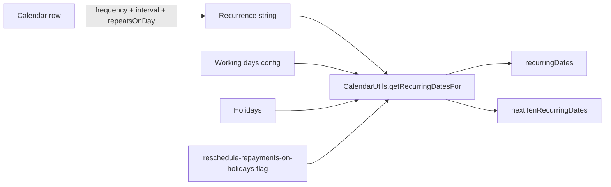

The Calendars API attaches recurring schedules to Apache Fineract entities. A `Calendar` carries a start date, a frequency (day/week/month/year), an interval, optional repeats-on-day or nth-day rules, and a calendar type (collection meeting, audit, general, etc.). Calendars drive group meeting dates, repayment schedules for JLG loans, and any other entity that needs a recurrence rule.

## Source

| Aspect | Value |
| --- | --- |
| Resource class | `org.apache.fineract.portfolio.calendar.api.CalendarsApiResource` |
| File | `fineract-provider/src/main/java/org/apache/fineract/portfolio/calendar/api/CalendarsApiResource.java` |
| JAX-RS `@Path` | `/v1/{entityType}/{entityId}/calendars` |
| Swagger tag | `Calendar` |
| Permission code | `CALENDAR` |
| Read services | `CalendarReadPlatformService`, `CalendarDropdownReadPlatformService` |

## Supported entity types

`CalendarEntityType` (path `entityType`):

| Path segment | Meaning |
| --- | --- |
| `clients` | Per-client calendar. |
| `groups` | Group meeting schedule. |
| `centers` | Center meeting schedule. |
| `loans` | Loan repayment calendar. |
| `savings` | Savings collection calendar. |

The `getResourceDetails` helper enriches the command wrapper with the matching `withClientId` / `withGroupId` / `withLoanId` / `withSavingsId` so command processors know the parent resource.

## Endpoints

| Method | Path | Description | Command / read handler | Permission |
| --- | --- | --- | --- | --- |
| `GET` | `/v1/{entityType}/{entityId}/calendars/template` | Calendar-creation template with frequency / repeats-on-day / remind-by dropdowns. | `CalendarReadPlatformService.retrieveNewCalendarDetails()` + `handleTemplate(...)` | `READ_CALENDAR` |
| `GET` | `/v1/{entityType}/{entityId}/calendars` | List calendars for the entity. Optional `calendarType` and `associations=parentCalendars`. | `CalendarReadPlatformService.retrieveCalendarsByEntity(...)` (+ `retrieveParentCalendarsByEntity`) | `READ_CALENDAR` |
| `GET` | `/v1/{entityType}/{entityId}/calendars/{calendarId}` | Retrieve a single calendar with recurring dates and next-ten occurrences; `?template=true` overlays dropdowns. | `CalendarReadPlatformService.retrieveCalendar(...)` | `READ_CALENDAR` |
| `POST` | `/v1/{entityType}/{entityId}/calendars` | Create a calendar; raises `CalendarEntityTypeNotSupportedException` for unsupported entity types. | `CommandWrapperBuilder.createCalendar(resourceDetails, entityType, entityId)` → `CREATE_CALENDAR` | `CREATE_CALENDAR` |
| `PUT` | `/v1/{entityType}/{entityId}/calendars/{calendarId}` | Update a calendar. | `updateCalendar(entityType, entityId, calendarId)` → `UPDATE_CALENDAR` | `UPDATE_CALENDAR` |
| `DELETE` | `/v1/{entityType}/{entityId}/calendars/{calendarId}` | Delete a calendar. | `deleteCalendar(entityType, entityId, calendarId)` → `DELETE_CALENDAR` | `DELETE_CALENDAR` |

## Request body — create

The deserialiser binds to `CalendarRequest`:

```json
{
  "title": "Weekly Center Meeting",
  "typeId": 1,
  "startDate": "01 March 2024",
  "frequency": 1,
  "interval": 1,
  "repeatsOnDay": 1,
  "repeatsOnNthDayOfMonth": null,
  "repeatsOnLastWeekday": false,
  "remindBy": 1,
  "firstReminder": 1,
  "secondReminder": 0,
  "locale": "en",
  "dateFormat": "dd MMMM yyyy"
}
```

`typeId` enumerations include `1` Collection, `2` Training, `3` Audit, `4` General, `5` Group Meetings.

`frequency` codes: `1` Daily, `2` Weekly, `3` Monthly, `4` Yearly.

## Response — list

```json
[
  {
    "id": 9,
    "calendarInstanceId": 13,
    "entityId": 7,
    "entityType": { "id": 3, "value": "centers" },
    "title": "Weekly Center Meeting",
    "startDate": [2024, 3, 1],
    "frequency": { "id": 2, "value": "Weekly" },
    "interval": 1,
    "repeating": true,
    "humanReadable": "Weekly on Mondays",
    "recurringDates": [[2024, 3, 1], [2024, 3, 8], [2024, 3, 15]],
    "nextTenRecurringDates": [[2024, 3, 1], [2024, 3, 8]]
  }
]
```

## Response — write

```json
{
  "officeId": 1,
  "groupId": 7,
  "resourceId": 9,
  "changes": {}
}
```

## Source — create handler

```java
@POST
public String createCalendar(@PathParam("entityType") final String entityType,
        @PathParam("entityId") final Long entityId,
        final String apiRequestBodyAsJson) {
    final CommandWrapperBuilder resourceDetails = getResourceDetails(
        CalendarEntityType.fromString(entityType), entityId);
    final CommandWrapper commandRequest = new CommandWrapperBuilder()
        .createCalendar(resourceDetails, entityType, entityId)
        .withJson(apiRequestBodyAsJson).build();
    final CommandProcessingResult result =
        commandsSourceWritePlatformService.logCommandSource(commandRequest);
    return toApiJsonSerializer.serialize(result);
}
```

`getResourceDetails` (private) inspects the `CalendarEntityType` and stamps the wrapper with `.withClientId(...)`, `.withGroupId(...)`, `.withLoanId(...)`, or `.withSavingsId(...)` so the audit row carries the parent resource id.

## Canonical curl

```bash
# Discover frequency / repeats-on-day dropdowns
curl -k -u mifos:password \
  -H "Fineract-Platform-TenantId: default" \
  https://localhost:8443/fineract-provider/api/v1/centers/7/calendars/template

# Create a weekly Monday meeting calendar for a center
curl -k -u mifos:password \
  -H "Fineract-Platform-TenantId: default" \
  -H "Content-Type: application/json" \
  -X POST https://localhost:8443/fineract-provider/api/v1/centers/7/calendars \
  -d '{
    "title": "Weekly Center Meeting",
    "typeId": 1,
    "startDate": "01 March 2024",
    "frequency": 2,
    "interval": 1,
    "repeatsOnDay": 1,
    "remindBy": 1,
    "firstReminder": 1,
    "secondReminder": 0,
    "locale": "en",
    "dateFormat": "dd MMMM yyyy"
  }'

# List calendars, including parent calendars (centers inherit from above)
curl -k -u mifos:password \
  -H "Fineract-Platform-TenantId: default" \
  'https://localhost:8443/fineract-provider/api/v1/groups/42/calendars?associations=parentCalendars'

# Inspect a single calendar with the editing template overlay
curl -k -u mifos:password \
  -H "Fineract-Platform-TenantId: default" \
  'https://localhost:8443/fineract-provider/api/v1/centers/7/calendars/9?template=true'
```

## Recurrence semantics

Calendars are persisted with a serialised RFC 5545–like recurrence string. `CalendarUtils.getRecurringDatesFor(...)` materialises occurrences on demand:



When the `reschedule-repayments-on-holidays` global configuration is enabled, dates that fall on a holiday are shifted to the next working day; otherwise the raw recurrence is returned.

## Inheritance — parents and instances

A calendar is created against a specific entity but the recurrence flows to children through `CalendarInstance` rows:

- A `centers` calendar with `typeId=1` (Collection) becomes the default schedule for groups under that center.
- A `groups` calendar acts as the schedule for JLG loans booked against that group when `meetings-mandatory-for-jlg-loans` is enabled.
- `associations=parentCalendars` returns the cascade so UIs can show "inherited from center 12".

## Validation rules

- `startDate` must not be in the past for collection-meeting calendars when the platform-wide rule is enabled.
- `frequency=2` (Weekly) requires `repeatsOnDay` (1=Monday … 7=Sunday).
- `frequency=3` (Monthly) requires either `repeatsOnDay` + `repeatsOnNthDayOfMonth`, or `repeatsOnLastWeekday=true`.
- Deleting a calendar that backs an active loan repayment schedule raises `CalendarCannotBeDeletedException`.

## Error responses

| HTTP | When |
| --- | --- |
| `400 Bad Request` | Bad recurrence parameters; `entityType` is not a known `CalendarEntityType`. |
| `403 Forbidden` | Missing the matching `*_CALENDAR` permission. |
| `404 Not Found` | Entity or calendar not found. |
| `409 Conflict` | Delete blocked by active loan/group dependency. |

## Related subsystems

- Subsystem overview: [/portfolio/calendars](/portfolio/calendar)
- Meeting attendance on the same schedule: [/api/meetings](/api/meetings)
- Loans following group/center calendars: [/portfolio/loans](/loan/overview)
- Holidays which can shift recurring dates: [/organisation/holidays](/organisation/holidays), [/api/holidays](/api/holidays)
- Working-day rules used during recurrence: [/api/working-days](/api/working-days)
- API conventions: [/api/conventions](/api/conventions)
