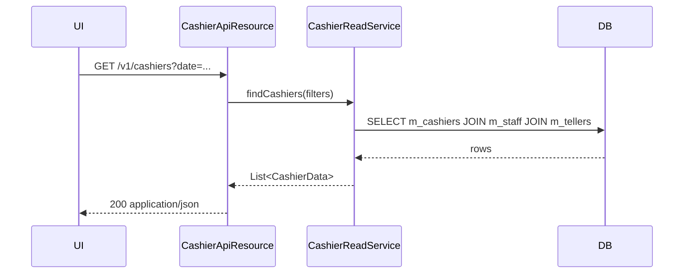

`CashierApiResource` is a small read-only JAX-RS resource that exposes Apache Fineract's **cashier allocation** rows independent of a specific teller. It is the inverse projection of the cashier endpoints on [`TellerApiResource`](/api/tellers) — instead of starting from a teller and listing its cashiers, callers start with optional office / teller / staff / date filters and get the matching cashier rows.

Full cashier CRUD (allocate, update, delete, cash-in / cash-out) lives on `TellerApiResource` under `/v1/tellers/{tellerId}/cashiers/...`. The standalone `/v1/cashiers` resource is intended for branch-day dashboards.

## Source

- **File:** `fineract-branch/src/main/java/org/apache/fineract/organisation/teller/api/CashierApiResource.java`
- **Class path annotation:** `@Path("/v1/cashiers")`
- **OpenAPI tag:** `Cashiers`
- **Spring stereotype:** `@Component`

Constructor-injected dependency:

- `TellerManagementReadPlatformService readPlatformService`

## Endpoints

| Method | Path | Description | Command / Handler | Permission |
| ------ | ---- | ----------- | ----------------- | ---------- |
| GET | `/v1/cashiers?officeId=&tellerId=&staffId=&date=` | List cashier allocations matching the supplied filters on a date. | `readPlatformService.getCashierData(officeId, tellerId, staffId, dateRestriction)` | Authenticated |

If the `date` query parameter is omitted the resource falls back to `DateUtils.getBusinessLocalDate()`. The expected format is `yyyyMMdd` (`DateTimeFormatter.BASIC_ISO_DATE`).

## Code

```java
@GET
@Consumes({ MediaType.TEXT_HTML, MediaType.APPLICATION_JSON })
@Produces(MediaType.APPLICATION_JSON)
public Collection<CashierData> getCashierData(
        @QueryParam("officeId") final Long officeId,
        @QueryParam("tellerId") final Long tellerId,
        @QueryParam("staffId") final Long staffId,
        @QueryParam("date") final String date) {
    final LocalDate dateRestriction = date != null
        ? LocalDate.parse(date, DateTimeFormatter.BASIC_ISO_DATE)
        : DateUtils.getBusinessLocalDate();
    return readPlatformService.getCashierData(officeId, tellerId, staffId, dateRestriction);
}
```

## Request / response example

`GET /v1/cashiers?officeId=1&date=20250120`

```json
[
  {
    "id": 8,
    "tellerId": 5,
    "tellerName": "Main Branch – Window 1",
    "staffId": 42,
    "staffName": "Alice Smith",
    "description": "Alice on counter",
    "isFullDay": true,
    "startDate": [2025, 1, 20],
    "endDate":   [2025, 1, 20]
  },
  {
    "id": 9,
    "tellerId": 5,
    "tellerName": "Main Branch – Window 1",
    "staffId": 51,
    "staffName": "Bob Jones",
    "description": "Bob covering lunch",
    "isFullDay": false,
    "startTime": "12:00",
    "endTime":   "13:00",
    "startDate": [2025, 1, 20],
    "endDate":   [2025, 1, 20]
  }
]
```

### Filtering rules

- All four query parameters are optional and combine with `AND`.
- `date` restricts to allocations whose `[start_date, end_date]` window contains the date.
- The handler does **not** validate any permission against the principal — anyone authenticated can list cashier allocations. Tighten this at the gateway or with a custom `RequestFilter` if your tenant requires it.

## Data carriers

- **Response:** `Collection<CashierData>` — flat representation of each `Cashier` row joined with `Staff` (name) and `Teller` (name).

## Cross-links

- [Tellers API](/api/tellers) — full cashier CRUD and allocate / settle commands.
- [Teller journal](/api/teller-journal) — read-only journal of allocate / settle entries.
- [Staff](/organisation/staff) — the principal referenced by `staffId`.
- [Offices](/organisation/offices) — the office the teller belongs to.


## Endpoint detail

The resource registers a single GET on `/v1/cashiers`:

```java
@Path("/v1/cashiers")
@Component
@RequiredArgsConstructor
public class CashierApiResource {
    @GET
    @Produces({ MediaType.APPLICATION_JSON })
    public Collection<CashierData> findCashiers(
        @QueryParam("officeId") Long officeId,
        @QueryParam("tellerId") Long tellerId,
        @QueryParam("staffId")  Long staffId,
        @QueryParam("date")     LocalDate date) { ... }
```

All filters are AND-combined. Omitting all filters returns every cashier row visible to the caller.

## Filters

| Parameter | Description |
| --------- | ----------- |
| `officeId` | Restrict to cashiers attached to tellers of this office. |
| `tellerId` | Restrict to cashiers of a specific teller. |
| `staffId` | Restrict to allocations for a specific staff principal. |
| `date` | Effective-on filter: only rows whose `[startDate, endDate]` covers this date. |

## Response shape

`Collection<CashierData>` — a flat JSON array, **not** a `Page` envelope. Pagination is not supported; large result sets should be narrowed with filters.

```json
[
  {
    "id": 17,
    "tellerId": 4,
    "tellerName": "Branch-001 Main Teller",
    "staffId": 33,
    "staffName": "Jane Doe",
    "description": "Morning shift",
    "fullDay": false,
    "startDate": [2025, 1, 1],
    "endDate":   [2025, 12, 31],
    "startTime": "09:00",
    "endTime":   "13:00"
  }
]
```

## When to use this vs `/v1/tellers/{id}/cashiers`

Use `/v1/cashiers` when you do not yet know the teller — e.g. "which cashier was working in office 5 on this date?". Use the teller-scoped variant when you have a teller in hand and want to render its full allocation timeline.

## Operational notes

- The endpoint is read-only by design. All mutations live under [`/v1/tellers/{tellerId}/cashiers`](/api/tellers).
- No `validateHasReadPermission` is called; any authenticated user can see allocations. Sensitive deployments should front the endpoint with a gateway-level role check.
- Dates are serialised as JSON arrays (`[year, month, day]`) consistent with the rest of Fineract — clients should not assume ISO-8601 strings.

## Error semantics

| Failure | HTTP | Detail |
| ------- | ---- | ------ |
| Unknown `officeId` | 200 with empty array | filter has no matches |
| Malformed `date` | 400 | JAX-RS conversion error |
| Auth failure | 401 | standard tenant filter |

## Cross-links

- [Tellers](/api/tellers) — full cashier CRUD and allocate / settle commands.
- [Cashier journals](/api/teller-journal) — read-only journal of allocate / settle / cash-inward / cash-outward entries.
- [Staff](/api/staff), [Offices](/api/offices) — referenced foreign keys.

## cURL recipes

Who is allocated to the front desk today across all branches?

```bash
curl -u mifos:password \
     -H "Fineract-Platform-TenantId: default" \
     "https://localhost:8443/fineract-provider/api/v1/cashiers?date=2025-05-01"
```

Active cashiers for office 5:

```bash
curl -u mifos:password \
     -H "Fineract-Platform-TenantId: default" \
     "https://localhost:8443/fineract-provider/api/v1/cashiers?officeId=5"
```

Allocations for staff principal 33 (e.g. their full shift history):

```bash
curl -u mifos:password \
     -H "Fineract-Platform-TenantId: default" \
     "https://localhost:8443/fineract-provider/api/v1/cashiers?staffId=33"
```

## Sequence


