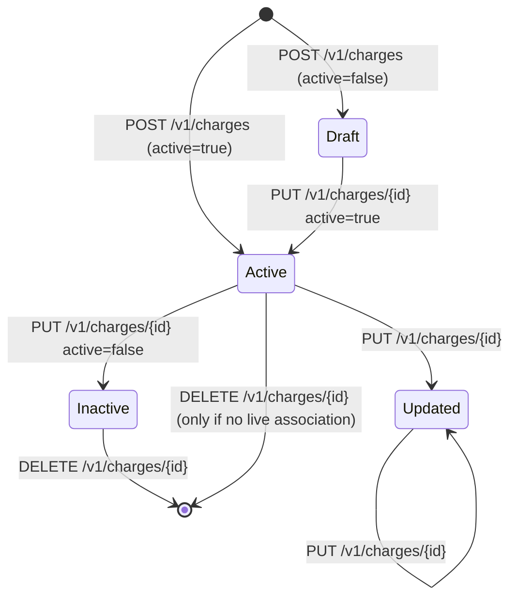

The Charges API stores the fee and penalty templates Apache Fineract attaches to loan, savings, share, and client accounts. Each `Charge` defines a calculation type (flat or percentage of various bases), a time/event of charge, a currency, whether it counts as a penalty, and the linked income GL account. Charges defined here are subsequently associated with products and individual accounts to drive automated fee accruals.

## Source

| Aspect | Value |
| --- | --- |
| Resource class | `org.apache.fineract.portfolio.charge.api.ChargesApiResource` |
| File | `fineract-charge/src/main/java/org/apache/fineract/portfolio/charge/api/ChargesApiResource.java` |
| JAX-RS `@Path` | `/v1/charges` |
| Swagger tag | `Charges` |
| Permission code | `CHARGE` |
| Read service | `ChargeReadPlatformService` |

## Endpoints

| Method | Path | Description | Command / read handler | Permission |
| --- | --- | --- | --- | --- |
| `GET` | `/v1/charges` | List all defined charges. | `ChargeReadPlatformService.retrieveAllCharges()` | `READ_CHARGE` |
| `GET` | `/v1/charges/{chargeId}` | Retrieve a charge; `?template=true` overlays template defaults via `ChargeData.withTemplate(charge, template)`. | `ChargeReadPlatformService.retrieveCharge(chargeId)` (+ `retrieveNewChargeDetails`) | `READ_CHARGE` |
| `GET` | `/v1/charges/template` | Allowed value lists and defaults for building a Create UI. | `ChargeReadPlatformService.retrieveNewChargeDetails()` | `READ_CHARGE` |
| `POST` | `/v1/charges` | Create a new charge. | `CommandWrapperBuilder.createCharge()` → `CREATE_CHARGE` | `CREATE_CHARGE` |
| `PUT` | `/v1/charges/{chargeId}` | Update a charge. | `updateCharge(chargeId)` → `UPDATE_CHARGE` | `UPDATE_CHARGE` |
| `DELETE` | `/v1/charges/{chargeId}` | Delete a charge. | `deleteCharge(chargeId)` → `DELETE_CHARGE` | `DELETE_CHARGE` |

## Request body — create

The deserialiser binds to `ChargeRequest`:

```json
{
  "name": "Loan processing fee",
  "active": true,
  "penalty": false,
  "currencyCode": "USD",
  "amount": 25.00,
  "locale": "en",
  "chargeAppliesTo": 1,
  "chargeTimeType": 1,
  "chargeCalculationType": 1,
  "chargePaymentMode": 0,
  "feeOnMonthDay": null,
  "feeInterval": null,
  "monthDayFormat": "dd MMM",
  "minCap": null,
  "maxCap": null,
  "incomeAccountId": 32,
  "taxGroupId": null
}
```

### Common enums

`chargeAppliesTo`: `1` Loan, `2` Savings, `3` Client, `4` Shares.

`chargeTimeType`: `1` Disbursement, `2` Specified due date, `3` Installment fee, `4` Overdue installment, `5` Savings activation, `6` Withdrawal fee, `7` Annual fee, `8` Monthly fee, `9` Weekly fee, `10` Trigger.

`chargeCalculationType`: `1` Flat, `2` % Amount, `3` % Amount + Interest, `4` % Interest, `5` % Disbursement amount.

`chargePaymentMode`: `0` Regular, `1` Account transfer.

## Response — list

```json
[
  {
    "id": 5,
    "name": "Loan processing fee",
    "active": true,
    "penalty": false,
    "freeWithdrawalChargeFrequency": null,
    "currency": { "code": "USD", "name": "US Dollar" },
    "amount": 25.00,
    "chargeTimeType":        { "id": 1, "value": "Disbursement" },
    "chargeAppliesTo":       { "id": 1, "value": "Loan" },
    "chargeCalculationType": { "id": 1, "value": "Flat" },
    "chargePaymentMode":     { "id": 0, "value": "Regular" },
    "incomeAccount": { "id": 32, "name": "Fee Income", "glCode": "400100" }
  }
]
```

## Response — write

```json
{
  "resourceId": 5,
  "changes": { "amount": 25.00 }
}
```

## Template

The `template` endpoint returns currency options, charge-applies-to / time / calculation / payment-mode dropdowns, GL income account candidates, and tax group options. The structure mirrors the response of `retrieve` with `?template=true` minus the existing charge fields.

## Source — create handler

```java
@POST
public String createCharge(final String apiRequestBodyAsJson) {
    final CommandWrapper commandRequest = new CommandWrapperBuilder()
        .createCharge().withJson(apiRequestBodyAsJson).build();
    final CommandProcessingResult result =
        commandsSourceWritePlatformService.logCommandSource(commandRequest);
    return toApiJsonSerializer.serialize(result);
}
```

## Source — list handler

```java
@GET
public String retrieveAllCharges(@Context final UriInfo uriInfo) {
    context.authenticatedUser().validateHasReadPermission(RESOURCE_NAME_FOR_PERMISSIONS);
    final Collection<ChargeData> charges = readPlatformService.retrieveAllCharges();
    final ApiRequestJsonSerializationSettings settings =
        apiRequestParameterHelper.process(uriInfo.getQueryParameters());
    return toApiJsonSerializer.serialize(settings, charges, RESPONSE_DATA_PARAMETERS);
}
```

## Lifecycle



Once a charge is referenced by a product or an account, `DELETE` raises `ChargeCannotBeDeletedException`; the operational replacement is `PUT {"active":false}`.

## Canonical curl

```bash
# Browse charge template options
curl -k -u mifos:password \
  -H "Fineract-Platform-TenantId: default" \
  https://localhost:8443/fineract-provider/api/v1/charges/template

# Create a loan disbursement fee
curl -k -u mifos:password \
  -H "Fineract-Platform-TenantId: default" \
  -H "Content-Type: application/json" \
  -X POST https://localhost:8443/fineract-provider/api/v1/charges \
  -d '{
    "name": "Loan processing fee",
    "active": true,
    "penalty": false,
    "currencyCode": "USD",
    "amount": 25.00,
    "locale": "en",
    "chargeAppliesTo": 1,
    "chargeTimeType": 1,
    "chargeCalculationType": 1,
    "chargePaymentMode": 0,
    "incomeAccountId": 32
  }'

# Define a monthly savings maintenance fee
curl -k -u mifos:password \
  -H "Fineract-Platform-TenantId: default" \
  -H "Content-Type: application/json" \
  -X POST https://localhost:8443/fineract-provider/api/v1/charges \
  -d '{
    "name": "Savings monthly maintenance",
    "active": true,
    "penalty": false,
    "currencyCode": "USD",
    "amount": 1.50,
    "locale": "en",
    "chargeAppliesTo": 2,
    "chargeTimeType": 8,
    "chargeCalculationType": 1,
    "chargePaymentMode": 0,
    "incomeAccountId": 32
  }'

# Deactivate a charge instead of deleting it
curl -k -u mifos:password \
  -H "Fineract-Platform-TenantId: default" \
  -H "Content-Type: application/json" \
  -X PUT https://localhost:8443/fineract-provider/api/v1/charges/5 \
  -d '{ "active": false }'
```

## Calculation type matrix

| `chargeAppliesTo` | Compatible `chargeCalculationType` | Notes |
| --- | --- | --- |
| 1 Loan | 1 Flat, 2 % Amount, 3 % Amount+Interest, 4 % Interest, 5 % Disbursement amount | `5` only when `chargeTimeType=1` (Disbursement). |
| 2 Savings | 1 Flat, 6 % Amount Out (withdrawal fee) | Use `chargeTimeType=6` for withdrawal fees and `8` for monthly maintenance. |
| 3 Client | 1 Flat | Client-level charges are flat-only. |
| 4 Shares | 1 Flat, 2 % Amount | Applied to subscription/redemption. |

Combinations outside this matrix are rejected by `ChargeDataValidator` with `error.msg.charge.calculation.type.invalid`.

## Time-of-charge specifics

- `chargeTimeType=2` (Specified due date) requires the consuming account to provide a `dueDate` when the charge is attached.
- `chargeTimeType=4` (Overdue installment) takes effect through the COB pipeline (`LoanCOBExecutorBatchJob`) and respects the `penalty-wait-period` global configuration.
- `chargeTimeType=7..9` (Annual / Monthly / Weekly) requires `feeOnMonthDay` (and `feeInterval` for weekly).
- `chargeTimeType=10` (Trigger) is event-driven; consumers post the charge from external systems via [/api/loan-charges](/api/loan-charges).

## Tax groups

When `taxGroupId` is set, the platform's tax engine ([/api/tax-groups](/api/tax-groups)) applies all components in the group to the charge amount at posting time. The tax components write parallel journal entries against the configured liability accounts and respect each component's start-date validity window.

## Error responses

| HTTP | When |
| --- | --- |
| `400 Bad Request` | Calculation type incompatible with `chargeAppliesTo`/`chargeTimeType`; missing currency. |
| `403 Forbidden` | Missing `*_CHARGE` permission. |
| `404 Not Found` | `chargeId` unknown; `incomeAccountId` unknown. |
| `409 Conflict` | Delete attempted on a charge with active product/account associations; duplicate `name`. |

## Related subsystems

- Subsystem overview: [/portfolio/charges](/charge/overview)
- Loan-product / savings-product charge associations: [/portfolio/loan-products](/loan/loan-product-api), [/portfolio/savings-products](/savings/overview)
- Per-account charge instances: [/api/loan-charges](/api/loan-charges), [/api/savings-account-charges](/api/savings-account-charges), [/api/client-charges](/api/client-charges)
- Tax groups attached to a charge: [/api/tax-groups](/api/tax-groups), [/api/tax-components](/api/tax-components)
- GL accounts referenced by `incomeAccountId`: [/api/gl-accounts](/api/gl-accounts)
- API conventions: [/api/conventions](/api/conventions)
