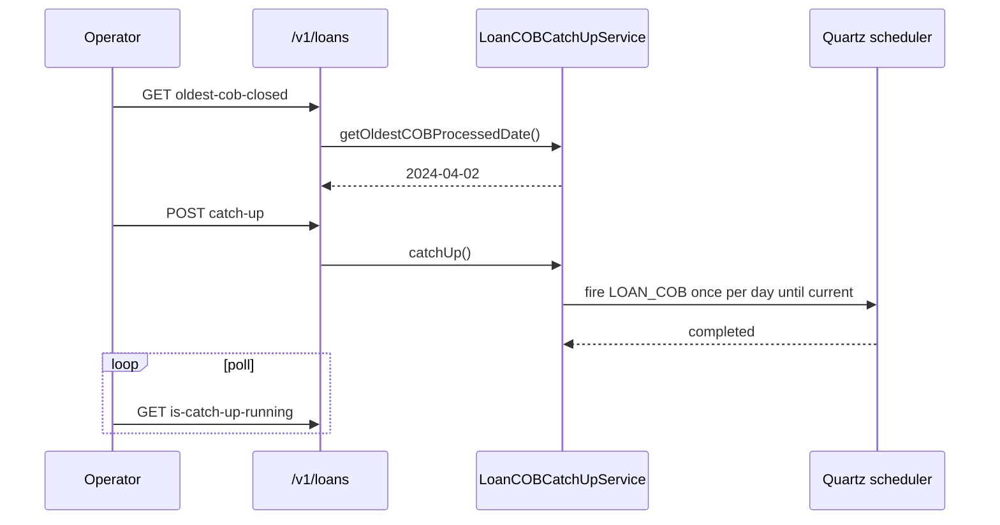

The Loan COB Catch-Up API is the operational lever Apache Fineract gives operators when the `LOAN_COB` job has fallen behind the current business date — for example after a long outage, a paused scheduler, or a maintenance window. It exposes three small endpoints under `/v1/loans` that report the *oldest* COB-processed loan, kick off a sequential day-by-day catch-up run, and tell callers whether a catch-up is already in flight.

## Source

| Aspect | Value |
| --- | --- |
| Resource class | `org.apache.fineract.cob.api.LoanCOBCatchUpApiResource` |
| File | `fineract-provider/src/main/java/org/apache/fineract/cob/api/LoanCOBCatchUpApiResource.java` |
| JAX-RS `@Path` | `/v1/loans` |
| Swagger tag | `Loan COB Catch Up` |
| Service | `LoanCOBCatchUpServiceImpl` (`Optional<>` — present only when the `LOAN_COB` job is enabled) |
| Helper | `COBCatchUpExecutorHelper` |
| Job | `JobName.LOAN_COB` |

The companion working-capital surface is documented at [Working Capital COB Catch-Up](/api/working-capital-cob-catchup).

## Endpoints

| Method | Path | Description | Command / handler | Permission |
| --- | --- | --- | --- | --- |
| `GET` | `/v1/loans/oldest-cob-closed` | Return the oldest COB business date that still has loans waiting to be processed, plus the oldest loan id at that date. | `COBCatchUpService.getOldestCOBProcessedLoan()` | Authenticated |
| `POST` | `/v1/loans/catch-up` | Trigger a sequential catch-up: for every business date between the oldest open day and `COB_DATE`, run the `LOAN_COB` inline job. | `COBCatchUpExecutorHelper.executeLoanCOBCatchUp(loanCOBCatchUpService)` | Authenticated |
| `GET` | `/v1/loans/is-catch-up-running` | Tell whether a catch-up is in flight, and if so, which business date is currently being processed. | `COBCatchUpService.isCatchUpRunning()` | Authenticated |

If the `LOAN_COB` job is disabled (the optional service is empty), `GET /oldest-cob-closed` and `POST /catch-up` raise `JobIsNotFoundOrNotEnabledException("LOAN_COB")`. `GET /is-catch-up-running` falls back to `new IsCatchUpRunningDTO(false, null)` instead of throwing, so monitoring probes are safe even on instances that do not run COB.

## Inspecting the oldest open day

```bash
curl -u mifos:password \
  -H 'fineract-platform-tenantid: default' \
  'https://fineract.example.org/fineract-provider/api/v1/loans/oldest-cob-closed'
```

```json
{
  "cobBusinessDate": "2024-04-10",
  "oldestCOBProcessedLoan": 1042
}
```

`OldestCOBProcessedLoanDTO` carries the earliest business date for which the catch-up still has work to do (the day after the last successful COB closure) and the loan id used to anchor the scan. When everything is already up to date the date matches the current `COB_DATE` and `oldestCOBProcessedLoan` is `null`.

## Triggering a catch-up

```bash
curl -X POST -u mifos:password \
  -H 'fineract-platform-tenantid: default' \
  -H 'Content-Type: application/json' \
  'https://fineract.example.org/fineract-provider/api/v1/loans/catch-up'
```

The handler delegates to `COBCatchUpExecutorHelper.executeLoanCOBCatchUp(...)`, which in turn iterates through the missing business dates and submits one inline `LOAN_COB` run per day. The HTTP response is one of:

| Status | Meaning |
| --- | --- |
| `200 OK` | Nothing to do — all loans are already up to date. |
| `202 Accepted` | Catch-up has been started in a background thread. |
| `400 Bad Request` | A catch-up is already in progress; refuse the new request. |

Because the actual work happens on a background executor, the call returns long before the last loan is processed. Poll `is-catch-up-running` to observe progress.

## Polling progress

```bash
curl -u mifos:password \
  -H 'fineract-platform-tenantid: default' \
  'https://fineract.example.org/fineract-provider/api/v1/loans/is-catch-up-running'
```

```json
{
  "catchUpRunning": true,
  "currentDate": "2024-04-12"
}
```

The `currentDate` field is the business date currently being processed by the catch-up loop. It increments by one as each day completes; the catch-up is finished when `catchUpRunning` is `false` again and `oldest-cob-closed` returns the current `COB_DATE`.

## Operational pattern

A typical recovery flow:

1. Pause the scheduler so production COB runs do not contend with the catch-up. See [Scheduler](/api/scheduler) (`POST /v1/scheduler?command=stop`).
2. Verify the lag: `GET /v1/loans/oldest-cob-closed`.
3. Inspect held locks if you suspect parked failures: [Loan Account Lock](/api/loan-account-lock).
4. Kick the catch-up: `POST /v1/loans/catch-up`.
5. Poll `GET /v1/loans/is-catch-up-running` until it reports `catchUpRunning=false`.
6. Re-activate the scheduler: `POST /v1/scheduler?command=start`.

In a clustered deployment the catch-up must run on the batch-manager node. The inline `LOAN_COB` invocations the helper makes flow through [Inline Jobs](/api/inline-jobs); the steps they execute are ordered by [Configure Business Step](/api/configure-business-step).

## Optional-service guard

Because `LoanCOBCatchUpServiceImpl` is an `Optional<>` constructor argument, the catch-up endpoints simply do not function on instances where the COB job has been disabled at boot. This avoids accidental no-op invocations during partial deployments — a missing service consistently maps to an HTTP error tagged with the well-known job name.

## Related resources

- [Working Capital COB Catch-Up](/api/working-capital-cob-catchup) — same surface for the working-capital-loan COB job.
- [Loan Account Lock](/api/loan-account-lock) — see which loans are currently locked by the pipeline.
- [Inline Jobs](/api/inline-jobs) — synchronous invocation path used internally by the catch-up helper.
- [Scheduler](/api/scheduler) — pause/resume the Quartz scheduler around a catch-up run.
- [Scheduler Jobs](/api/scheduler-jobs) — change the cron expression of `LOAN_COB` or its activation flag.
- [Configure Business Step](/api/configure-business-step) — order the steps inside `LOAN_COB`.
- [Internal COB](/api/internal-cob) — TEST-only partition and fast-forward helpers.
- [Business Date](/api/business-date) — inspect `BUSINESS_DATE` and `COB_DATE` while monitoring progress.

## Curl reference

Inspect the oldest open business day:

```bash
curl -u mifos:password \
  -H "Fineract-Platform-TenantId: default" \
  https://example.org/fineract-provider/api/v1/loans/oldest-cob-closed
```

Trigger the catch-up run:

```bash
curl -u mifos:password \
  -H "Fineract-Platform-TenantId: default" \
  -X POST https://example.org/fineract-provider/api/v1/loans/catch-up
```

Poll progress:

```bash
curl -u mifos:password \
  -H "Fineract-Platform-TenantId: default" \
  https://example.org/fineract-provider/api/v1/loans/is-catch-up-running
```

## Response shapes

`GET /v1/loans/oldest-cob-closed` → `OldestCOBProcessedLoanDTO`:

| Field | Type | Notes |
| --- | --- | --- |
| `cobBusinessDate` | date | Earliest day with at least one un-COB-processed loan. `null` when the portfolio is fully caught up. |

`GET /v1/loans/is-catch-up-running` → `IsCatchUpRunningDTO`:

| Field | Type | Notes |
| --- | --- | --- |
| `catchUpRunning` | boolean | Mirrors the `LoanCOBCatchUpService.isCatchUpRunning()` flag. |

## Sequence diagram



## Operational notes

- The endpoint is **idempotent**: a second `POST /catch-up` while a catch-up is in progress simply returns immediately — see `LoanCOBCatchUpService.catchUp()`.
- A catch-up run does not advance `BUSINESS_DATE`; only `COB_DATE` moves. The operator is expected to also raise `BUSINESS_DATE` once COB is caught up.
- The catch-up cannot start when the matching `LOAN_COB` job is disabled in [Scheduler Jobs](/api/scheduler-jobs) — re-enable it first.

## Optional-service guard

The endpoints are only registered when `LoanCOBCatchUpService` is available — projects that build without the COB module simply don't expose them, and clients receive `404 NOT_FOUND`.

## Permissions

| Endpoint | Permission |
| --- | --- |
| `GET /v1/loans/oldest-cob-closed` | `READ_LOAN` |
| `POST /v1/loans/catch-up` | `EXECUTEJOB_SCHEDULER` |
| `GET /v1/loans/is-catch-up-running` | `READ_LOAN` |

## Failure modes

| Symptom | Likely cause |
| --- | --- |
| `cobBusinessDate: null` but unprocessed loans exist | Run a [Inline LOAN_COB](/api/inline-jobs) for the affected loans — the catch-up flag does not include rows skipped due to locks. |
| Catch-up flag stuck on `true` for hours | A Quartz fire crashed; clear stale locks via [Internal Loan Account Lock](/api/internal-loan-account-lock). |
| `405 Method Not Allowed` on POST | Targeted a non-batch-manager node — see [Instance Mode](/api/instance-mode). |

## Sample responses

```json
{ "cobBusinessDate": "2024-04-02" }
```

```json
{ "catchUpRunning": false }
```
