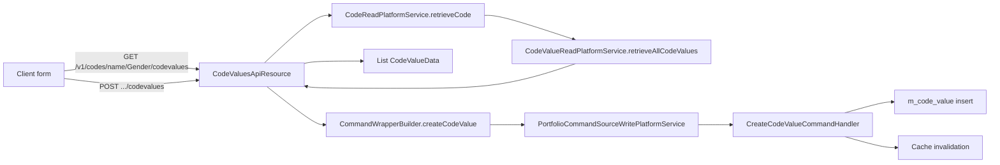

The Code Values API manages the individual `CodeValue` rows that belong to a parent `Code` in Apache Fineract. Code values are the strings shown in dropdowns across the platform — every Gender option, every Loan Purpose, every tag attached to a GL account, every address type. They carry a `position` used for ordering, an optional `description`, an `isActive` flag controlling whether the value is offered in new dropdowns, and an `isMandatory` flag that influences validation in UIs.

Every endpoint is duplicated: one variant identifies the parent code by numeric `codeId`, the other by string `codeName`. The two variants share the same command handlers and the same write envelope.

## Source

| Aspect | Value |
| --- | --- |
| Resource class | `org.apache.fineract.infrastructure.codes.api.CodeValuesApiResource` |
| File | `fineract-provider/src/main/java/org/apache/fineract/infrastructure/codes/api/CodeValuesApiResource.java` |
| JAX-RS `@Path` | `/v1/codes` (sub-paths under `{codeId}/codevalues` and `name/{codeName}/codevalues`) |
| Swagger tag | `Code Values` |
| Permission resource | `CODEVALUE` (`RESOURCE_NAME_FOR_PERMISSIONS`) |
| Read services | `CodeValueReadPlatformService`, `CodeReadPlatformService` |
| Write pipeline | `CommandWrapperBuilder` → `PortfolioCommandSourceWritePlatformService` |
| Response DTO | `CodeValueData` |
| Response parameters | `id`, `name`, `position`, `isMandatory`, `description` (from `CodeConstants.CodevalueJSONinputParams`) |
| Swagger schemas | `CodeValuesApiResourceSwagger.{GetCodeValuesDataResponse,PostCodeValuesDataRequest,PostCodeValueDataResponse,PutCodeValuesDataRequest,PutCodeValueDataResponse,DeleteCodeValueDataResponse}` |

## Endpoints — by numeric code id

| Method | Path | Description | Command / read handler | Permission |
| --- | --- | --- | --- | --- |
| `GET` | `/v1/codes/{codeId}/codevalues` | List all values for the code. | `CodeValueReadPlatformService.retrieveAllCodeValues(codeId)` | `READ_CODEVALUE` |
| `GET` | `/v1/codes/{codeId}/codevalues/{codeValueId}` | Retrieve one value. | `CodeValueReadPlatformService.retrieveCodeValue(codeValueId)` | `READ_CODEVALUE` |
| `POST` | `/v1/codes/{codeId}/codevalues` | Create a value under the code. | `CommandWrapperBuilder.createCodeValue(codeId)` → `CREATE_CODEVALUE` | `CREATE_CODEVALUE` |
| `PUT` | `/v1/codes/{codeId}/codevalues/{codeValueId}` | Update a value. | `updateCodeValue(codeId, codeValueId)` → `UPDATE_CODEVALUE` | `UPDATE_CODEVALUE` |
| `DELETE` | `/v1/codes/{codeId}/codevalues/{codeValueId}` | Delete a value. | `deleteCodeValue(codeId, codeValueId)` → `DELETE_CODEVALUE` | `DELETE_CODEVALUE` |

## Endpoints — by code name

| Method | Path | Description | Command / read handler | Permission |
| --- | --- | --- | --- | --- |
| `GET` | `/v1/codes/name/{codeName}/codevalues` | List values by code name. | `CodeValueReadPlatformService.retrieveAllCodeValues(codeName)` | `READ_CODEVALUE` |
| `GET` | `/v1/codes/name/{codeName}/codevalues/{codeValueId}` | Retrieve one value by code name + id. | `CodeValueReadPlatformService.retrieveCodeValue(codeName, codeValueId)` | `READ_CODEVALUE` |
| `POST` | `/v1/codes/name/{codeName}/codevalues` | Create a value under the named code. Resolves `codeId` via `CodeReadPlatformService.retrieveCode(codeName)`. | `createCodeValue(codeId, codeName)` → `CREATE_CODEVALUE` | `CREATE_CODEVALUE` |
| `PUT` | `/v1/codes/name/{codeName}/codevalues/{codeValueId}` | Update a value by code name. | `updateCodeValue(codeName, codeId, codeValueId)` → `UPDATE_CODEVALUE` | `UPDATE_CODEVALUE` |
| `DELETE` | `/v1/codes/name/{codeName}/codevalues/{codeValueId}` | Delete a value by code name. | `deleteCodeValue(codeName, codeId, codeValueId)` → `DELETE_CODEVALUE` | `DELETE_CODEVALUE` |

The `name/{codeName}/codevalues` family is preferred when the caller does not want to embed numeric ids in client code; it does an extra `CodeReadPlatformService.retrieveCode(name)` lookup but otherwise reaches the same handler.

## Request body — create

```json
{
  "name": "Passport",
  "description": "International travel document",
  "position": 1,
  "isActive": true
}
```

| Field | Required | Notes |
| --- | --- | --- |
| `name` | yes | Unique within the parent code. |
| `description` | no | Free-text caption shown in some UI hover panels. |
| `position` | no | Integer used for sort order. Defaults to the next free slot. |
| `isActive` | no | Defaults to `true`. Inactive values are excluded from new dropdowns but kept for referential integrity. |

## Request body — update

```json
{
  "name": "Passport (international)",
  "description": "International travel document",
  "position": 1,
  "isActive": true
}
```

The same fields apply. Any subset can be sent; missing fields are left unchanged on the row.

## Response — list

```json
[
  { "id": 11, "name": "Passport",         "position": 1, "isMandatory": false, "description": "International travel document" },
  { "id": 12, "name": "National ID",      "position": 2, "isMandatory": false, "description": null },
  { "id": 13, "name": "Driver's License", "position": 3, "isMandatory": false, "description": null }
]
```

The `name/{codeName}/codevalues` `GET` returns a `List<CodeValueData>` directly (not wrapped through `DefaultToApiJsonSerializer`), so the JSON shape is identical but the serialiser does not honour `?fields=` projection on that variant.

## Response — single

```json
{ "id": 11, "name": "Passport", "position": 1, "isMandatory": false, "description": "International travel document" }
```

## Response — write

The standard command-processing envelope:

```json
{
  "officeId": null,
  "resourceId": 11,
  "changes": { "name": "Passport (international)" }
}
```

For `DELETE`, `changes` is empty.

## Source — create handler (by id)

```java
@POST
@Path("{codeId}/codevalues")
public String createCodeValue(@PathParam("codeId") final Long codeId,
        final String apiRequestBodyAsJson) {
    final CommandWrapper commandRequest = new CommandWrapperBuilder()
        .createCodeValue(codeId).withJson(apiRequestBodyAsJson).build();
    final CommandProcessingResult result =
        commandsSourceWritePlatformService.logCommandSource(commandRequest);
    return toApiJsonSerializer.serialize(result);
}
```

## Source — create handler (by name)

```java
@POST
@Path("name/{codeName}/codevalues")
public CommandProcessingResult createCodeValue(@PathParam("codeName") final String codeName,
        final String apiRequestBodyAsJson) {
    CodeData code = codeReadPlatformService.retrieveCode(codeName);
    final CommandWrapper commandRequest = new CommandWrapperBuilder()
        .createCodeValue(code.getId(), codeName)
        .withJson(apiRequestBodyAsJson).build();
    return commandsSourceWritePlatformService.logCommandSource(commandRequest);
}
```

## Dispatch flow



## Canonical curl

```bash
# List values under Gender by name
curl -k -u mifos:password \
  -H "Fineract-Platform-TenantId: default" \
  https://localhost:8443/fineract-provider/api/v1/codes/name/Gender/codevalues

# Create a value
curl -k -u mifos:password \
  -H "Fineract-Platform-TenantId: default" \
  -H "Content-Type: application/json" \
  -X POST https://localhost:8443/fineract-provider/api/v1/codes/14/codevalues \
  -d '{ "name": "Personal", "description": "Personal credit", "position": 1, "isActive": true }'

# Update a value by code name
curl -k -u mifos:password \
  -H "Fineract-Platform-TenantId: default" \
  -H "Content-Type: application/json" \
  -X PUT https://localhost:8443/fineract-provider/api/v1/codes/name/LoanPurpose/codevalues/65 \
  -d '{ "name": "Personal (consolidation)", "isActive": true }'

# Deactivate a value (preferred over delete)
curl -k -u mifos:password \
  -H "Fineract-Platform-TenantId: default" \
  -H "Content-Type: application/json" \
  -X PUT https://localhost:8443/fineract-provider/api/v1/codes/14/codevalues/65 \
  -d '{ "isActive": false }'
```

## Behavioural notes

- Deleting a code value that is referenced by an existing client, loan, or accounting row raises `PlatformDataIntegrityException`. Prefer `isActive=false` to retire a value while keeping historical references intact.
- `position` is not unique-constrained — duplicate positions are allowed but UI ordering becomes implementation-dependent.
- The list endpoint result is cached under the `code_values_by_code_name` Spring cache; mutations through this API invalidate the cache for the affected code.

## Error responses

| HTTP | When |
| --- | --- |
| `400 Bad Request` | `name` missing; bad JSON. |
| `403 Forbidden` | Missing the matching `*_CODEVALUE` permission. |
| `404 Not Found` | `codeId`/`codeName` or `codeValueId` not found. |
| `409 Conflict` | Duplicate `name` within the same code; delete attempted on a value with live references. |

## Related subsystems

- Subsystem overview: [/infrastructure/codes-and-code-values](/core/codes)
- Parent code CRUD: [/api/codes](/api/codes)
- Cache providers (the code-value cache lives here): [/api/cache](/api/cache)
- Consumers for accounting tags: [/api/accounting-rules](/api/accounting-rules), [/api/gl-accounts](/api/gl-accounts)
- Loan collateral types use the `LoanCollateral` code: [/api/collaterals](/api/collaterals)
- API conventions: [/api/conventions](/api/conventions)
