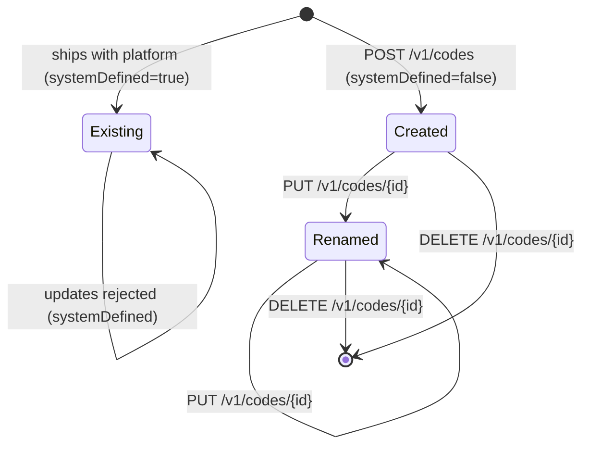

The Codes API manages the top-level `Code` rows in Apache Fineract. A Code defines a category (for example `Gender`, `LoanPurpose`, `IDType`, `AssetAccountTag`, `AddressType`) and is the parent of the individual `CodeValue` rows surfaced through dropdowns across loans, clients, and accounting.

System-defined codes ship with the platform and cannot be renamed or removed; user-defined codes can be created, renamed, and deleted. The values inside both kinds of code are editable through the [Code Values API](/api/code-values).

## Source

| Aspect | Value |
| --- | --- |
| Resource class | `org.apache.fineract.infrastructure.codes.api.CodesApiResource` |
| File | `fineract-provider/src/main/java/org/apache/fineract/infrastructure/codes/api/CodesApiResource.java` |
| JAX-RS `@Path` | `/v1/codes` |
| Swagger tag | `Codes` |
| Permission resource | `CODE` (`RESOURCE_NAME_FOR_PERMISSIONS`) |
| Read service | `CodeReadPlatformService` |
| Write pipeline | `CommandWrapperBuilder` → `PortfolioCommandSourceWritePlatformService` |
| Response DTO | `CodeData` (`id`, `name`, `systemDefined`) |
| Response parameters | `id`, `name`, `systemDefined` |
| Swagger schemas | `CodesApiResourceSwagger.{GetCodesResponse,PostCodesRequest,PostCodesResponse,PutCodesRequest,PutCodesResponse}` |

## Endpoints

| Method | Path | Description | Command / read handler | Permission |
| --- | --- | --- | --- | --- |
| `GET` | `/v1/codes` | List all codes. | `CodeReadPlatformService.retrieveAllCodes()` | `READ_CODE` |
| `GET` | `/v1/codes/{codeId}` | Retrieve a single code by id. | `CodeReadPlatformService.retrieveCode(codeId)` | Authenticated |
| `GET` | `/v1/codes/name/{codeName}` | Retrieve a code by name. | `CodeReadPlatformService.retrieveCode(codeName)` | Authenticated |
| `POST` | `/v1/codes` | Create a user-defined code. `systemDefined` is forced to `false`. | `CommandWrapperBuilder.createCode()` → handler logs `CREATE_CODE` | `CREATE_CODE` |
| `PUT` | `/v1/codes/{codeId}` | Update a non-system-defined code. | `updateCode(codeId)` → `UPDATE_CODE` | `UPDATE_CODE` |
| `DELETE` | `/v1/codes/{codeId}` | Delete a non-system-defined code. | `deleteCode(codeId)` → `DELETE_CODE` | `DELETE_CODE` |

Only the `GET /v1/codes` (list) endpoint goes through `validateHasReadPermission("CODE")`. The single-code reads rely on authentication only because they are used by downstream APIs (charges, clients) that fan out per-form lookups; the write endpoints all flow through the maker-checker pipeline.

## Request body — create / update

```json
{
  "name": "LoanPurpose"
}
```

The update endpoint accepts the same shape; system-defined codes are rejected at the command-handler level with `PlatformDataIntegrityException` (`error.msg.code.systemdefined`).

## Response — list

```json
[
  { "id": 1,  "name": "Gender",          "systemDefined": true },
  { "id": 14, "name": "LoanPurpose",     "systemDefined": false },
  { "id": 22, "name": "AssetAccountTag", "systemDefined": true }
]
```

## Response — single

```json
{ "id": 14, "name": "LoanPurpose", "systemDefined": false }
```

## Response — write

The standard command-processing envelope:

```json
{
  "resourceId": 14,
  "changes": { "name": "LoanPurpose" }
}
```

For `DELETE`, `changes` is empty.

## Source — list handler

```java
@GET
@Operation(summary = "Retrieve Codes")
public String retrieveCodes(@Context final UriInfo uriInfo) {
    context.authenticatedUser().validateHasReadPermission(RESOURCE_NAME_FOR_PERMISSIONS);
    final Collection<CodeData> codes = readPlatformService.retrieveAllCodes();
    final ApiRequestJsonSerializationSettings settings =
        apiRequestParameterHelper.process(uriInfo.getQueryParameters());
    return toApiJsonSerializer.serialize(settings, codes, RESPONSE_DATA_PARAMETERS);
}
```

## Source — create handler

```java
@POST
@Operation(summary = "Create a Code",
    description = "Codes created through api are always 'user defined' and so system defined is marked as false.")
public String createCode(final String apiRequestBodyAsJson) {
    final CommandWrapper commandRequest =
        new CommandWrapperBuilder().createCode().withJson(apiRequestBodyAsJson).build();
    final CommandProcessingResult result =
        commandsSourceWritePlatformService.logCommandSource(commandRequest);
    return toApiJsonSerializer.serialize(result);
}
```

## Lifecycle



## Canonical curl

```bash
# List codes
curl -k -u mifos:password \
  -H "Fineract-Platform-TenantId: default" \
  https://localhost:8443/fineract-provider/api/v1/codes

# Resolve by name
curl -k -u mifos:password \
  -H "Fineract-Platform-TenantId: default" \
  https://localhost:8443/fineract-provider/api/v1/codes/name/LoanPurpose

# Create a user-defined code
curl -k -u mifos:password \
  -H "Fineract-Platform-TenantId: default" \
  -H "Content-Type: application/json" \
  -X POST https://localhost:8443/fineract-provider/api/v1/codes \
  -d '{ "name": "CallReason" }'

# Rename it
curl -k -u mifos:password \
  -H "Fineract-Platform-TenantId: default" \
  -H "Content-Type: application/json" \
  -X PUT https://localhost:8443/fineract-provider/api/v1/codes/27 \
  -d '{ "name": "ContactReason" }'

# Delete it (must not be system-defined and must have no live values referenced from m_code_value rows in use)
curl -k -u mifos:password \
  -H "Fineract-Platform-TenantId: default" \
  -X DELETE https://localhost:8443/fineract-provider/api/v1/codes/27
```

## Code-value sub-resource

Codes are paired with `CodeValuesApiResource` mounted under the same `/v1/codes` path. The code-values endpoints — `/v1/codes/{codeId}/codevalues`, `/v1/codes/name/{codeName}/codevalues`, and their per-id variants — are documented in [/api/code-values](/api/code-values).

The `name/{codeName}` family is preferred when the caller does not want to embed numeric ids in client code, since system-defined ids vary slightly across distributions but the canonical names do not.

## Common system-defined codes

| Code name | Used by |
| --- | --- |
| `Gender` | Client demographics. |
| `CustomerIdentifier` | Client KYC. |
| `LoanPurpose` | Loan applications. |
| `AssetAccountTag`, `LiabilityAccountTag`, `EquityAccountTag`, `IncomeAccountTag`, `ExpensesAccountTag` | Accounting rule tagging on GL accounts. |
| `LoanCollateral` | Legacy collateral types (see [/api/collaterals](/api/collaterals)). |
| `ADDRESS_TYPE`, `STATE`, `COUNTRY` | Client addresses. |
| `YesNo` | Generic binary picker used by some datatables and surveys. |

These ship as `systemDefined=true` and can be enumerated by issuing `GET /v1/codes` and filtering on `systemDefined`.

## Error responses

| HTTP | When |
| --- | --- |
| `400 Bad Request` | `name` missing or longer than the database column allows. |
| `403 Forbidden` | Missing the matching permission (`CREATE_CODE`, etc.). |
| `404 Not Found` | `codeId` or `codeName` does not exist. |
| `409 Conflict` | Attempt to update or delete a system-defined code, or to create a duplicate `name`. |

## Related subsystems

- Subsystem overview: [/infrastructure/codes-and-code-values](/core/codes)
- Per-code values CRUD: [/api/code-values](/api/code-values)
- Accounting-tag consumers: [/api/accounting-rules](/api/accounting-rules), [/api/gl-accounts](/api/gl-accounts)
- KYC consumers: [/api/client-identifiers](/api/client-identifiers), [/api/client-address](/api/client-address)
- API conventions and envelope: [/api/conventions](/api/conventions)
