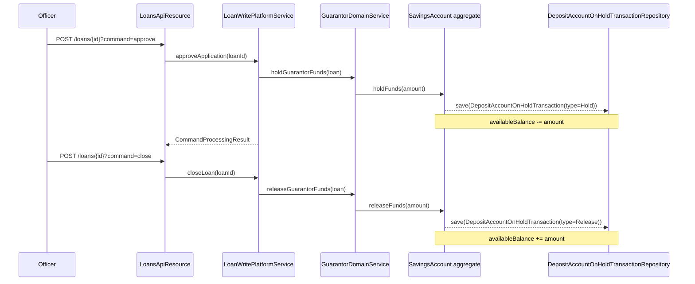

The Deposit Account On-Hold Fund Transactions API is a read-only Apache Fineract endpoint that lists the *hold* and *release* transactions applied to a savings account on behalf of a loan guarantee. When a savings account is used as collateral via a `GuarantorFundingDetails`, the corresponding amount is held (made unavailable) on the savings account and tracked through `DepositAccountOnHoldTransaction` rows that this endpoint surfaces.

## Source

| Aspect | Value |
| --- | --- |
| Resource class | `org.apache.fineract.portfolio.savings.api.DepositAccountOnHoldFundTransactionsApiResource` |
| File | `fineract-provider/src/main/java/org/apache/fineract/portfolio/savings/api/DepositAccountOnHoldFundTransactionsApiResource.java` |
| JAX-RS `@Path` | `/v1/savingsaccounts/{savingsId}/onholdtransactions` |
| Swagger tag | `Deposit Account On Hold Fund Transactions` |
| Permission resource | `SavingsApiConstants.SAVINGS_ACCOUNT_RESOURCE_NAME` = `SAVINGSACCOUNT` |
| Read service | `DepositAccountOnHoldTransactionReadPlatformService` |

The constructor injects `PlatformSecurityContext`, `DefaultToApiJsonSerializer<DepositAccountOnHoldTransactionData>`, `ApiRequestParameterHelper`, `DepositAccountOnHoldTransactionReadPlatformService` and `SqlValidator`.

## Endpoint

| Method | Path | Operation id | Handler | Permission |
| --- | --- | --- | --- | --- |
| `GET` | `/v1/savingsaccounts/{savingsId}/onholdtransactions` | `retrieveAllDepositAccountOnHoldFundTransactions` | `DepositAccountOnHoldTransactionReadPlatformService.retriveAll(savingsId, guarantorFundingId, searchParameters)` | `READ_SAVINGSACCOUNT` |

### Query parameters

- `guarantorFundingId` — optional. When supplied, returns only the on-hold transactions associated with that funding entry.
- `offset`, `limit` — pagination.
- `orderBy`, `sortOrder` — sort by any whitelisted column (validated by `SqlValidator`).

The whitelisted response data set is `SavingsApiSetConstants.SAVINGS_ACCOUNT_ON_HOLD_RESPONSE_DATA_PARAMETERS`.

## Response shape

The handler returns a `Page<DepositAccountOnHoldTransactionData>`:

```json
{
  "totalFilteredRecords": 12,
  "pageItems": [
    {
      "id": 555,
      "transactionType": { "id": 1, "code": "depositAccountOnHoldTransactionType.hold", "value": "Hold" },
      "transactionDate": "2026-03-15",
      "amount": 500.00,
      "reversed": false,
      "currency": { "code": "USD" },
      "isFullPayment": false
    },
    {
      "id": 556,
      "transactionType": { "id": 2, "code": "depositAccountOnHoldTransactionType.release", "value": "Release" },
      "transactionDate": "2026-09-30",
      "amount": 500.00,
      "reversed": false,
      "currency": { "code": "USD" },
      "isFullPayment": true
    }
  ]
}
```

Transaction types are constants from `DepositAccountOnHoldTransactionType`:

- `1 — Hold` — a hold was placed to back a guarantee or court order.
- `2 — Release` — a previous hold was released (guarantee freed up).

## Behaviour notes

- This endpoint is read-only. New holds and releases are produced as side-effects of loan-state transitions (`POST /v1/loans/{loanId}?command=approve|disburse|undodisbursal|close|writeoff|recoverGuarantees`) and through the regular [Savings Transactions](/api/savings-account-transactions) `holdAmount` / `releaseAmount` flow.
- For court-order or external-claim holds (not tied to a loan guarantee), `guarantorFundingId` is null and the originating transaction comes from `SavingsAccountTransactionsApiResource.holdAmount`.

## Permissions

The handler invokes `context.authenticatedUser().validateHasReadPermission("SAVINGSACCOUNT")`. There are no write endpoints on this resource.

## How holds are originated



## Pagination envelope

`Page<DepositAccountOnHoldTransactionData>` follows the standard Fineract pagination envelope:

| Field | Description |
| --- | --- |
| `totalFilteredRecords` | Number of rows matching `guarantorFundingId` filter. |
| `pageItems` | Page slice ordered by `transactionDate desc` by default. |

## Sample curl

```bash
curl -k -u mifos:password \
  -H "Fineract-Platform-TenantId: default" \
  "https://localhost:8443/fineract-provider/api/v1/savingsaccounts/88/onholdtransactions?limit=20&offset=0"
```

Restrict to a particular guarantor funding entry:

```bash
curl -k -u mifos:password \
  -H "Fineract-Platform-TenantId: default" \
  "https://localhost:8443/fineract-provider/api/v1/savingsaccounts/88/onholdtransactions?guarantorFundingId=14"
```

## Reversal semantics

Reversal of an on-hold transaction is not a user action exposed via this resource. The `reversed` boolean on each row flips automatically when the originating loan command is undone (e.g. `?command=undodisbursal` flips the underlying `Hold` row to `reversed=true` and recomputes `availableBalance`). Reversed rows are still returned by the listing endpoint to preserve the audit trail.

## When holds are released

The platform releases an on-hold automatically in the following situations:

1. **Loan closure** — `POST /v1/loans/{id}?command=close` or `closeAsRescheduled` walks every `GuarantorFundingDetails` row attached to the loan and releases the hold.
2. **Loan write-off recovery** — `?command=recoverGuarantees` releases holds and re-applies the freed amount against the outstanding write-off.
3. **Guarantor removal** — `DELETE /v1/loans/{loanId}/guarantors/{guarantorId}` only succeeds on a loan that has not yet been disbursed; otherwise the hold must be released through one of the above commands.
4. **Manual `releaseAmount`** — for holds not tied to a guarantor (court-order style), the originating account-level transaction can be released via `POST /v1/savingsaccounts/{id}/transactions/{txnId}?command=releaseAmount`.

## Available balance vs running balance

| Concept | Where | Affected by hold |
| --- | --- | --- |
| `runningBalance` on `SavingsAccount` | actual posted balance | No — holds do not debit |
| `availableBalance` on `SavingsAccount` | what the client can withdraw | Yes — holds reduce |
| Bank statement (`SavingsAccountTransactionsApi`) | full transaction list | Holds appear as `withdrawal-hold` rows |
| On-hold listing (this API) | guarantor-driven holds | Only on-hold/release rows |

Clients should reconcile by reading both `availableBalance` (from `GET /v1/savingsaccounts/{id}`) and this listing to attribute each hold to its source loan.

## Common pitfalls

- **`guarantorFundingId` filter** narrows the result to holds tied to a single loan funding entry. Manual court-order holds set `guarantorFundingId=null` and are surfaced only when the filter is omitted.
- **Hold rows are immutable** through this API — there is no PUT/POST/DELETE. To unwind a hold, drive the originating loan command (e.g. `?command=close`) or the savings `?command=releaseAmount`.
- **Reversed rows still influence `availableBalance` history** but not the present-time value. The platform recomputes available balance from the active (non-reversed) rows on every read.

## Pagination defaults

When `offset` / `limit` are omitted, the read service falls back to the global default page size configured by `PaginationParameters`. Defaults are tuned to 200 rows; large guarantor portfolios should always set an explicit `limit`.

## Related pages

- [/savings/deposit-account-on-hold-funds](/savings/deposit-account-on-hold-funds) — domain model walk-through of `DepositAccountOnHoldTransaction`.
- [/api/savings-account-transactions](/api/savings-account-transactions) — `holdAmount` / `releaseAmount` user-facing transactions.
- [/api/guarantors](/api/guarantors) — guarantor funding entries that trigger holds.
- [/api/loans](/api/loans) — loan lifecycle commands that drive guarantee-related holds.
- [/api/conventions](/api/conventions) — pagination, envelope, locale and error model.
