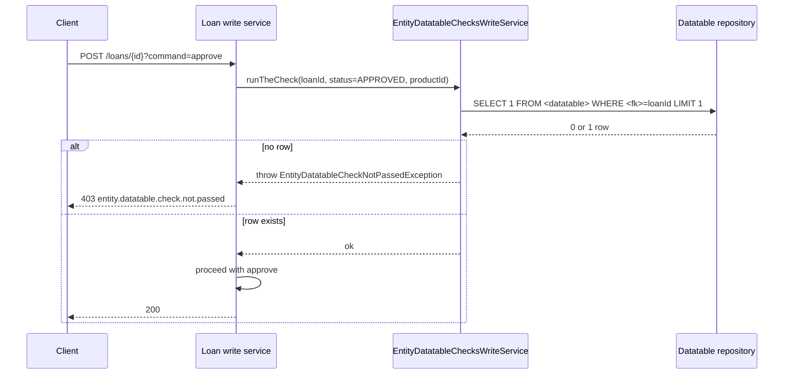

Entity Datatable Checks are Apache Fineract's hook for **forcing custom data capture** before a lifecycle transition. A check binds a [datatable](/api/datatables) to a core entity (`m_client`, `m_loan`, `m_savings_account`, …) and a status (e.g. *activate*, *approve*, *disburse*). When the user attempts that transition, the command handler refuses unless a matching datatable row exists for the entity. Optionally a check can be narrowed to a specific product.

## Source

- **File**: `fineract-provider/src/main/java/org/apache/fineract/infrastructure/dataqueries/api/EntityDatatableChecksApiResource.java`
- **Base path**: `@Path("/v1/entityDatatableChecks")`
- **Permission entity**: `ENTITY_DATATABLE_CHECK`
- **Tag**: `Entity Data Table`

Reads go through `EntityDatatableChecksReadService`; writes are command-sourced via `PortfolioCommandSourceWritePlatformService`. The enforcement itself happens in the lifecycle command handlers (loan write service, savings write service, client write service) which consult `m_entity_datatable_check` at the right state transitions.

## Endpoints

| Method | Path | Description | Command handler | Permission |
| ------ | ---- | ----------- | --------------- | ---------- |
| GET | `/v1/entityDatatableChecks` | Paged list, optional filters | `EntityDatatableChecksReadService.retrieveAll` | `READ_ENTITY_DATATABLE_CHECK` |
| GET | `/v1/entityDatatableChecks/template` | Allowed entities, statuses, product list and datatables | `retrieveTemplate` | `READ_ENTITY_DATATABLE_CHECK` |
| POST | `/v1/entityDatatableChecks` | Create a new check | `CommandWrapperBuilder.createEntityDatatableChecks` → action `CREATE`, entity `ENTITY_DATATABLE_CHECK` | `CREATE_ENTITY_DATATABLE_CHECK` |
| DELETE | `/v1/entityDatatableChecks/{entityDatatableCheckId}` | Remove a check | `CommandWrapperBuilder.deleteEntityDatatableChecks` → action `DELETE` | `DELETE_ENTITY_DATATABLE_CHECK` |

There is no `PUT` — checks are immutable. To change a check, delete and re-create it.

## Query parameters — list

| Parameter | Description |
| --------- | ----------- |
| `status` | Integer status code to filter on (see status table below) |
| `entity` | Entity name (`m_client`, `m_loan`, `m_savings_account`, `m_group`) |
| `productId` | Restrict to a single loan/savings product |
| `offset`, `limit` | Pagination (default limit 200; `0` or negative disables paging) |

## Status codes

The `status` field maps to lifecycle events. The exact set surfaces in the `/template` payload; the common values are:

| status | Entity | Trigger |
| ------ | ------ | ------- |
| 100 | `m_client` | Activate |
| 200 | `m_group` | Activate |
| 300 | `m_loan` | Create |
| 400 | `m_loan` | Approve |
| 500 | `m_loan` | Disburse |
| 600 | `m_loan` | Write off |
| 700 | `m_savings_account` | Create |
| 800 | `m_savings_account` | Approve |
| 900 | `m_savings_account` | Activate |
| 1000 | `m_savings_account` | Close |

The authoritative list lives in `EntityTables` / `StatusEnum` in the source.

## Examples

### Discover available options

`GET /v1/entityDatatableChecks/template`

```json
{
  "entities": ["m_client", "m_group", "m_loan", "m_savings_account"],
  "statusClient": [{"id": 100, "code": "clientStatusType.active", "value": "Active"}],
  "statusLoans": [
    {"id": 300, "code": "loanStatusType.create", "value": "Create"},
    {"id": 400, "code": "loanStatusType.approve", "value": "Approve"}
  ],
  "datatables": [
    { "registeredTableName": "Client KYC Extra", "applicationTableName": "m_client" }
  ],
  "loanProductDatas": [ { "id": 1, "name": "Group Loan" } ],
  "savingsProductDatas": []
}
```

### Force KYC capture before client activation

`POST /v1/entityDatatableChecks`

```json
{
  "entity": "m_client",
  "status": 100,
  "datatableName": "Client KYC Extra"
}
```

Response:

```json
{ "resourceId": 9, "commandId": null, "changes": {} }
```

After this is created, calling `POST /v1/clients/{id}?command=activate` for a client lacking a `Client KYC Extra` row returns:

```json
{
  "developerMessage": "Application table check failed for entity m_client and datatable Client KYC Extra",
  "userMessageGlobalisationCode": "error.msg.entity.datatable.check.column.missing.data"
}
```

### Restrict a check to one product

`POST /v1/entityDatatableChecks`

```json
{
  "entity": "m_loan",
  "status": 500,
  "datatableName": "Loan Risk Memo",
  "productId": 1
}
```

### Delete a check

`DELETE /v1/entityDatatableChecks/9` → `{ "resourceId": 9 }`

## Subsystem cross-links

- **[Datatables](/api/datatables)** — the `datatableName` column referenced here.
- **[Surveys](/api/surveys)** — PPI tables (category 200) are treated as a special-cased datatable for checks.
- **[Reports](/api/reports)** — reporting often surfaces compliance with these checks.

## Notes

- A check only fires for the specific status; e.g. an `m_loan` / status 400 check does **not** block disbursement.
- For `multiRow=true` datatables, the check is satisfied by at least one matching row.
- Checks scoped to `productId` only fire when the loan/savings account uses that product; checks without a `productId` fire for all products of the entity.


## Endpoint reference

```java
@Path("/v1/entityDatatableChecks")
public class EntityDatatableChecksApiResource {
    @GET                        public String retrieveAll(@Context UriInfo, @QueryParam status, @QueryParam entity);
    @GET  @Path("template")     public String getTemplate();
    @POST                       public String createEntityDatatableCheck(String json);
    @DELETE @Path("{id}")       public String deleteDatatableCheck(@PathParam("id") Long id);
}
```

A check binds:

- `entity` — one of `m_client`, `m_loan`, `m_savings_account`, `m_group`.
- `status` — the lifecycle status code (e.g. `100` PENDING, `200` APPROVED, `300` ACTIVE, `400` DISBURSED).
- `datatableName` — registered via [`/v1/datatables`](/api/datatables).
- `productId` *(optional)* — restrict to a single loan/savings product.

When the user attempts that state transition, the relevant write platform service (`LoanWritePlatformService`, `SavingsAccountWritePlatformService`, etc.) calls `EntityDatatableChecksWritePlatformService.runTheCheck` which loops over the configured checks and throws `EntityDatatableCheckNotPassedException` (HTTP 403) if a row is missing.

## Lifecycle of a transition with checks



## Template

`GET /entityDatatableChecks/template` returns the available `entity` codes, `status` enums per entity, the registered datatables (filtered to those that target the relevant apptable), and the loan/savings products for `productId` selection.

## Filtering checks

`GET /entityDatatableChecks?entity=m_loan&status=400` returns all checks that gate disbursement of any loan. Combined with the `productId` field on the response, this is how admin UIs render the "what blocks disbursement?" view.

## Error semantics

| Failure | HTTP | Detail |
| ------- | ---- | ------ |
| Unknown `entity` | 400 | platform validation error |
| Datatable not registered to the entity | 400 | `datatable.not.registered.to.apptable` |
| Duplicate check (same entity+status+datatable+productId) | 403 | `entity.datatable.check.duplicate` |
| Check id not found on DELETE | 404 | `entity.datatable.check.not.found` |

## Permissions

`CREATE_ENTITYDATATABLECHECK`, `READ_ENTITYDATATABLECHECK`, `DELETE_ENTITYDATATABLECHECK`. There is no UPDATE endpoint — delete and recreate.

## cURL recipes

Create a check requiring an `m_client_kyc` row before activation:

```bash
curl -u mifos:password -X POST      -H "Content-Type: application/json"      -d '{"entity":"m_client","status":300,"datatableName":"m_client_kyc"}'      "https://localhost:8443/fineract-provider/api/v1/entityDatatableChecks"
```

List all checks gating disbursement of loan product 7:

```bash
curl -u mifos:password      "https://localhost:8443/fineract-provider/api/v1/entityDatatableChecks?entity=m_loan&status=400&productId=7"
```

## Cross-links

- [Datatables](/api/datatables) — the `datatableName` column.
- [Loans](/api/loans), [Clients](/api/clients), [Savings](/api/savings-accounts), [Groups](/api/groups) — entities whose transitions are gated.
- [Reports](/api/reports) — typical surfacing of compliance vs configured checks.
