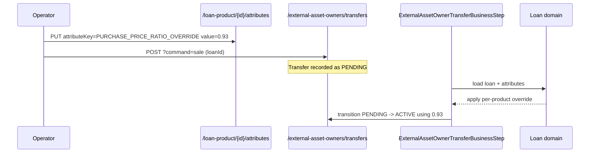

`ExternalAssetOwnerLoanProductAttributesApiResource` is the JAX-RS resource that maintains the **per-loan-product attribute overrides** used by Apache Fineract's investor subsystem. Each row in `m_external_asset_owner_loan_product_attribute` records an `(attributeKey, attributeValue)` pair against a `LoanProduct` — typically used to flag products that may not be transferred, that require a specific purchase price ratio, or that map to a downstream investor reporting bucket.

The bean is gated by `@Conditional(InvestorModuleIsEnabledCondition.class)` — like the rest of the investor module, it is only wired into the JAX-RS context when the investor module is enabled.

## Source

- **File:** `fineract-investor/src/main/java/org/apache/fineract/investor/api/ExternalAssetOwnerLoanProductAttributesApiResource.java`
- **Class path annotation:** `@Path("/v1/external-asset-owners/loan-product")`
- **OpenAPI tag:** `External Asset Owner Loan Product Attributes`
- **Spring stereotype:** `@Component`

Constructor-injected dependencies:

- `PlatformUserRightsContext platformUserRightsContext`
- `PortfolioCommandSourceWritePlatformService commandsSourceWritePlatformService`
- `ExternalAssetOwnerLoanProductAttributesReadService externalAssetOwnerLoanProductAttributesReadService`

## Endpoints

| Method | Path | Description | Command / Handler | Permission |
| ------ | ---- | ----------- | ----------------- | ---------- |
| POST | `/v1/external-asset-owners/loan-product/{loanProductId}/attributes` | Create a new attribute on a loan product. | `CommandWrapperBuilder.createExternalAssetOwnerLoanProductAttribute(loanProductId)` → `CREATE_EXTERNALASSETOWNERLOANPRODUCTATTRIBUTE` | `CREATE_EXTERNALASSETOWNERLOANPRODUCTATTRIBUTE` |
| GET | `/v1/external-asset-owners/loan-product/{loanProductId}/attributes?attributeKey=…` | List attributes for a loan product, optionally filtered by key. | `externalAssetOwnerLoanProductAttributesReadService.retrieveAllLoanProductAttributesByLoanProductId(loanProductId, attributeKey)` | Authenticated |
| PUT | `/v1/external-asset-owners/loan-product/{loanProductId}/attributes/{id}` | Update an existing attribute row. | `CommandWrapperBuilder.updateExternalAssetOwnerLoanProductAttribute(loanProductId, attributeId)` → `UPDATE_EXTERNALASSETOWNERLOANPRODUCTATTRIBUTE` | `UPDATE_EXTERNALASSETOWNERLOANPRODUCTATTRIBUTE` |

There is no `DELETE` — clearing an attribute is done by `PUT`-ing an empty value (the underlying service treats `attributeValue=null` as a logical delete) or by relying on Liquibase to clean stale rows.

## Request / response examples

### Create

`POST /v1/external-asset-owners/loan-product/22/attributes`

```json
{
  "attributeKey": "PURCHASE_PRICE_RATIO_OVERRIDE",
  "attributeValue": "0.95",
  "locale": "en"
}
```

Handler:

```java
final CommandWrapperBuilder builder = new CommandWrapperBuilder().withJson(apiRequestBodyAsJson);
CommandWrapper request = builder.createExternalAssetOwnerLoanProductAttribute(loanProductId).build();
return commandsSourceWritePlatformService.logCommandSource(request);
```

Response (`CommandProcessingResult`):

```json
{
  "resourceId": 7,
  "changes": {}
}
```

### List

`GET /v1/external-asset-owners/loan-product/22/attributes?attributeKey=PURCHASE_PRICE_RATIO_OVERRIDE`

```json
{
  "totalFilteredRecords": 1,
  "pageItems": [
    {
      "id": 7,
      "loanProductId": 22,
      "attributeKey": "PURCHASE_PRICE_RATIO_OVERRIDE",
      "attributeValue": "0.95"
    }
  ]
}
```

The result is a paged response (Fineract `Page<ExternalTransferLoanProductAttributesData>`). `attributeKey=` is optional; if omitted, every attribute row for the product is returned.

### Update

`PUT /v1/external-asset-owners/loan-product/22/attributes/7`

```json
{
  "attributeValue": "0.93"
}
```

Response:

```json
{
  "resourceId": 7,
  "changes": { "attributeValue": "0.93" }
}
```

## Data carriers

- **Requests:** raw JSON string — the resource passes the body straight into the command wrapper. Swagger declares:
  - `ExternalAssetOwnerLoanProductAttributesApiResourceSwagger.PostExternalAssetOwnerLoanProductAttributeRequest`
  - `ExternalAssetOwnerLoanProductAttributesApiResourceSwagger.PutExternalAssetOwnerLoanProductAttributeRequest`
- **Read response:** `Page<ExternalTransferLoanProductAttributesData>` — `{id, loanProductId, attributeKey, attributeValue}`.
- **Write response:** `CommandProcessingResult` envelope.

## Permissions

The resource calls `platformUserRightsContext.isAuthenticated()` before each operation. Authorization is enforced inside `PortfolioCommandSourceWritePlatformService` against `CREATE_EXTERNALASSETOWNERLOANPRODUCTATTRIBUTE` and `UPDATE_EXTERNALASSETOWNERLOANPRODUCTATTRIBUTE`.

## Consumed by

The attributes are read during a sale/buyback via the COB step `ExternalAssetOwnerTransferBusinessStep` and during the `LoanReadService` projection used by [external-asset-owners](/api/external-asset-owners). They override product-level defaults for a specific transfer (typically the `PURCHASE_PRICE_RATIO_OVERRIDE` key) without forcing a full loan-product change.

## Cross-links

- [External asset owners API](/api/external-asset-owners) — consumer of these attributes.
- [Loan products](/loan/loan-product-api) — owner of the `loanProductId` referenced.
- [Investor module overview](/investor/external-asset-owner-domain)


## Endpoint reference

| Method | Path | Description | Command |
| ------ | ---- | ----------- | ------- |
| POST   | `/v1/external-asset-owners/loan-product/{loanProductId}/attributes` | Create an attribute row for the loan product | `CREATE_EXTERNALASSETOWNERLOANPRODUCTATTRIBUTE` |
| GET    | `/v1/external-asset-owners/loan-product/{loanProductId}/attributes` | List attributes; filter by `attributeKey` query param | (read) |
| PUT    | `/v1/external-asset-owners/loan-product/{loanProductId}/attributes/{id}` | Update an existing attribute row | `UPDATE_EXTERNALASSETOWNERLOANPRODUCTATTRIBUTE` |

Mutating endpoints route through `PortfolioCommandSourceWritePlatformService.logCommandSource`, so a `commandId` is returned when the entity is registered for maker–checker. The handler always calls `platformUserRightsContext.isAuthenticated()` before forwarding.

## Effect on transfers



Attributes are resolved *at the time of the COB step*, not at the time the transfer is initiated. Updating an attribute after the POST but before the COB run therefore changes the effective ratio applied at sale.

## Field semantics

- **`loanProductId`** — path segment; mandatory. Must reference a row in `m_product_loan`.
- **`attributeKey`** — currently the platform recognises `PURCHASE_PRICE_RATIO_OVERRIDE`. Unknown keys are stored but ignored by the COB consumer.
- **`attributeValue`** — opaque string. For ratio keys, the COB step parses it as a `BigDecimal`.

## Pagination & filtering

`GET` uses Spring's `Pageable` (`page`, `size`, `sort`). The optional `attributeKey` query parameter narrows the result to a single key — useful for the UI to render the "current override" field for a given product.

## Error semantics

| Failure | HTTP | Detail |
| ------- | ---- | ------ |
| Loan product not found | 404 | `loan.product.not.found` |
| Attribute id not found (PUT) | 404 | `external.asset.owner.loan.product.attribute.not.found` |
| Duplicate `attributeKey` for product on POST | 403 | platform validation error |
| Maker–checker pending | 200 | response carries `commandId`, mutation not applied |

## Cross-links

- [External asset owners](/api/external-asset-owners) — primary consumer of these attributes.
- [Loan products](/loan/loan-product-api) — the product whose attributes are overridden.
- [COB investor steps](/cob/investor-cob-steps) — where the override is applied.

## cURL recipes

Create an override:

```bash
curl -u mifos:password \
     -H "Fineract-Platform-TenantId: default" \
     -H "Content-Type: application/json" \
     -d '{"attributeKey":"PURCHASE_PRICE_RATIO_OVERRIDE","attributeValue":"0.93"}' \
     "https://localhost:8443/fineract-provider/api/v1/external-asset-owners/loan-product/42/attributes"
```

List overrides for a product:

```bash
curl -u mifos:password \
     -H "Fineract-Platform-TenantId: default" \
     "https://localhost:8443/fineract-provider/api/v1/external-asset-owners/loan-product/42/attributes?attributeKey=PURCHASE_PRICE_RATIO_OVERRIDE"
```

Update the value:

```bash
curl -u mifos:password \
     -X PUT \
     -H "Fineract-Platform-TenantId: default" \
     -H "Content-Type: application/json" \
     -d '{"attributeValue":"0.95"}' \
     "https://localhost:8443/fineract-provider/api/v1/external-asset-owners/loan-product/42/attributes/7"
```
