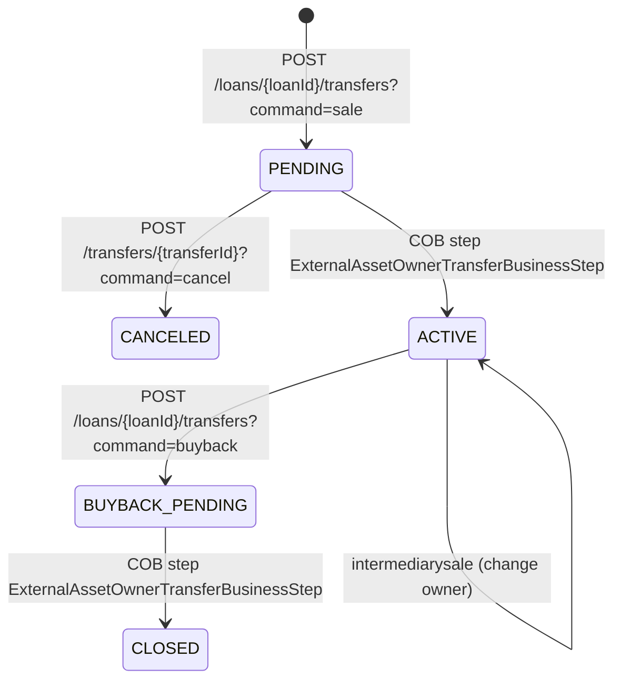

`ExternalAssetOwnersApiResource` is the JAX-RS resource that drives Apache Fineract's **loan-to-investor** subsystem. The investor module (gated by `InvestorModuleIsEnabledCondition`) lets the platform record that a loan asset has been sold to an external investor — partially or wholly — and tracks the cash and accounting entries that flow as a result. The four transfer commands (`sale`, `intermediarysale`, `buyback`, `cancel`) plus owner CRUD are all routed through this resource.

Loan product attributes (per-product mappings such as "do not transfer when status=…") have their own resource — see [external-asset-owner-loan-product-attributes](/api/external-asset-owner-loan-product-attributes).

## Source

- **File:** `fineract-investor/src/main/java/org/apache/fineract/investor/api/ExternalAssetOwnersApiResource.java`
- **Class path annotation:** `@Path("/v1/external-asset-owners")`
- **OpenAPI tag:** `External Asset Owners`
- **Spring stereotype:** `@Component`
- **Conditional:** `@Conditional(InvestorModuleIsEnabledCondition.class)` — the bean is only registered when the investor module is enabled.

Constructor-injected dependencies:

- `PlatformUserRightsContext platformUserRightsContext`
- `ExternalAssetOwnersReadService externalAssetOwnersReadService`
- `DefaultToApiJsonSerializer<String> postApiJsonSerializerService`
- `PortfolioCommandSourceWritePlatformService commandsSourceWritePlatformService`
- `LoanReadPlatformServiceCommon loanReadPlatformService`
- `ExternalAssetOwnersSearchApiDelegate delegate`

A static `CommandHandlerRegistry` maps the `command` query parameter to the right `CommandWrapperBuilder` call:

```java
Map.of(
  CANCEL_COMMAND_VALUE,            (id, json) -> ...cancelTransactionByIdToExternalAssetOwner(id).build(),
  INTERMEDIARY_SALE_COMMAND_VALUE, (id, json) -> ...withJson(json).intermediarySaleLoanToExternalAssetOwner(id).build(),
  SALE_COMMAND_VALUE,              (id, json) -> ...withJson(json).saleLoanToExternalAssetOwner(id).build(),
  BUY_BACK_COMMAND_VALUE,          (id, json) -> ...withJson(json).buybackLoanToExternalAssetOwner(id).build(),
  CREATE_COMMAND_VALUE,            (id, json) -> ...withJson(json).createExternalAssetOwner().build());
```

## Endpoints

| Method | Path | Description | Command / Handler | Permission |
| ------ | ---- | ----------- | ----------------- | ---------- |
| POST | `/v1/external-asset-owners/transfers/loans/{loanId}?command=sale\|intermediarysale\|buyback\|cancel` | Initiate a transfer keyed on internal loan id. | Routed via `COMMAND_HANDLER_REGISTRY` → `SALE_LOAN_TO_EXTERNAL_ASSET_OWNER` / `INTERMEDIARY_SALE_…` / `BUYBACK_…` / `CANCEL_…` | Mapped per command (`TRANSFER_*`) |
| POST | `/v1/external-asset-owners/transfers/loans/external-id/{loanExternalId}?command=…` | Same as above, keyed by loan external id. | Resolves loan via `LoanReadPlatformServiceCommon.getLoanIdByLoanExternalId` then dispatches. | Mapped per command |
| POST | `/v1/external-asset-owners/transfers/{id}?command=cancel` | Mutate an existing transfer by id (currently `cancel`). | `cancelTransactionByIdToExternalAssetOwner(id)` | `CANCEL_TRANSFER` |
| POST | `/v1/external-asset-owners/transfers/external-id/{externalId}?command=cancel` | Same, keyed by transfer external id. | Resolves via `retrieveLastTransferIdByExternalId`. | `CANCEL_TRANSFER` |
| GET | `/v1/external-asset-owners/transfers?transferExternalId=&loanId=&loanExternalId=&offset=&limit=` | List transfers, optionally filtered. | `externalAssetOwnersReadService.retrieveTransferData(...)` | Authenticated |
| GET | `/v1/external-asset-owners/transfers/active-transfer?transferExternalId=&loanId=&loanExternalId=` | Retrieve the currently active transfer for a loan. | `externalAssetOwnersReadService.retrieveActiveTransferData(...)` | Authenticated |
| GET | `/v1/external-asset-owners/transfers/{transferId}/journal-entries?offset=&limit=` | Journal entries posted for a transfer. | `externalAssetOwnersReadService.retrieveJournalEntriesOfTransfer(...)` | Authenticated |
| GET | `/v1/external-asset-owners/owners/external-id/{ownerExternalId}/journal-entries?offset=&limit=` | Journal entries for all transfers of an owner. | `externalAssetOwnersReadService.retrieveJournalEntriesOfOwner(...)` | Authenticated |
| POST | `/v1/external-asset-owners/search` | Paged search by text and date ranges (settlement / effective). | `delegate.searchInvestorData(request)` | Authenticated |
| POST | `/v1/external-asset-owners` | Create a new external asset owner using an external id payload. | `createExternalAssetOwner()` → `CREATE_EXTERNALASSETOWNER` | `CREATE_EXTERNALASSETOWNER` |
| GET | `/v1/external-asset-owners` | List all external asset owners. | `externalAssetOwnersReadService.retrieveAllExternalOwners()` | Authenticated |

All handlers begin with `platformUserRightsContext.isAuthenticated()` to assert a logged-in caller.

## Request / response examples

### Create an owner

`POST /v1/external-asset-owners`

```json
{
  "externalId": "INV-2025-001",
  "name": "Crescent Credit Fund I"
}
```

```json
{
  "resourceId": 1,
  "resourceExternalId": "INV-2025-001"
}
```

### Sale of a loan to an investor

`POST /v1/external-asset-owners/transfers/loans/101?command=sale`

```json
{
  "ownerExternalId": "INV-2025-001",
  "transferExternalId": "TX-INV-1",
  "purchasePriceRatio": "0.97",
  "settlementDate": "01 May 2025",
  "locale": "en",
  "dateFormat": "dd MMMM yyyy"
}
```

Returns a `CommandProcessingResult` (Swagger: `PostInitiateTransferResponse`):

```json
{
  "loanId": 101,
  "resourceId": 999,
  "resourceExternalId": "TX-INV-1",
  "changes": {}
}
```

Behind the scenes the command flips the transfer status to `PENDING` and queues the actual journal posting to the Loan COB step (`ExternalAssetOwnerTransferBusinessStep`).

### Buy back

`POST /v1/external-asset-owners/transfers/loans/101?command=buyback`

Same JSON shape as `sale` — the buy-back command flips the transfer status back and posts reversal journal entries on the next COB tick.

### Cancel a pending transfer

`POST /v1/external-asset-owners/transfers/999?command=cancel`

No body required. Permitted only while the transfer is `PENDING`.

### List transfers

`GET /v1/external-asset-owners/transfers?loanId=101&offset=0&limit=10`

Returns a Spring `Page<ExternalTransferData>`:

```json
{
  "content": [
    {
      "transferId": 999,
      "transferExternalId": "TX-INV-1",
      "loanId": 101,
      "ownerExternalId": "INV-2025-001",
      "purchasePriceRatio": 0.97,
      "status": "ACTIVE",
      "settlementDate": [2025, 5, 1],
      "effectiveDateFrom": [2025, 5, 1]
    }
  ],
  "totalElements": 1,
  "totalPages": 1
}
```

### Search

`POST /v1/external-asset-owners/search`

```json
{
  "request": {
    "text": "INV-2025",
    "settlementDateFrom": "01 April 2025",
    "settlementDateTo":   "30 June 2025"
  },
  "page": 0,
  "size": 50
}
```

## Data carriers

- **Request:** `ExternalAssetOwnerRequest` (transfer initiation) — plus opaque JSON for `POST /v1/external-asset-owners` (deserialized by `ExternalAssetOwnerJsonDeserializer`).
- **Read responses:** `ExternalTransferData`, `ExternalTransferOwnerData`, `ExternalOwnerJournalEntryData`, `ExternalOwnerTransferJournalEntryData`.
- **Write response:** `CommandProcessingResult` envelopes. Swagger types live in `ExternalAssetOwnersApiResourceSwagger` (`PostInitiateTransferResponse`, `PostExternalAssetOwnerRequest`, `PostExternalAssetOwnerResponse`).

## Permissions

The resource itself only checks authentication. Authorization is enforced per command inside `PortfolioCommandSourceWritePlatformService` against permissions of the shape `CREATE_EXTERNALASSETOWNER`, `SALE_LOAN_TO_EXTERNAL_ASSET_OWNER`, `INTERMEDIARY_SALE_LOAN_TO_EXTERNAL_ASSET_OWNER`, `BUYBACK_LOAN_TO_EXTERNAL_ASSET_OWNER`, `CANCEL_TRANSFER`.

The `?command=` query parameter is required on every transfer endpoint — supplying an unknown value throws `UnrecognizedQueryParamException` (HTTP 400).

## Cross-links

- [External asset owner loan product attributes](/api/external-asset-owner-loan-product-attributes) — per-product overrides applied during transfer.
- [Investor subsystem overview](/investor/external-asset-owner-domain)
- [COB step: external asset owner transfer](/cob/investor-cob-steps)
- [Loans API](/loan/loan-rest-handlers)


## Maker–checker behaviour

Every command this resource dispatches goes through `PortfolioCommandSourceWritePlatformService.logCommandSource`. When the `EXTERNALASSETOWNER` (or specific transfer command) entity is registered for approval in `m_permission` with `can_maker_checker=1`, the call returns immediately with a `commandId` and **no resource side-effect**; an approver must then call `POST /v1/makercheckers/{commandId}?command=approve` to actually trigger the sale/buyback/cancel.

## Lifecycle of a transfer



The COB-step transition (PENDING → ACTIVE, BUYBACK_PENDING → CLOSED) does not happen on the HTTP call — it happens at the next close-of-business run for the loan. Clients orchestrating around the transfer lifecycle should poll `GET /v1/external-asset-owners/transfers?loanId=…` or subscribe to the `LoanOwnershipTransferBusinessEvent` external event.

## Error semantics

| Failure | HTTP | Body |
| ------- | ---- | ---- |
| Unknown `?command=` value | 400 | `UnrecognizedQueryParamException` payload with the allowed values |
| Loan does not exist | 404 | `loan.not.found` |
| Owner does not exist (transfer endpoints) | 404 | `external.asset.owner.not.found` |
| Transfer already cancelled | 403 | `external.asset.transfer.already.cancelled` |
| Sale price ratio out of range | 400 | platform validation error |
| Loan ineligible (status, charges, product attribute override) | 403 | `external.asset.transfer.loan.not.eligible` |

## Operational notes

- Sales are evaluated against the loan-product attributes resolved at the time of the COB step, not at the time of the POST. Update `purchasePriceRatio` overrides via [external-asset-owner-loan-product-attributes](/api/external-asset-owner-loan-product-attributes) before approving the command.
- The journal endpoint paginates by `Pageable`; pass `?page=0&size=50` and check `totalPages` to iterate.
- The search endpoint accepts free text in `request.text`; the matcher is the standard search-builder used by [client-search-v2](/api/client-search-v2).

## cURL recipe

```bash
curl -u mifos:password \
     -H "Fineract-Platform-TenantId: default" \
     -H "Content-Type: application/json" \
     -d '{"transferExternalId":"TX-INV-1","ownerExternalId":"INV-2025-001","purchasePriceRatio":"0.97","settlementDate":"01 May 2025","dateFormat":"dd MMMM yyyy","locale":"en"}' \
     "https://localhost:8443/fineract-provider/api/v1/loans/101/transfers?command=sale"
```
