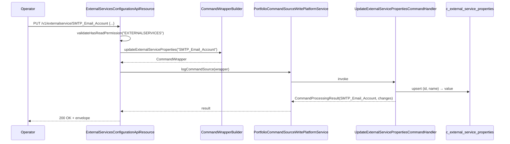

The External Services Configuration API stores per-service name/value bags that Apache Fineract uses to talk to third-party systems — Amazon S3 (document storage), SMTP (email delivery), SMS gateways, and push-notification providers. The resource class is named `ExternalServicesConfigurationApiResource`. Each service exposes a fixed set of property keys defined in `ExternalServicesConstants`, and the values are persisted in the `c_external_service_properties` table joined to `c_external_service` on `external_service_id`.

## Source

| Aspect | Value |
| --- | --- |
| Resource class | `org.apache.fineract.infrastructure.configuration.api.ExternalServicesConfigurationApiResource` |
| File | `fineract-provider/src/main/java/org/apache/fineract/infrastructure/configuration/api/ExternalServicesConfigurationApiResource.java` |
| JAX-RS `@Path` | `/v1/externalservice` |
| Swagger tag | `External Services` |
| Permission resource | `EXTERNALSERVICES` (`ExternalServiceConfigurationApiConstant.EXTERNAL_SERVICE_RESOURCE_NAME`) |
| Read service | `ExternalServicesPropertiesReadPlatformService` |
| Write pipeline | `CommandWrapperBuilder.updateExternalServiceProperties(serviceName)` → `PortfolioCommandSourceWritePlatformService` |
| Response DTO | `ExternalServicesPropertiesData` (`name`, `value`) |
| Constants | `ExternalServicesConstants` |

## Endpoints

| Method | Path | Description | Command / read handler | Permission |
| --- | --- | --- | --- | --- |
| `GET` | `/v1/externalservice/{servicename}` | Retrieve the name/value bag for `servicename`. | `ExternalServicesPropertiesReadPlatformService.retrieveOne(serviceName)` | `READ_EXTERNALSERVICES` |
| `PUT` | `/v1/externalservice/{servicename}` | Update properties for the given service. | `CommandWrapperBuilder.updateExternalServiceProperties(serviceName)` → `UPDATE_EXTERNALSERVICES` | `UPDATE_EXTERNALSERVICES` |

There is no `POST`: the four supported services ship pre-registered in `c_external_service` and the API only mutates the property values, not the service registry.

## Supported services and property keys

The canonical names below are case-sensitive and forwarded verbatim into the command handler; misspelling raises a `PlatformResourceNotFoundException` from the read service.

| Service name (URL segment) | Property keys (constants in `ExternalServicesConstants`) |
| --- | --- |
| `S3` | `s3_bucket_name`, `s3_access_key`, `s3_secret_key` |
| `SMTP_Email_Account` | `username`, `password`, `host`, `port`, `useTLS`, `fromEmail`, `fromName` |
| `MESSAGE_GATEWAY` | `host_name`, `port_number`, `end_point`, `tenant_app_key` |
| `NOTIFICATION` | `server_key`, `gcm_end_point`, `fcm_end_point` |

Tenants that don't use a service can leave its row empty; consuming subsystems detect a missing configuration and fall back to a no-op implementation (e.g. the file-system document store when `S3` is empty).

## Request body — update

The body is a JSON object whose keys match the property names above:

```json
{
  "username": "noreply@example.org",
  "password": "secret",
  "host": "smtp.example.org",
  "port": "587",
  "useTLS": "true",
  "fromEmail": "noreply@example.org",
  "fromName": "Example MFI"
}
```

Property values are stored as strings; numeric ports and booleans are serialised by the caller. The handler upserts each `(external_service_id, name)` pair and emits a `changes` map containing only the keys whose values actually moved.

`password`, `s3_secret_key`, `tenant_app_key`, and `server_key` are returned masked from `GET` but accepted in plaintext on `PUT`.

## Response — get

`ExternalServicesPropertiesData` rows, one per key:

```json
[
  { "name": "username",   "value": "noreply@example.org" },
  { "name": "password",   "value": "*****" },
  { "name": "host",       "value": "smtp.example.org" },
  { "name": "port",       "value": "587" },
  { "name": "useTLS",     "value": "true" },
  { "name": "fromEmail",  "value": "noreply@example.org" },
  { "name": "fromName",   "value": "Example MFI" }
]
```

## Response — update

```json
{
  "resourceIdentifier": "SMTP_Email_Account",
  "changes": {
    "host": "smtp.example.org",
    "port": "587"
  }
}
```

## Source — read handler

```java
@GET
@Path("{servicename}")
public String retrieveOne(@PathParam("servicename") final String serviceName,
        @Context final UriInfo uriInfo) {
    context.authenticatedUser().validateHasReadPermission(
        ExternalServiceConfigurationApiConstant.EXTERNAL_SERVICE_RESOURCE_NAME);
    final Collection<ExternalServicesPropertiesData> rows =
        readPlatformService.retrieveOne(serviceName);
    final ApiRequestJsonSerializationSettings settings =
        apiRequestParameterHelper.process(uriInfo.getQueryParameters());
    return toApiJsonSerializer.serialize(settings, rows, RESPONSE_DATA_PARAMETERS);
}
```

## Source — update handler

```java
@PUT
@Path("{servicename}")
public String updateExternalServiceProperties(
        @PathParam("servicename") final String serviceName,
        final String apiRequestBodyAsJson) {
    final CommandWrapper commandRequest = new CommandWrapperBuilder()
        .updateExternalServiceProperties(serviceName)
        .withJson(apiRequestBodyAsJson).build();
    final CommandProcessingResult result =
        commandsSourceWritePlatformService.logCommandSource(commandRequest);
    return toApiJsonSerializer.serialize(result);
}
```

## Update flow



## Canonical curl

```bash
# Read SMTP settings
curl -k -u mifos:password \
  -H "Fineract-Platform-TenantId: default" \
  https://localhost:8443/fineract-provider/api/v1/externalservice/SMTP_Email_Account

# Read S3 settings
curl -k -u mifos:password \
  -H "Fineract-Platform-TenantId: default" \
  https://localhost:8443/fineract-provider/api/v1/externalservice/S3

# Rotate the SMTP password
curl -k -u mifos:password \
  -H "Fineract-Platform-TenantId: default" \
  -H "Content-Type: application/json" \
  -X PUT https://localhost:8443/fineract-provider/api/v1/externalservice/SMTP_Email_Account \
  -d '{ "password": "new-secret" }'

# Point the document store at a new S3 bucket
curl -k -u mifos:password \
  -H "Fineract-Platform-TenantId: default" \
  -H "Content-Type: application/json" \
  -X PUT https://localhost:8443/fineract-provider/api/v1/externalservice/S3 \
  -d '{
    "s3_access_key": "AKIA...",
    "s3_secret_key": "...",
    "s3_bucket_name": "mfi-prod-docs"
  }'
```

## Behavioural notes

- Consumers re-read these properties through `ExternalServicesPropertiesRepository` on each operation, so updates take effect on the next outbound request — no restart needed.
- The properties are tenant-scoped: every tenant database owns its own `c_external_service` rows.
- For OAuth-style credentials, prefer rotating values via this endpoint over editing the database directly; the command-source audit row records the operator who applied the change.
- The endpoint does not validate connectivity — it only persists. Probe deliverability by sending a test email/SMS through the dedicated APIs after a change.

## Error responses

| HTTP | When |
| --- | --- |
| `400 Bad Request` | Body contains a key that is not in the service's known schema. |
| `403 Forbidden` | Missing `READ_EXTERNALSERVICES` / `UPDATE_EXTERNALSERVICES`. |
| `404 Not Found` | `servicename` does not match a row in `c_external_service`. |

## Related subsystems

- Subsystem overview: [/config/external-services](/config/external-services-config)
- General feature flags: [/api/global-configuration](/api/global-configuration)
- Document storage uses the `S3` properties: [/infrastructure/documents](/document/overview), [/api/documents](/api/documents)
- Email & notifications: [/infrastructure/notifications](/notification/overview), [/api/email-configuration](/api/email-configuration), [/api/notifications](/api/notifications)
- SMS: [/api/sms](/api/sms), [/api/sms-campaigns](/api/sms-campaigns)
- API conventions: [/api/conventions](/api/conventions)
