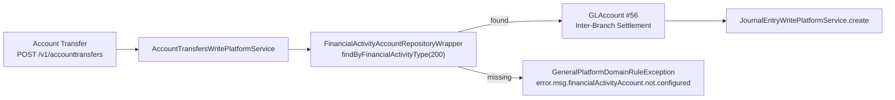

The Financial Activity Accounts API maps Apache Fineract organisation-level financial activities (asset transfer, liability transfer, cash, opening balances transfer, etc.) onto specific GL accounts so that automated account-transfer postings and other system-driven entries pick up the correct ledger.

## Source

| Aspect | Value |
| --- | --- |
| Resource class | `org.apache.fineract.accounting.financialactivityaccount.api.FinancialActivityAccountsApiResource` |
| File | `fineract-accounting/src/main/java/org/apache/fineract/accounting/financialactivityaccount/api/FinancialActivityAccountsApiResource.java` |
| JAX-RS `@Path` | `/v1/financialactivityaccounts` |
| Swagger tag | `Mapping Financial Activities to Accounts` |
| Permission code | `FINANCIALACTIVITYACCOUNT` (constant `FinancialActivityAccountsConstants.RESOURCE_NAME_FOR_PERMISSION`) |
| Read service | `FinancialActivityAccountReadPlatformService` |

## Endpoints

| Method | Path | Description | Command / read handler | Permission |
| --- | --- | --- | --- | --- |
| `GET` | `/v1/financialactivityaccounts/template` | Returns the financial-activity dropdowns and allowed GL account list. | `FinancialActivityAccountReadPlatformService.getFinancialActivityAccountTemplate()` | `READ_FINANCIALACTIVITYACCOUNT` |
| `GET` | `/v1/financialactivityaccounts` | List existing activity-to-account mappings. | `FinancialActivityAccountReadPlatformService.retrieveAll()` | `READ_FINANCIALACTIVITYACCOUNT` |
| `GET` | `/v1/financialactivityaccounts/{mappingId}` | Retrieve one mapping; `?template=true` returns template overlay. | `FinancialActivityAccountReadPlatformService.retrieve(mappingId)` (+ `addTemplateDetails`) | `READ_FINANCIALACTIVITYACCOUNT` |
| `POST` | `/v1/financialactivityaccounts` | Create mapping; mandatory `financialActivityId`, `glAccountId`. | `CommandWrapperBuilder.createOfficeToGLAccountMapping()` → `CREATE_FINANCIALACTIVITYACCOUNT` | `CREATE_FINANCIALACTIVITYACCOUNT` |
| `PUT` | `/v1/financialactivityaccounts/{mappingId}` | Update the linked GL account. | `updateOfficeToGLAccountMapping(mappingId)` → `UPDATE_FINANCIALACTIVITYACCOUNT` | `UPDATE_FINANCIALACTIVITYACCOUNT` |
| `DELETE` | `/v1/financialactivityaccounts/{mappingId}` | Delete a mapping. | `deleteOfficeToGLAccountMapping(mappingId)` → `DELETE_FINANCIALACTIVITYACCOUNT` | `DELETE_FINANCIALACTIVITYACCOUNT` |

## Financial activities

The `financialActivityId` enumeration covers organisation-wide activities such as Asset Transfer (`100`), Liability Transfer (`200`), Asset-Funds Source (`101`), Liability-Funds Source (`201`), Cash at Mainvault, Cash at Teller, and Opening Balances Transfer Contra. Exact values come from `org.apache.fineract.accounting.common.AccountingConstants.FinancialActivity`.

## Request body — create / update

The deserialiser binds to `FinancialActivityAccRequest`:

```json
{
  "financialActivityId": 200,
  "glAccountId": 56
}
```

## Response — retrieve list

```json
[
  {
    "id": 4,
    "financialActivityData": {
      "id": 200,
      "name": "Liability Transfer",
      "mappedGLAccountType": "LIABILITY"
    },
    "glAccountData": {
      "id": 56,
      "name": "Inter-Branch Settlement",
      "glCode": "200100"
    }
  }
]
```

## Response — write

```json
{
  "resourceId": 4,
  "changes": { "glAccountId": 56 }
}
```

## Usage

These mappings are read by:

- `AccountTransfersWritePlatformService` when posting savings-to-savings and savings-to-loan transfers.
- `OpeningBalancesAssembler` while replaying define-opening-balance commands.
- The cash-and-vault subsystem if enabled in the deployment.

## Mapping enforcement



A missing mapping is fatal for the transaction: `AccountTransfersWritePlatformService` rejects the transfer with `error.msg.financialActivityAccount.not.configured` rather than silently defaulting.

## Financial activity values

The integer ids come from `AccountingConstants.FinancialActivity`:

| id | Name | Mapped GL type |
| --- | --- | --- |
| `100` | Asset Transfer | ASSET |
| `101` | Asset-Funds Source | ASSET |
| `200` | Liability Transfer | LIABILITY |
| `201` | Liability-Funds Source | LIABILITY |
| `300` | Cash at Mainvault | ASSET |
| `301` | Cash at Teller | ASSET |
| `400` | Opening Balances Transfer Contra | EQUITY |
| `500` | Payment Type Funds Source | ASSET |

## Common pitfalls

- **`glAccountId` type must match** the activity's `mappedGLAccountType`. Mapping a LIABILITY activity to an ASSET account returns `error.msg.financialActivityAccount.gl.account.type.mismatch`.
- **One mapping per activity.** Re-posting `financialActivityId = 200` raises `error.msg.financialActivityAccount.duplicate.activity`. Update the existing mapping with `PUT` instead.
- **`Cash at Teller` (301)** is only active when the teller subsystem (`org.apache.fineract.organisation.teller`) is enabled. Mapping it has no effect otherwise.

## Sample curl

```bash
curl -k -u mifos:password \
  -H "Fineract-Platform-TenantId: default" \
  -H "Content-Type: application/json" \
  -X POST https://localhost:8443/fineract-provider/api/v1/financialactivityaccounts \
  -d '{ "financialActivityId": 200, "glAccountId": 56 }'
```

## Initial-setup checklist

Before any tenant can use account transfers or opening-balance commands, the following mappings should exist:

1. `100` Asset Transfer → an ASSET account (suspense, "in-transit").
2. `200` Liability Transfer → a LIABILITY account (suspense).
3. `400` Opening Balances Transfer Contra → an EQUITY account.
4. (Optional) `300/301` Cash at Mainvault / Teller — only if the teller subsystem is active.
5. (Optional) `500` Payment Type Funds Source — one per payment type that needs a custom GL split.

Without (1)–(3) the [Account Transfers](/api/account-transfers) and [Journal Entries](/api/journal-entries) opening-balance endpoint will fail.

## Listing endpoint output

`GET /v1/financialactivityaccounts` returns a flat array — there is no pagination because the row count is bounded by the size of the `FinancialActivity` enum. Combine with `GET /v1/financialactivityaccounts/template` to see which activities are still unmapped:

```bash
curl -k -u mifos:password \
  -H "Fineract-Platform-TenantId: default" \
  https://localhost:8443/fineract-provider/api/v1/financialactivityaccounts/template
```

The template carries `financialActivityOptions` containing the full enum so the UI can diff against the already-mapped list.

## Related subsystems

- Subsystem overview: [/accounting/financial-activity-accounts](/accounting/financial-activity-accounts)
- Chart of accounts: [/api/gl-accounts](/api/gl-accounts)
- Account transfer posting: [/api/account-transfers](/api/account-transfers)
- Generic accounting rules: [/api/accounting-rules](/api/accounting-rules)
- [/api/conventions](/api/conventions) — envelope, locale and error model.
