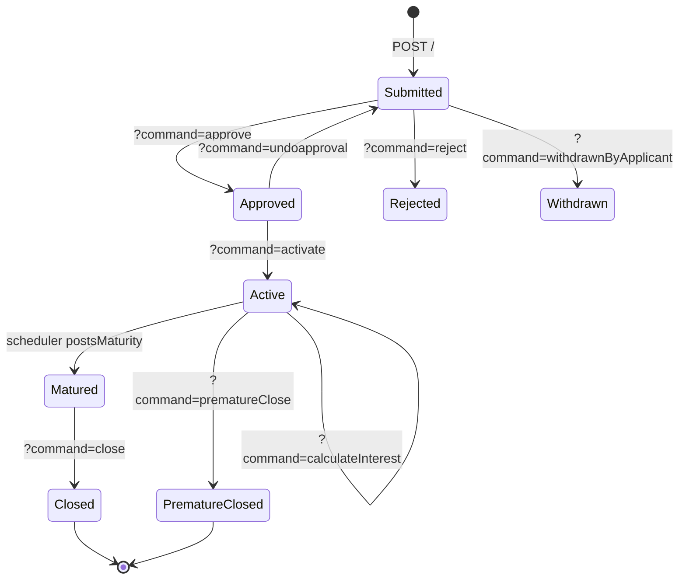

The Fixed Deposit Accounts API drives the full lifecycle of an Apache Fineract fixed-deposit (term-deposit) application — submission, approval, activation, premature closure with interest recalculation, and final closure. It also exposes Excel-based bulk import and account-closure template helpers.

## Source

| Aspect | Value |
| --- | --- |
| Resource class | `org.apache.fineract.portfolio.savings.api.FixedDepositAccountsApiResource` |
| File | `fineract-provider/src/main/java/org/apache/fineract/portfolio/savings/api/FixedDepositAccountsApiResource.java` |
| JAX-RS `@Path` | `/v1/fixeddepositaccounts` |
| Swagger tag | `Fixed Deposit Account` |
| Permission resource | `FIXEDDEPOSITACCOUNT` |
| Read service | `DepositAccountReadPlatformService` |
| Command source | `PortfolioCommandSourceWritePlatformService` |

## Endpoints

### Application lifecycle

| Method | Path | Operation id | Command handler |
| --- | --- | --- | --- |
| `GET` | `/v1/fixeddepositaccounts/template` | `retrieveTemplateFixedDepositAccount` | `DepositAccountReadPlatformService.retrieveTemplate(FIXED_DEPOSIT, ...)` |
| `GET` | `/v1/fixeddepositaccounts` | `retrieveAllFixedDepositAccounts` | paginated `retrieveAll(...)` |
| `POST` | `/v1/fixeddepositaccounts` | (`submitApplication`) | `CommandWrapperBuilder.createFixedDepositAccount()` |
| `GET` | `/v1/fixeddepositaccounts/{accountId}` | `retrieveOneFixedDepositAccount` | `retrieveOne(accountId)` |
| `PUT` | `/v1/fixeddepositaccounts/{accountId}` | `updateFixedDepositAccount` | `CommandWrapperBuilder.updateFixedDepositAccount(accountId)` |
| `POST` | `/v1/fixeddepositaccounts/{accountId}` | `handleCommandsFixedDepositAccount` | varies by `?command=` |
| `DELETE` | `/v1/fixeddepositaccounts/{accountId}` | `deleteFixedDepositAccount` | `CommandWrapperBuilder.deleteFixedDepositAccount(accountId)` |
| `GET` | `/v1/fixeddepositaccounts/{accountId}/template` | (`accountClosureTemplate`) | account-closure template (`?command=close|prematureClose`) |
| `GET` | `/v1/fixeddepositaccounts/calculate-fd-interest` | (`calculateFixedDepositInterest`) | preview-only interest calculation |

### Excel templates

| Method | Path | Description |
| --- | --- | --- |
| `GET` | `/v1/fixeddepositaccounts/downloadtemplate` | Download the FD-accounts import workbook. |
| `POST` | `/v1/fixeddepositaccounts/uploadtemplate` | Upload a completed FD-accounts workbook. |
| `GET` | `/v1/fixeddepositaccounts/transaction/downloadtemplate` | Download the FD-transactions workbook. |
| `POST` | `/v1/fixeddepositaccounts/transaction/uploadtemplate` | Upload a completed FD-transactions workbook. |

## State transition commands

`POST /v1/fixeddepositaccounts/{accountId}?command={cmd}` dispatched in `handleCommands(...)`:

| `command` | Builder |
| --- | --- |
| `reject` | `rejectFixedDepositAccountApplication(accountId)` |
| `withdrawnByApplicant` | `withdrawFixedDepositAccountApplication(accountId)` |
| `approve` | `approveFixedDepositAccountApplication(accountId)` |
| `undoapproval` | `undoFixedDepositAccountApplication(accountId)` |
| `activate` | `activateFixedDepositAccount(accountId)` |
| `calculateInterest` | `calculateInterestOnFixedDepositAccount(accountId)` |
| `postInterest` | `postInterestOnFixedDepositAccount(accountId)` |
| `close` | `closeFixedDepositAccount(accountId)` |
| `prematureClose` | `prematureCloseFixedDepositAccount(accountId)` |
| `calculatePrematureAmount` | `calculatePrematureAmountOnFixedDepositAccount(accountId)` |

Unknown commands raise `UnrecognizedQueryParamException("command", ...)`.

## Account closure template

`GET /v1/fixeddepositaccounts/{accountId}/template?command=close|prematureClose` returns the savings/transfer choices that the account-closure UI needs (e.g. transfer-to savings account, on-account vs. external payment). Internally also supports the `close` dispatch through the same handler.

## Request shapes

### Submit FD

`POST /v1/fixeddepositaccounts`:

```json
{
  "clientId": 42,
  "productId": 1,
  "submittedOnDate": "01 March 2026",
  "depositAmount": 10000,
  "depositPeriod": 12,
  "depositPeriodFrequencyId": 2,
  "expectedFirstDepositOnDate": "01 March 2026",
  "interestCompoundingPeriodType": 1,
  "interestPostingPeriodType": 4,
  "interestCalculationType": 1,
  "interestCalculationDaysInYearType": 365,
  "locale": "en",
  "dateFormat": "dd MMMM yyyy"
}
```

### Approve / activate

```json
{ "approvedOnDate": "05 March 2026", "locale": "en", "dateFormat": "dd MMMM yyyy" }
```

### Premature close

`POST /v1/fixeddepositaccounts/{accountId}?command=prematureClose`:

```json
{
  "closedOnDate": "15 September 2026",
  "onAccountClosureId": 2,
  "toSavingsAccountId": 88,
  "transferDescription": "Premature transfer",
  "locale": "en",
  "dateFormat": "dd MMMM yyyy"
}
```

### Calculate premature amount

`POST /v1/fixeddepositaccounts/{accountId}?command=calculatePrematureAmount` accepts the same body as `prematureClose` but returns the projected closure amount without persisting.

## Response shapes

Standard `CommandProcessingResult`:

```json
{ "officeId": 1, "clientId": 42, "savingsId": 88, "resourceId": 88, "changes": {} }
```

`GET /v1/fixeddepositaccounts/{accountId}` returns a `FixedDepositAccountData` whose summary includes `accountBalance`, `accountTermAndPreClosure`, `interestCalculationDaysInYearType`, `maturityAmount` and `maturityDate`.

## Permissions

Read endpoints invoke `validateHasReadPermission("FIXEDDEPOSITACCOUNT")`. Writes are routed through `PortfolioCommandSourceWritePlatformService.logCommandSource(...)` which applies `CREATE_/UPDATE_/DELETE_/APPROVE_/ACTIVATE_/CLOSE_/PREMATURECLOSE_/CALCULATEPREMATUREAMOUNT_FIXEDDEPOSITACCOUNT` permissions.

## Lifecycle diagram



## Calculate FD interest preview

`GET /v1/fixeddepositaccounts/calculate-fd-interest` accepts the same parameter set as the submit endpoint (`productId`, `depositAmount`, `depositPeriod`, `depositPeriodFrequencyId`, `submittedOnDate`, `locale`, `dateFormat`) and returns the projected `maturityAmount`, `maturityDate` and `nominalAnnualInterestRate` without persisting an account. It is the canonical way to back the "what would I get?" widget on the client UI.

## Common pitfalls

- **`prematureClose` is rejected when `maturityDate` has already been crossed** — use `close` instead. The error code is `error.msg.fixeddepositaccount.premature.close.not.allowed`.
- **`calculatePrematureAmount` does not mutate**; the response carries projected interest plus penalty. Persist by re-posting the same body to `?command=prematureClose`.
- **`postInterest` requires `isInterestPostingUpfront` to be aligned with the product**; otherwise the maturity-date scheduler may double-post. The handler raises `error.msg.fixeddepositaccount.interest.posting.not.allowed`.
- **`onAccountClosureId` values:** `1` withdrawDeposit, `2` transferToSavings, `3` reinvest, `4` transferToLinkedAccount. The handler raises `error.msg.invalid.account.closure.option` for any other value.

## Sample curl — calculate FD interest

```bash
curl -k -u mifos:password \
  -H "Fineract-Platform-TenantId: default" \
  "https://localhost:8443/fineract-provider/api/v1/fixeddepositaccounts/calculate-fd-interest?productId=1&depositAmount=10000&depositPeriod=12&depositPeriodFrequencyId=2&submittedOnDate=01%20March%202026&locale=en&dateFormat=dd%20MMMM%20yyyy"
```

## Submit response

```json
{
  "officeId": 1,
  "clientId": 42,
  "savingsId": 121,
  "resourceId": 121,
  "changes": {}
}
```

`savingsId` is set because all deposit products share the parent `savings_account` table — the FD's primary key is in fact a savings-account id.

## Closure transfer mechanics

`onAccountClosureId=2` (transferToSavings) requires `toSavingsAccountId`. The handler walks `AccountTransferDetails`:

1. Posts the final interest accrual on the FD.
2. Creates a debit on the FD's savings-account row.
3. Creates a paired credit on the target savings account.
4. Persists an `AccountTransfer` audit row linking the two.

If the destination savings account is not active or has incompatible currency, the closure fails with `error.msg.account.transfer.destination.account.not.active` and the FD remains in its pre-closure state.

## Related pages

- [/savings/fixed-deposit](/savings/fixed-deposit) — domain model and interest calculation.
- [/api/fixed-deposit-products](/api/fixed-deposit-products) — products used to instantiate FD accounts.
- [/api/fixed-deposit-account-transactions](/api/fixed-deposit-account-transactions) — transaction sub-resource.
- [/api/savings-accounts](/api/savings-accounts) — sister savings resource.
- [/api/conventions](/api/conventions) — envelope, locale and error model.
