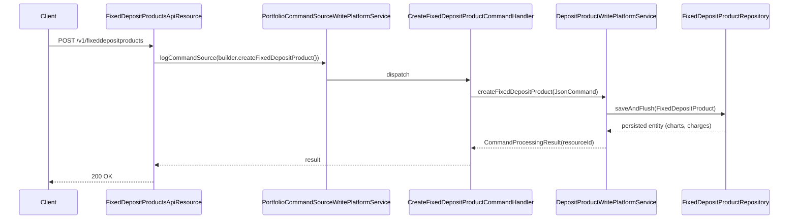

The Fixed Deposit Products API exposes CRUD endpoints for `FixedDepositProduct` definitions in Apache Fineract. Each product fixes the currency, lock-in rules, interest chart (slabs by term and amount), premature-closure penalties, charges and accounting rules used by every FD account created from it.

## Source

| Aspect | Value |
| --- | --- |
| Resource class | `org.apache.fineract.portfolio.savings.api.FixedDepositProductsApiResource` |
| File | `fineract-provider/src/main/java/org/apache/fineract/portfolio/savings/api/FixedDepositProductsApiResource.java` |
| JAX-RS `@Path` | `/v1/fixeddepositproducts` |
| Swagger tag | `Fixed Deposit Product` |
| Permission resource | `FIXEDDEPOSITPRODUCT` |
| Read service | `DepositProductReadPlatformService` |
| Command source | `PortfolioCommandSourceWritePlatformService` |

## Endpoints

| Method | Path | Operation id | Command handler | Permission |
| --- | --- | --- | --- | --- |
| `POST` | `/v1/fixeddepositproducts` | `createFixedDepositProduct` | `CommandWrapperBuilder.createFixedDepositProduct()` | `CREATE_FIXEDDEPOSITPRODUCT` |
| `PUT` | `/v1/fixeddepositproducts/{productId}` | `updateFixedDepositProduct` | `CommandWrapperBuilder.updateFixedDepositProduct(productId)` | `UPDATE_FIXEDDEPOSITPRODUCT` |
| `GET` | `/v1/fixeddepositproducts` | `retrieveAllFixedDepositProducts` | `retrieveAll(FIXED_DEPOSIT)` | `READ_FIXEDDEPOSITPRODUCT` |
| `GET` | `/v1/fixeddepositproducts/{productId}` | `retrieveOneFixedDepositProduct` | `retrieveOne(productId)` | `READ_FIXEDDEPOSITPRODUCT` |
| `GET` | `/v1/fixeddepositproducts/template` | `retrieveTemplateFixedDepositProduct` | template aggregator | `READ_FIXEDDEPOSITPRODUCT` |
| `DELETE` | `/v1/fixeddepositproducts/{productId}` | `deleteFixedDepositProduct` | `CommandWrapperBuilder.deleteFixedDepositProduct(productId)` | `DELETE_FIXEDDEPOSITPRODUCT` |

## Template composition

`GET /v1/fixeddepositproducts/template` aggregates everything a UI needs to design a term-deposit product:

- Currency, interest compounding/posting period, calculation type and days-in-year dropdowns.
- Lock-in and minimum-deposit-term frequency types.
- Charge options (`ChargeReadPlatformService.retrieveAllChargesApplicableTo(SAVINGS_DEPOSIT)`).
- Pre-closure type options for `prePaymentBehaviour`.
- Accounting rule and GL account dropdowns.
- An empty `chart` skeleton for interest slabs.

## Request shapes

### Create

`POST /v1/fixeddepositproducts`:

```json
{
  "name": "12 month CD",
  "shortName": "CD12",
  "currencyCode": "USD",
  "digitsAfterDecimal": 2,
  "interestCompoundingPeriodType": 1,
  "interestPostingPeriodType": 4,
  "interestCalculationType": 1,
  "interestCalculationDaysInYearType": 365,
  "lockinPeriodFrequency": 0,
  "lockinPeriodFrequencyType": 0,
  "minDepositTerm": 6,
  "minDepositTermTypeId": 2,
  "maxDepositTerm": 60,
  "maxDepositTermTypeId": 2,
  "preClosurePenalApplicable": true,
  "preClosurePenalInterest": 1,
  "preClosurePenalInterestOnTypeId": 1,
  "charts": [
    {
      "fromDate": "01 January 2026",
      "endDate": "31 December 2026",
      "isPrimaryGroupingByAmount": false,
      "chartSlabs": [
        { "fromPeriod": 6,  "toPeriod": 11, "periodType": 2, "annualInterestRate": 4.0 },
        { "fromPeriod": 12, "toPeriod": 23, "periodType": 2, "annualInterestRate": 5.0 },
        { "fromPeriod": 24, "toPeriod": 60, "periodType": 2, "annualInterestRate": 6.0 }
      ]
    }
  ],
  "accountingRule": 1,
  "locale": "en",
  "dateFormat": "dd MMMM yyyy"
}
```

### Update

`PUT /v1/fixeddepositproducts/{productId}` accepts the same envelope with all fields optional. Updating `charts` replaces the chart entirely.

### Standard response

```json
{ "resourceId": 1, "changes": { } }
```

### Retrieve (excerpt)

```json
{
  "id": 1,
  "name": "12 month CD",
  "shortName": "CD12",
  "currency": { "code": "USD" },
  "interestCompoundingPeriodType": { "id": 1, "code": "savings.interest.period.daily" },
  "interestPostingPeriodType": { "id": 4, "code": "savings.interest.posting.period.monthly" },
  "minDepositTerm": 6,
  "minDepositTermType": { "id": 2, "code": "depositPeriodFrequencyType.months" },
  "maxDepositTerm": 60,
  "maxDepositTermType": { "id": 2, "code": "depositPeriodFrequencyType.months" },
  "preClosurePenalApplicable": true,
  "preClosurePenalInterest": 1,
  "preClosurePenalInterestOnType": { "id": 1, "code": "preClosurePenalInterestOnType.wholeTerm" },
  "activeChart": {
    "chartSlabs": [
      { "fromPeriod": 6,  "toPeriod": 11, "annualInterestRate": 4.0 },
      { "fromPeriod": 12, "toPeriod": 23, "annualInterestRate": 5.0 },
      { "fromPeriod": 24, "toPeriod": 60, "annualInterestRate": 6.0 }
    ]
  }
}
```

## Permissions

Read endpoints invoke `validateHasReadPermission("FIXEDDEPOSITPRODUCT")`. Writes route through `PortfolioCommandSourceWritePlatformService.logCommandSource(...)` which applies `CREATE_FIXEDDEPOSITPRODUCT`, `UPDATE_FIXEDDEPOSITPRODUCT`, `DELETE_FIXEDDEPOSITPRODUCT`.

## Create flow



## Interest slab lookup

For an FD with deposit amount A held for term T (in the slab's `periodType`), the platform picks the chart slab where:

- `fromPeriod ≤ T ≤ toPeriod` (or `toPeriod` is null), AND
- when `isPrimaryGroupingByAmount = true`, `fromAmount ≤ A ≤ toAmount`.

If multiple slabs match (overlapping ranges) the validator rejects the chart at create/update time with `error.msg.product.deposit.slab.cannot.overlap`.

## Common pitfalls

- **Chart updates replace, not merge.** Sending a partial `charts` array on PUT removes all slabs that were not included. Use the retrieve endpoint to read the full chart, edit, and POST back.
- **`preClosurePenalApplicable` requires `preClosurePenalInterestOnTypeId`** to be `1` (whole term) or `2` (till premature withdrawal); other values fail with `error.msg.product.deposit.invalid.preClosurePenalInterestOnType`.
- **Currency vs charges.** Adding a charge in a different currency raises `error.msg.charge.currency.mismatch` even though the dropdown filtered it; the validator double-checks server-side.
- **`minDepositTerm` and `maxDepositTerm` must use the same `*TermTypeId`** to allow consistent comparison.

## Sample curl — list active products

```bash
curl -k -u mifos:password \
  -H "Fineract-Platform-TenantId: default" \
  https://localhost:8443/fineract-provider/api/v1/fixeddepositproducts
```

## Slab grouping modes

Each chart record has an `isPrimaryGroupingByAmount` flag that decides the lookup precedence:

- `false` (default): pick the slab by period first, then by amount; rates differ by term.
- `true`: pick the slab by amount first; rates differ by deposit size.

This affects how multi-dimensional charts are arranged in the response. Most institutions stay with `false`.

## Charges

Like savings products, fixed-deposit products allow attaching charges. Term-deposit appropriate charge types include:

| `chargeTimeType` | Use |
| --- | --- |
| `1` Specified due date | Maintenance fee on a particular date. |
| `12` Save deposit fee | Fee charged at deposit acceptance. |
| `13` Withdrawal fee | Penalty on premature withdrawal in addition to interest haircut. |

The product validator rejects savings-only charge types (e.g. `5` monthly fee or `8` no-activity fee) for term-deposit products with `error.msg.charge.cannot.be.applied.to.fixed.deposit.product`.

## Related pages

- [/api/fixed-deposit-accounts](/api/fixed-deposit-accounts) — accounts instantiated from these products.
- [/savings/fixed-deposit](/savings/fixed-deposit) — domain model.
- [/api/interest-rate-charts](/api/interest-rate-charts) — chart structure.
- [/api/conventions](/api/conventions) — envelope, locale and error model.
