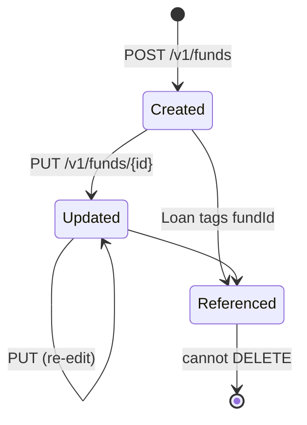

`FundsApiResource` exposes a small CRUD surface for the **funds** catalogue. A fund represents an external funding source (a particular grant, line of credit, donor pool) that loans may be tagged with for reporting and ring-fencing. The data model is intentionally light — just `name` and `externalId` — but downstream reports use it to slice the portfolio.

## Source

```
fineract-provider/src/main/java/org/apache/fineract/portfolio/fund/api/FundsApiResource.java
```

| Annotation | Value |
| --- | --- |
| `@Path` | `/v1/funds` |
| `@Component` | yes |
| `@Tag` | `Funds` |

Injected collaborators:

- `PlatformSecurityContext context`
- `FundReadPlatformService readPlatformService`
- `PortfolioCommandSourceWritePlatformService commandsSourceWritePlatformService`
- `DefaultToApiJsonSerializer<FundData> toApiJsonSerializer`

## Permissions

Resource string: `FUND` (`RESOURCE_NAME_FOR_PERMISSIONS`). Reads call `validateHasReadPermission("FUND")`. Writes use `CREATE_FUND`, `UPDATE_FUND`.

There is **no** `DELETE` — funds cannot be deleted because they would orphan referencing loans.

## Endpoint inventory

| HTTP | Path | Description | Command / Read service |
| --- | --- | --- | --- |
| `GET` | `/v1/funds` | List all funds | `readPlatformService.retrieveAllFunds()` |
| `POST` | `/v1/funds` | Create a fund | `createFund` |
| `GET` | `/v1/funds/{fundId}` | Fetch one fund | `readPlatformService.retrieveFund(fundId)` |
| `PUT` | `/v1/funds/{fundId}` | Update a fund | `updateFund(fundId)` |

## Source excerpt — create

```java
@POST
@Consumes(MediaType.APPLICATION_JSON)
@Produces(MediaType.APPLICATION_JSON)
public CommandProcessingResult createFund(final FundRequest fundRequest) {
    final CommandWrapper commandRequest = new CommandWrapperBuilder()
        .createFund()
        .withJson(toApiJsonSerializer.serialize(fundRequest))
        .build();
    return commandsSourceWritePlatformService.logCommandSource(commandRequest);
}
```

Note: the input is a typed `FundRequest`, but the resource serialises it back to JSON before handing to the legacy command pipeline — a half-migration to the typed pipeline.

## Canonical curl

```bash
curl -k -u mifos:password \
  -H "Fineract-Platform-TenantId: default" \
  -H "Content-Type: application/json" \
  -X POST https://localhost:8443/fineract-provider/api/v1/funds \
  -d '{ "name": "Donor Fund 2024", "externalId": "DF-2024-001" }'
```

Sample response:

```json
{
  "officeId": null,
  "resourceId": 7
}
```

## Read DTO

`org.apache.fineract.portfolio.fund.data.FundData`:

```json
{
  "id": 7,
  "name": "Donor Fund 2024",
  "externalId": "DF-2024-001"
}
```

The list endpoint returns a flat array of `FundData` — no paging.

## Request body — POST/PUT

`FundRequest`:

| Field | Required | Notes |
| --- | --- | --- |
| `name` | yes | Unique among funds |
| `externalId` | no | Unique if provided |

## How funds are consumed

- Loan products carry an optional default fund via [`/v1/loanproducts`](/portfolio/products-generic).
- Individual loan accounts can override the default at submission time.
- The portfolio report `Funds Disbursement Report` slices the portfolio by `fundId`.
- The Avro event `LoanCreatedBusinessEvent` includes `fundId` so downstream consumers can route accordingly.

## Lifecycle



## Endpoint signatures from source

```java
@GET
@Consumes(MediaType.APPLICATION_JSON)
@Produces(MediaType.APPLICATION_JSON)
public List<FundData> retrieveFunds() {
    context.authenticatedUser().validateHasReadPermission("FUND");
    return new ArrayList<>(readPlatformService.retrieveAllFunds());
}

@GET
@Path("{fundId}")
public FundData retrieveFund(@PathParam("fundId") final Long fundId) {
    context.authenticatedUser().validateHasReadPermission("FUND");
    return readPlatformService.retrieveFund(fundId);
}

@PUT
@Path("{fundId}")
public String updateFund(@PathParam("fundId") final Long fundId,
        final FundRequest fundRequest) {
    final CommandWrapper commandRequest = new CommandWrapperBuilder()
        .updateFund(fundId)
        .withJson(toApiJsonSerializer.serialize(fundRequest))
        .build();
    return toApiJsonSerializer.serialize(
        commandsSourceWritePlatformService.logCommandSource(commandRequest));
}
```

## Common pitfalls

- **`name` must be unique** — duplicates raise `error.msg.fund.duplicate.name`.
- **`externalId` is unique only when present.** Null values do not collide.
- **No DELETE.** To stop using a fund, blank out the references from existing loans first (their schedule must reissue, which is a separate, careful operation).
- **The `FundRequest` body is typed** but the resource re-serialises it to JSON before handing to the legacy command pipeline — round-trip serialization quirks (e.g. `null` vs. absent fields) propagate.

## Sample curl — list

```bash
curl -k -u mifos:password \
  -H "Fineract-Platform-TenantId: default" \
  https://localhost:8443/fineract-provider/api/v1/funds
```

## Cross-references

- [Portfolio → Funds](/portfolio/funds) — domain model.
- [Portfolio → Products generic](/portfolio/products-generic) — default fund on loan products.
- [API conventions](/api/conventions) — envelope and error JSON.
