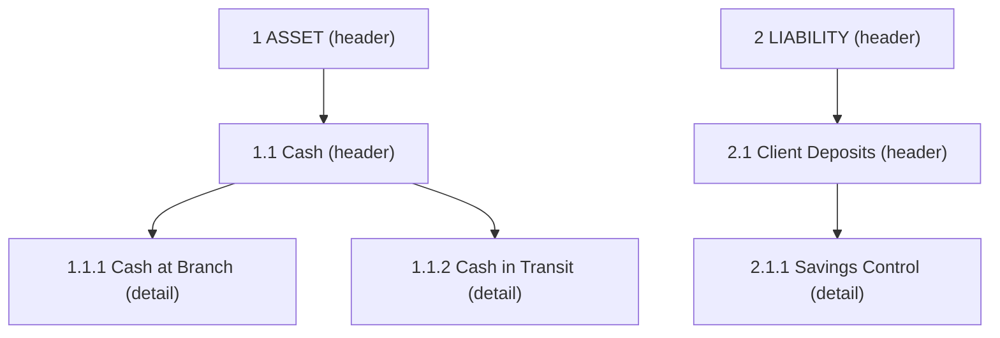

The General Ledger Accounts API is the entry point used by Apache Fineract clients to manage an organisation's Chart of Accounts (COA). Each `GLAccount` belongs to a type (asset, liability, equity, income, expense), can be a header or detail account, may be tagged via code values, and is referenced from every journal entry produced by loans, savings, share and accounting-rule postings.

## Source

| Aspect | Value |
| --- | --- |
| Resource class | `org.apache.fineract.accounting.glaccount.api.GLAccountsApiResource` |
| File | `fineract-accounting/src/main/java/org/apache/fineract/accounting/glaccount/api/GLAccountsApiResource.java` |
| JAX-RS `@Path` | `/v1/glaccounts` |
| Swagger tag | `General Ledger Account` |
| Permission code | `GLACCOUNT` (read) / per-command codes for writes |
| Read service | `GLAccountReadPlatformService` |
| Command builder helpers | `CommandWrapperBuilder.createGLAccount` / `updateGLAccount(id)` / `deleteGLAccount(id)` |

The constructor wires `PlatformSecurityContext`, `GLAccountReadPlatformService`, `DefaultToApiJsonSerializer<GLAccountData>`, `ApiRequestParameterHelper`, `PortfolioCommandSourceWritePlatformService`, `AccountingDropdownReadPlatformService`, `CodeValueReadPlatformService`, `BulkImportWorkbookService` and `BulkImportWorkbookPopulatorService`.

## Endpoints

| Method | Path | Description | Command / read handler | Permission |
| --- | --- | --- | --- | --- |
| `GET` | `/v1/glaccounts/template` | Account-creation template (defaults + allowed value lists, filtered by `type` 1‒5). | `GLAccountReadPlatformService.retrieveNewGLAccountDetails(type)` + `handleTemplate(...)` | `READ_GLACCOUNT` |
| `GET` | `/v1/glaccounts` | List accounts filtered by `type`, `searchParam`, `usage`, `manualEntriesAllowed`, `disabled`, `fetchRunningBalance`. | `GLAccountReadPlatformService.retrieveAllGLAccounts(...)` | `READ_GLACCOUNT` |
| `GET` | `/v1/glaccounts/{glAccountId}` | Retrieve a single account; supports `?template=true`, `?fetchRunningBalance=true`, `?fields=`. | `GLAccountReadPlatformService.retrieveGLAccountById(id, assoc)` | `READ_GLACCOUNT` |
| `POST` | `/v1/glaccounts` | Create a GL account; mandatory `name`, `glCode`, `type`, `usage`, `manualEntriesAllowed`. | `CommandWrapperBuilder.createGLAccount()` → `CREATE_GLACCOUNT` | `CREATE_GLACCOUNT` |
| `PUT` | `/v1/glaccounts/{glAccountId}` | Update a GL account. | `CommandWrapperBuilder.updateGLAccount(glAccountId)` → `UPDATE_GLACCOUNT` | `UPDATE_GLACCOUNT` |
| `DELETE` | `/v1/glaccounts/{glAccountId}` | Delete a GL account. | `CommandWrapperBuilder.deleteGLAccount(glAccountId)` → `DELETE_GLACCOUNT` | `DELETE_GLACCOUNT` |
| `GET` | `/v1/glaccounts/downloadtemplate` | Download the COA Excel workbook (`GlobalEntityType.CHART_OF_ACCOUNTS`). | `BulkImportWorkbookPopulatorService.getTemplate(...)` | Authenticated |
| `POST` | `/v1/glaccounts/uploadtemplate` | Upload a populated COA Excel workbook. Multipart fields: `file`, `locale`, `dateFormat`. | `BulkImportWorkbookService.importWorkbook(...)` | Authenticated |

The `handleTemplate` helper enriches `GLAccountData` with dropdowns from `AccountingDropdownReadPlatformService` and tag options from `CodeValueReadPlatformService` (codes `ASSESTS_TAG_OPTION_CODE_NAME`, `LIABILITIES_TAG_OPTION_CODE_NAME`, `EQUITY_TAG_OPTION_CODE_NAME`, `INCOME_TAG_OPTION_CODE_NAME`, `EXPENSES_TAG_OPTION_CODE_NAME` defined in `AccountingConstants`).

## Account types and usage

`GLAccountType` integer codes used by the `type` query and request field:

| Code | Type |
| --- | --- |
| `1` | ASSET |
| `2` | LIABILITY |
| `3` | EQUITY |
| `4` | INCOME |
| `5` | EXPENSE |

`usage` integer codes (from `GLAccountUsage`):

| Code | Usage |
| --- | --- |
| `1` | DETAIL — postable account |
| `2` | HEADER — grouping node in the hierarchy |

## Request body — create

`POST /v1/glaccounts` deserialises into `GLAccountCommand`:

```json
{
  "name": "Cash at Branch",
  "glCode": "100001",
  "manualEntriesAllowed": true,
  "type": 1,
  "usage": 1,
  "description": "Cash drawer for the branch office",
  "parentId": 1,
  "tagId": 12,
  "disabled": false
}
```

## Response — create / update / delete

All write endpoints return a `CommandProcessingResult` (serialised via `DefaultToApiJsonSerializer`):

```json
{
  "officeId": null,
  "resourceId": 27,
  "changes": {}
}
```

## Response — retrieve list

```json
[
  {
    "id": 1,
    "name": "Cash at Branch",
    "glCode": "100001",
    "disabled": false,
    "manualEntriesAllowed": true,
    "type": { "id": 1, "code": "accountType.asset", "value": "ASSET" },
    "usage": { "id": 1, "code": "accountUsage.detail", "value": "DETAIL" },
    "description": "Cash drawer for the branch office",
    "nameDecorated": "Cash at Branch",
    "organizationRunningBalance": 0
  }
]
```

## Bulk import

The `downloadtemplate` / `uploadtemplate` pair uses the `CHART_OF_ACCOUNTS` global entity type. The upload returns a `Long` import-document id that can be polled via the import-documents API to track row-level results.

## Hierarchy



`parentId` on a detail account points at a header in the same `type`. The validator (`GLAccountCommandFromApiJsonDeserializer`) rejects a parent in a different type with `error.msg.glAccount.parent.account.type.mismatch`.

## Common pitfalls

- **`glCode` is unique** across the chart. Duplicates raise `error.msg.glAccount.duplicate.glCode`.
- **HEADER accounts cannot be referenced** by `journalentries` or `financialactivityaccounts`. The validator returns `error.msg.glAccount.usage.invalid` if you try to map a header.
- **Deleting an account with running balance** is rejected (`error.msg.glAccount.cannot.be.deleted`) — disable it (`disabled=true`) instead.
- **`disabled=true` only hides from dropdowns** — historical journal entries against the account still aggregate into reports.
- **`tagId` must belong to the type-specific code** listed in `AccountingConstants` (e.g. `ASSESTS_TAG_OPTION_CODE_NAME`); mismatches return `error.msg.glAccount.tag.invalid`.

## Sample curl — create a detail account

```bash
curl -k -u mifos:password \
  -H "Fineract-Platform-TenantId: default" \
  -H "Content-Type: application/json" \
  -X POST https://localhost:8443/fineract-provider/api/v1/glaccounts \
  -d '{
        "name": "Cash at Branch",
        "glCode": "100001",
        "manualEntriesAllowed": true,
        "type": 1,
        "usage": 1,
        "parentId": 1
      }'
```

## List filters

`GET /v1/glaccounts` accepts an expressive set of query parameters that the read service turns into a single SQL filter:

| Query param | Effect |
| --- | --- |
| `type` | One of `1` (asset) … `5` (expense). Restricts to one type. |
| `searchParam` | LIKE-search across `name` and `glCode`. |
| `usage` | `1` detail, `2` header. |
| `manualEntriesAllowed` | Restrict to accounts available to manual postings. |
| `disabled` | Filter on the soft-disable flag. |
| `fetchRunningBalance` | Include `organizationRunningBalance` per row (slow). |

The retrieve-one endpoint additionally accepts `?template=true` which overlays dropdowns (`allowedParents`, tag option lists per type) onto the `GLAccountData` payload. Combining `?fetchRunningBalance=true&template=true` returns a fully populated detail page in one round trip.

## Running balance caveats

`organizationRunningBalance` is computed at the *organisation* level (all offices combined) by the nightly `Update Account Running Balances` job. It does **not** auto-refresh on every read. To get a real-time number, run the [Journal Entries](/api/journal-entries) `?command=updateRunningBalance` endpoint first.

## Bulk import workbook

`GET /v1/glaccounts/downloadtemplate` returns an Excel workbook with the existing chart pre-populated; add rows on the "GL Accounts" sheet and POST it back to `uploadtemplate` as `multipart/form-data` with form fields `file`, `locale`, `dateFormat`. The endpoint returns a `Long` import-document id that you can poll via `GET /v1/imports/{id}` to track row-level success/failure. Useful for migrating a chart from another core banking system.

## Related subsystems

- Subsystem overview: [/accounting/gl-accounts](/accounting/gl-accounts)
- Journal postings against these accounts: [/api/journal-entries](/api/journal-entries)
- Period-end controls: [/api/gl-closures](/api/gl-closures)
- Product-to-account mapping helpers: [/api/financial-activity-accounts](/api/financial-activity-accounts), [/api/accounting-rules](/api/accounting-rules)
- [/api/conventions](/api/conventions) — envelope, locale and error model.
