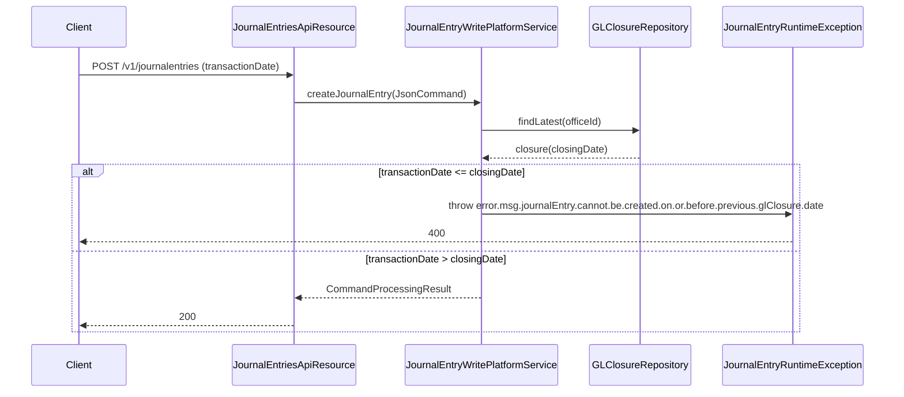

The Accounting Closure API exposes the per-office cutoff dates that Apache Fineract uses to reject backdated journal entries. A `GLClosure` carries an `officeId`, a `closingDate`, and operator comments; once a closure exists no manual or system-generated entry may be logged or reversed with a date on or before that closure.

## Source

| Aspect | Value |
| --- | --- |
| Resource class | `org.apache.fineract.accounting.closure.api.GLClosuresApiResource` |
| File | `fineract-accounting/src/main/java/org/apache/fineract/accounting/closure/api/GLClosuresApiResource.java` |
| JAX-RS `@Path` | `/v1/glclosures` |
| Swagger tag | `Accounting Closure` |
| Permission code | `GLCLOSURE` |
| Read service | `GLClosureReadPlatformService` |
| Office dropdown | `OfficeReadPlatformService.retrieveAllOfficesForDropdown()` (template only) |

## Endpoints

| Method | Path | Description | Command / read handler | Permission |
| --- | --- | --- | --- | --- |
| `GET` | `/v1/glclosures?officeId={id}` | List closures, optionally scoped to an office. | `GLClosureReadPlatformService.retrieveAllGLClosures(officeId)` | `READ_GLCLOSURE` |
| `GET` | `/v1/glclosures/{glClosureId}` | Retrieve a single closure; `?template=true` enriches the response with office dropdown options. | `GLClosureReadPlatformService.retrieveGLClosureById(id)` | `READ_GLCLOSURE` |
| `POST` | `/v1/glclosures` | Create a closure; mandatory fields `officeId`, `closingDate`. | `CommandWrapperBuilder.createGLClosure()` → `CREATE_GLCLOSURE` | `CREATE_GLCLOSURE` |
| `PUT` | `/v1/glclosures/{glClosureId}` | Update closure (only `comments` may change after creation). | `updateGLClosure(glClosureId)` → `UPDATE_GLCLOSURE` | `UPDATE_GLCLOSURE` |
| `DELETE` | `/v1/glclosures/{glClosureId}` | Delete; only the latest closure of a branch may be removed. | `deleteGLClosure(glClosureId)` → `DELETE_GLCLOSURE` | `DELETE_GLCLOSURE` |

## Request body — create

The deserialised payload binds to `GLClosureRequest`:

```json
{
  "officeId": 1,
  "closingDate": "31 March 2024",
  "comments": "Quarter-end close — branch reviewed by AS",
  "locale": "en",
  "dateFormat": "dd MMMM yyyy"
}
```

## Request body — update

After creation, only `comments` is mutable; supplying `officeId` or `closingDate` is ignored or rejected by the command handler:

```json
{
  "comments": "Comments updated after audit feedback"
}
```

## Response — single closure

```json
{
  "id": 12,
  "officeId": 1,
  "officeName": "Head Office",
  "closingDate": [2024, 3, 31],
  "comments": "Quarter-end close — branch reviewed by AS",
  "createdByUsername": "mifos",
  "createdDate": [2024, 4, 1, 8, 5, 12]
}
```

When `?template=true` is appended, `allowedOffices` is populated from `OfficeReadPlatformService`.

## Response — write

All write endpoints return a `CommandProcessingResult` describing the affected resource:

```json
{
  "officeId": 1,
  "resourceId": 12,
  "changes": { "comments": "Comments updated after audit feedback" }
}
```

## Operational notes

- Closures are enforced inside the journal-entry create handler; attempts to backdate a posting raise `JournalEntryRuntimeException`.
- A branch may hold multiple closures (one per period). Only the most recent closure per `officeId` is deletable.
- System-generated entries from loan/savings transactions also respect closures and surface the same error class to callers.

## Closure enforcement



## Branch hierarchy semantics

A closure on a parent office does **not** cascade to its children. Each branch closes on its own cadence. The journal-entry writer only checks the closure of the entry's `officeId`. This lets head office close at quarter-end while branches catch up at month-end.

## Common pitfalls

- **Cannot delete an old closure** — only the latest per office. The handler returns `error.msg.glClosure.cannot.be.deleted`.
- **`closingDate` must be in the past** relative to `BusinessDate.COB_DATE`; future closures are rejected with `error.msg.glClosure.closingDate.cannot.be.in.future`.
- **`closingDate` must be strictly after** the previous closure for the office — otherwise `error.msg.glClosure.previous.closure.exists`.
- **`?template=true`** on the list endpoint is ignored; only the single-closure GET enriches the response.

## Sample curl — create a closure

```bash
curl -k -u mifos:password \
  -H "Fineract-Platform-TenantId: default" \
  -H "Content-Type: application/json" \
  -X POST https://localhost:8443/fineract-provider/api/v1/glclosures \
  -d '{
        "officeId": 1,
        "closingDate": "31 March 2024",
        "comments": "Quarter-end close",
        "locale": "en",
        "dateFormat": "dd MMMM yyyy"
      }'
```

## Period-end checklist

A typical month-end run executes the following sequence per branch:

1. Run the [Provisioning Entries](/api/provisioning-entries) batch and post journal entries.
2. Trigger the **Update Account Running Balances** job to refresh `organizationRunningBalance` on every GL account.
3. Generate the trial balance / balance sheet reports.
4. Once the operator signs off, post `POST /v1/glclosures` with the period-end date.
5. The next month's transactions are now constrained to dates strictly after the closure.

To **reopen** a period for correction, delete the most recent closure (`DELETE /v1/glclosures/{id}`). Older closures cannot be deleted; you must walk back through the chain.

## List filtering

`GET /v1/glclosures?officeId=1` scopes the result to a single office; without `officeId` the endpoint returns every branch's closures ordered by `closingDate desc`. The list endpoint does not paginate — the maximum number of closures per branch is bounded by month-end runs and remains modest in size.

## Audit fields

Each `GLClosure` row carries `createdBy`, `createdDate`, `lastModifiedBy`, and `lastModifiedDate`. Together with the immutable `closingDate`, they form the auditor's view of when each period was locked. Updates to `comments` are also surfaced via the audit framework.

## Related subsystems

- Subsystem overview: [/accounting/gl-closures](/accounting/closure)
- Chart of accounts: [/api/gl-accounts](/api/gl-accounts)
- Journal postings affected by closures: [/api/journal-entries](/api/journal-entries)
- Office management: [/organisation/offices](/organisation/offices)
- [/api/conventions](/api/conventions) — envelope, locale and error model.
