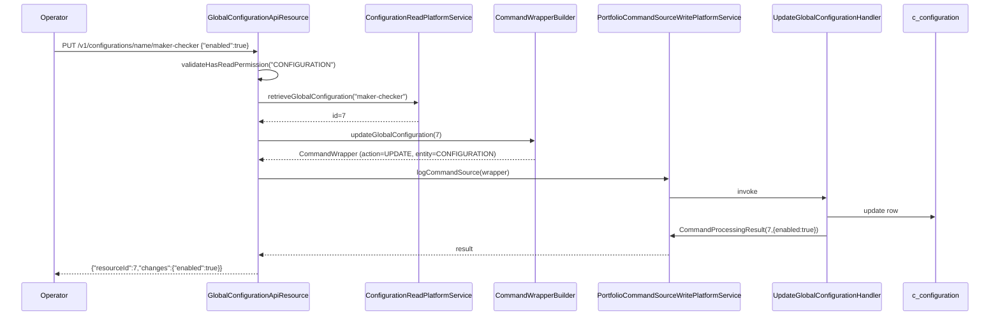

The Global Configuration API exposes the named feature flags and numeric/string toggles that drive tenant behaviour in Apache Fineract. Properties such as `maker-checker`, `allow-transactions-on-holiday`, `financial-year-beginning-month`, `meetings-mandatory-for-jlg-loans`, `rounding-mode`, and the various survey/COB toggles are read from a single `c_configuration` table and surfaced through this resource for runtime updates.

Each row pairs:

- a boolean `enabled` flag,
- an optional `value` (long) for numeric configurations,
- an optional `dateValue` (date) for date-bearing toggles,
- an optional `stringValue` for free-form text settings,
- a `trapDoor` flag that, once `true`, blocks future updates until cleared at the database level.

## Source

| Aspect | Value |
| --- | --- |
| Resource class | `org.apache.fineract.infrastructure.configuration.api.GlobalConfigurationApiResource` |
| File | `fineract-provider/src/main/java/org/apache/fineract/infrastructure/configuration/api/GlobalConfigurationApiResource.java` |
| JAX-RS `@Path` | `/v1/configurations` |
| Swagger tag | `Global Configuration` |
| Permission resource | `CONFIGURATION` |
| Read service | `ConfigurationReadPlatformService` |
| Write pipeline | `CommandWrapperBuilder.updateGlobalConfiguration(id)` → `PortfolioCommandSourceWritePlatformService` |
| Swagger schemas | `GlobalConfigurationApiResourceSwagger.{GetGlobalConfigurationsResponse,GetGlobalConfigurationsResponse$GlobalConfigurationData,PutGlobalConfigurationsRequest,PutGlobalConfigurationsResponse}` |
| Constants | `GlobalConfigurationConstants` (canonical names such as `MAKER_CHECKER`, `ROUNDING_MODE`) |

## Endpoints

| Method | Path | Description | Command / read handler | Permission |
| --- | --- | --- | --- | --- |
| `GET` | `/v1/configurations?survey={bool}` | List all global configurations, or only survey-related ones when `survey=true`. | `ConfigurationReadPlatformService.retrieveGlobalConfiguration(survey)` | `READ_CONFIGURATION` |
| `GET` | `/v1/configurations/{configId}` | Retrieve a single configuration by id. | `ConfigurationReadPlatformService.retrieveGlobalConfiguration(configId)` | `READ_CONFIGURATION` |
| `GET` | `/v1/configurations/name/{name}` | Retrieve by name (e.g. `enable-address`). | `ConfigurationReadPlatformService.retrieveGlobalConfiguration(name)` | `READ_CONFIGURATION` |
| `PUT` | `/v1/configurations/{configId}` | Update a configuration. | `CommandWrapperBuilder.updateGlobalConfiguration(configId)` → `UPDATE_CONFIGURATION` | `UPDATE_CONFIGURATION` |
| `PUT` | `/v1/configurations/name/{configName}` | Update by name; resolves id via the read service and reuses the same command builder. | `updateGlobalConfiguration(configId)` → `UPDATE_CONFIGURATION` | `UPDATE_CONFIGURATION` |

The class enforces `validateHasReadPermission("CONFIGURATION")` on every `GET`. Writes go through the maker-checker pipeline and therefore generate an `m_portfolio_command_source` audit row.

## Common configuration names

| Name | Effect when enabled |
| --- | --- |
| `maker-checker` | Turns on the maker-checker pipeline for command processing. |
| `reschedule-future-repayments` | Reschedules repayments falling on non-working days. |
| `allow-transactions-on-non-workingday` | Permits transactions on non-working days. |
| `reschedule-repayments-on-holidays` | Reschedules around holidays. |
| `allow-transactions-on-holiday` | Permits transactions on holidays. |
| `savings-interest-posting-current-period-end` | Posts savings interest on the period-end date. |
| `financial-year-beginning-month` | 1‒12; drives savings posting period boundaries. |
| `meetings-mandatory-for-jlg-loans` | Forces JLG loans to follow parent group/center meeting schedule. |
| `enable-address` | Activates the address sub-module. |
| `enable-business-date` | Honours [/api/business-date](/api/business-date) values in place of `LocalDate.now()`. |
| `enable-automatic-cob-date-adjustment` | Lets COB jobs advance `COB_DATE` automatically. |
| `rounding-mode` | Sets the platform `RoundingMode` ordinal (see `GlobalConfigurationConstants.ROUNDING_MODE`). |
| `penalty-wait-period` | Days the platform waits before applying overdue-penalty charges. |
| `grace-on-arrears-ageing` | Days of grace before a loan ages into arrears buckets. |
| `force-password-reset-days` | Days after which `m_appuser` rows force a password reset. |

The complete set ships in the `c_configuration` Liquibase migration; new names are added with each release.

## Request body — update

```json
{
  "enabled": true,
  "value": 4,
  "dateValue": null,
  "stringValue": null,
  "trapDoor": false
}
```

| Field | Type | Notes |
| --- | --- | --- |
| `enabled` | boolean | Primary on/off lever; mandatory for boolean-style configurations. |
| `value` | long | Numeric configurations such as `financial-year-beginning-month` (1‒12) or `rounding-mode` (ordinal). |
| `dateValue` | string (date) | Date-bearing toggles. Requires `dateFormat` and `locale` if present. |
| `stringValue` | string | Free-form text settings. |
| `trapDoor` | boolean | Once `true`, the row rejects further updates from this API and must be reset via SQL. Use carefully. |

Only fields present in the body are updated; missing fields are left unchanged.

## Response — list

The response is wrapped under the `globalConfiguration` parameter set:

```json
{
  "globalConfiguration": [
    {
      "id": 7,
      "name": "maker-checker",
      "value": null,
      "dateValue": null,
      "stringValue": null,
      "enabled": false,
      "trapDoor": false,
      "description": "Enable maker-checker"
    },
    {
      "id": 9,
      "name": "financial-year-beginning-month",
      "value": 4,
      "dateValue": null,
      "stringValue": null,
      "enabled": true,
      "trapDoor": false,
      "description": "Financial year start month (1-12)"
    }
  ]
}
```

## Response — single property

```json
{
  "id": 9,
  "name": "financial-year-beginning-month",
  "value": 4,
  "dateValue": null,
  "stringValue": null,
  "enabled": true,
  "trapDoor": false,
  "description": "Financial year start month (1-12)"
}
```

## Response — write

Standard command-processing envelope:

```json
{
  "resourceId": 9,
  "changes": { "value": 4 }
}
```

## Source — list handler

```java
@GET
@Operation(summary = "Retrieve Global Configuration")
public String retrieveConfiguration(@Context final UriInfo uriInfo,
        @DefaultValue("false") @QueryParam("survey") final boolean survey) {
    context.authenticatedUser().validateHasReadPermission(RESOURCE_NAME_FOR_PERMISSIONS);
    final GlobalConfigurationData configuration =
        readPlatformService.retrieveGlobalConfiguration(survey);
    final ApiRequestJsonSerializationSettings settings =
        apiRequestParameterHelper.process(uriInfo.getQueryParameters());
    return toApiJsonSerializer.serialize(settings, configuration, RESPONSE_DATA_PARAMETERS);
}
```

## Source — update-by-name handler

```java
@PUT
@Path("/name/{configName}")
public String updateConfigurationByName(@PathParam("configName") final String configName,
        final String apiRequestBodyAsJson) {
    final GlobalConfigurationPropertyData property =
        readPlatformService.retrieveGlobalConfiguration(configName);
    final CommandWrapper commandRequest = new CommandWrapperBuilder()
        .updateGlobalConfiguration(property.getId())
        .withJson(apiRequestBodyAsJson).build();
    final CommandProcessingResult result =
        commandsSourceWritePlatformService.logCommandSource(commandRequest);
    return toApiJsonSerializer.serialize(result);
}
```

## Mutation flow



## Canonical curl

```bash
# List all configurations
curl -k -u mifos:password \
  -H "Fineract-Platform-TenantId: default" \
  https://localhost:8443/fineract-provider/api/v1/configurations

# List only survey-related configurations
curl -k -u mifos:password \
  -H "Fineract-Platform-TenantId: default" \
  'https://localhost:8443/fineract-provider/api/v1/configurations?survey=true'

# Read one by name
curl -k -u mifos:password \
  -H "Fineract-Platform-TenantId: default" \
  https://localhost:8443/fineract-provider/api/v1/configurations/name/maker-checker

# Turn maker-checker on
curl -k -u mifos:password \
  -H "Fineract-Platform-TenantId: default" \
  -H "Content-Type: application/json" \
  -X PUT https://localhost:8443/fineract-provider/api/v1/configurations/name/maker-checker \
  -d '{ "enabled": true }'

# Set the financial year to start in April
curl -k -u mifos:password \
  -H "Fineract-Platform-TenantId: default" \
  -H "Content-Type: application/json" \
  -X PUT https://localhost:8443/fineract-provider/api/v1/configurations/name/financial-year-beginning-month \
  -d '{ "enabled": true, "value": 4 }'
```

## Behavioural notes

- Reads are cache-backed; mutations through this API invalidate the relevant cache entries automatically.
- `trapDoor=true` is a one-way switch through this API — once locked, the row can only be unlocked by direct SQL on `c_configuration`. Used as a safety net for irreversible operational decisions.
- Some configurations are read at JVM start and not re-read on every transaction; for those, callers may need to restart the deployment to observe the new value. See per-configuration documentation in [/config/global-configuration-api](/config/global-configuration-api).

## Error responses

| HTTP | When |
| --- | --- |
| `400 Bad Request` | Body fields incompatible with the configuration (e.g. `value=0` on `financial-year-beginning-month`). |
| `403 Forbidden` | Missing `READ_CONFIGURATION` / `UPDATE_CONFIGURATION` permission. |
| `404 Not Found` | `configId` or `name` does not exist. |
| `409 Conflict` | Update against a `trapDoor=true` row. |

## Related subsystems

- Subsystem overview: [/config/global-configuration-api](/config/global-configuration-api)
- Trap-door overrides for tests: [/api/internal-configurations](/api/internal-configurations)
- Third-party service settings: [/api/external-services-configuration](/api/external-services-configuration)
- Instance role overrides: [/api/instance-mode](/api/instance-mode)
- Business-date dependency: [/api/business-date](/api/business-date)
- API conventions: [/api/conventions](/api/conventions)
