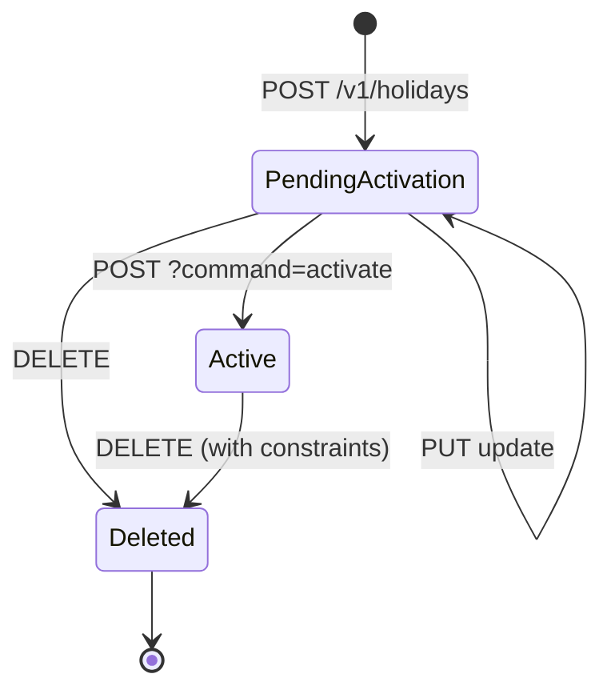

`HolidaysApiResource` exposes office-scoped holidays. A holiday declares a date range during which the institution is closed; the loan engine consults active holidays to decide whether to reschedule repayments that fall inside the window. Each holiday is linked to one or more offices and to a `repaymentScheduleAdjustmentType`.

## Source

```
fineract-provider/src/main/java/org/apache/fineract/organisation/holiday/api/HolidaysApiResource.java
```

| Annotation | Value |
| --- | --- |
| `@Path` | `/v1/holidays` |
| `@Component` | yes |
| `@Tag` | `Holidays` |

Injected collaborators:

- `PlatformSecurityContext context`
- `HolidayReadPlatformService holidayReadPlatformService`
- `PortfolioCommandSourceWritePlatformService commandsSourceWritePlatformService`
- `DefaultToApiJsonSerializer<HolidayData> toApiJsonSerializer`

## Permissions

Resource string: `HOLIDAY` (`HOLIDAY_RESOURCE_NAME`). Reads call `validateHasReadPermission("HOLIDAY")`. Writes are gated by `CREATE_HOLIDAY`, `UPDATE_HOLIDAY`, `DELETE_HOLIDAY`, `ACTIVATE_HOLIDAY`.

## Endpoint inventory

| HTTP | Path | Description | Command / Read service |
| --- | --- | --- | --- |
| `POST` | `/v1/holidays` | Create holiday | `createHoliday` |
| `POST` | `/v1/holidays/{holidayId}?command=activate` | Activate a pending holiday | `activateHoliday(holidayId)` |
| `GET` | `/v1/holidays/{holidayId}` | Fetch one holiday | `holidayReadPlatformService.retrieveHoliday(holidayId)` |
| `PUT` | `/v1/holidays/{holidayId}` | Update holiday | `updateHoliday(holidayId)` |
| `DELETE` | `/v1/holidays/{holidayId}` | Delete holiday | `deleteHoliday(holidayId)` |
| `GET` | `/v1/holidays` | List holidays for an office, optionally filtered by date range | `holidayReadPlatformService.retrieveAllHolidaysBySearchParameters(...)` |
| `GET` | `/v1/holidays/template` | Repayment-reschedule type options | `holidayReadPlatformService.retrieveHolidayTemplate()` |

## Source excerpt — list with filters

```java
@GET
@Consumes(MediaType.APPLICATION_JSON)
@Produces(MediaType.APPLICATION_JSON)
public String retrieveAllHolidays(@Context final UriInfo uriInfo,
        @QueryParam("officeId") final Long officeId,
        @QueryParam("fromDate") final DateParam fromDateParam,
        @QueryParam("toDate") final DateParam toDateParam,
        @QueryParam("locale") final String locale,
        @QueryParam("dateFormat") final String dateFormat) {
    this.context.authenticatedUser().validateHasReadPermission(HOLIDAY_RESOURCE_NAME);
    // ...
}
```

Filters:

| Param | Notes |
| --- | --- |
| `officeId` | required for non-super-user reads |
| `fromDate`, `toDate` | optional range filter |
| `locale`, `dateFormat` | required when date filters are supplied |

## Source excerpt — command dispatch

```java
@POST
@Path("{holidayId}")
public String handleCommands(@PathParam("holidayId") final Long holidayId,
        @QueryParam("command") final String commandParam,
        final String jsonApiRequest) {
    final CommandWrapperBuilder builder = new CommandWrapperBuilder().withJson(jsonApiRequest);
    CommandProcessingResult result = null;
    if (is(commandParam, "activate")) {
        result = commandsSourceWritePlatformService.logCommandSource(
            builder.activateHoliday(holidayId).build());
    }
    if (result == null) {
        throw new UnrecognizedQueryParamException("command", commandParam);
    }
    return toApiJsonSerializer.serialize(result);
}
```

Only one `command=` value is supported today: `activate`.

## Canonical curl

```bash
# Create a holiday spanning 25-26 December for branches 1 and 5
curl -k -u mifos:password \
  -H "Fineract-Platform-TenantId: default" \
  -H "Content-Type: application/json" \
  -X POST https://localhost:8443/fineract-provider/api/v1/holidays \
  -d '{
    "name": "Christmas",
    "fromDate": "25 December 2024",
    "toDate": "26 December 2024",
    "repaymentsRescheduledTo": "27 December 2024",
    "reshedulingType": 1,
    "offices": [ {"officeId": 1}, {"officeId": 5} ],
    "locale": "en",
    "dateFormat": "dd MMMM yyyy"
  }'

# Activate it
curl -k -u mifos:password \
  -H "Fineract-Platform-TenantId: default" \
  -X POST 'https://localhost:8443/fineract-provider/api/v1/holidays/3?command=activate' \
  -d '{}'
```

## Request body — POST

| Field | Required | Notes |
| --- | --- | --- |
| `name` | yes | Display name |
| `fromDate`, `toDate` | yes | Inclusive range; can be a single day |
| `reshedulingType` | yes | `1` = move to next repayment date; `2` = move to a specific date |
| `repaymentsRescheduledTo` | when `reshedulingType=2` | The specific replacement date |
| `description` | no | Free text |
| `offices` | yes | Array of `{ officeId }` — at least one |
| `locale`, `dateFormat` | yes | |

## Read DTO

`org.apache.fineract.organisation.holiday.data.HolidayData`:

```json
{
  "id": 3,
  "name": "Christmas",
  "description": null,
  "fromDate": [2024, 12, 25],
  "toDate": [2024, 12, 26],
  "repaymentsRescheduledTo": [2024, 12, 27],
  "status": { "id": 100, "code": "holidayStatusType.pendingActivation", "value": "Pending For Activation" },
  "offices": [
    { "officeId": 1, "officeName": "Head Office" },
    { "officeId": 5, "officeName": "Anytown Branch" }
  ]
}
```

After activation `status.id` becomes `300` (`holidayStatusType.active`); the loan reschedule engine only consults active holidays.

## Repayment rescheduling

`reshedulingType` values:

| id | code | Effect on overlapping repayment dates |
| --- | --- | --- |
| 1 | `RESCHEDULETONEXTREPAYMENTDATE` | Move forward to the next scheduled repayment |
| 2 | `RESCHEDULETOSPECIFICDATE` | Move to `repaymentsRescheduledTo` |

The behaviour is also gated by the global configurations `reschedule-future-repayments` and `allow-transactions-on-non-workingday`. See [Working days](/api/working-days) for the related setting.

## Lifecycle



Status `id=100` is `pendingActivation`; `id=300` is `active`; `id=400` is `deleted`. Only `active` holidays influence the loan-repayment scheduler.

## Common pitfalls

- **`reshedulingType=2` requires `repaymentsRescheduledTo`** to fall on or after `toDate` and to be a working day. Otherwise the validator raises `error.msg.holiday.repaymentsRescheduledTo.before.toDate`.
- **`offices` must be non-empty** at create time. The validator raises `error.msg.holiday.atleastone.office.is.required`.
- **Activation is irreversible.** There is no `?command=deactivate`. To inactivate, `DELETE` the holiday — but only before the date window is in the past; deleting a past holiday is rejected to preserve the audit trail.
- **Updates after activation** are restricted to `description` and `offices`. Changing the dates after activation is rejected with `error.msg.holiday.cannot.update.dates.after.activation`.

## Sample curl — list active holidays for office 1

```bash
curl -k -u mifos:password \
  -H "Fineract-Platform-TenantId: default" \
  "https://localhost:8443/fineract-provider/api/v1/holidays?officeId=1&fromDate=01%20January%202024&toDate=31%20December%202024&locale=en&dateFormat=dd%20MMMM%20yyyy"
```

## Cross-references

- [Offices](/api/offices) — parent for `offices[]`.
- [Working days](/api/working-days) — weekly non-working schedule (the other half of "what counts as a working day").
- [Organisation → Holidays](/organisation/holidays) — domain model and reschedule semantics.
- [API conventions](/api/conventions) — envelope and `command=`.
