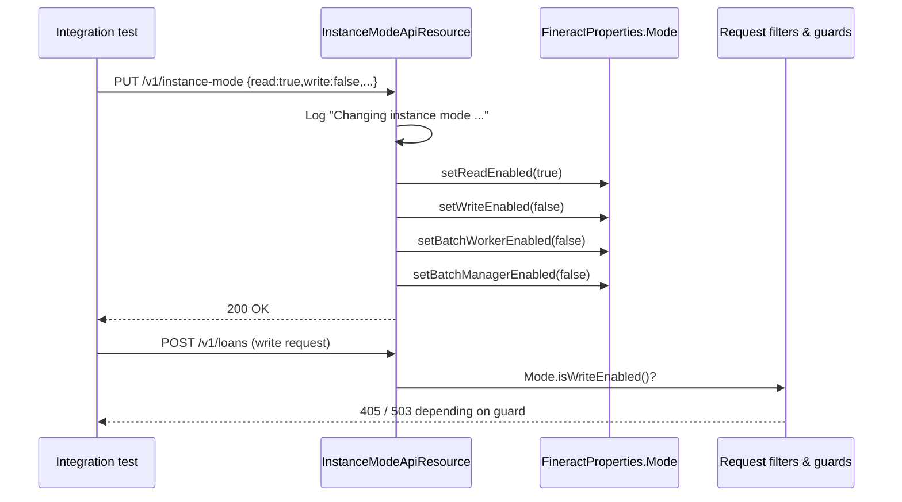

The Instance Mode API is a **test-profile-only** trap-door that lets Apache Fineract integration tests switch the running JVM between read-only, write-enabled, batch-worker, and batch-manager roles without restarting the process. The same flags are normally read from `FineractProperties.Mode` at startup and govern which JAX-RS, scheduler, and batch-job beans are active in production deployments.

Use it from integration suites that need to simulate a horizontally scaled Fineract cluster — for example, to verify that the batch-manager pod becomes the only node dispatching `LoanCOBExecutorBatchJob` work while several batch-worker pods consume the queue.

## Source

| Aspect | Value |
| --- | --- |
| Resource class | `org.apache.fineract.infrastructure.instancemode.api.InstanceModeApiResource` |
| File | `fineract-provider/src/main/java/org/apache/fineract/infrastructure/instancemode/api/InstanceModeApiResource.java` |
| JAX-RS `@Path` | `/v1/instance-mode` |
| Swagger tag | `Instance Mode` |
| Active Spring profile | `FineractProfiles.TEST` (the `test` profile constant) |
| Backing config bean | `FineractProperties.Mode` |
| DTO | `InstanceModeApiResourceSwagger.ChangeInstanceModeRequest` |

The bean implements `InitializingBean`. A startup banner logs `DO NOT USE THIS IN PRODUCTION!` every time it is constructed, so the warning is impossible to miss in CI logs.

## Endpoints

| Method | Path | Description | Command handler | Permission |
| --- | --- | --- | --- | --- |
| `PUT` | `/v1/instance-mode` | Apply the four flags from the body to `FineractProperties.Mode`. | Inline — no `CommandWrapper`, no audit row. | None — gated by the `TEST` Spring profile only. |

There is no `GET` companion: callers are expected to know which mode they pushed.

## Request body

The deserialiser binds to `InstanceModeApiResourceSwagger.ChangeInstanceModeRequest`. All four boolean fields are `required = true` in the Swagger schema and there are no defaults — the caller must send the full quartet on every call.

```json
{
  "readEnabled": true,
  "writeEnabled": false,
  "batchWorkerEnabled": false,
  "batchManagerEnabled": false
}
```

| Field | Effect when `true` | Backing setter |
| --- | --- | --- |
| `readEnabled` | The read endpoints (`GET`) are served by this instance. | `FineractProperties.Mode.setReadEnabled(boolean)` |
| `writeEnabled` | The command / write endpoints (`POST`, `PUT`, `DELETE`) are served. | `FineractProperties.Mode.setWriteEnabled(boolean)` |
| `batchWorkerEnabled` | Spring Batch worker beans are wired and consume partition work. | `FineractProperties.Mode.setBatchWorkerEnabled(boolean)` |
| `batchManagerEnabled` | Spring Batch manager beans coordinate partitioned jobs. | `FineractProperties.Mode.setBatchManagerEnabled(boolean)` |

## Response

A bare `200 OK` from `Response.ok().build()` — no body, no command-processing envelope, and no `resourceId`. Callers verify success purely from the HTTP status.

## Source — full handler

```java
@PUT
@Consumes({ MediaType.APPLICATION_JSON })
@Operation(summary = "Changes the Fineract instance mode")
public Response changeMode(InstanceModeApiResourceSwagger.ChangeInstanceModeRequest request) {
    log.warn("Changing instance mode according to the request parameters {}", request);
    fineractProperties.getMode().setReadEnabled(request.isReadEnabled());
    fineractProperties.getMode().setWriteEnabled(request.isWriteEnabled());
    fineractProperties.getMode().setBatchWorkerEnabled(request.isBatchWorkerEnabled());
    fineractProperties.getMode().setBatchManagerEnabled(request.isBatchManagerEnabled());
    return Response.ok().build();
}
```

Each call replaces all four flags. There is no read-modify-write helper, so a caller that wants to toggle a single flag must send the other three at their current values.

## Mode-flip flow



Beans that snapshot the flags at construction keep their previous behaviour; the endpoint is most useful for tests that exercise per-request guards which re-read `FineractProperties.Mode` on every call.

## Canonical curl

```bash
# Make the JVM behave as a read-only worker
curl -k -u mifos:password \
  -H "Fineract-Platform-TenantId: default" \
  -H "Content-Type: application/json" \
  -X PUT https://localhost:8443/fineract-provider/api/v1/instance-mode \
  -d '{
    "readEnabled": true,
    "writeEnabled": false,
    "batchWorkerEnabled": false,
    "batchManagerEnabled": false
  }'

# Make the JVM the batch manager and disable writes from outside
curl -k -u mifos:password \
  -H "Fineract-Platform-TenantId: default" \
  -H "Content-Type: application/json" \
  -X PUT https://localhost:8443/fineract-provider/api/v1/instance-mode \
  -d '{
    "readEnabled": true,
    "writeEnabled": true,
    "batchWorkerEnabled": false,
    "batchManagerEnabled": true
  }'
```

## Test usage patterns

A common integration-test idiom is:

```java
// Before the test: make the JVM behave as a read-only replica
restTemplate.exchange(
    "/api/v1/instance-mode",
    HttpMethod.PUT,
    new HttpEntity<>(Map.of(
        "readEnabled", true,
        "writeEnabled", false,
        "batchWorkerEnabled", false,
        "batchManagerEnabled", false), headers),
    Void.class);

// Now the write call we expect to be blocked
ResponseEntity<String> response = restTemplate.exchange(
    "/api/v1/loans", HttpMethod.POST, request, String.class);
assertThat(response.getStatusCode()).isEqualTo(HttpStatus.METHOD_NOT_ALLOWED);

// After the test: restore the all-in-one mode
restTemplate.exchange(
    "/api/v1/instance-mode", HttpMethod.PUT,
    new HttpEntity<>(Map.of(
        "readEnabled", true, "writeEnabled", true,
        "batchWorkerEnabled", true, "batchManagerEnabled", true), headers),
    Void.class);
```

Tests that flip the manager/worker flags usually also reset Spring Batch state (job repository, lock tables) between cases — see `org.apache.fineract.batch.*` fixtures.

## Production gating

`@Profile(FineractProfiles.TEST)` ensures the bean is absent in non-test profiles. Outside tests the path resolves to 404 because no JAX-RS resource is registered for `/v1/instance-mode`. The `afterPropertiesSet()` startup banner is intentionally noisy so that any deployment with the test profile accidentally enabled lights up the logs:

```text
------------------------------------------------------------
DO NOT USE THIS IN PRODUCTION!
Instance type changing feature is enabled
DO NOT USE THIS IN PRODUCTION!
------------------------------------------------------------
```

## Operational notes

- The endpoint is not audited (no `CommandWrapper`, no `m_portfolio_command_source` row). Use server-side logs to reconstruct mode flips.
- Concurrent in-flight requests on the JVM finish under the previous flags — the change is observed only by subsequent calls into beans that re-read `FineractProperties.Mode`.
- Combine with [/api/internal-configurations](/api/internal-configurations) when the test also needs to mutate persistent `c_configuration` rows; that endpoint is also `TEST`-profile-gated.
- For production deployments, set the four flags through environment variables (`FINERACT_MODE_READ_ENABLED`, `FINERACT_MODE_WRITE_ENABLED`, `FINERACT_MODE_BATCH_WORKER_ENABLED`, `FINERACT_MODE_BATCH_MANAGER_ENABLED`) and restart the pod.

## Role matrix

The four flags collectively encode the role a pod plays in a Fineract deployment:

| readEnabled | writeEnabled | batchManagerEnabled | batchWorkerEnabled | Conventional role |
| --- | --- | --- | --- | --- |
| `true` | `true` | `true` | `true` | All-in-one (single-pod default). |
| `true` | `true` | `false` | `false` | API server backing a load balancer. |
| `true` | `false` | `false` | `false` | Read-only replica behind a CQRS edge. |
| `false` | `false` | `true` | `false` | Dedicated batch manager. |
| `false` | `false` | `false` | `true` | Pure batch worker — no HTTP traffic expected. |
| `true` | `true` | `false` | `true` | API server doubling as a worker. |

Mixed `readEnabled=false, writeEnabled=true` is a misconfiguration: write endpoints typically need to read first.

## Interaction with FineractProperties.Mode

`FineractProperties.Mode` is a Lombok `@Data` POJO bound from `application.yaml` (or environment variables) under `fineract.mode.*`. Its setters are public, so the API does nothing more than invoke them after the JSON deserialiser has filled the request DTO. The fields are read by:

- Spring conditional bean factories that decide whether to register batch job beans (`@ConditionalOnProperty("fineract.mode.batch-manager-enabled")`).
- Request filters that 405-out write endpoints when `writeEnabled` is `false`.
- The custom JAX-RS feature `InstanceModeFilter` which short-circuits requests addressed to roles the JVM is not playing.

A change made through `PUT /v1/instance-mode` therefore reaches every consumer that re-reads the flag on each call, but not consumers that snapshot at bean-construction time.

## Failure modes

| Symptom | Likely cause |
| --- | --- |
| `404 Not Found` for `/v1/instance-mode` | Spring profile `test` not active — the bean is not registered. |
| `400 Bad Request` | One of the four boolean fields is missing or not a JSON boolean. |
| Mode flips but new writes still go through | Beans snapshotting `FineractProperties.Mode` at construction; restart or use a guard that re-reads on each invocation. |
| Banner appears in production logs | The deployment is incorrectly running with the `test` profile — disable it immediately. |

## Related subsystems

- Subsystem overview: [/config/instance-mode](/config/instance-mode-api)
- Persistent feature flags: [/api/global-configuration](/api/global-configuration)
- Companion trap-door for property updates: [/api/internal-configurations](/api/internal-configurations)
- Batch role consumers: [/api/scheduler-jobs](/api/scheduler-jobs), [/api/inline-jobs](/api/inline-jobs)
- API conventions: [/api/conventions](/api/conventions)
