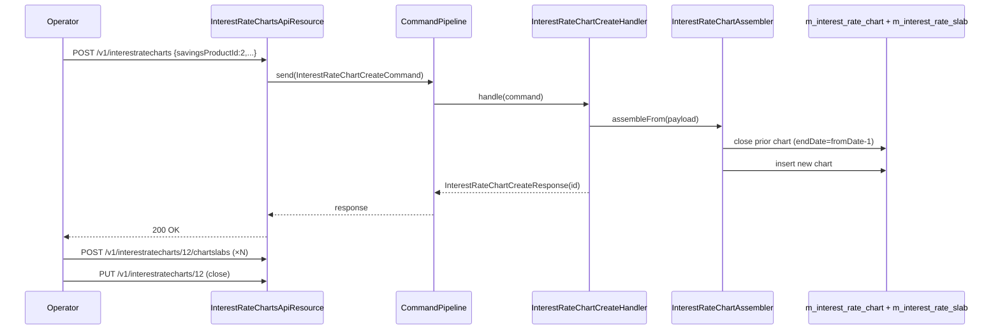

`InterestRateChartsApiResource` is the JAX-RS resource that maintains Apache Fineract's **interest rate charts** — dated rate schemes attached to a term-deposit product (fixed deposit or recurring deposit). Each chart owns a list of **chart slabs** that map a deposit-period band to an annual interest rate, plus optional **incentives** that adjust the rate based on client attributes (gender, age, KYC level, ...).

Slabs are exposed through their own resource: see [Interest Rate Chart Slabs](/api/interest-rate-chart-slabs).

## Source

- **File:** `fineract-provider/src/main/java/org/apache/fineract/portfolio/interestratechart/api/InterestRateChartsApiResource.java`
- **Class path annotation:** `@Path("/v1/interestratecharts")`
- **OpenAPI tag:** `Interest Rate Chart`
- **Class-level annotations:** `@Consumes({ MediaType.APPLICATION_JSON })`, `@Produces({ MediaType.APPLICATION_JSON })`, `@Component`

Constructor-injected dependencies:

- `InterestRateChartReadService chartReadPlatformService` — read store.
- `CommandPipeline commandPipeline` — typed command dispatcher (same model as [Payment Types](/api/payment-types)).

## Endpoints

| Method | Path | Description | Command / Handler | Permission |
| ------ | ---- | ----------- | ----------------- | ---------- |
| GET | `/v1/interestratecharts/template` | Return template/options for new-chart UI (no parent product required). | `chartReadPlatformService.template()` | Authenticated |
| GET | `/v1/interestratecharts?productId={id}` | List all charts attached to a term-deposit product, with their slabs. | `chartReadPlatformService.retrieveAllWithSlabs(productId)` | Authenticated |
| GET | `/v1/interestratecharts/{chartId}?associations=chartSlabs` | Retrieve a chart; pass `associations=chartSlabs` to also include its slabs. | `chartReadPlatformService.retrieveOne(chartId)` or `retrieveOneWithSlabs(chartId)` | Authenticated |
| POST | `/v1/interestratecharts` | Create a new chart on a term-deposit product. | `commandPipeline.send(new InterestRateChartCreateCommand(request))` | `CREATE_INTERESTRATECHART` |
| PUT | `/v1/interestratecharts/{chartId}` | Update an existing chart. | `commandPipeline.send(new InterestRateChartUpdateCommand(request))` | `UPDATE_INTERESTRATECHART` |
| DELETE | `/v1/interestratecharts/{chartId}` | Delete the chart and cascade its slabs. | `commandPipeline.send(new InterestRateChartDeleteCommand(...))` | `DELETE_INTERESTRATECHART` |

The `associations` query parameter is compared against `InterestRateChartApiConstants.chartSlabs` (literal value `"chartSlabs"`).

## Request / response examples

### Template

`GET /v1/interestratecharts/template`

```json
{
  "periodTypes": [
    { "id": 0, "code": "interestChartPeriodType.days",   "value": "Days" },
    { "id": 1, "code": "interestChartPeriodType.weeks",  "value": "Weeks" },
    { "id": 2, "code": "interestChartPeriodType.months", "value": "Months" },
    { "id": 3, "code": "interestChartPeriodType.years",  "value": "Years" }
  ]
}
```

### List for a product

`GET /v1/interestratecharts?productId=2`

```json
[
  {
    "id": 12,
    "name": "FD Standard 2025",
    "fromDate": [2025,1,1],
    "endDate": null,
    "savingsProductId": 2,
    "savingsProductName": "Fixed Deposit – USD",
    "chartSlabs": [
      { "id": 101, "periodType": { "id": 2, "value": "Months" }, "fromPeriod": 1, "toPeriod": 11,  "annualInterestRate": 3.0 },
      { "id": 102, "periodType": { "id": 2, "value": "Months" }, "fromPeriod": 12, "toPeriod": null, "annualInterestRate": 5.0 }
    ]
  }
]
```

### Create

`POST /v1/interestratecharts`

`InterestRateChartCreateRequest`:

```json
{
  "name": "FD Standard 2025",
  "savingsProductId": 2,
  "fromDate": "01 January 2025",
  "endDate": null,
  "locale": "en",
  "dateFormat": "dd MMMM yyyy"
}
```

Handler:

```java
final var command = new InterestRateChartCreateCommand();
command.setPayload(request);
final Supplier<InterestRateChartCreateResponse> responseSupplier = commandPipeline.send(command);
return responseSupplier.get();
```

Response — `InterestRateChartCreateResponse` (`CommandProcessingResult` flavor):

```json
{
  "resourceId": 12,
  "changes": {}
}
```

### Update

`PUT /v1/interestratecharts/12`

```json
{
  "name": "FD Standard 2025 (revised)",
  "endDate": "31 December 2025",
  "locale": "en",
  "dateFormat": "dd MMMM yyyy"
}
```

The path id is set into the request body before dispatching:

```java
request.setId(chartId);
```

Response — `InterestRateChartUpdateResponse`:

```json
{
  "resourceId": 12,
  "changes": {
    "endDate": "2025-12-31",
    "name": "FD Standard 2025 (revised)"
  }
}
```

### Delete

`DELETE /v1/interestratecharts/12`

```json
{
  "resourceId": 12,
  "changes": {}
}
```

## Data carriers

- **Requests:** `InterestRateChartCreateRequest`, `InterestRateChartUpdateRequest`, `InterestRateChartDeleteRequest` (builder).
- **Responses:** `InterestRateChartData` (reads — joined with `InterestRateChartSlabData`), `InterestRateChartCreateResponse`, `InterestRateChartUpdateResponse`, `InterestRateChartDeleteResponse` (writes).
- **Commands:** `InterestRateChartCreateCommand`, `InterestRateChartUpdateCommand`, `InterestRateChartDeleteCommand`.

## Permissions

Permission enforcement is handled inside the typed command handlers via `PlatformUserRightsContext`, against `CREATE_INTERESTRATECHART`, `UPDATE_INTERESTRATECHART` and `DELETE_INTERESTRATECHART`.

## Lifecycle integration

- A chart with `fromDate` in the past and `endDate` null is the **active** chart for its product.
- Adding a new chart with a future `fromDate` automatically closes the prior chart (sets `endDate = newChart.fromDate - 1`). This is enforced by `InterestRateChartAssembler#assembleFrom`.
- Deleting a chart fails if it is referenced by any account's locked-in slab — the chart on an account is captured at activation and persists for the term of the deposit, so live accounts pin the chart in place.

## End-to-end flow



## Canonical curl

```bash
# Template
curl -k -u mifos:password \
  -H "Fineract-Platform-TenantId: default" \
  https://localhost:8443/fineract-provider/api/v1/interestratecharts/template

# List for a product
curl -k -u mifos:password \
  -H "Fineract-Platform-TenantId: default" \
  'https://localhost:8443/fineract-provider/api/v1/interestratecharts?productId=2'

# Create a new chart
curl -k -u mifos:password \
  -H "Fineract-Platform-TenantId: default" \
  -H "Content-Type: application/json" \
  -X POST https://localhost:8443/fineract-provider/api/v1/interestratecharts \
  -d '{
    "name": "FD Standard 2025",
    "savingsProductId": 2,
    "fromDate": "01 January 2025",
    "locale": "en",
    "dateFormat": "dd MMMM yyyy"
  }'

# Close the chart
curl -k -u mifos:password \
  -H "Fineract-Platform-TenantId: default" \
  -H "Content-Type: application/json" \
  -X PUT https://localhost:8443/fineract-provider/api/v1/interestratecharts/12 \
  -d '{
    "endDate": "31 December 2025",
    "locale": "en",
    "dateFormat": "dd MMMM yyyy"
  }'
```

## Validation rules

- `fromDate` is mandatory and must be unique within the parent product's chart timeline (overlap raises `error.msg.interestratechart.overlap`).
- `endDate`, if supplied, must be ≥ `fromDate`.
- Closing a chart while leaving live accounts referencing future slabs is allowed — accounts retain the chart they activated against.
- Deleting a chart referenced by any locked-in slab on an active deposit account raises `InterestRateChartCannotBeDeletedException`.

## Slab and incentive sub-resources

- **Slabs:** `/v1/interestratecharts/{chartId}/chartslabs/...` — period-band rates. See [Interest rate chart slabs](/api/interest-rate-chart-slabs).
- **Incentives:** slabs have nested `/incentives/...` rows that override the rate when the depositing client matches a set of attribute predicates (gender, age band, KYC level, client classification).

## Error responses

| HTTP | When |
| --- | --- |
| `400 Bad Request` | Missing `fromDate`, overlapping date ranges, `endDate < fromDate`. |
| `403 Forbidden` | Missing `*_INTERESTRATECHART` permission. |
| `404 Not Found` | `chartId` or `productId` unknown. |
| `409 Conflict` | Delete blocked by live account references. |

## Cross-links

- [Interest rate chart slabs](/api/interest-rate-chart-slabs) — child rate bands.
- [Fixed deposit products](/savings/fixed-deposit) — owner of charts.
- [Recurring deposit products](/savings/recurring-deposit) — also charts-owner.
- [Interest rate charts overview](/portfolio/interest-rate-charts)
- [API conventions](/api/conventions) — envelopes and `associations=`.
