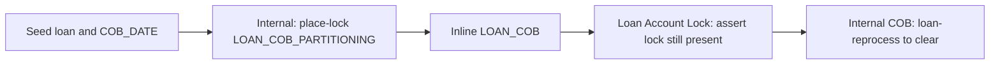

The Internal Loan Account Lock API is a **test-only** companion to the production [Loan Account Lock](/api/loan-account-lock) endpoint. It lets integration tests synthesise a `LoanAccountLock` row directly — choosing the loan id, the `LockOwner` value, and optionally an error message — without having to drive the close-of-business pipeline. Apache Fineract uses it inside the COB integration suite to exercise the "locked loan" branches of LOAN_COB without actually running the job.

<Warning>
This resource is guarded by `@Profile(FineractProfiles.TEST)`. It is **only** registered with Spring when the `test` profile is active, and its `afterPropertiesSet` callback logs a loud `DO NOT USE THIS IN PRODUCTION!` banner on startup. Production Fineract deployments must run without `test` in `SPRING_PROFILES_ACTIVE` so that the bean — and therefore the JAX-RS path — does not exist.
</Warning>

## Source

| Aspect | Value |
| --- | --- |
| Resource class | `org.apache.fineract.cob.api.InternalLoanAccountLockApiResource` |
| File | `fineract-provider/src/main/java/org/apache/fineract/cob/api/InternalLoanAccountLockApiResource.java` |
| JAX-RS `@Path` | `/v1/internal/loans` |
| Spring profile guard | `@Profile(FineractProfiles.TEST)` |
| Repository | `LoanAccountLockRepository` |
| Domain object | `LoanAccountLock` |
| Lock owner enum | `LockOwner` |
| Business-date source | `ThreadLocalContextUtil.getBusinessDateByType(COB_DATE)` |

The class also implements `InitializingBean` purely so it can emit the warning banner from `afterPropertiesSet()`:

```
DO NOT USE THIS IN PRODUCTION!
Internal client services mode is enabled
DO NOT USE THIS IN PRODUCTION!
```

## Endpoints

| Method | Path | Description | Command / handler | Permission |
| --- | --- | --- | --- | --- |
| `POST` | `/v1/internal/loans/{loanId}/place-lock/{lockOwner}` | Persist a `LoanAccountLock` for the loan with the chosen owner and the current COB business date. Body may include an `error` to mark the lock as a failure. | `LoanAccountLockRepository.save(new LoanAccountLock(...))` | None — relies on the `test` profile guard |

The handler verbatim:

```java
@POST
@Path("{loanId}/place-lock/{lockOwner}")
public Response placeLockOnLoanAccount(@Context final UriInfo uriInfo, @PathParam("loanId") Long loanId,
        @PathParam("lockOwner") String lockOwner, @RequestBody(required = false) LockRequest request) {

    LoanAccountLock loanAccountLock = new LoanAccountLock(loanId, LockOwner.valueOf(lockOwner),
            ThreadLocalContextUtil.getBusinessDateByType(BusinessDateType.COB_DATE));

    if (StringUtils.isNotBlank(request.getError())) {
        loanAccountLock.setError(request.getError(), request.getError());
    }
    loanAccountLockRepository.save(loanAccountLock);
    return Response.status(Response.Status.ACCEPTED).build();
}
```

## Path parameters

| Parameter | Type | Notes |
| --- | --- | --- |
| `loanId` | `Long` | Must point to an existing `m_loan` row. No referential check is performed up-front; the foreign-key constraint surfaces at flush time. |
| `lockOwner` | `String` | Must be one of the `LockOwner` enum constants (e.g. `LOAN_COB_PARTITIONING`, `LOAN_COB_CHUNK_PROCESSING`, `LOAN_INLINE_COB_PROCESSING`). Invalid values raise `IllegalArgumentException` from `LockOwner.valueOf(...)` and surface as a 500. |

## Request body

`LockRequest` is a small DTO (defined alongside the resource) with a single optional `error` field. Both arguments to `setError(message, stackTrace)` receive the same string, so the resulting row has identical content in `error_message` and `stack_trace`.

```json
{
  "error": "java.lang.IllegalStateException: synthetic test failure"
}
```

Send an empty body or omit the `error` field to create a clean lock — the same as a successful in-flight COB partition would.

## Response

The endpoint always returns `202 Accepted` with no body, mirroring how the real COB pipeline acknowledges a lock placement. To inspect the resulting row, call [`GET /v1/loans/locked`](/api/loan-account-lock).

## Example

```bash
# Place a partitioning-stage lock on loan 1042 with no error
curl -X POST -u mifos:password \
  -H 'fineract-platform-tenantid: default' \
  -H 'Content-Type: application/json' \
  'https://fineract.example.org/fineract-provider/api/v1/internal/loans/1042/place-lock/LOAN_COB_PARTITIONING' \
  -d '{}'

# Place a parked / failed lock with a synthetic error
curl -X POST -u mifos:password \
  -H 'fineract-platform-tenantid: default' \
  -H 'Content-Type: application/json' \
  'https://fineract.example.org/fineract-provider/api/v1/internal/loans/1042/place-lock/LOAN_COB_CHUNK_PROCESSING' \
  -d '{"error":"java.lang.IllegalStateException: simulated failure"}'
```

## Use in the COB test suite

The lock placed by this endpoint feeds two integration scenarios:

1. **Catch-up retry path** — call `place-lock/LOAN_COB_CHUNK_PROCESSING` with an `error`, then invoke [COB Catch-Up](/api/cob-catchup) and assert that the loan is reprocessed without manual intervention.
2. **Concurrent inline run** — call `place-lock/LOAN_INLINE_COB_PROCESSING`, then try the [Inline Job](/api/inline-jobs) `LOAN_COB` and verify that the inline path skips loans already owned by another worker.

When debugging in a local TEST instance, the `BUSINESS_DATE` and `COB_DATE` values used by the lock come from the request thread's `ThreadLocalContextUtil`; set them via the [Business Date](/api/business-date) endpoints before placing the lock.

## Related resources

- [Loan Account Lock](/api/loan-account-lock) — production read endpoint for the same table.
- [COB Catch-Up](/api/cob-catchup) and [Working Capital COB Catch-Up](/api/working-capital-cob-catchup) — drive the LOAN_COB job that consumes these locks.
- [Internal COB](/api/internal-cob) — TEST-only partition/fast-forward helpers in the same subsystem.
- [Inline Jobs](/api/inline-jobs) — fire `LOAN_COB` against a curated loan list while these locks are in place.
- [Business Date](/api/business-date) — set `COB_DATE` before placing the lock so that the row records a meaningful business date.

## Curl reference

Place a synthetic lock for partitioning tests:

```bash
curl -u mifos:password \
  -H "Fineract-Platform-TenantId: default" \
  -H "Content-Type: application/json" \
  -X POST https://example.org/fineract-provider/api/v1/internal/loans/101/place-lock/LOAN_COB_CHUNK_PROCESSING \
  -d '{
    "error": "simulated chunk failure",
    "stacktrace": "java.lang.RuntimeException: simulated"
  }'
```

The body is optional — omit it to place a clean lock without an error trail.

## Request body — `LockRequest`

| Field | Type | Notes |
| --- | --- | --- |
| `error` | string, optional | Written into `error_message` of `m_loan_account_locks`. |
| `stacktrace` | string, optional | Written into `stacktrace` of the same row. |

## Lock owner literals

The `{lockOwner}` path segment is a free string but the COB pipeline only honours a fixed vocabulary:

| Owner | Set by |
| --- | --- |
| `LOAN_COB_PARTITIONING` | Partitioner sweep. |
| `LOAN_COB_CHUNK_PROCESSING` | Step that owns the chunk. |
| `LOAN_INLINE_COB_PROCESSING` | Inline run via [Inline Jobs](/api/inline-jobs). |

Tests typically use one of these so that subsequent partition / chunk logic recognises the lock.

## Profile guard

The class is annotated `@Profile(FineractProfiles.TEST)`. On a production node (no `test` profile) the bean is not registered and JAX-RS returns `404 NOT_FOUND` for every call. On startup the bean logs `DO NOT USE THIS IN PRODUCTION!`.

## Related resources

- [Loan Account Lock](/api/loan-account-lock) — production read view of the same table.
- [Internal COB](/api/internal-cob) — partition inspector that operates against locked loans.
- [Inline Jobs](/api/inline-jobs) — the runtime that places `LOAN_INLINE_COB_PROCESSING` locks.

## Sample response

`POST /v1/internal/loans/{loanId}/place-lock/{lockOwner}` returns the JAX-RS `Response` envelope with `204 NO_CONTENT` on success. A duplicate lock for the same `(loanId, lockOwner)` pair returns `200 OK` and updates the `error` / `stacktrace` columns.

## Permissions

The handler explicitly does **not** call `validateHasReadPermission` or `validateHasUpdatePermission` — the profile guard is the only access control. Any authenticated user reaching the `test`-profile node can call it, which is by design: integration tests typically authenticate as the seeded admin.

## Test workflow



This is the canonical fixture pattern in `LoanCOBPartitionerIntegrationTest`.

## Notes

- The endpoint shares the `LOAN_ACCOUNT_LOCK` table with [Loan Account Lock](/api/loan-account-lock); a row placed here is observable via that public read endpoint.
- A lock placed with a non-canonical owner is harmless — the COB pipeline only filters on the known set, so the row is treated as opaque.
- There is no matching DELETE on this resource. To clear a lock during tests, complete the chunk it belongs to via [Internal COB](/api/internal-cob)'s `loan-reprocess`, or truncate the row directly in fixture-setup SQL.

## Why not in production

Production COB lock placement is fully owned by `LoanCOBPartitioner` and `LoanCOBChunkProcessor` — any manual lock from outside that flow risks orphaning the row and blocking subsequent COB runs. The TEST-only profile guard is deliberate; production deployments should never have a path to this endpoint.

## See also

- `LoanAccountLockData` in `org.apache.fineract.cob.data` for the column-to-field mapping shared with [Loan Account Lock](/api/loan-account-lock).
- The `LoanAccountLockRepository` for the underlying JPA repository used by both the public read endpoint and this internal write endpoint.

## Notes on integration testing

The `LockRequest` body is also used by the test bootstrapping utility classes to simulate a worker that crashed mid-chunk: an `error` plus a `stacktrace` string lets you assert that subsequent COB runs surface the failure through [Loan Account Lock](/api/loan-account-lock)'s read endpoint. This is the canonical setup for the "stuck loan" branch of the COB error-handling test suite.
