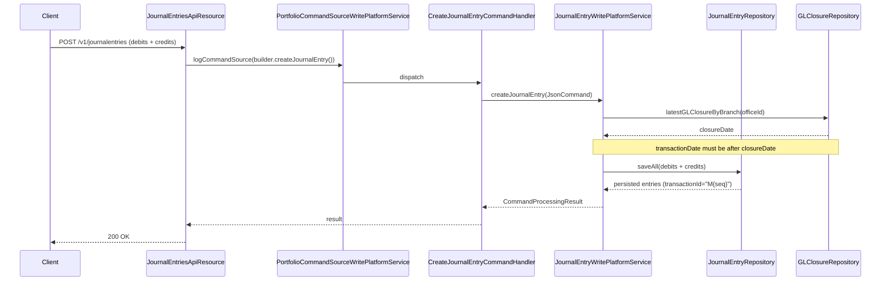

The Journal Entries API exposes balanced double-entry postings against the Apache Fineract General Ledger. Entries may originate from manual data entry, from automated postings produced by loan/savings/share transactions, or from the periodic provisioning and accrual jobs. Each entry references one or more GL accounts, an office, a transaction identifier, and an entry type (`DEBIT` / `CREDIT`).

## Source

| Aspect | Value |
| --- | --- |
| Resource class | `org.apache.fineract.accounting.journalentry.api.JournalEntriesApiResource` |
| File | `fineract-provider/src/main/java/org/apache/fineract/accounting/journalentry/api/JournalEntriesApiResource.java` |
| JAX-RS `@Path` | `/v1/journalentries` |
| Swagger tag | `Journal Entries` |
| Permission code | `JOURNALENTRY` |
| Read service | `JournalEntryReadPlatformService` |
| Builders | `CommandWrapperBuilder.createJournalEntry`, `reverseJournalEntry(txn)`, `updateRunningBalanceForJournalEntry`, `defineOpeningBalanceForJournalEntry` |

## Endpoints

| Method | Path | Description | Command / read handler | Permission |
| --- | --- | --- | --- | --- |
| `GET` | `/v1/journalentries` | Paginated list filtered by `officeId`, `glAccountId`, `manualEntriesOnly`, `fromDate`, `toDate`, `submittedOnDateFrom/To`, `transactionId`, `entityType`, `loanId`, `savingsId`, `runningBalance`, `transactionDetails`. | `JournalEntryReadPlatformService.retrieveAll(...)` | `READ_JOURNALENTRY` |
| `GET` | `/v1/journalentries/{journalEntryId}` | Retrieve a single GL entry; supports `runningBalance` and `transactionDetails`. | `JournalEntryReadPlatformService.retrieveGLJournalEntryById(...)` | `READ_JOURNALENTRY` |
| `POST` | `/v1/journalentries` | Create a balanced (or compound) manual journal entry. | `CommandWrapperBuilder.createJournalEntry()` → `CREATE_JOURNALENTRY` | `CREATE_JOURNALENTRY` |
| `POST` | `/v1/journalentries?command=updateRunningBalance` | Recompute running balances for an office (or all offices when `officeId` is omitted). | `updateRunningBalanceForJournalEntry()` → `UPDATERUNNINGBALANCE_JOURNALENTRY` | `UPDATERUNNINGBALANCE_JOURNALENTRY` |
| `POST` | `/v1/journalentries?command=defineOpeningBalance` | Post office opening balances. | `defineOpeningBalanceForJournalEntry()` → `DEFINEOPENINGBALANCE_JOURNALENTRY` | `DEFINEOPENINGBALANCE_JOURNALENTRY` |
| `POST` | `/v1/journalentries/{transactionId}?command=reverse` | Reverse a posted transaction; throws `UnrecognizedQueryParamException` if `command` is anything else. | `reverseJournalEntry(transactionId)` → `REVERSE_JOURNALENTRY` | `REVERSE_JOURNALENTRY` |
| `GET` | `/v1/journalentries/provisioning?entryId=...` | List journal entries for a provisioning batch (`transactionId` becomes `"P" + entryId`, entity type `PROVISIONING`). | `JournalEntryReadPlatformService.retrieveAll(...)` | Authenticated |
| `GET` | `/v1/journalentries/openingbalance?officeId=...&currencyCode=...` | Office opening balances per currency. | `JournalEntryReadPlatformService.retrieveOfficeOpeningBalances(...)` | `READ_JOURNALENTRY` |
| `GET` | `/v1/journalentries/downloadtemplate` | Download bulk-import Excel template (`GlobalEntityType.GL_JOURNAL_ENTRIES`). | `BulkImportWorkbookPopulatorService.getTemplate(...)` | Authenticated |
| `POST` | `/v1/journalentries/uploadtemplate` | Multipart upload of populated journal-entries workbook. | `BulkImportWorkbookService.importWorkbook(...)` | Authenticated |

## Request body — create balanced entry

```json
{
  "officeId": 1,
  "transactionDate": "01 March 2024",
  "currencyCode": "USD",
  "comments": "Bank deposit",
  "referenceNumber": "REF-1029",
  "locale": "en",
  "dateFormat": "dd MMMM yyyy",
  "credits": [
    { "glAccountId": 12, "amount": 1000.00, "comments": "Cash drawer" }
  ],
  "debits": [
    { "glAccountId": 25, "amount": 1000.00, "comments": "Bank account" }
  ],
  "paymentTypeId": 1,
  "accountNumber": "00012345",
  "checkNumber": "00098",
  "routingCode": "RT-001",
  "receiptNumber": "RC-1234",
  "bankNumber": "BN-77"
}
```

Validation is performed by `JournalEntryCommand` and the deserialiser ensures the sum of debits equals the sum of credits.

## Request body — define opening balance

```json
{
  "officeId": 1,
  "currencyCode": "USD",
  "transactionDate": "01 January 2024",
  "locale": "en",
  "dateFormat": "dd MMMM yyyy",
  "assetAccountOpeningBalances": [ { "glAccountId": 1, "amount": 50000 } ],
  "liabilityAccountOpeningBalances": [],
  "equityAccountOpeningBalances": [ { "glAccountId": 7, "amount": 50000 } ],
  "incomeAccountOpeningBalances": [],
  "expenseAccountOpeningBalances": []
}
```

## Request body — update running balance

```json
{
  "officeId": 1
}
```

## Response — list

```json
{
  "totalFilteredRecords": 2,
  "pageItems": [
    {
      "id": 4231,
      "officeId": 1,
      "officeName": "Head Office",
      "glAccountName": "Loan Portfolio",
      "glAccountId": 32,
      "glAccountCode": "120001",
      "glAccountType": { "id": 1, "value": "ASSET" },
      "transactionDate": [2024, 3, 1],
      "entryType": { "id": 2, "value": "DEBIT" },
      "amount": 1000.00,
      "transactionId": "L-12-3",
      "manualEntry": false,
      "entityType": { "id": 1, "value": "LOAN" },
      "entityId": 12,
      "createdByUserId": 1,
      "createdDate": [2024, 3, 1, 9, 31, 22],
      "submittedOnDate": [2024, 3, 1],
      "createdByUserName": "mifos",
      "comments": "Loan disbursal",
      "reversed": false,
      "referenceNumber": null,
      "currency": { "code": "USD", "name": "US Dollar", "decimalPlaces": 2 }
    }
  ]
}
```

## Response — write

All write paths return a `CommandProcessingResult` containing `transactionId` (a string code such as `S1`, `L23`, or a UUID for manual entries) and `resourceId`.

## Posting flow



## Validation highlights

- The `debits.sum == credits.sum` check happens in `JournalEntryCommand.validateForCreate(...)`. Imbalance returns `error.msg.glJournalEntry.debit.credit.must.balance`.
- `currencyCode` must be the same on every line and the office must transact in that currency, otherwise `error.msg.glJournalEntry.unknown.currency.code`.
- `transactionDate` must be on or after the latest GL closure for the office. Otherwise `error.msg.journalEntry.cannot.be.created.on.or.before.previous.glClosure.date`.
- Manual entries cannot post to header accounts; the validator rejects with `error.msg.glJournalEntry.gl.account.is.invalid` (the GL account must be `usage = DETAIL`).

## Sample curl — reverse a transaction

```bash
curl -k -u mifos:password \
  -H "Fineract-Platform-TenantId: default" \
  -H "Content-Type: application/json" \
  -X POST "https://localhost:8443/fineract-provider/api/v1/journalentries/M99?command=reverse" \
  -d '{ "comments": "Reverse misposting", "locale": "en" }'
```

## Common pitfalls

- **Reversal produces new entries**, it does not soft-delete the originals. The two sets share the same `entityType` / `entityId` but with opposite `entryType`.
- **Running balance is lazy** — every `transaction` increments per-office, per-account running totals only when `updateRunningBalance` is invoked. The job `Update Account Running Balances` runs nightly by default.
- **`defineOpeningBalance` is idempotent per (office, currency)** — re-posting overwrites the prior entry rather than appending.

## Filter combinations

Useful filter combinations for `GET /v1/journalentries`:

| Use case | Query |
| --- | --- |
| Manual entries only | `?manualEntriesOnly=true` |
| One office for a month | `?officeId=1&fromDate=01 March 2024&toDate=31 March 2024&locale=en&dateFormat=dd MMMM yyyy` |
| All entries for a single loan | `?loanId=12` |
| Running balances per row | `?runningBalance=true` |
| All entries for a provisioning batch | `?transactionId=P15&entityType=PROVISIONING` |

## Related subsystems

- Subsystem overview: [/accounting/journal-entries](/accounting/journal-entries)
- Chart of accounts: [/api/gl-accounts](/api/gl-accounts)
- Period locking: [/api/gl-closures](/api/gl-closures)
- Periodic accrual postings: [/api/accrual-accounting](/api/accrual-accounting)
- Provisioning postings: [/api/provisioning-entries](/api/provisioning-entries)
- [/api/conventions](/api/conventions) — envelope, locale and error model.
