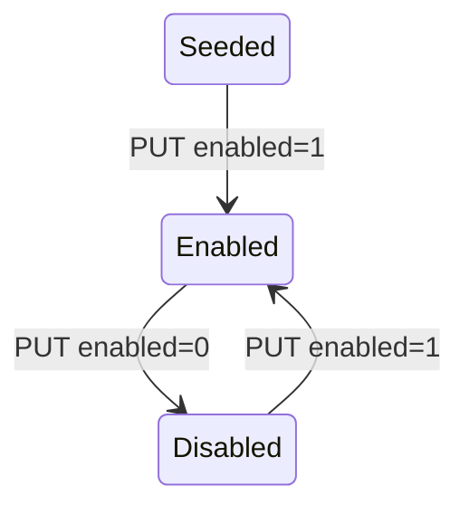

The Likelihood resource manages the demographic "likelihood" rows that pair with a PPI ([Progress out of Poverty Index](/api/surveys)) survey. For a given PPI, the likelihood table holds entries that map a fulfilled PPI **score** to the probability that the respondent falls below a given poverty line (see [Poverty Line](/api/poverty-line)). Each row is a column in the PPI grade table; this resource lets you read and edit them.

## Source

- **File**: `fineract-provider/src/main/java/org/apache/fineract/infrastructure/survey/api/LikelihoodApiResource.java`
- **Base path**: `@Path("/v1/likelihood")`
- **Permission entity**: `POVERTY_LINE` (shared with [Poverty Line](/api/poverty-line) via `PovertyLineApiConstants.POVERTY_LINE_RESOURCE_NAME`)
- **Tag**: `Likelihood`

Reads use `ReadLikelihoodService`; updates go through `PortfolioCommandSourceWritePlatformService` with the `updateLikelihood` command builder.

## Endpoints

| Method | Path | Description | Command handler | Permission |
| ------ | ---- | ----------- | --------------- | ---------- |
| GET | `/v1/likelihood/{ppiName}` | List likelihood rows for the named PPI survey | `ReadLikelihoodService.retrieveAll` | `READ_POVERTY_LINE` |
| GET | `/v1/likelihood/{ppiName}/{likelihoodId}` | Retrieve one likelihood row | `ReadLikelihoodService.retrieve` | `READ_POVERTY_LINE` |
| PUT | `/v1/likelihood/{ppiName}/{likelihoodId}` | Update the likelihood row (typically `enabled` or weight) | `CommandWrapperBuilder.updateLikelihood(id)` | `READ_POVERTY_LINE` (note: the source reuses the read permission) |

There is no POST or DELETE — likelihood rows are seeded with each PPI survey by the platform migrations; only updates are exposed.

The PUT handler reuses `validateHasReadPermission` (`POVERTY_LINE`), not an update permission. Treat that as an intentional design choice — likelihood configuration is broadly readable/writable by anyone who can read the PPI.

## Path parameters

| Parameter | Description |
| --------- | ----------- |
| `ppiName` | The registered name of the PPI datatable (e.g. `PPI Bangladesh`). |
| `likelihoodId` | The id of the row in `m_likelihood`. |

## Examples

### List likelihoods for a PPI

`GET /v1/likelihood/PPI%20Bangladesh`

```json
[
  {
    "id": 1,
    "name": "Bangladesh-100% National Line",
    "ppiName": "PPI Bangladesh",
    "code": "BD_NL_100",
    "enabled": 1
  },
  {
    "id": 2,
    "name": "Bangladesh-150% National Line",
    "ppiName": "PPI Bangladesh",
    "code": "BD_NL_150",
    "enabled": 0
  }
]
```

### Retrieve one

`GET /v1/likelihood/PPI%20Bangladesh/1`

```json
{
  "id": 1,
  "name": "Bangladesh-100% National Line",
  "ppiName": "PPI Bangladesh",
  "code": "BD_NL_100",
  "enabled": 1
}
```

### Update — enable a likelihood

`PUT /v1/likelihood/PPI%20Bangladesh/2`

```json
{ "enabled": 1 }
```

Response:

```json
{ "resourceId": 2, "changes": { "enabled": 1 } }
```

## Subsystem cross-links

- **[Surveys](/api/surveys)** — fulfil a PPI survey; each fulfilment's score is interpreted against the enabled likelihoods.
- **[Poverty Line](/api/poverty-line)** — the buckets each likelihood is calibrated against.
- **[SPM Scorecards](/api/spm-scorecards)** — the alternative SPM scoring path under `/v1/surveys/scorecards`.

## Notes

- The `ppiName` path segment is part of the URL but not strictly required by the read handler — `retrieve(likelihoodId)` looks up by id only. It exists for URL hygiene and to make logs more readable.
- `enabled = 0` rows are still returned by GET — they are simply ignored by scoring. Toggling `enabled = 1` reactivates them.
- The Likelihood and Poverty Line endpoints are paired; you almost always configure both for a given PPI.


## Endpoint reference

```java
@Path("/v1/likelihood")
public class LikelihoodApiResource {
    @GET  @Path("{ppiName}")        List<LikelihoodData> retrieveAll(@PathParam("ppiName") String);
    @GET  @Path("{ppiName}/{likelihoodId}") LikelihoodData retrieve(@PathParam("likelihoodId") Long);
    @PUT  @Path("{ppiName}/{likelihoodId}") String update(@PathParam("likelihoodId") Long, String json);
}
```

There is no POST or DELETE — likelihood rows are seeded by Liquibase migrations alongside the PPI datatable, and only the `enabled` flag and `likelihood` weight are operator-editable.

## Data model

| Field | Notes |
| ----- | ----- |
| `id` | Surrogate key. |
| `name` | Demographic label (e.g. "Urban", "Rural"). |
| `ppiName` | The PPI this likelihood belongs to. |
| `likelihood` | Decimal weight applied during score → poverty conversion. |
| `enabled` | 0 / 1. Disabled rows are ignored by scoring but still returned by GET. |

## Lifecycle



## Pairing with Poverty Line

Each likelihood maps to a column in `m_poverty_line` — call [`/v1/povertyLine/{ppiName}/{likelihoodId}`](/api/poverty-line) to retrieve the score → poverty-probability table for that demographic.

## Permissions

Reads use `READ_POVERTY_LINE` (the shared SPM read permission). Updates use `UPDATE_POVERTY_LINE`. The `POVERTY_LINE` resource therefore covers both this resource and `/v1/povertyLine`.

## Error semantics

| Failure | HTTP | Detail |
| ------- | ---- | ------ |
| Unknown `ppiName` | 200 with empty list | filter has no matches |
| Likelihood id not found | 404 | `likelihood.not.found` |
| Payload missing required field | 400 | platform validation error |

## cURL recipes

List likelihoods for PPI `ppi_kenya_2010`:

```bash
curl -u mifos:password      -H "Fineract-Platform-TenantId: default"      "https://localhost:8443/fineract-provider/api/v1/likelihood/ppi_kenya_2010"
```

Enable a likelihood:

```bash
curl -u mifos:password -X PUT      -H "Content-Type: application/json"      -d '{"enabled":1}'      "https://localhost:8443/fineract-provider/api/v1/likelihood/ppi_kenya_2010/4"
```

## Cross-links

- [Surveys](/api/surveys) — fulfilment endpoint.
- [Poverty Line](/api/poverty-line) — paired calibration data.
- [SPM Scorecards](/api/spm-scorecards) — alternative scoring path (does not consult likelihoods).


## Lookup helper

Pair this resource with `/v1/povertyLine/{ppiName}/{likelihoodId}` for scoring. The two endpoints share the `POVERTY_LINE` permission family so a single role grant covers both.

## Migration vs runtime updates

Adding a new likelihood row requires a Liquibase migration — there is no POST endpoint. Likewise, deleting a row requires a migration. The PUT endpoint only edits the `enabled` flag and `likelihood` weight.

## Operational note

Operators typically toggle a likelihood off when retiring a demographic (e.g. moving from a rural/urban split to an income-based split); the existing answer sets are preserved, but new fulfilments will not match the disabled demographic during scoring.


## Source extract

```java
@Path("/v1/likelihood")
@RequiredArgsConstructor
public class LikelihoodApiResource {

    private final PlatformSecurityContext context;
    private final LikelihoodReadPlatformService readPlatformService;
    private final PortfolioCommandSourceWritePlatformService commandWritePlatformService;
    private final DefaultToApiJsonSerializer<LikelihoodData> toApiJsonSerializer;
}
```

`ppiName` exists only as a path-hygiene segment; the read service looks up the row by `id` alone. That makes URL-rewriting tools that drop the `ppiName` segment still work, although they break readability.

## Pairing semantics

Each likelihood corresponds to a column in `m_poverty_line` for the same `ppiName`. The scoring engine uses both: pick the matching likelihood row for the client's demographic, then walk the poverty-line table for the score → poverty-probability conversion.
