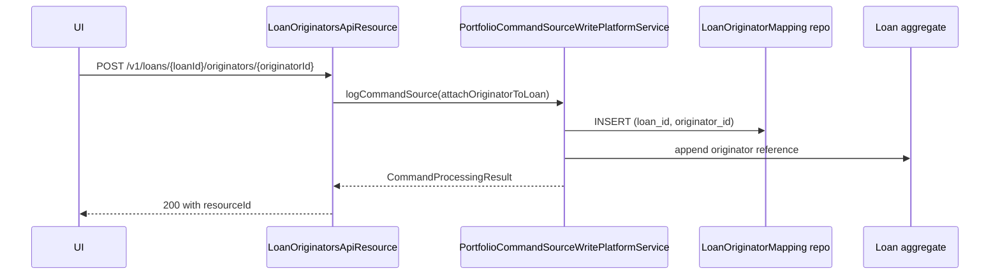

`LoanOriginatorsApiResource` is the JAX-RS resource that maintains the **loan-to-originator mapping** in Apache Fineract. It lets ops users attach an existing `LoanOriginator` record to a loan during the application stage and detach it again when needed. The originator itself (name, KYC, payout details) is maintained by the sibling resource [LoanOriginatorApiResource](/api/loan-originator).

The whole loan-origination module is feature-flagged: the bean is only registered when `fineract.module.loan-origination.enabled=true`.

## Source

- **File:** `fineract-loan-origination/src/main/java/org/apache/fineract/portfolio/loanorigination/api/LoanOriginatorsApiResource.java`
- **Class path annotation:** `@Path("/v1/loans")`
- **OpenAPI tag:** `Loan Originators` — *"Fetch loan originator details for a specific loan"*
- **Spring stereotype:** `@Component`
- **Conditional:** `@ConditionalOnProperty("fineract.module.loan-origination.enabled" = "true")`

Constructor-injected dependencies:

- `PlatformSecurityContext context`
- `LoanReadPlatformService loanReadPlatformService` — used for `existsByLoanId` and `retrieveLoanIdByExternalId` lookups.
- `LoanOriginatorReadPlatformService loanOriginatorReadPlatformService`
- `PortfolioCommandSourceWritePlatformService commandsSourceWritePlatformService`

Static config:

```java
private static final String LOAN_RESOURCE_NAME = "LOAN";
```

Note this resource's *read* permission gate is `READ_LOAN` — readers of originator-on-loan are considered loan readers.

## Endpoints

The resource exposes four logical operations (list, attach, detach, detach-all) — each in **four variants** (loan id × originator id; loan id × originator external id; loan external id × originator id; loan external id × originator external id) — for a total of 14 endpoints. Read endpoints come in two variants (by loan id and loan external id).

### Read

| Method | Path | Description | Command / Handler | Permission |
| ------ | ---- | ----------- | ----------------- | ---------- |
| GET | `/v1/loans/{loanId}/originators` | List originators attached to a loan. | `loanOriginatorReadPlatformService.retrieveByLoanId(loanId)` | `READ_LOAN` |
| GET | `/v1/loans/external-id/{loanExternalId}/originators` | Same, keyed by loan external id. | Resolve via `loanReadPlatformService.retrieveLoanIdByExternalId(...)` then as above. | `READ_LOAN` |

### Attach

| Method | Path | Description | Command / Handler | Permission |
| ------ | ---- | ----------- | ----------------- | ---------- |
| POST | `/v1/loans/{loanId}/originators/{originatorId}` | Attach an originator to a loan. | `CommandWrapperBuilder.attachLoanOriginator(loanId, originatorId)` → `ATTACH_LOAN_ORIGINATOR` | `ATTACH_LOAN_ORIGINATOR` |
| POST | `/v1/loans/{loanId}/originators/external-id/{originatorExternalId}` | Same, originator keyed by external id. | After `resolveIdByExternalId(...)` | `ATTACH_LOAN_ORIGINATOR` |
| POST | `/v1/loans/external-id/{loanExternalId}/originators/{originatorId}` | Same, loan keyed by external id. | – | `ATTACH_LOAN_ORIGINATOR` |
| POST | `/v1/loans/external-id/{loanExternalId}/originators/external-id/{originatorExternalId}` | Both keyed by external id. | – | `ATTACH_LOAN_ORIGINATOR` |

### Detach (single)

| Method | Path | Description | Command / Handler | Permission |
| ------ | ---- | ----------- | ----------------- | ---------- |
| DELETE | `/v1/loans/{loanId}/originators/{originatorId}` | Detach an originator from a loan. | `CommandWrapperBuilder.detachLoanOriginator(loanId, originatorId)` → `DETACH_LOAN_ORIGINATOR` | `DETACH_LOAN_ORIGINATOR` |
| DELETE | `/v1/loans/{loanId}/originators/external-id/{originatorExternalId}` | Same, originator keyed by external id. | – | `DETACH_LOAN_ORIGINATOR` |
| DELETE | `/v1/loans/external-id/{loanExternalId}/originators/{originatorId}` | Same, loan keyed by external id. | – | `DETACH_LOAN_ORIGINATOR` |
| DELETE | `/v1/loans/external-id/{loanExternalId}/originators/external-id/{originatorExternalId}` | Both keyed by external id. | – | `DETACH_LOAN_ORIGINATOR` |

## Pre-conditions

- **Attach** — the loan must be in the *Submitted and Pending Approval* status, the originator must be `ACTIVE`, and there must not already be a mapping for that `(loanId, originatorId)` pair. Violations raise HTTP 403.
- **Detach** — the loan must be in the *Submitted and Pending Approval* status. After approval/disbursement, originator mappings become immutable so commissions and reporting remain auditable.

These checks are enforced by `LoanOriginatorWritePlatformServiceImpl` (the actual command handler).

## Code

```java
@POST
@Path("{loanId}/originators/{originatorId}")
public LoanOriginatorMappingResponse attachOriginatorToLoan(
        @PathParam("loanId") final Long loanId,
        @PathParam("originatorId") final Long originatorId) {
    final CommandWrapper commandRequest = new CommandWrapperBuilder()
        .attachLoanOriginator(loanId, originatorId).build();
    final CommandProcessingResult result =
        this.commandsSourceWritePlatformService.logCommandSource(commandRequest);
    return buildMappingResponse(result);
}
```

## Request / response examples

### List

`GET /v1/loans/101/originators`

```json
{
  "loanId": 101,
  "originators": [
    {
      "id": 7,
      "externalId": "ORIG-001",
      "name": "Acme Brokerage",
      "status": "ACTIVE",
      "commissionRate": 0.005
    }
  ]
}
```

### Attach

`POST /v1/loans/101/originators/7`

No body required. Response — `LoanOriginatorMappingResponse`:

```json
{
  "loanId": 101,
  "originatorId": 7,
  "resourceId": 31,
  "changes": {}
}
```

### Detach

`DELETE /v1/loans/101/originators/7`

```json
{
  "loanId": 101,
  "originatorId": 7,
  "resourceId": 31,
  "changes": {}
}
```

### Errors

- `404` — loan or originator not found.
- `403` — loan not in correct status, originator not `ACTIVE`, duplicate mapping, or missing permission.

## Data carriers

- **Read response:** `LoanOriginatorsResponse` — wraps a `List<LoanOriginatorData>` for the supplied loan.
- **Write response:** `LoanOriginatorMappingResponse` — built via `buildMappingResponse(CommandProcessingResult)` (extracts `loanId`, `originatorId`, `resourceId`, `changes`).

## Permissions

All read paths call:

```java
this.context.authenticatedUser().validateHasReadPermission(LOAN_RESOURCE_NAME);
```

Write paths delegate authorization to `PortfolioCommandSourceWritePlatformService` against `ATTACH_LOAN_ORIGINATOR` and `DETACH_LOAN_ORIGINATOR`.

## Cross-links

- [Loan originator CRUD](/api/loan-originator) — manage the originators referenced here.
- [Loans API](/loan/loan-rest-handlers) — owner of the `loanId`/`loanExternalId` path params.
- [Loan origination subsystem](/loan-origination/overview) — module overview.


## Endpoint reference (extended)

| Method | Path | Description |
| ------ | ---- | ----------- |
| GET    | `/v1/loans/{loanId}/originators` | List originators currently attached to the loan |
| GET    | `/v1/loans/external-id/{loanExternalId}/originators` | Same, addressed by loan external id |
| POST   | `/v1/loans/{loanId}/originators/{originatorId}` | Attach originator (numeric ids on both sides) |
| POST   | `/v1/loans/{loanId}/originators/external-id/{originatorExternalId}` | Attach by originator external id |
| POST   | `/v1/loans/external-id/{loanExternalId}/originators/{originatorId}` | Attach by loan external id |
| POST   | `/v1/loans/external-id/{loanExternalId}/originators/external-id/{originatorExternalId}` | Both sides by external id |
| DELETE | `/v1/loans/{loanId}/originators/{originatorId}` | Detach |

The four POST variants cover every combination of internal/external ids on each side; pick whichever your integration already has in hand.

## Sequence (attach)



## Mapping rules

- A loan may have **0..n** originators attached; the platform does not impose a maximum.
- An originator must be `active=true` (per [loan-originator](/api/loan-originator)) at attach time; the command handler refuses inactive originators.
- Duplicate attachments are rejected — the (loanId, originatorId) tuple is unique in `m_loan_originator_mapping`.

## Error semantics

| Failure | HTTP | Detail |
| ------- | ---- | ------ |
| Loan not found | 404 | `loan.not.found` |
| Originator not found | 404 | `loan.originator.not.found` |
| Originator inactive | 403 | `loan.originator.not.active` |
| Duplicate mapping | 403 | `loan.originator.mapping.duplicate` |
| Loan in disallowed state | 403 | `loan.originator.invalid.loan.state` |
| Maker–checker pending | 200 | `commandId` returned, mutation deferred |

## cURL recipes

Attach originator 7 to loan 101:

```bash
curl -u mifos:password -X POST      -H "Fineract-Platform-TenantId: default"      "https://localhost:8443/fineract-provider/api/v1/loans/101/originators/7"
```

Attach by both external ids:

```bash
curl -u mifos:password -X POST      -H "Fineract-Platform-TenantId: default"      "https://localhost:8443/fineract-provider/api/v1/loans/external-id/LN-2025-001/originators/external-id/BROKER-001"
```

Detach:

```bash
curl -u mifos:password -X DELETE      -H "Fineract-Platform-TenantId: default"      "https://localhost:8443/fineract-provider/api/v1/loans/101/originators/7"
```

## Operational notes

- Attaching an originator after disbursement is allowed (e.g. retrofitting historical data) but typically gated by an UPDATE_LOAN permission on top of `ATTACH_LOAN_ORIGINATOR`.
- The `LoanOriginatorMappingResponse` returned on attach echoes the resolved numeric ids — use it to bind the result of an external-id-based call back to your local cache.
