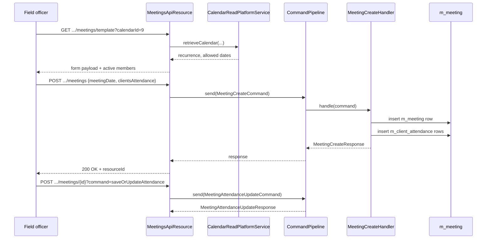

The Meetings API records meeting occurrences for group and center calendars in Apache Fineract and tracks per-client attendance. Each meeting belongs to a parent calendar (see [/api/calendars](/api/calendars)), is dated, and carries attendance records keyed by `clientId` and an attendance type code value. The resource is delivered through the modern `CommandPipeline` rather than the legacy `CommandWrapperBuilder`.

## Source

| Aspect | Value |
| --- | --- |
| Resource class | `org.apache.fineract.portfolio.meeting.api.MeetingsApiResource` |
| File | `fineract-provider/src/main/java/org/apache/fineract/portfolio/meeting/api/MeetingsApiResource.java` |
| JAX-RS `@Path` | `/v1/{entityType}/{entityId}/meetings` |
| Swagger tag | `Meetings` |
| Read services | `MeetingReadService`, `MeetingAttendanceReadService`, `MeetingAttendanceDropdownReadService`, `ClientReadPlatformService`, `CalendarReadPlatformService` |
| Command pipeline | `CommandPipeline.send(MeetingCreateCommand / MeetingUpdateCommand / MeetingDeleteCommand / MeetingAttendanceUpdateCommand)` |

## Supported entity types

Meeting attendance is supported only for `GROUPS` and `CENTERS` (`CalendarEntityType`). Calling the endpoints under `clients`, `loans`, or `savings` raises `MeetingNotSupportedResourceException` from the template handler and `CalendarEntityTypeNotSupportedException` from write handlers.

## Endpoints

| Method | Path | Description | Command / read handler | Permission |
| --- | --- | --- | --- | --- |
| `GET` | `/v1/{entityType}/{entityId}/meetings/template?calendarId=` | Build the meeting form data: active client members, calendar recurrence, attendance type options. | `clientReadPlatformService.retrieveActiveClientMembersOfGroup/Center(...)` + `calendarReadPlatformService.retrieveCalendar(...)` | Authenticated (handler-enforced) |
| `GET` | `/v1/{entityType}/{entityId}/meetings` | List recent meetings for the entity; `limit` truncates the result. | `MeetingReadService.retrieveMeetingsByEntity(entityId, entityTypeId, limit)` | Authenticated |
| `GET` | `/v1/{entityType}/{entityId}/meetings/{meetingId}` | Retrieve a single meeting plus per-client attendance. | `MeetingReadService.retrieveMeeting(...)` + `MeetingAttendanceReadService.retrieveClientAttendanceByMeetingId(...)` | Authenticated |
| `POST` | `/v1/{entityType}/{entityId}/meetings` | Create a meeting on a date that matches the parent calendar recurrence. | `MeetingCreateCommand` via `CommandPipeline` | Authenticated |
| `PUT` | `/v1/{entityType}/{entityId}/meetings/{meetingId}` | Update meeting date/notes. | `MeetingUpdateCommand` via `CommandPipeline` | Authenticated |
| `DELETE` | `/v1/{entityType}/{entityId}/meetings/{meetingId}` | Delete a meeting. | `MeetingDeleteCommand` via `CommandPipeline` | Authenticated |
| `POST` | `/v1/{entityType}/{entityId}/meetings/{meetingId}?command=saveOrUpdateAttendance` | Submit per-client attendance for the meeting. | `MeetingAttendanceUpdateCommand` via `CommandPipeline` | Authenticated |

## Request body — create

The deserialiser binds to `MeetingCreateRequest` (entity id and type are injected from the path):

```json
{
  "meetingDate": "01 March 2024",
  "calendarId": 9,
  "locale": "en",
  "dateFormat": "dd MMMM yyyy",
  "clientsAttendance": [
    { "clientId": 1, "attendanceType": 1 },
    { "clientId": 2, "attendanceType": 2 }
  ]
}
```

## Request body — attendance update

`MeetingAttendanceUpdateRequest`:

```json
{
  "calendarId": 9,
  "transactionDate": "01 March 2024",
  "locale": "en",
  "dateFormat": "dd MMMM yyyy",
  "clientsAttendance": [
    { "clientId": 1, "attendanceType": 1 },
    { "clientId": 2, "attendanceType": 3 }
  ]
}
```

## Response — single meeting

```json
{
  "id": 25,
  "meetingDate": [2024, 3, 1],
  "calendarData": { "id": 9, "title": "Weekly Center Meeting" },
  "clientsAttendance": [
    { "clientId": 1, "attendanceType": { "id": 1, "value": "Present" } },
    { "clientId": 2, "attendanceType": { "id": 2, "value": "Absent"  } }
  ],
  "attendanceTypeOptions": [
    { "id": 1, "value": "Present" },
    { "id": 2, "value": "Absent" },
    { "id": 3, "value": "Approved" },
    { "id": 4, "value": "Late" }
  ]
}
```

## Response — write

The `MeetingCreateResponse`, `MeetingUpdateResponse`, `MeetingDeleteResponse`, and `MeetingAttendanceUpdateResponse` shapes each carry the affected `id` and any business-event metadata produced by the command handler.

```json
{
  "resourceId": 25,
  "changes": {
    "meetingDate": [2024, 3, 1]
  }
}
```

## Source — create handler

```java
@POST
public MeetingCreateResponse createMeeting(@PathParam("entityType") final String entityType,
        @PathParam("entityId") final Long entityId,
        @Valid final MeetingCreateRequest request) {
    final var command = new MeetingCreateCommand();
    command.setEntityType(entityType);
    command.setEntityId(entityId);
    command.setPayload(request);
    return commandPipeline.send(command).get();
}
```

## Source — attendance dispatch

```java
@POST
@Path("{meetingId}")
public MeetingAttendanceUpdateResponse updateMeetingAttendance(
        @PathParam("entityType") final String entityType,
        @PathParam("entityId") final Long entityId,
        @PathParam("meetingId") final Long meetingId,
        @QueryParam("command") final String commandParam,
        @Valid final MeetingAttendanceUpdateRequest request) {
    if (!"saveOrUpdateAttendance".equalsIgnoreCase(commandParam)) {
        throw new UnrecognizedQueryParamException("command", commandParam);
    }
    // ... build MeetingAttendanceUpdateCommand and dispatch through CommandPipeline ...
}
```

## Lifecycle



## Canonical curl

```bash
# Build form data for a group meeting
curl -k -u mifos:password \
  -H "Fineract-Platform-TenantId: default" \
  'https://localhost:8443/fineract-provider/api/v1/groups/42/meetings/template?calendarId=9'

# Record a new meeting with attendance
curl -k -u mifos:password \
  -H "Fineract-Platform-TenantId: default" \
  -H "Content-Type: application/json" \
  -X POST https://localhost:8443/fineract-provider/api/v1/centers/12/meetings \
  -d '{
    "meetingDate": "01 March 2024",
    "calendarId": 9,
    "locale": "en",
    "dateFormat": "dd MMMM yyyy",
    "clientsAttendance": [
      { "clientId": 1, "attendanceType": 1 },
      { "clientId": 2, "attendanceType": 2 }
    ]
  }'

# Save corrected attendance on an existing meeting
curl -k -u mifos:password \
  -H "Fineract-Platform-TenantId: default" \
  -H "Content-Type: application/json" \
  -X POST 'https://localhost:8443/fineract-provider/api/v1/centers/12/meetings/25?command=saveOrUpdateAttendance' \
  -d '{
    "calendarId": 9,
    "transactionDate": "01 March 2024",
    "locale": "en",
    "dateFormat": "dd MMMM yyyy",
    "clientsAttendance": [
      { "clientId": 1, "attendanceType": 1 },
      { "clientId": 2, "attendanceType": 3 }
    ]
  }'

# Delete a mistakenly created meeting
curl -k -u mifos:password \
  -H "Fineract-Platform-TenantId: default" \
  -X DELETE https://localhost:8443/fineract-provider/api/v1/centers/12/meetings/25
```

## Attendance type code values

`MeetingAttendanceDropdownReadService` exposes the values of the `AttendanceType` code value table. The default rows are:

| Id | Value | Meaning |
| --- | --- | --- |
| 1 | Present | Client attended in person. |
| 2 | Absent | Did not attend. |
| 3 | Approved | Pre-approved absence. |
| 4 | Leave | On leave / vacation. |
| 5 | Late | Arrived after the meeting started. |

Tenants can add additional values through [/api/code-values](/api/code-values) under the `AttendanceType` code.

## Validation rules

- `meetingDate` must satisfy the parent calendar recurrence — `CalendarUtils.isValidRecurringDate(...)` is invoked from the handler. A non-matching date raises `NotValidRecurringDateException`.
- `clientsAttendance` may be empty: the meeting is created with no attendance and can be filled in later via `saveOrUpdateAttendance`.
- Updating a meeting's date does not retroactively shift attendance rows; callers are expected to re-submit attendance for the new date.
- Deleting a meeting cascades to its `m_client_attendance` children.

## Error responses

| HTTP | When |
| --- | --- |
| `400 Bad Request` | Bad `meetingDate` (not parseable or not on the calendar recurrence). |
| `403 Forbidden` | Missing read/write permission. |
| `404 Not Found` | Entity, calendar, or meeting not found. |
| `409 Conflict` | A meeting already exists on `meetingDate` for the calendar; or unsupported `command=` value. |

## Related subsystems

- Subsystem overview: [/portfolio/meetings](/portfolio/meetings)
- Underlying schedules: [/api/calendars](/api/calendars)
- Centers and groups that own the meetings: [/portfolio/groups](/portfolio/groups-and-centers), [/portfolio/centers](/portfolio/groups-and-centers)
- Collection sheets generated for a meeting date: [/api/collection-sheet](/api/collection-sheet)
