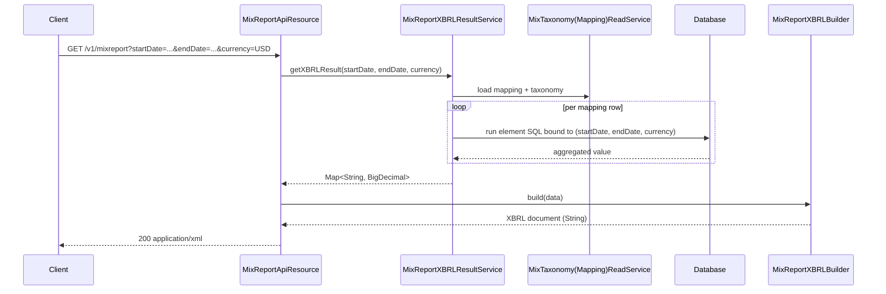

The Mix Report resource renders Apache Fineract's portfolio data into the [MIX Market](https://www.themix.org/) **XBRL** taxonomy — the format used historically by microfinance institutions to submit data for benchmarking and regulatory consumption. Output is an XML document whose facts are computed from the running portfolio at the requested date range, using the mapping configured via [`/v1/mixmapping`](/api/mix-taxonomy-mapping) and the taxonomy element list at [`/v1/mixtaxonomy`](/api/mix-taxonomy).

## Source

- **File**: `fineract-mix/src/main/java/org/apache/fineract/mix/api/MixReportApiResource.java`
- **Base path**: `@Path("/v1/mixreport")`
- **Tag**: `Mix Report`

The resource is just a JAX-RS adapter — the heavy lifting happens in `MixReportXBRLResultService` (data extraction) and `MixReportXBRLBuilder` (XBRL XML serialisation).

## Endpoints

| Method | Path | Description | Handler | Permission |
| ------ | ---- | ----------- | ------- | ---------- |
| GET | `/v1/mixreport` | Render an XBRL document for the given date range and currency | `MixReportXBRLResultService.getXBRLResult` → `MixReportXBRLBuilder.build` | authenticated user |

The endpoint is wired to `@Produces({ MediaType.APPLICATION_XML })`; there is no JSON variant.

## Query parameters

| Parameter | Type | Description |
| --------- | ---- | ----------- |
| `startDate` | `java.sql.Date` (yyyy-MM-dd) | Inclusive start of the reporting window |
| `endDate` | `java.sql.Date` (yyyy-MM-dd) | Inclusive end |
| `currency` | string | ISO currency code; facts whose accounts are in this currency are aggregated |

There are no path parameters and no body — this is a pure GET.

## Example

`GET /v1/mixreport?startDate=2024-01-01&endDate=2024-03-31&currency=USD`

Response (`application/xml`):

```xml
<?xml version="1.0" encoding="UTF-8"?>
<xbrl xmlns="http://www.xbrl.org/2003/instance"
      xmlns:mix="http://www.themix.org/int/fr/ifrs/basi/2010-08-31/mx-cor">
  <context id="Group-Period">
    <entity>
      <identifier scheme="http://www.themix.org">MFI</identifier>
    </entity>
    <period>
      <startDate>2024-01-01</startDate>
      <endDate>2024-03-31</endDate>
    </period>
  </context>
  <unit id="USD">
    <measure>iso4217:USD</measure>
  </unit>
  <mix:GLP contextRef="Group-Period" unitRef="USD" decimals="2">15234100.00</mix:GLP>
  <mix:NumberOfActiveBorrowers contextRef="Group-Period" decimals="0">4123</mix:NumberOfActiveBorrowers>
  
</xbrl>
```

Each `<mix:*>` fact corresponds to a taxonomy element returned by `/v1/mixtaxonomy` and is computed by running the SQL stored against that element on the configured mapping (see `/v1/mixmapping`).

## Subsystem cross-links

- **[Mix Taxonomy](/api/mix-taxonomy)** — list the XBRL elements available in the current taxonomy.
- **[Mix Taxonomy Mapping](/api/mix-taxonomy-mapping)** — map taxonomy elements to GL account selectors so this endpoint can compute their values.
- **[Reports](/api/reports)** / **[Run Reports](/api/run-reports)** — the more general reporting engine.

## Notes

- The `fineract-mix` module is optional. If your build excludes it (or it is missing from the classpath), `/v1/mixreport` will not be registered.
- `MixReportXBRLBuilder.build` returns a `String`; the source has a `TODO: make this type safe?` because the builder reuses a stringly-typed intermediate model.
- The endpoint does **not** call `validateHasReadPermission` — any authenticated user can run it. Sensitive deployments should front it with a reverse-proxy ACL.

## How a report is rendered

`MixReportXBRLResultService` walks every mapping row (taxonomy element → GL identifier) configured via [`/v1/mixmapping`](/api/mix-taxonomy-mapping), runs the SQL associated with the element against the live database for the requested `[startDate, endDate]` window, and aggregates the result by `currency`. For taxonomy elements whose `type` is `monetaryItemType` or `decimalItemType` the result is a `BigDecimal` rounded to two decimals; `integerItemType` elements are coerced to a `long`. The resulting `(namespace, value)` pairs become `<mix:*>` facts whose `contextRef` is the period context the builder emits up front.



## Element coverage

The number of `<mix:*>` facts in the response equals the number of taxonomy elements that have a non-null mapping. Elements with no mapping are simply omitted — they are not emitted as empty tags. To discover which elements are currently covered, intersect the output of `GET /v1/mixtaxonomy` with the rows returned by `GET /v1/mixmapping`.

## Sample failure modes

- **No mapping for an element referenced by a custom XBRL receiver** — the receiver will reject the document with an XBRL validation error. Fix by adding the missing mapping via `PUT /v1/mixmapping`.
- **`startDate > endDate`** — the SQL returns empty aggregates; the response is a valid but empty XBRL document. Validate parameters client-side.
- **Currency with no GL accounts** — all numeric facts collapse to `0.00`. The endpoint does not error, so confirm the `currency` matches an in-use organisation currency before scheduling the job downstream.

## Operational guidance

- The endpoint is read-heavy: each call runs a SQL statement per mapped element. For wide taxonomies and large portfolios this can take tens of seconds. Treat it as a batch job and cache the result by `(startDate, endDate, currency)` upstream rather than re-rendering on every page load.
- The output is a `String`, not a streamed `Response` — the whole document is materialised in memory before the response begins. For very large taxonomies, consider keeping a reverse-proxy timeout > 60s.
- There is no pagination, sort, or filter. The whole document is the response.

## Worked example — end-to-end XBRL run

The intent of `/v1/mixreport` is to produce a regulator- or benchmarker-friendly snapshot. A typical operator workflow:

1. **Discover the taxonomy** — call `GET /v1/mixtaxonomy` to list the elements compiled into the deployment (e.g. `mix:GLP`, `mix:NumberOfActiveBorrowers`).
2. **Review the current mapping** — call `GET /v1/mixmapping` to see which GL identifiers each element resolves to.
3. **Patch missing mappings** — call `PUT /v1/mixmapping` to bind elements you intend to report on. The handler accepts a `MixTaxonomyMappingUpdateRequest` describing the GL identifier overrides.
4. **Trigger the report** — call `GET /v1/mixreport?startDate=YYYY-MM-DD&endDate=YYYY-MM-DD&currency=XXX`. The response is XBRL-XML.
5. **Submit downstream** — pipe the response into your XBRL transmission tool (typically as a file attachment) or store it in the document store via [`/api/documents`](/api/documents) for audit.

## Computed value semantics

| Element type | Aggregation | Notes |
| ------------ | ----------- | ----- |
| `monetaryItemType` | `SUM(balance)` over GL accounts resolved by the mapping | Filtered by `currency`; rounded to two decimals. |
| `integerItemType` | `COUNT(*)` or `SUM(int_column)` depending on the element SQL | Coerced to `long`; `decimals="0"` in the XBRL output. |
| `decimalItemType` | Free-form decimal (e.g. ratios) | Decimals attribute mirrors the SQL precision. |
| `stringItemType` | Literal text from the SQL | Used for institution metadata such as currency code. |

If you need to verify what the runner did, enable `org.apache.fineract.mix=DEBUG` on the logger — the result service logs every (`namespace`, value) pair it emits before handing the map to the builder.

## Performance & scheduling

- Wire `/v1/mixreport` calls into a cron or scheduler job rather than UI clicks; XBRL submission is monthly or quarterly in practice.
- The endpoint is registered behind tenant routing, so the `Fineract-Platform-TenantId` header is honoured exactly as for other reports.
- The response is `application/xml` only; no JSON variant is available, and `Accept`-negotiation is a no-op because of the static `@Produces`.

## Subsystem cross-links

- **[Mix Taxonomy](/api/mix-taxonomy)** — the element catalogue this endpoint renders facts for.
- **[Mix Taxonomy Mapping](/api/mix-taxonomy-mapping)** — bind taxonomy elements to GL identifiers used by the SQL.
- **[GL Accounts](/api/gl-accounts)** — the chart of accounts whose ids drive the aggregations.
- **[Accounting overview](/accounting/overview)** — where the underlying balances are produced.
- **[Reports](/api/reports)** — the general non-core report catalogue used for SQL/Pentaho/Jasper outputs.

## XBRL context model

The XBRL document the builder emits has exactly one `<context>` per submission, identified by the literal `id="Group-Period"`. The entity identifier is hard-coded to `MFI` in the `http://www.themix.org` scheme — there is no per-tenant override. If your downstream receiver requires a tenant-specific identifier, post-process the response before submission.

| XBRL construct | Source | Notes |
| -------------- | ------ | ----- |
| `<entity>/<identifier scheme="http://www.themix.org">` | constant in `MixReportXBRLBuilder` | always `MFI` |
| `<period>/<startDate>` | `startDate` query parameter | inclusive |
| `<period>/<endDate>` | `endDate` query parameter | inclusive |
| `<unit id="…">/<measure>iso4217:…</measure>` | `currency` query parameter | one unit per request |
| `<mix:*>` facts | `MixReportXBRLResultService` aggregation | one tag per mapped, non-null taxonomy element |

## Validation checklist before submission

1. The `currency` parameter must be one of the organisation currencies returned by [`/api/currencies`](/api/currencies). Mismatch quietly produces zeros.
2. The reporting window must align with the receiver's regulatory calendar (typically quarter-end). Off-cycle dates are accepted but flagged downstream.
3. Every taxonomy element required by the receiver (consult their schema) must have a row in `GET /v1/mixmapping` — missing elements are silently skipped.
4. Run a dry-run against a UAT tenant before posting against production data — there is no preview mode in the endpoint itself.

## cURL recipe

```bash
curl -u mifos:password \
     -H "Fineract-Platform-TenantId: default" \
     -H "Accept: application/xml" \
     "https://localhost:8443/fineract-provider/api/v1/mixreport?startDate=2024-01-01&endDate=2024-03-31&currency=USD" \
     -o mix-2024Q1.xbrl
```

The output is a single XBRL instance document — pipe it to `xmllint --format` for a readable view.

## Source extract

For reference, the entire resource is six lines of routing — it is intentionally trivial:

```java
@Path("/v1/mixreport")
@Component
@Tag(name = "Mix Report", description = "")
@RequiredArgsConstructor
public class MixReportApiResource {

    private final MixReportXBRLResultService xbrlResultService;
    private final MixReportXBRLBuilder xbrlBuilder;

    @GET
    @Produces({ MediaType.APPLICATION_XML })
    public String retrieveXBRLReport(@QueryParam("startDate") final Date startDate,
                                     @QueryParam("endDate")   final Date endDate,
                                     @QueryParam("currency")  final String currency) {
        final var data = xbrlResultService.getXBRLResult(startDate, endDate, currency);
        // TODO: make this type safe?
        return this.xbrlBuilder.build(data);
    }
}
```

All semantics live in `MixReportXBRLResultService` (data fetch) and `MixReportXBRLBuilder` (XML assembly). When debugging an unexpected response, set breakpoints on those two collaborators rather than on the resource.
