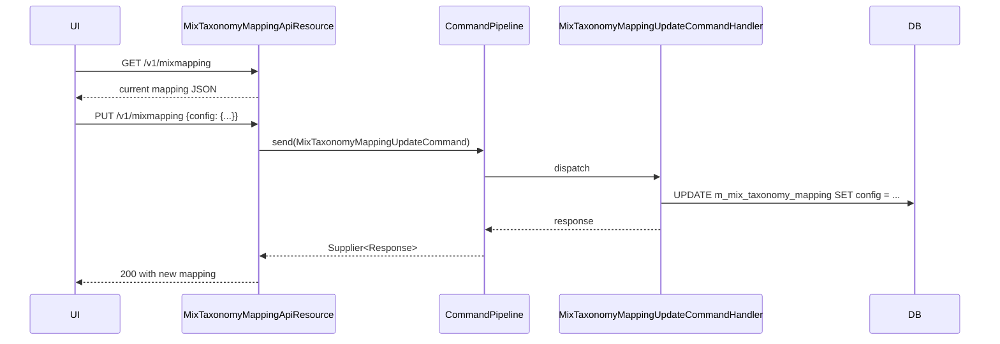

The Mix Taxonomy Mapping resource is the bridge between Apache Fineract's [chart of accounts](/api/gl-accounts) and the [MIX taxonomy](/api/mix-taxonomy). For each taxonomy element it stores the GL-identifier expression that produces the element's value, and exposes that mapping back to the renderer used by [`/v1/mixreport`](/api/mix-report).

## Source

- **File**: `fineract-mix/src/main/java/org/apache/fineract/mix/api/MixTaxonomyMappingApiResource.java`
- **Base path**: `@Path("/v1/mixmapping")`
- **Tag**: `Mix Mapping`

The resource uses the newer command bus (`CommandPipeline`) rather than `PortfolioCommandSourceWritePlatformService`. The update goes through `MixTaxonomyMappingUpdateCommand`, which is handled by the JPA-backed write service in `fineract-mix`.

## Endpoints

| Method | Path | Description | Handler / Command | Permission |
| ------ | ---- | ----------- | ----------------- | ---------- |
| GET | `/v1/mixmapping` | Retrieve the current mapping document | `MixTaxonomyMappingReadService.retrieveTaxonomyMapping` | authenticated user |
| PUT | `/v1/mixmapping` | Replace the mapping document | `CommandPipeline.send(MixTaxonomyMappingUpdateCommand)` | authenticated user |

Only one mapping is supported (id `1`) — the source notes the design is intended to allow multiple in the future:

```java
// TODO support multiple configuration file loading; this is the legacy behavior
if (request.getId() == null) {
    request.setId(1L);
}
```

## Mapping document

The body is a `MixTaxonomyMappingData` (response) / `MixTaxonomyMappingUpdateRequest` (request) wrapping a JSON config object whose top-level keys are taxonomy element ids and whose values are GL-identifier expressions.

### GET response

`GET /v1/mixmapping`

```json
{
  "id": 1,
  "config": "{ \"1\": \"100000\", \"14\": \"110100 + 110200 - 110900\", \"27\": null }",
  "identifier": "default",
  "lastUpdateDate": "2024-02-15T09:34:21"
}
```

The `config` value is a JSON-encoded string (escaped). Parsed, the example above means:

```json
{
  "1": "100000",
  "14": "110100 + 110200 - 110900",
  "27": null
}
```

- Element id `1` (Assets) — value comes from GL account `100000`.
- Element id `14` (GLP) — sum of loan-portfolio accounts less the suspense account.
- Element id `27` (NumberOfActiveBorrowers) — unmapped; will be empty in the rendered XBRL.

The expression grammar supports `+`, `-`, parentheses and GL identifiers (account numbers in `m_gl_account.gl_code`).

### PUT request

`PUT /v1/mixmapping`

```json
{
  "id": 1,
  "config": "{ \"1\": \"100000\", \"14\": \"110100 + 110200\", \"27\": \"select count(*) from m_loan where loan_status_id = 300\" }"
}
```

For non-monetary items (`integerItemType`), the expression may be a SQL statement returning a single column; for monetary items it must be the GL expression form.

Response:

```json
{ "resourceId": 1, "changes": { "config": "..." } }
```

## Example flow

1. `GET /v1/mixtaxonomy` to enumerate available elements and their ids.
2. `GET /v1/mixmapping` to pull the current configuration.
3. Edit the `config` JSON to bind missing elements to GL identifiers.
4. `PUT /v1/mixmapping` with the modified document.
5. `GET /v1/mixreport?startDate=…&endDate=…&currency=…` to render.

## Subsystem cross-links

- **[Mix Taxonomy](/api/mix-taxonomy)** — element ids referenced by the mapping `config`.
- **[Mix Report](/api/mix-report)** — consumes the mapping.
- **[GL Accounts](/api/gl-accounts)** — `gl_code` values referenced in the expressions.

## Notes

- There is only ever one mapping row; passing `id` other than `1` will be silently overwritten to `1`.
- There is no DELETE endpoint — the way to clear a mapping is `PUT` with an empty `config` object.
- Like the other MIX endpoints, this resource is only registered when the `fineract-mix` module is on the runtime classpath.


## Endpoint reference

```java
@Path("/v1/mixmapping")
@Component
@RequiredArgsConstructor
public class MixTaxonomyMappingApiResource {
    private final MixTaxonomyMappingReadService readTaxonomyMappingService;
    private final CommandPipeline commandPipeline;

    @GET  MixTaxonomyMappingData retrieveTaxonomyMapping();
    @PUT  MixTaxonomyMappingUpdateResponse updateTaxonomyMapping(MixTaxonomyMappingUpdateRequest request);
}
```

The resource exposes the **single** mapping row that pairs taxonomy elements with GL identifiers. There is no GET-by-id and no DELETE — the legacy schema assumes one mapping per tenant.

## Update semantics

The `PUT` handler runs:

```java
if (request.getId() == null) {
    request.setId(1L);
}
final var command = new MixTaxonomyMappingUpdateCommand();
command.setPayload(request);
final Supplier<MixTaxonomyMappingUpdateResponse> response = commandPipeline.send(command);
return response.get();
```

so passing any other `id` is silently overwritten to `1`. The `TODO support multiple configuration file loading` comment in the source signals where future multi-mapping work would land.

## Data model

A mapping is a JSON document of the shape:

```json
{
  "id": 1,
  "identifier": "default",
  "config": {
    "GLP": "1101000",
    "OperatingExpense": "5*",
    "FinancialRevenueOnLoans": "4101000",
    "NumberOfActiveBorrowers": "client_count()"
  }
}
```

- **`config` keys** — taxonomy element `namespace` values (see [`/v1/mixtaxonomy`](/api/mix-taxonomy)).
- **`config` values** — either a single `gl_code` (e.g. `"1101000"`), a glob pattern (`"5*"` matches every account whose code starts with `5`), or a SQL-callable function recognised by `MixReportXBRLResultService` (`client_count()` etc.).

## Sequence



## Permissions

The resource does not call `validateHasReadPermission`. The mutation passes through `CommandPipeline`, whose handler chain enforces `UPDATE_MIXTAXONOMYMAPPING` (configurable in `m_permission`).

## Error semantics

| Failure | HTTP | Detail |
| ------- | ---- | ------ |
| Malformed `config` JSON | 400 | platform validation error |
| Unknown taxonomy element in `config` | 200 | persisted but the renderer will skip it |
| Unknown `gl_code` | 200 | persisted but `/v1/mixreport` will return 0 for that fact |
| Auth failure | 401 | tenant filter |

## cURL recipe

Replace the whole mapping:

```bash
curl -u mifos:password -X PUT      -H "Fineract-Platform-TenantId: default"      -H "Content-Type: application/json"      -d '{
       "id": 1,
       "config": {
         "GLP": "1101000",
         "OperatingExpense": "5*",
         "NumberOfActiveBorrowers": "client_count()"
       }
     }'      "https://localhost:8443/fineract-provider/api/v1/mixmapping"
```

## Cross-links

- [Mix Taxonomy](/api/mix-taxonomy) — element ids referenced by `config`.
- [Mix Report](/api/mix-report) — consumes the mapping.
- [GL Accounts](/api/gl-accounts) — `gl_code` values referenced in the expressions.
