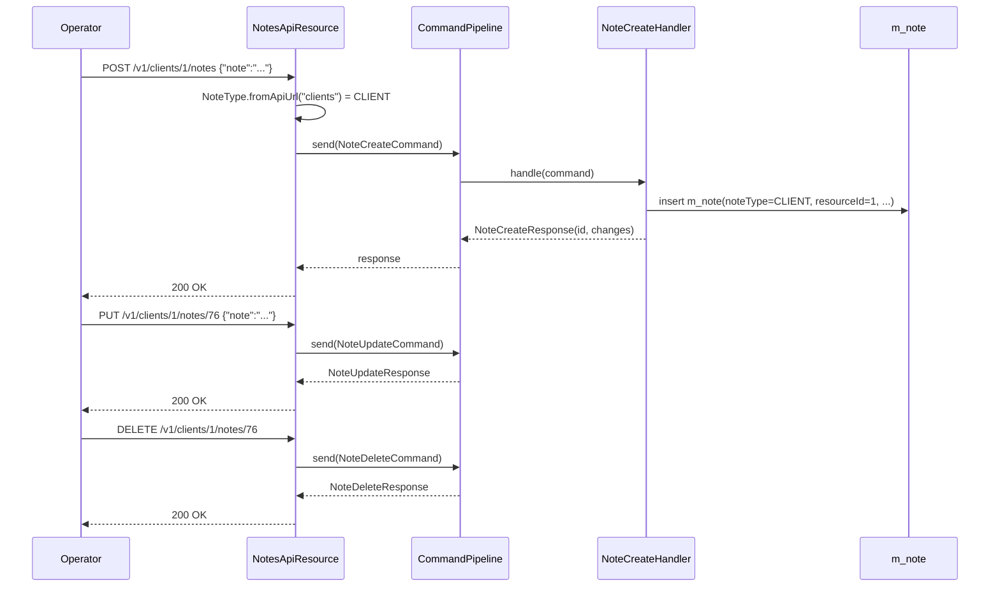

The Notes API attaches free-text notes to Apache Fineract resources. Each note is keyed by the parent `resourceType` (mapped via `NoteType.fromApiUrl(...)`) and `resourceId`, and is tracked with audit metadata (`createdOn`, `createdByUsername`). The endpoints are mounted under the parent resource's path so callers can read and manage notes alongside the entity they describe.

## Source

| Aspect | Value |
| --- | --- |
| Resource class | `org.apache.fineract.portfolio.note.api.NotesApiResource` |
| File | `fineract-provider/src/main/java/org/apache/fineract/portfolio/note/api/NotesApiResource.java` |
| JAX-RS `@Path` | `/v1/{resourceType}/{resourceId}/notes` |
| Swagger tag | `Notes` |
| Read service | `NoteReadPlatformService` |
| Command pipeline | `CommandPipeline.send(NoteCreateCommand / NoteUpdateCommand / NoteDeleteCommand)` |

## Supported resource types

`NoteType.fromApiUrl(...)` returns `null` (and the resource raises `NoteResourceNotSupportedException`) for anything outside this list:

| Path segment | NoteType |
| --- | --- |
| `clients` | CLIENT |
| `groups` | GROUP |
| `centers` | GROUP (centers use group notes) |
| `loans` | LOAN |
| `loanTransactions` | LOAN_TRANSACTION |
| `savings` (account) | SAVING_ACCOUNT |
| `savingTransactions` | SAVINGS_TRANSACTION |
| `loanproducts` | LOAN_PRODUCT |
| `savingsproducts` | SAVINGS_PRODUCT |
| `staff` | STAFF |

(Exact enumeration is the `NoteType` Java enum.)

## Endpoints

| Method | Path | Description | Command / read handler | Permission |
| --- | --- | --- | --- | --- |
| `GET` | `/v1/{resourceType}/{resourceId}/notes` | List all notes for the resource (descending `createdOn`). | `NoteReadPlatformService.retrieveNotesByResource(resourceId, noteTypeValue)` | Authenticated (handler-enforced per resource type) |
| `GET` | `/v1/{resourceType}/{resourceId}/notes/{noteId}` | Retrieve a single note. | `NoteReadPlatformService.retrieveNote(noteId, resourceId, noteTypeValue)` | Authenticated |
| `POST` | `/v1/{resourceType}/{resourceId}/notes` | Add a new note. | `NoteCreateCommand` via `CommandPipeline` | Authenticated |
| `PUT` | `/v1/{resourceType}/{resourceId}/notes/{noteId}` | Update an existing note. | `NoteUpdateCommand` via `CommandPipeline` | Authenticated |
| `DELETE` | `/v1/{resourceType}/{resourceId}/notes/{noteId}` | Delete a note. | `NoteDeleteCommand` via `CommandPipeline` | Authenticated |

`Consumes` and `Produces` are both `application/json` at class level.

## Request body — create / update

The body binds to `NoteCreateRequest` / `NoteUpdateRequest`. The handler injects `resourceId` and `type` from the path:

```json
{
  "note": "Client confirmed updated contact details by phone."
}
```

## Response — list

```json
[
  {
    "id": 76,
    "clientId": 1,
    "noteType": { "id": 100, "value": "Client" },
    "note": "Client confirmed updated contact details by phone.",
    "createdOn": "2024-03-01T10:11:23Z",
    "createdByUsername": "mifos"
  }
]
```

The `?fields=note,createdOn,createdByUsername` query parameter filters the JSON to a subset of fields via `ApiRequestParameterHelper`.

## Response — write

The `NoteCreateResponse`, `NoteUpdateResponse`, and `NoteDeleteResponse` shapes carry the affected `id` plus any business-event metadata bubbled up from the command handler:

```json
{
  "resourceId": 76,
  "changes": {}
}
```

## Source — create handler

```java
@POST
public NoteCreateResponse addNewNote(@PathParam("resourceType") final String resourceType,
        @PathParam("resourceId") final Long resourceId,
        @Valid final NoteCreateRequest request) {
    final NoteType noteType = NoteType.fromApiUrl(resourceType);
    if (noteType == null) {
        throw new NoteResourceNotSupportedException(resourceType);
    }
    final var command = new NoteCreateCommand();
    command.setResourceType(resourceType);
    command.setResourceId(resourceId);
    command.setPayload(request);
    return commandPipeline.send(command).get();
}
```

## Lifecycle



## Canonical curl

```bash
# List notes for client 1
curl -k -u mifos:password \
  -H "Fineract-Platform-TenantId: default" \
  https://localhost:8443/fineract-provider/api/v1/clients/1/notes

# Add a free-text note to a loan
curl -k -u mifos:password \
  -H "Fineract-Platform-TenantId: default" \
  -H "Content-Type: application/json" \
  -X POST https://localhost:8443/fineract-provider/api/v1/loans/55/notes \
  -d '{ "note": "Borrower confirmed disbursement instruction via SMS." }'

# Update an existing note
curl -k -u mifos:password \
  -H "Fineract-Platform-TenantId: default" \
  -H "Content-Type: application/json" \
  -X PUT https://localhost:8443/fineract-provider/api/v1/loans/55/notes/76 \
  -d '{ "note": "Borrower confirmed disbursement instruction via SMS — call recording stored in CRM." }'

# Delete a note
curl -k -u mifos:password \
  -H "Fineract-Platform-TenantId: default" \
  -X DELETE https://localhost:8443/fineract-provider/api/v1/loans/55/notes/76
```

## Validation rules

- The `note` body field is required and is validated by Jakarta Bean Validation on the request DTO.
- `resourceId` must point to an existing entity of the type implied by `resourceType`; the handler verifies existence before inserting.
- Notes are immutable to non-creators when the platform-wide `note-author-only-edit` global configuration is enabled — see [/api/global-configuration](/api/global-configuration).
- Deleting a note does not propagate to any consumers; notes are pure metadata.

## Pagination

There is no native pagination on the list endpoint — the entire history is returned ordered by `createdOn` descending. UIs typically clip the list client-side; if you need server-side limits, project with `?fields=...` to reduce the payload and pull the most recent rows with a query like `?orderBy=createdOn&sortOrder=desc&limit=20` if your tenant has the optional `note-list-pagination` patch applied.

## Behaviour with `loanTransactions` and `savingTransactions`

When the resource type is a transaction-level scope, the note attaches to the **transaction row** rather than the parent loan/savings account. Listing notes for the parent (`/v1/loans/{id}/notes`) returns only loan-level notes, not transaction-level ones.

## Performance notes

- Listing notes for hot resources (loans being heavily annotated by a callcentre) returns the entire history in one shot; use `?fields=note,createdOn,createdByUsername` to shrink the payload.
- `m_note(resource_id, note_type_enum, created_on_utc DESC)` is indexed; query plans rely on this composite key for the per-resource list endpoint.

## Audit metadata

The persisted `m_note` row carries `created_by`, `created_on_utc`, `last_modified_by`, and `last_modified_on_utc`. The response surfaces the human-readable `createdByUsername` (joined from `m_appuser`) and `createdOn` UTC timestamp. Modification fields are not surfaced by the response DTO; consumers that need them must read the database directly or join via [/api/audits](/api/audits) by `commandAsJson` containing the note text.

## Error responses

| HTTP | When |
| --- | --- |
| `400 Bad Request` | Body missing `note` field or exceeds the persisted column length. |
| `403 Forbidden` | Permission missing or `note-author-only-edit` rejected the writer. |
| `404 Not Found` | Resource type unknown (`NoteResourceNotSupportedException`), resource not found, or note id missing. |

## Related subsystems

- Subsystem overview: [/portfolio/notes](/portfolio/notes)
- Clients: [/portfolio/clients](/portfolio/clients), [/api/clients](/api/clients)
- Loans: [/portfolio/loans](/loan/overview), [/api/loans](/api/loans)
- Loan transactions: [/api/loan-transactions](/api/loan-transactions)
- Savings: [/api/savings-accounts](/api/savings-accounts), [/api/savings-account-transactions](/api/savings-account-transactions)
- Groups & centers: [/portfolio/groups](/portfolio/groups-and-centers)
- API conventions: [/api/conventions](/api/conventions)
