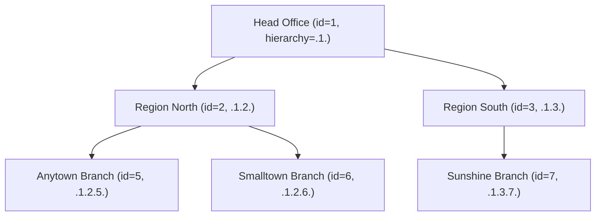

`OfficesApiResource` exposes the branch hierarchy. Offices are tree-structured (Head Office → Region → Branch → Sub-branch …); every other entity (client, group, loan, journal entry, …) lives under an office, and Fineract's data scope rules cascade through this tree.

## Source

```
fineract-provider/src/main/java/org/apache/fineract/organisation/office/api/OfficesApiResource.java
```

| Annotation | Value |
| --- | --- |
| `@Path` | `/v1/offices` |
| `@Component` | yes |
| `@Tag` | `Offices` |

Injected collaborators:

- `PlatformSecurityContext context`
- `OfficeReadPlatformService readPlatformService`
- `PortfolioCommandSourceWritePlatformService commandsSourceWritePlatformService`
- `DefaultToApiJsonSerializer<OfficeData> toApiJsonSerializer`
- `BulkImportWorkbookService` / `BulkImportWorkbookPopulatorService`

## Permissions

Resource string: `OFFICE` (`RESOURCE_NAME_FOR_PERMISSIONS`). Reads call `validateHasReadPermission("OFFICE")`. Writes are gated by `CREATE_OFFICE`, `UPDATE_OFFICE`.

There is **no** `DELETE_OFFICE` — offices are never deleted because they would orphan transactions. The closest equivalent is leaving the office row in place; closing semantics live at the portfolio level.

## Endpoint inventory

| HTTP | Path | Description | Command / Read service |
| --- | --- | --- | --- |
| `GET` | `/v1/offices` | List all offices the caller can see | `readPlatformService.retrieveAllOffices(...)` |
| `GET` | `/v1/offices/template` | Parent-office options for a new office | `readPlatformService.retrieveNewOfficeTemplate()` |
| `POST` | `/v1/offices` | Create office | `createOffice` |
| `GET` | `/v1/offices/{officeId}` | Fetch one office | `readPlatformService.retrieveOffice(officeId)` |
| `PUT` | `/v1/offices/{officeId}` | Update office | `updateOffice(officeId)` |
| `GET` | `/v1/offices/external-id/{externalId}` | Fetch by external id | `readPlatformService.retrieveOfficeByExternalId(...)` |
| `PUT` | `/v1/offices/external-id/{externalId}` | Update by external id | `updateOffice(externalId)` |
| `GET` | `/v1/offices/downloadtemplate` | Excel import template | bulk import |
| `POST` | `/v1/offices/uploadtemplate` | Excel upload | bulk import |

## Source excerpt — list

```java
@GET
@Consumes(MediaType.APPLICATION_JSON)
@Produces(MediaType.APPLICATION_JSON)
public String retrieveOffices(@Context final UriInfo uriInfo,
        @DefaultValue("false") @QueryParam("includeAllOffices") final boolean includeAllOffices,
        @DefaultValue("false") @QueryParam("orderBy") final String orderBy,
        @DefaultValue("false") @QueryParam("sortOrder") final String sortOrder) {
    context.authenticatedUser().validateHasReadPermission(RESOURCE_NAME_FOR_PERMISSIONS);
    // ...
}
```

- `includeAllOffices=true` lifts the data-scope filter and returns the entire tree (super-user only).
- Without it, the caller sees their own office plus all descendants (the standard hierarchy filter).

## Source excerpt — create

```java
@POST
@Consumes(MediaType.APPLICATION_JSON)
@Produces(MediaType.APPLICATION_JSON)
public String createOffice(final String apiRequestBodyAsJson) {
    final CommandWrapper commandRequest = new CommandWrapperBuilder()
        .createOffice()
        .withJson(apiRequestBodyAsJson).build();
    final CommandProcessingResult result =
        commandsSourceWritePlatformService.logCommandSource(commandRequest);
    return toApiJsonSerializer.serialize(result);
}
```

## Canonical curl

```bash
curl -k -u mifos:password \
  -H "Fineract-Platform-TenantId: default" \
  -H "Content-Type: application/json" \
  -X POST https://localhost:8443/fineract-provider/api/v1/offices \
  -d '{
    "name": "Anytown Branch",
    "externalId": "ANT-001",
    "parentId": 1,
    "openingDate": "01 January 2024",
    "locale": "en",
    "dateFormat": "dd MMMM yyyy"
  }'
```

Sample response:

```json
{
  "officeId": 5,
  "resourceId": 5,
  "resourceIdentifier": "5"
}
```

## Request body — create

| Field | Required | Notes |
| --- | --- | --- |
| `name` | yes | Unique among siblings of the same parent |
| `parentId` | yes | Head Office is id 1 |
| `openingDate` | yes | Cannot be after today |
| `externalId` | no | Free-text unique identifier |
| `locale`, `dateFormat` | yes | Standard date envelope |

## Read DTO

`org.apache.fineract.organisation.office.data.OfficeData`:

```json
{
  "id": 5,
  "name": "Anytown Branch",
  "nameDecorated": "....Anytown Branch",
  "externalId": "ANT-001",
  "openingDate": [2024, 1, 1],
  "hierarchy": ".1.5.",
  "parentId": 1,
  "parentName": "Head Office",
  "allowedParents": null
}
```

| Field | Meaning |
| --- | --- |
| `hierarchy` | Materialised-path string used by the data-scope SQL clause |
| `nameDecorated` | Indented name for tree views; one `.` per depth level |
| `allowedParents` | Populated only when `?template=true` |

## Bulk import

The `/downloadtemplate` endpoint returns an Excel template populated with current office names; `/uploadtemplate` accepts a filled spreadsheet (multipart `file=` plus `locale=` and `dateFormat=`) and creates the rows in bulk.

## Hierarchy enforcement

When you create a new office with `parentId=X`, the request fails with HTTP 403 if the caller's data scope does not include X (or any ancestor of it). Once created the new office's `hierarchy` string is parent's hierarchy + new id + dot, e.g. Head Office (`.1.`) → new Anytown Branch (`.1.5.`).

Re-parenting an office via PUT is supported but re-computes `hierarchy` for all descendants in a single transaction.

## Hierarchy diagram



Data scope SQL clauses use `office.hierarchy LIKE '<callerHierarchy>%'` to filter every row in every table whose entity carries an `office_id`. A user at id=2 (Region North) sees rows for offices id=2, 5, 6 and nothing under id=3.

## Common pitfalls

- **`openingDate` of a child must be on or after the parent's `openingDate`** — otherwise `error.msg.office.opening.date.before.parent.openingDate`.
- **Sibling names must be unique under a parent** — otherwise `error.msg.office.duplicate.name`.
- **Re-parenting (PUT with new `parentId`) cascades** the hierarchy recompute through every descendant; do it in low-traffic windows.
- **`externalId` is unique across the entire tree**, not just within siblings.

## Sample curl — list with hierarchy

```bash
curl -k -u mifos:password \
  -H "Fineract-Platform-TenantId: default" \
  "https://localhost:8443/fineract-provider/api/v1/offices?includeAllOffices=true&orderBy=hierarchy"
```

## Related pages

- [Office transactions](/api/office-transactions) — inter-office cash transfers between branches.
- [Staff](/api/staff) — every staff member lives under an office.
- [Holidays](/api/holidays) — holidays apply to specific offices.
- [Organisation → Offices](/organisation/offices) — domain model, hierarchy, data scope.
- [API conventions](/api/conventions) — envelope, dates, error JSON.
