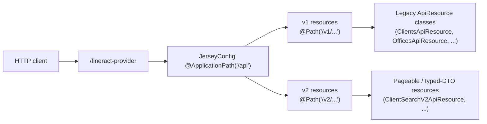
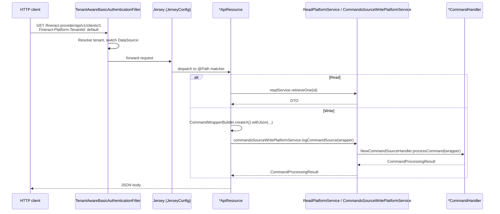

Apache Fineract exposes a JAX-RS REST API mounted under `/fineract-provider/api`. Every endpoint documented in this section lives inside a Spring-managed class annotated with `@Path` and is discovered at boot by [`JerseyConfig`](/api/jersey-paths). This page is the index — each child page documents one `*ApiResource` class with its full endpoint inventory, command handler, and source location.

## Base URL pattern

```
https://<host>:<port>/fineract-provider/api/{v1|v2}/{resource}
```

| Segment | Source | Notes |
| --- | --- | --- |
| `/fineract-provider` | servlet context | The Spring Boot WAR / executable JAR mounts everything under this context |
| `/api` | `@ApplicationPath("/api")` on `JerseyConfig` | Jersey application root |
| `/v1` or `/v2` | first segment of each `@Path` | Encoded inside every resource class — see [Jersey paths](/api/jersey-paths) |
| `/{resource}` | second segment of `@Path` | e.g. `clients`, `groups`, `offices` |

`JerseyConfig` does not configure path prefixes — the `v1` / `v2` literal is hard-coded into each resource's `@Path` annotation. There is no central router map; every resource is its own routing fragment.

## Versioning model



- **v1** — the historic surface. Endpoints are JSON-only, return raw `String` (serialised via `ToApiJsonSerializer`), and accept commands via the [`command=` query parameter](/api/conventions). Write paths funnel through `CommandWrapperBuilder` → `commandsSourceWritePlatformService.logCommandSource`.
- **v2** — the modern surface. Endpoints take typed request DTOs (often `PagedRequest<...>`), return Spring Data `Page<...>` or typed response DTOs, and bypass the legacy `String` round-trip. Only a handful of resources exist in v2 today (e.g. `ClientSearchV2ApiResource` at `/v2/clients/search`).

There is no transparent migration: a v1 endpoint is **not** auto-reachable under `/v2`. Each endpoint exists in exactly one namespace.

## Resource families documented in this section

The pages below cover the **core party and organisation** APIs. Loan, savings, accounting, and infrastructure APIs are documented in their own sections.

### Authentication and platform

| Page | Class | Path |
| --- | --- | --- |
| [Authentication endpoints](/api/authentication-endpoints) | `AuthenticationApiResource`, `UserDetailsApiResource` | `/v1/authentication`, `/v1/userdetails` |
| [Tenant header](/api/tenant-header) | `TenantAwareBasicAuthenticationFilter` | every call |
| [Conventions](/api/conventions) | — | `command=`, envelope, pagination, dates |
| [Jersey paths](/api/jersey-paths) | `JerseyConfig` | `@Path` discovery |

### Clients

| Page | Class | Path |
| --- | --- | --- |
| [Clients](/api/clients) | `ClientsApiResource` | `/v1/clients` |
| [Client identifiers](/api/client-identifiers) | `ClientIdentifiersApiResource` | `/v1/clients/{clientId}/identifiers` |
| [Client charges](/api/client-charges) | `ClientChargesApiResource` | `/v1/clients/{clientId}/charges` |
| [Client transactions](/api/client-transactions) | `ClientTransactionsApiResource` | `/v1/clients/{clientId}/transactions` |
| [Client family members](/api/client-family-members) | `ClientFamilyMembersApiResource` | `/v1/clients/{clientId}/familymembers` |
| [Client address](/api/client-address) | `ClientAddressApiResource` | `/v1/client/{clientid}/addresses` |
| [Client search v2](/api/client-search-v2) | `ClientSearchV2ApiResource` | `/v2/clients/search` |

### Groups, centers, levels

| Page | Class | Path |
| --- | --- | --- |
| [Groups](/api/groups) | `GroupsApiResource` | `/v1/groups` |
| [Centers](/api/centers) | `CentersApiResource` | `/v1/centers` |
| [Group levels](/api/group-levels) | `GroupsLevelApiResource` | `/v1/grouplevels` |

### Organisation

| Page | Class | Path |
| --- | --- | --- |
| [Offices](/api/offices) | `OfficesApiResource` | `/v1/offices` |
| [Office transactions](/api/office-transactions) | `OfficeTransactionsApiResource` | `/v1/officetransactions` |
| [Staff](/api/staff) | `StaffApiResource` | `/v1/staff` |
| [Holidays](/api/holidays) | `HolidaysApiResource` | `/v1/holidays` |
| [Working days](/api/working-days) | `WorkingDaysApiResource` | `/v1/workingdays` |
| [Currencies](/api/currencies) | `CurrenciesApiResource` | `/v1/currencies` |
| [Funds](/api/funds) | `FundsApiResource` | `/v1/funds` |
| [Provisioning categories](/api/provisioning-categories) | `ProvisioningCategoryApiResource` | `/v1/provisioningcategory` |
| [Provisioning criteria](/api/provisioning-criteria) | `ProvisioningCriteriaApiResource` | `/v1/provisioningcriteria` |

### Tax

| Page | Class | Path |
| --- | --- | --- |
| [Tax components](/api/tax-components) | `TaxComponentApiResource` | `/v1/taxes/component` |
| [Tax groups](/api/tax-groups) | `TaxGroupApiResource` | `/v1/taxes/group` |

## How a request flows



Read endpoints delegate directly to a `*ReadPlatformService`. Write endpoints build a `CommandWrapper` (with action / entity / resource ids) and hand it to `commandsSourceWritePlatformService.logCommandSource`, which finds the matching `NewCommandSourceHandler` by `(actionName, entityName)` — see the [Command](/command/synchronous-command-processing) section for the dispatch contract.

## Conventions cheat sheet

- Every endpoint requires the [`Fineract-Platform-TenantId`](/api/tenant-header) header.
- Reads typically support `fields=a,b,c` to project the response.
- Lists support `offset`, `limit`, and sometimes `orderBy`, `sortOrder`.
- Writes that mutate state are POST/PUT/DELETE with a JSON body. **Multi-action POSTs** (close client, activate, reject, transfer, …) hang off a single `@Path` and dispatch on a `?command=` query parameter — see [Conventions](/api/conventions).
- Dates always need `locale` and `dateFormat` query/body fields when the body contains a date.
- All write responses are wrapped in a `CommandProcessingResult` (rowsAffected, resourceId, changes, …).

## What is *not* in this section

- Loan, loan-product, repayment, disbursement endpoints — see [Loan APIs](/api/loans).
- Savings, fixed-deposit, recurring-deposit endpoints — see [Savings APIs](/api/savings-accounts).
- GL accounts, journal entries, financial-activity mappings — see [Accounting APIs](/accounting/journal-entries).
- Data tables, reports, jobs, business dates, configurations — see [Infrastructure APIs](/dataqueries/datatables).
- Batch API (`/v1/batches`) — see [Batch API](/batch-api/overview).

## Response shape contract

Every read endpoint returns either a single DTO, a list, or a paged envelope. Every write endpoint returns a `CommandProcessingResult`. The serialisation pipeline is shared:

| Direction | Pipeline |
| --- | --- |
| Read DTO → JSON | `DefaultToApiJsonSerializer<DTO>` → GSON with `ApiRequestJsonSerializationSettings` (drives `?fields=` projection and `?pretty=true`). |
| Page → JSON | `Page<DTO>` is wrapped `{ "totalFilteredRecords": N, "pageItems": [...] }`. |
| Command → JSON | `CommandProcessingResultBuilder` constructs the result; the resource serialises it through the same `ToApiJsonSerializer<CommandProcessingResult>`. |
| Error → JSON | `GlobalExceptionMapper` maps `PlatformApiDataValidationException`, `AbstractPlatformDomainRuleException`, `AbstractPlatformResourceNotFoundException`, etc., to the standard error envelope documented in [Conventions](/api/conventions). |

The exception mappers register through `JerseyConfig.registerExceptionMappers` and produce the JSON shape that the [Conventions](/api/conventions) page documents under "Error JSON".

## Authentication, tenant, idempotency at a glance

Every endpoint in this section requires three pieces of HTTP plumbing:

1. **Basic Auth header** (or OAuth2 bearer when the OAuth profile is active) — see [Authentication](/api/authentication) and [User Details](/api/user-details).
2. **`Fineract-Platform-TenantId` header** — required even on `POST /v1/authentication`. The `TenantAwareBasicAuthenticationFilter` resolves the tenant and switches the routing DataSource before the request reaches Jersey.
3. **Optional `Idempotency-Key` header** — recommended for every `POST` / `PUT` write. The command pipeline caches the `CommandProcessingResult` keyed by `(idempotencyKey, commandJsonHash)` and replays it instead of running the handler twice.

## Spotting v1 vs v2 resources

To find every v1 resource:

```bash
grep -rn '^@Path("/v1/' fineract-provider/src/main/java/org/apache/fineract \
  | grep -v Swagger
```

For v2:

```bash
grep -rn '^@Path("/v2/' fineract-provider/src/main/java/org/apache/fineract \
  | grep -v Swagger
```

The result is the authoritative list of every endpoint family — every child page in this section corresponds to one entry in that grep output.

## Where to read source

Resource classes live in the relevant subsystem module under `src/main/java/.../api/`:

| Module | Example resource |
| --- | --- |
| `fineract-core` | `CurrenciesApiResource` (`organisation/monetary/api`) |
| `fineract-provider` | `ClientsApiResource`, `GroupsApiResource`, `OfficesApiResource`, … |
| `fineract-tax` | `TaxComponentApiResource`, `TaxGroupApiResource` |
| `fineract-security` | `AuthenticationApiResource`, `UserDetailsApiResource` |
| `fineract-loan`, `fineract-savings`, … | loan/savings resources (separate section) |

Each child page in this section quotes the exact source path so you can jump straight to the file.

## How `@Path` discovery works

`JerseyConfig` (at `fineract-provider/src/main/java/org/apache/fineract/infrastructure/core/jersey/JerseyConfig.java`) extends Jersey's `ResourceConfig`. It registers two flavours of resources:

- **Spring-discovered components** — every `@Component`-annotated `*ApiResource` is auto-picked-up via `packages("org.apache.fineract")`, then re-registered with Jersey's resource model. No central routing table; each class's `@Path` annotation is the routing fragment.
- **Explicit registration** — a handful of infrastructure resources (e.g. health checks, metrics) are registered by class via `register(...)` calls in the same configuration.

If two classes declare the same `@Path` Jersey will fail at boot with `MultipleResourceMethodsException`. The v1/v2 split is therefore enforced by convention, not by configuration.
