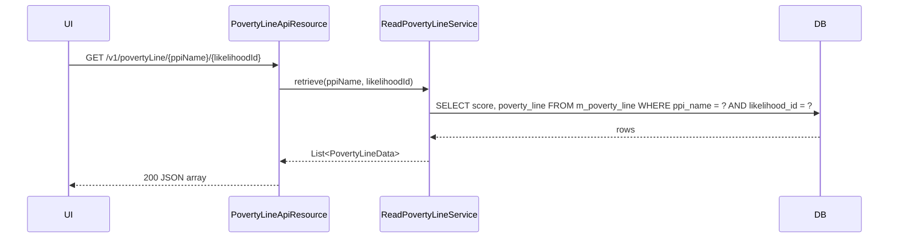

The Poverty Line resource is the read-only complement of [Likelihood](/api/likelihood) and [Surveys](/api/surveys). For a registered PPI it returns the **score-to-poverty-probability** lookup: at each score bucket, what fraction of respondents are estimated to fall below each likelihood's poverty line. The Survey scoring engine consults this resource when converting a fulfilled PPI questionnaire into a poverty estimate.

## Source

- **File**: `fineract-provider/src/main/java/org/apache/fineract/infrastructure/survey/api/PovertyLineApiResource.java`
- **Base path**: `@Path("/v1/povertyLine")`
- **Permission entity**: `POVERTY_LINE` (`PovertyLineApiConstants.POVERTY_LINE_RESOURCE_NAME`)
- **Tag**: `Poverty Line`

Both handlers go through `PovertyLineService`. There are **no mutation endpoints** — poverty-line tables are seeded by platform migrations and treated as reference data.

## Endpoints

| Method | Path | Description | Handler | Permission |
| ------ | ---- | ----------- | ------- | ---------- |
| GET | `/v1/povertyLine/{ppiName}` | Retrieve the full poverty-line matrix for a PPI (all likelihoods × all score buckets) | `PovertyLineService.retrieveAll` | `READ_POVERTY_LINE` |
| GET | `/v1/povertyLine/{ppiName}/{likelihoodId}` | Retrieve the poverty-line lookup for a single likelihood | `PovertyLineService.retrieveForLikelihood` | `READ_POVERTY_LINE` |

## Path parameters

| Parameter | Description |
| --------- | ----------- |
| `ppiName` | Name of the registered PPI survey (e.g. `PPI Bangladesh`). Must match a row in `m_survey` / a datatable registered with category `200`. |
| `likelihoodId` | The likelihood row id (see [Likelihood](/api/likelihood)). |

## Examples

### Full matrix

`GET /v1/povertyLine/PPI%20Bangladesh`

```json
{
  "ppiName": "PPI Bangladesh",
  "povertyLines": [
    {
      "likelihoodId": 1,
      "likelihoodName": "Bangladesh-100% National Line",
      "scores": [
        { "scoreFrom": 0,  "scoreTo": 4,  "povertyLine": 0.93 },
        { "scoreFrom": 5,  "scoreTo": 9,  "povertyLine": 0.89 },
        { "scoreFrom": 95, "scoreTo": 99, "povertyLine": 0.03 },
        { "scoreFrom": 100,"scoreTo": 100,"povertyLine": 0.01 }
      ]
    },
    {
      "likelihoodId": 3,
      "likelihoodName": "Bangladesh-USD 1.25",
      "scores": [
        { "scoreFrom": 0,  "scoreTo": 4,  "povertyLine": 0.99 },
        { "scoreFrom": 100,"scoreTo": 100,"povertyLine": 0.04 }
      ]
    }
  ]
}
```

Each entry says: "respondents who scored between `scoreFrom` and `scoreTo` on this PPI have probability `povertyLine` of being below the configured threshold". Probabilities are decimals between 0.0 and 1.0.

### Single likelihood

`GET /v1/povertyLine/PPI%20Bangladesh/1`

```json
{
  "likelihoodId": 1,
  "likelihoodName": "Bangladesh-100% National Line",
  "ppiName": "PPI Bangladesh",
  "scores": [
    { "scoreFrom": 0,  "scoreTo": 4,  "povertyLine": 0.93 },
    { "scoreFrom": 5,  "scoreTo": 9,  "povertyLine": 0.89 }
  ]
}
```

## Subsystem cross-links

- **[Surveys](/api/surveys)** — fulfilment endpoint that produces the raw score consulted here.
- **[Likelihood](/api/likelihood)** — the demographic rows whose `id`s are this resource's `likelihoodId`s.
- **[SPM Scorecards](/api/spm-scorecards)** — alternative scoring path that does not use the PPI / poverty-line model.

## Notes

- The poverty-line buckets are typically 5 points wide for PPI surveys with 100-point scales; the platform migrations populate the full bucket set per likelihood.
- There is no write endpoint by design: this is calibration data shipped with the PPI, not user-editable configuration.
- The `POVERTY_LINE` permission is shared between `/v1/povertyLine` and `/v1/likelihood`; a single permission grant covers both.


## Endpoint reference

```java
@Path("/v1/povertyLine")
public class PovertyLineApiResource {
    @GET  @Path("{ppiName}")                       String retrieve(@PathParam("ppiName") String ppiName);
    @GET  @Path("{ppiName}/{likelihoodId}")        String retrieve(@PathParam("ppiName") String, @PathParam("likelihoodId") Long);
}
```

Both endpoints return JSON arrays of `PovertyLineData` rows.

## Data model

A poverty-line row says: for **this PPI** and **this likelihood demographic**, at score `score`, the probability of being below the poverty line is `povertyLine`.

| Field | Notes |
| ----- | ----- |
| `id` | Surrogate key. |
| `score` | Integer bucket — typically the upper bound of a 5-point band for 100-point PPIs. |
| `povertyLine` | Decimal (0..100) — the probability percentage. |
| `likelihoodId` | FK to [Likelihood](/api/likelihood). |

## How scoring works

```mermaid
flowchart LR
  Fulfil[POST /v1/survey/{name}/{clientId}] --> Score[Compute integer score]
  Score --> Demo[Lookup enabled likelihood for client]
  Demo --> PL[(GET /v1/povertyLine/{name}/{likelihoodId})]
  PL --> Bucket[Match bucket where score <= row.score]
  Bucket --> Result[povertyLine percentage]
```

The endpoint returns the raw lookup table — scoring is performed by callers that select the appropriate row based on the score and demographic.

## Permissions

`READ_POVERTY_LINE`. There is no write endpoint by design: calibration data is shipped with the PPI bundle and updated through Liquibase migrations.

## Error semantics

| Failure | HTTP | Detail |
| ------- | ---- | ------ |
| Unknown `ppiName` | 200 with empty array | not seeded |
| Unknown `likelihoodId` | 200 with empty array | filter has no matches |

## cURL recipes

```bash
curl -u mifos:password      -H "Fineract-Platform-TenantId: default"      "https://localhost:8443/fineract-provider/api/v1/povertyLine/ppi_kenya_2010/4"
```

## Cross-links

- [Surveys](/api/surveys) — fulfilment of PPI questionnaires.
- [Likelihood](/api/likelihood) — demographic rows referenced here.
- [SPM Scorecards](/api/spm-scorecards) — alternative SPM scoring path.


## Storage shape

Rows live in `m_poverty_line`. The seed for each PPI inserts one row per `(likelihoodId, score)` bucket. Without a row at a given score, scoring falls back to the nearest lower bucket.

## Calibration provenance

The shipped seeds come from the published PPI scorecard documents — each new country PPI is added by Liquibase migration. To bring in a newer revision, run the corresponding migration; the API surface does not change.

## Why no write endpoints

Allowing operators to edit poverty thresholds at runtime would invalidate the comparability that PPI relies on. The platform deliberately surfaces only reads.

## Performance

The endpoint is read-only and returns at most a few hundred rows per (`ppiName`, `likelihoodId`) — no pagination is required. Cache aggressively on the client; calibration data is stable between releases.

## Operational note

When a regulator updates the poverty line they typically issue a new likelihood + bucket set rather than mutating the old one. The right move on the Fineract side is to ship a new PPI bundle (new `ppiName`) and migrate clients to it.


## Sequence



## Schema migration entry point

The Liquibase changelogs under `fineract-provider/src/main/resources/db/changelog/tenant/parts/0099_*.xml` seed the PPI bundles. Adding a new PPI means dropping a new `INSERT` block into the schema; the API surface does not change.

## Field reference recap

The JSON array element matches `PovertyLineData`:

```json
{ "id": 17, "score": 35, "povertyLine": 78.42, "likelihoodId": 4 }
```

Use the `score` column as the bucket upper bound when matching a fulfilment score to a poverty probability — the standard implementation walks rows in ascending order until the first row with `score >= fulfilmentScore`.
