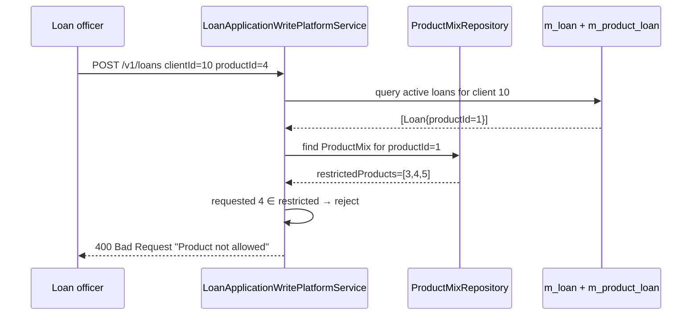

The Product Mix API in Apache Fineract is a per-product compatibility matrix: for every `LoanProduct` it lists which **other** loan products a client is allowed to hold simultaneously (and which are forbidden). The check is applied when a new loan application is submitted, so operators can prevent product combinations that violate underwriting rules.

## Source

| Aspect | Value |
| --- | --- |
| Resource class | `org.apache.fineract.portfolio.loanproduct.productmix.api.ProductMixApiResource` |
| File | `fineract-provider/src/main/java/org/apache/fineract/portfolio/loanproduct/productmix/api/ProductMixApiResource.java` |
| JAX-RS `@Path` | `/v1/loanproducts/{productId}/productmix` |
| Swagger tag | `Product Mix` |
| Permission resource | `PRODUCTMIX` |
| Read service | `ProductMixReadPlatformService`, `LoanProductReadPlatformService` |
| Command source | `PortfolioCommandSourceWritePlatformService` |

The constructor injects `PlatformSecurityContext`, `PortfolioCommandSourceWritePlatformService`, `ApiRequestParameterHelper`, `DefaultToApiJsonSerializer<ProductMixData>`, `ProductMixReadPlatformService` and `LoanProductReadPlatformService`. The response is filtered to `productId`, `productName`, `restrictedProducts`, `allowedProducts`, `productOptions`.

## Endpoints

| Method | Path | Description | Command / read handler | Permission |
| --- | --- | --- | --- | --- |
| `GET` | `/v1/loanproducts/{productId}/productmix` | Retrieve the product mix; `?template=true` adds available product options for editing. | `ProductMixReadPlatformService.retrieveLoanProductMixDetails(productId)` | `READ_PRODUCTMIX` |
| `POST` | `/v1/loanproducts/{productId}/productmix` | Create a product mix for the parent product. | `CommandWrapperBuilder.createProductMix(productId)` | `CREATE_PRODUCTMIX` |
| `PUT` | `/v1/loanproducts/{productId}/productmix` | Update an existing product mix. | `CommandWrapperBuilder.updateProductMix(productId)` | `UPDATE_PRODUCTMIX` |
| `DELETE` | `/v1/loanproducts/{productId}/productmix` | Delete the product mix. | `CommandWrapperBuilder.deleteProductMix(productId)` | `DELETE_PRODUCTMIX` |

There is no top-level list — to discover which products *have* a mix configured, callers iterate the loan-products endpoint and inspect each via `GET .../productmix?template=true`.

## Request shape

`POST` and `PUT` accept a `ProductMixRequest`:

```json
{
  "restrictedProducts": [3, 4, 5],
  "locale": "en"
}
```

`restrictedProducts` is the array of `LoanProduct.id` values that the parent product is incompatible with. The server populates `allowedProducts` as the complement of (`restrictedProducts` ∪ `{productId}`).

## Response shape

`GET /v1/loanproducts/{productId}/productmix?template=true`:

```json
{
  "productId": 1,
  "productName": "Standard cumulative loan",
  "restrictedProducts": [
    { "id": 3, "name": "Bridging loan" },
    { "id": 4, "name": "Working capital loan" }
  ],
  "allowedProducts": [
    { "id": 2, "name": "Progressive loan" },
    { "id": 5, "name": "Microloan" }
  ],
  "productOptions": [
    { "id": 2, "name": "Progressive loan" },
    { "id": 3, "name": "Bridging loan" },
    { "id": 4, "name": "Working capital loan" },
    { "id": 5, "name": "Microloan" }
  ]
}
```

When `?template=true` is omitted, `productOptions` is empty and only the existing mix is returned.

### Write responses

Standard `CommandProcessingResult`:

```json
{ "resourceId": 1, "changes": { "restrictedProducts": [3, 4, 5] } }
```

## Behaviour notes

- Product-mix evaluation happens during `LoanApplicationWritePlatformService.submitApplication(...)` — submitting a loan against a parent product whose mix lists the requested product as restricted raises a domain exception.
- `LoanProductReadPlatformService.retrieveAvailableLoanProductsForMix()` is used to populate the `productOptions` list and excludes products that have no active configuration.

## Permissions

The GET endpoint enforces `validateHasReadPermission("PRODUCTMIX")` directly; writes are gated through `PortfolioCommandSourceWritePlatformService.logCommandSource(...)` and mapped to `CREATE_PRODUCTMIX`, `UPDATE_PRODUCTMIX`, `DELETE_PRODUCTMIX` by the command-source framework.

## Source — create handler

```java
@POST
public CommandProcessingResult createProductMix(@PathParam("productId") final Long productId,
        final String apiRequestBodyAsJson) {
    final CommandWrapper commandRequest = new CommandWrapperBuilder()
        .createProductMix(productId).withJson(apiRequestBodyAsJson).build();
    return commandsSourceWritePlatformService.logCommandSource(commandRequest);
}
```

## Source — read handler

```java
@GET
public String retrieveTemplate(@PathParam("productId") final Long productId,
        @Context final UriInfo uriInfo) {
    context.authenticatedUser().validateHasReadPermission(RESOURCE_NAME_FOR_PERMISSIONS);
    ProductMixData productMixData = readPlatformService.retrieveLoanProductMixDetails(productId);
    final ApiRequestJsonSerializationSettings settings =
        apiRequestParameterHelper.process(uriInfo.getQueryParameters());
    if (settings.isTemplate()) {
        Collection<LoanProductData> productOptions =
            loanProductReadPlatformService.retrieveAvailableLoanProductsForMix();
        productMixData = ProductMixData.withTemplate(productMixData, productOptions);
    }
    return toApiJsonSerializer.serialize(settings, productMixData, RESPONSE_DATA_PARAMETERS);
}
```

## Mix evaluation flow



The check runs in both directions: the requested product's mix is also evaluated against the client's already-active products.

## Canonical curl

```bash
# Inspect the product mix for product 1 with editing template
curl -k -u mifos:password \
  -H "Fineract-Platform-TenantId: default" \
  'https://localhost:8443/fineract-provider/api/v1/loanproducts/1/productmix?template=true'

# Set product 3, 4 and 5 as restricted for product 1
curl -k -u mifos:password \
  -H "Fineract-Platform-TenantId: default" \
  -H "Content-Type: application/json" \
  -X POST https://localhost:8443/fineract-provider/api/v1/loanproducts/1/productmix \
  -d '{ "restrictedProducts": [3, 4, 5], "locale": "en" }'

# Replace the restricted set
curl -k -u mifos:password \
  -H "Fineract-Platform-TenantId: default" \
  -H "Content-Type: application/json" \
  -X PUT https://localhost:8443/fineract-provider/api/v1/loanproducts/1/productmix \
  -d '{ "restrictedProducts": [3], "locale": "en" }'

# Clear the mix completely
curl -k -u mifos:password \
  -H "Fineract-Platform-TenantId: default" \
  -X DELETE https://localhost:8443/fineract-provider/api/v1/loanproducts/1/productmix
```

## Use-case examples

| Scenario | Configuration |
| --- | --- |
| Working-capital loans cannot coexist with bridging loans | `POST /v1/loanproducts/{workingCapitalId}/productmix` with `restrictedProducts=[bridgingId]`. |
| Microloans only available to clients with no other product | `POST /v1/loanproducts/{microloanId}/productmix` with `restrictedProducts=[<all-other-ids>]`. |
| Two complementary products always allowed together | Leave both products' mixes empty / unrestricted. |

## Storage

The mix is persisted in `m_product_mix(product_id, restricted_product_id)`. A single product with three restrictions yields three rows. Both directions of the restriction are inserted by the create handler — i.e., restricting `B` from `A` also restricts `A` from `B`, so the underwriting check only needs to look up by `product_id` of the **existing** active loan.

## Validation rules

- A product cannot be its own restriction (`productId ∈ restrictedProducts` is rejected by the handler with `error.msg.productmix.product.cannot.restrict.itself`).
- All ids in `restrictedProducts` must exist in `m_product_loan`; unknown ids raise `LoanProductNotFoundException`.
- `POST` against a product that already has a mix raises `PlatformDataIntegrityException` — use `PUT` to amend.
- `DELETE` is always permitted; it removes both directions of the restriction.

## Error responses

| HTTP | When |
| --- | --- |
| `400 Bad Request` | Self-restriction; missing `locale`. |
| `403 Forbidden` | Missing `*_PRODUCTMIX` permission. |
| `404 Not Found` | Parent or referenced product ids not found. |
| `409 Conflict` | `POST` against a product that already has a mix. |

## Related pages

- [/api/loan-products](/api/loan-products) — parent loan products.
- [/loan/loan-product-api](/loan/loan-product-api) — subsystem walk-through.
- [/api/loans](/api/loans) — where the mix is evaluated at submit time.
- [/api/conventions](/api/conventions) — envelope and `template=` overlay convention.
