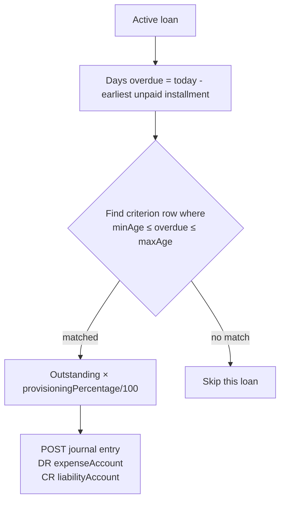

`ProvisioningCriteriaApiResource` defines the rules that drive Fineract's loan-loss provisioning job. Each criterion ties a set of [provisioning categories](/api/provisioning-categories) to overdue-day ranges, a provisioning percentage, and GL accounts for posting both the liability and expense legs. Optionally a criterion can scope to specific loan products.

## Source

```
fineract-provider/src/main/java/org/apache/fineract/organisation/provisioning/api/ProvisioningCriteriaApiResource.java
```

| Annotation | Value |
| --- | --- |
| `@Path` | `/v1/provisioningcriteria` |
| `@Component` | yes |
| `@Tag` | `Provisioning Criteria` |

Injected collaborators:

- `PlatformSecurityContext platformSecurityContext`
- `ApiRequestParameterHelper apiRequestParameterHelper`
- `ProvisioningCriteriaReadPlatformService provisioningCriteriaReadPlatformService`
- `PortfolioCommandSourceWritePlatformService commandsSourceWritePlatformService`
- `DefaultToApiJsonSerializer<ProvisioningCriteriaData> toApiJsonSerializer`

## Permissions

The resource only calls `platformSecurityContext.authenticatedUser()` — explicit permission codes are enforced inside the command handlers: `CREATE_PROVISIONINGCRITERIA`, `UPDATE_PROVISIONINGCRITERIA`, `DELETE_PROVISIONINGCRITERIA`.

## Endpoint inventory

| HTTP | Path | Description | Command / Read service |
| --- | --- | --- | --- |
| `GET` | `/v1/provisioningcriteria/template` | Category, GL account, loan-product dropdowns for the create form | `provisioningCriteriaReadPlatformService.retrievePrivisiongCriteriaTemplate()` |
| `GET` | `/v1/provisioningcriteria` | List all criteria | `provisioningCriteriaReadPlatformService.retrieveAllProvisioningCriterias()` |
| `GET` | `/v1/provisioningcriteria/{criteriaId}` | Fetch one criterion (optional `?template=true` bundles dropdowns) | `provisioningCriteriaReadPlatformService.retrieveProvisioningCriteria(...)` |
| `POST` | `/v1/provisioningcriteria` | Create criterion | `createProvisioningCriteria` |
| `PUT` | `/v1/provisioningcriteria/{criteriaId}` | Update criterion | `updateProvisioningCriteria(criteriaId)` |
| `DELETE` | `/v1/provisioningcriteria/{criteriaId}` | Delete criterion | `deleteProvisioningCriteria(criteriaId)` |

## Source excerpt — single fetch with template

```java
@GET
@Path("{criteriaId}")
public ProvisioningCriteriaData retrieveProvisioningCriteria(
        @PathParam("criteriaId") final Long criteriaId,
        @Context final UriInfo uriInfo) {
    platformSecurityContext.authenticatedUser();
    ProvisioningCriteriaData criteria =
        provisioningCriteriaReadPlatformService.retrieveProvisioningCriteria(criteriaId);
    final ApiRequestJsonSerializationSettings settings =
        apiRequestParameterHelper.process(uriInfo.getQueryParameters());
    if (settings.isTemplate()) {
        criteria = provisioningCriteriaReadPlatformService
            .retrievePrivisiongCriteriaTemplate(criteria);
    }
    return criteria;
}
```

## Canonical curl

```bash
curl -k -u mifos:password \
  -H "Fineract-Platform-TenantId: default" \
  -H "Content-Type: application/json" \
  -X POST https://localhost:8443/fineract-provider/api/v1/provisioningcriteria \
  -d '{
    "criteriaName": "Default Provisioning Policy",
    "loanProducts": [ { "id": 1 }, { "id": 2 } ],
    "provisioningcriteria": [
      {
        "categoryId": 1,
        "categoryName": "Standard",
        "minAge": 0,
        "maxAge": 30,
        "provisioningPercentage": 1.0,
        "liabilityAccount": 25,
        "expenseAccount": 41
      },
      {
        "categoryId": 2,
        "categoryName": "Sub-standard",
        "minAge": 31,
        "maxAge": 90,
        "provisioningPercentage": 10.0,
        "liabilityAccount": 25,
        "expenseAccount": 41
      },
      {
        "categoryId": 3,
        "categoryName": "Doubtful",
        "minAge": 91,
        "maxAge": 180,
        "provisioningPercentage": 50.0,
        "liabilityAccount": 25,
        "expenseAccount": 41
      },
      {
        "categoryId": 4,
        "categoryName": "Loss",
        "minAge": 181,
        "maxAge": 99999,
        "provisioningPercentage": 100.0,
        "liabilityAccount": 25,
        "expenseAccount": 41
      }
    ]
  }'
```

## Request body — POST

| Field | Required | Notes |
| --- | --- | --- |
| `criteriaName` | yes | Unique |
| `loanProducts` | no | Array of `{ id }` — empty means the criterion applies to every product |
| `provisioningcriteria` | yes | One row per category, see below |

`provisioningcriteria[]` rows:

| Field | Required | Notes |
| --- | --- | --- |
| `categoryId` | yes | FK to provisioning category |
| `categoryName` | for display | matches `categoryId` |
| `minAge`, `maxAge` | yes | Days-overdue range; non-overlapping across rows |
| `provisioningPercentage` | yes | 0–100 |
| `liabilityAccount` | yes | GL liability account id (credit side) |
| `expenseAccount` | yes | GL expense account id (debit side) |

## Read DTO

`org.apache.fineract.organisation.provisioning.data.ProvisioningCriteriaData`:

```json
{
  "criteriaId": 1,
  "criteriaName": "Default Provisioning Policy",
  "createdBy": "mifos",
  "createdDate": "2024-03-01T10:15:00",
  "lastModifiedBy": "mifos",
  "lastModifiedDate": "2024-03-01T10:15:00",
  "loanProducts": [
    { "id": 1, "name": "Group Loan" },
    { "id": 2, "name": "Individual Loan" }
  ],
  "definitions": [
    {
      "categoryId": 1,
      "categoryName": "Standard",
      "minAge": 0,
      "maxAge": 30,
      "provisioningPercentage": 1.0,
      "liabilityAccount": 25,
      "liabilityCode": "20100",
      "liabilityName": "Loan Loss Provision",
      "expenseAccount": 41,
      "expenseCode": "60100",
      "expenseName": "Provision Expense"
    }
  ]
}
```

When fetched with `?template=true`, additional `glAccounts`, `loanProductsOptions`, and `provisioningCategoryOptions` arrays are bundled into the response.

## How criteria are used

The job [`UPDATE_LOAN_PROVISIONING_PROFILES`](/jobs/job-names-enumeration) iterates active criteria, computes the overdue bucket of every active loan, applies the matching row's `provisioningPercentage`, and posts a journal entry crediting `liabilityAccount` / debiting `expenseAccount`. See [Accounting → Provisioning](/accounting/provisioning-entries) for the posting logic.

## Bucket evaluation



The job is idempotent: each run replaces the prior provisioning posting for the period via the `ProvisioningEntry` aggregate, so re-running the job a second time on the same date does not over-provision.

## Common pitfalls

- **Overlapping `minAge`/`maxAge` rows** are rejected at create/update time with `error.msg.provisioningcriteria.overlapping.ranges`.
- **`provisioningPercentage` outside 0–100** raises `error.msg.provisioningcriteria.invalid.percentage`.
- **GL account must be DETAIL.** Mapping a header account triggers `error.msg.glAccount.usage.invalid`.
- **Category coverage.** Every category referenced by the platform's loans should appear in the criterion; missing categories make the loan skip provisioning silently.

## Cross-references

- [Provisioning categories](/api/provisioning-categories) — the bucket dimension.
- [Accounting → Provisioning](/accounting/provisioning-entries) — journal entries the criteria drive.
- [Jobs](/jobs/job-names-enumeration) — `UPDATE_LOAN_PROVISIONING_PROFILES` scheduled job.
- [API conventions](/api/conventions) — envelope and `template=true`.
