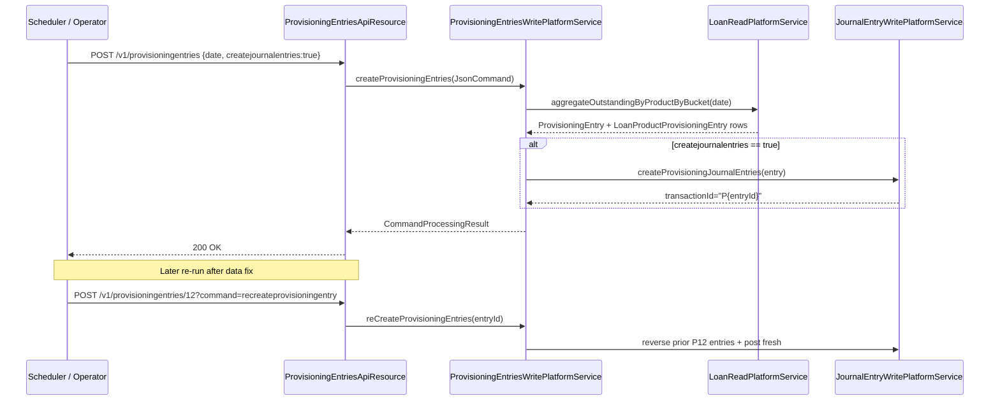

The Provisioning Entries API runs the Apache Fineract loan provisioning engine. Each `ProvisioningEntry` is a dated batch covering every active loan product; per-product `LoanProductProvisioningEntry` rows record the outstanding portfolio in each provisioning category (Standard / Sub-Standard / Doubtful / Loss, or similar) and produce double-entry postings against the configured liability and expense GL accounts.

## Source

| Aspect | Value |
| --- | --- |
| Resource class | `org.apache.fineract.accounting.provisioning.api.ProvisioningEntriesApiResource` |
| File | `fineract-accounting/src/main/java/org/apache/fineract/accounting/provisioning/api/ProvisioningEntriesApiResource.java` |
| JAX-RS `@Path` | `/v1/provisioningentries` |
| Swagger tag | `Provisioning Entries` |
| Command constants | `ProvisioningEntriesApiConstants.CREATE_JOURNAL_ENTRY`, `RECREATE_PROVISION_IN_ENTRY` |
| Read service | `ProvisioningEntriesReadPlatformService` |

## Endpoints

| Method | Path | Description | Command / read handler | Permission |
| --- | --- | --- | --- | --- |
| `POST` | `/v1/provisioningentries` | Generate a new provisioning batch. Mandatory: `date`, `dateFormat`, `locale`. Optional: `createjournalentries`. | `CommandWrapperBuilder.createProvisioningEntries()` → `CREATE_PROVISIONINGENTRY` | `CREATE_PROVISIONINGENTRY` |
| `POST` | `/v1/provisioningentries/{entryId}?command=createjournalentry` | Post journal entries for an already-generated batch. | `createProvisioningJournalEntries(entryId)` → `CREATE_PROVISIONJOURNALENTRY_PROVISIONINGENTRY` | `CREATE_PROVISIONJOURNALENTRY_PROVISIONINGENTRY` |
| `POST` | `/v1/provisioningentries/{entryId}?command=recreateprovisioningentry` | Re-run a batch (recomputes per-product rows). | `reCreateProvisioningEntries(entryId)` → `RECREATE_PROVISIONINGENTRY` | `RECREATE_PROVISIONINGENTRY` |
| `GET` | `/v1/provisioningentries/{entryId}` | Retrieve a single batch. | `ProvisioningEntriesReadPlatformService.retrieveProvisioningEntryData(entryId)` | Authenticated |
| `GET` | `/v1/provisioningentries/entries` | Paginated per-loan-product rows; filter by `entryId`, `officeId`, `productId`, `categoryId`. | `ProvisioningEntriesReadPlatformService.retrieveProvisioningEntries(params)` | Authenticated |
| `GET` | `/v1/provisioningentries` | Paginated list of all batches. | `ProvisioningEntriesReadPlatformService.retrieveAllProvisioningEntries(offset, limit)` | Authenticated |

Any other `command` query value on the `{entryId}` POST raises `UnrecognizedQueryParamException`.

## Request body — create batch

The payload binds to `ProvisionEntryRequest`:

```json
{
  "date": "31 March 2024",
  "dateFormat": "dd MMMM yyyy",
  "locale": "en",
  "createjournalentries": true
}
```

## Request body — recreate / create journal entry

The handler accepts a free-form JSON body (often empty); the only routing input is `command`:

```http
POST /v1/provisioningentries/12?command=createjournalentry
Content-Type: application/json

{}
```

## Response — batch retrieve

```json
{
  "id": 12,
  "createdDate": [2024, 3, 31, 23, 0, 5],
  "createdBy": "system",
  "modifiedDate": [2024, 3, 31, 23, 0, 5],
  "modifiedBy": "system",
  "journalEntryCreated": true,
  "loanProductProvisioningEntries": [
    {
      "id": 41,
      "officeId": 1,
      "officeName": "Head Office",
      "currencyCode": "USD",
      "loanProductId": 1,
      "productName": "Standard Loan",
      "categoryId": 1,
      "categoryName": "Standard",
      "amountreserved": 250.00,
      "liabilityAccount": 56,
      "liabilityAccountName": "Loan Loss Reserve",
      "expenseAccount": 90,
      "expenseAccountName": "Provisioning Expense"
    }
  ]
}
```

## Response — write

```json
{
  "resourceId": 12,
  "changes": {}
}
```

## Linked journal entries

When the batch posts entries, each `JournalEntry` is recorded with `transactionId = "P" + entryId`. The journal-entries API exposes the helper `GET /v1/journalentries/provisioning?entryId={id}` to enumerate those rows; see [/api/journal-entries](/api/journal-entries).

## Batch lifecycle



## Idempotency and re-runs

- `recreateprovisioningentry` reverses the existing `P{entryId}` journal entries and posts new ones. The reversal keeps the historical row but flips `reversed=true`; consumers reading the GL must filter on `reversed=false` to avoid double-counting.
- `createjournalentry` is rejected if `journalEntryCreated == true` — it can only run on a batch that was generated **without** the eager flag.

## Common pitfalls

- **Date must be on or after the most recent GL closure** for every affected office. Otherwise the journal-entry step raises `error.msg.journalEntry.cannot.be.created.on.or.before.previous.glClosure.date` and aborts the whole batch.
- **No criterion** for an active loan product means that product is silently skipped — operators must check the `loanProductProvisioningEntries` length against the active-product count.
- **`recreateprovisioningentry` is destructive** — there is no archive of the prior values besides the reversal of the journal entries themselves.

## Sample curl — list batches

```bash
curl -k -u mifos:password \
  -H "Fineract-Platform-TenantId: default" \
  "https://localhost:8443/fineract-provider/api/v1/provisioningentries?offset=0&limit=20"
```

## Drill-down: per-product rows

`GET /v1/provisioningentries/entries?entryId=12&productId=1` returns a `Page<LoanProductProvisioningEntryData>` so reporting tools can break a batch down by product or category. Supported filters:

- `entryId` (required for sensible results)
- `officeId` — restrict to one branch
- `productId` — restrict to one loan product
- `categoryId` — restrict to one bucket
- `offset`, `limit` — pagination

The row shape includes `amountreserved`, `liabilityAccount`, `expenseAccount` and the resolved office/product/category names, suitable for direct rendering.

## Scheduler integration

The job `UPDATE_LOAN_PROVISIONING_PROFILES` calls the same write service as `POST /v1/provisioningentries` with `createjournalentries=true` and `date = BusinessDate.COB_DATE`. Manual API runs and scheduled runs share the same data model — you can always re-post manually after a missed scheduled run, then call `?command=recreateprovisioningentry` to refresh.

## Related subsystems

- Subsystem overview: [/accounting/provisioning-entries](/accounting/provisioning-entries)
- Provisioning criteria configuration: [/accounting/provisioning-criteria](/organisation/provisioning-criteria)
- Journal entries written by the batch: [/api/journal-entries](/api/journal-entries)
- Loan products: [/portfolio/loan-products](/loan/loan-product-api)
- [/api/conventions](/api/conventions) — envelope, locale and error model.
